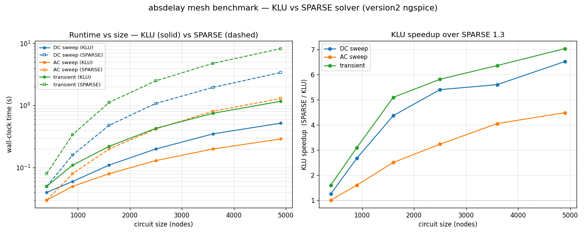
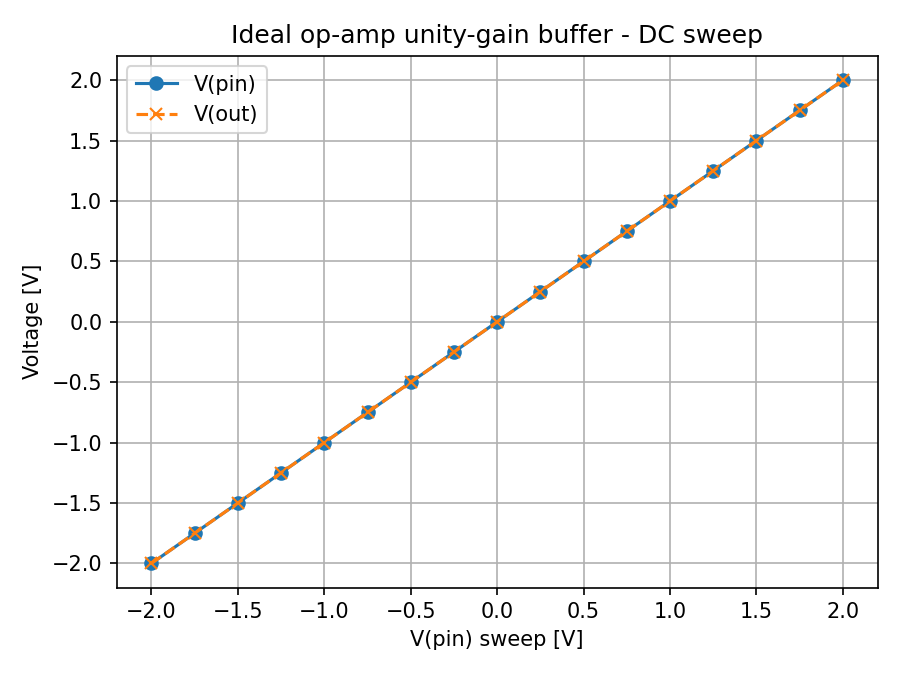
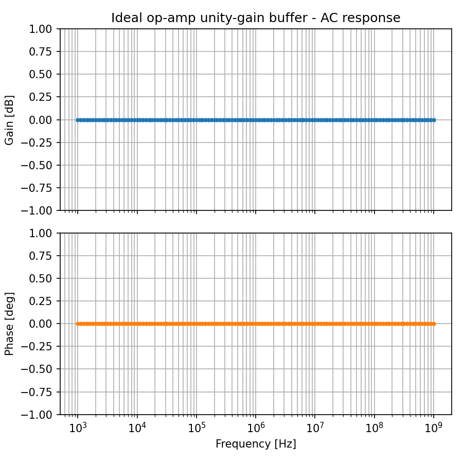
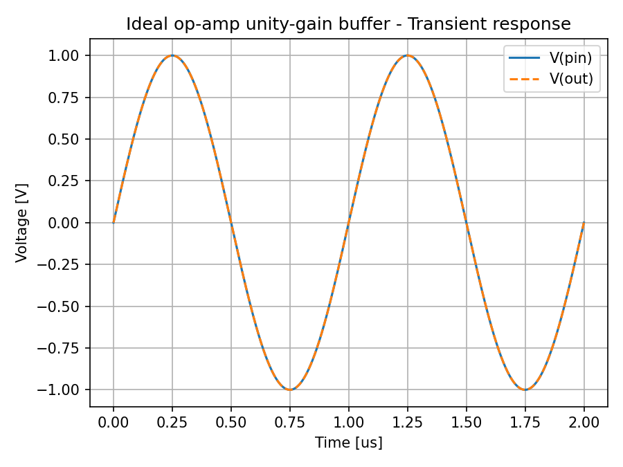
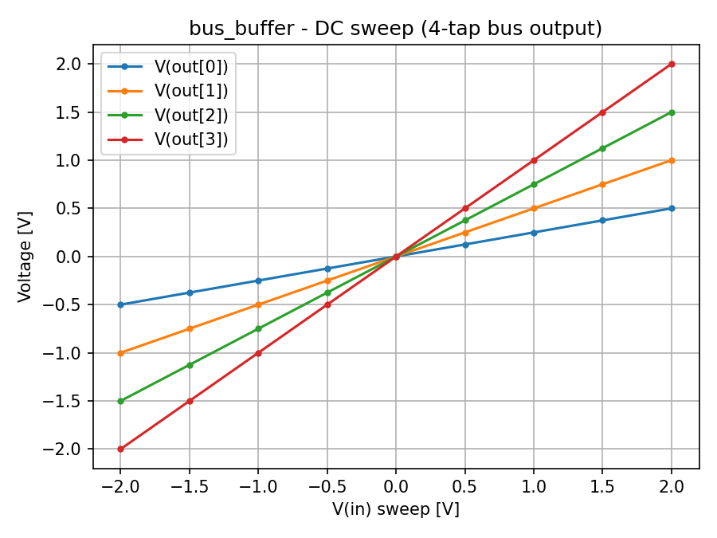
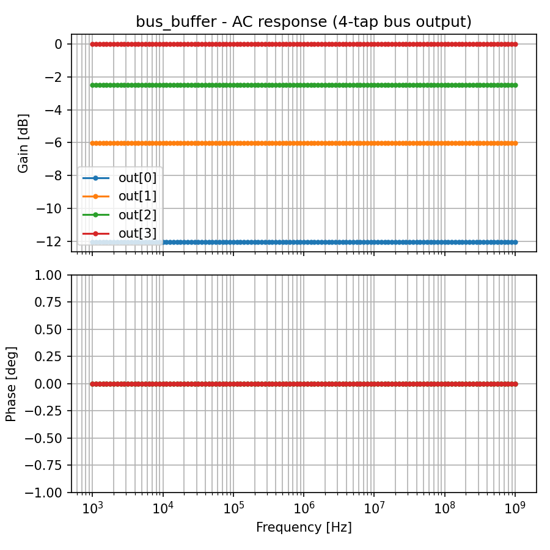
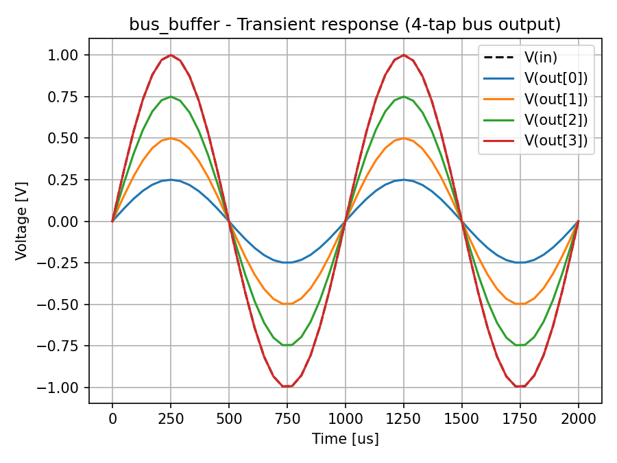
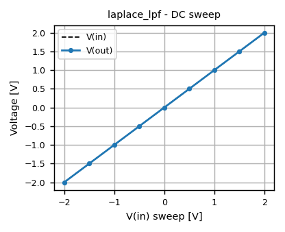
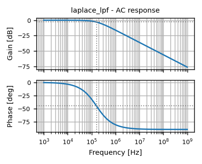
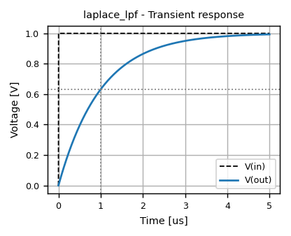

# Ngspice + OpenVAF Enhancements

Using Claude Code AI to enhance the ngspice and openvaf frameworks.

[](https://github.com/javaNoviceProgrammer/Ngspice_OpenVAF_Enhancements/actions/workflows/build-binaries.yml)

Main goals:
- turn ngspice into the most powerful spice simulator
- turn openvaf-r into the most powerful verilog-a compiler

---

## Enhancement 1: `absdelay()` support for Verilog-A / OSDI

*June 2026* — Implements the Verilog-A `absdelay(signal, td)` operator end-to-end through the OSDI flow, using the **synthetic-node DAE approach** in OpenVAF and ngspice.

- Verified for DC, AC, and Transient analysis
- Verified for both SPARSE and KLU solvers
- Details: [Enhancement-1.md](Enhancement-1.md)

**KLU vs SPARSE benchmark** (DC / AC / Transient across circuit sizes):



---

## Enhancement 2: Indirect branch assignment for Verilog-AMS

*June 2026* — Implements the Verilog-AMS **indirect branch assignment** construct (`<lhs> : <rhs> == <expr>;`) in OpenVAF, enabling ideal/abstract behavioral models such as the LRM's ideal op-amp. One new DAE unknown + implicit equation is added per statement, fully reusing the existing branch-contribution and residual machinery — no ngspice/OSDI changes were needed.

- Verified for DC, AC, and Transient analysis (unity-gain buffer built from the ideal op-amp)
- Verified for no regressions against the Enhancement-1 `absdelay` examples
- Details: [Enhancement-2.md](Enhancement-2.md)

**DC / AC / Transient results** for the ideal op-amp unity-gain buffer:

<p align="center">
  
  
  
</p>

---

## Enhancement 3: Vectored/bus-style net declarations for Verilog-A

*June 2026* — Implements Verilog-AMS **vectored net declarations** (bus syntax) in OpenVAF: `<discipline> [msb:lsb] name;` for nets and ports, with bit-select access (`bus[i]`) in branch declarations and `V()`/`I()` branch-access calls. A bus expands into independent scalar nodes at name-resolution time, so the feature is purely a front-end (parser/HIR) concern — no DAE, MIR, or OSDI changes were needed.

- Verified for DC, AC, and Transient analysis (a 4-tap fractional buffer driven through a `[0:3]` bus output port)
- Verified for no regressions against the Enhancement-1 `absdelay` and Enhancement-2 indirect-branch-assignment examples
- Details: [Enhancement-3.md](Enhancement-3.md)

**DC / AC / Transient results** for the 4-tap bus-output buffer:

<p align="center">
  
  
  
</p>

---

## Enhancement 4: Laplace transform filter operators, and array-variable declarations, for Verilog-A

*June 2026* — Implements Verilog-A's four **Laplace transform filter** analog operators (`laplace_nd`/`laplace_np`/`laplace_zd`/`laplace_zp`) by converting a transfer function `H(s) = num(s)/den(s)` into an exact controllable-canonical-form state-space realization at compile time, reusing the same implicit-equation/residual machinery `idt()` already uses — no new DAE primitive, and no `sim_back`/`osdi` changes were needed. Along the way, two latent front-end gaps were found and fixed: array-literal expressions (`'{...}'`/`{...}`) were fully scaffolded but never actually parsed, and the array-literal type-checker had a bug that made every array literal type-check as a bare scalar. As a follow-up, **array-variable declarations** (`real [msb:lsb] x;`) were also added, reusing Enhancement-3's bit-select machinery almost unchanged.

- Verified for DC, AC, and Transient analysis (a first-order RC-style low-pass filter, `H(s) = 1/(1+tau*s)`, realized with no actual resistor/capacitor in the model) — exact `-3dB`/`-45°` at the corner frequency, `-20dB`/decade rolloff, and `63.2%` step response at `t=tau`
- Verified all four `laplace_*` forms (coefficient and pole/zero) agree exactly on two equivalent transfer functions
- Verified array-variable declare/write/read end-to-end with a 5-tap weighted-sum model
- Verified for no regressions against the Enhancement-1/2/3 examples
- Details: [Enhancement-4.md](Enhancement-4.md)

**DC / AC / Transient results** for the Laplace low-pass filter:

<p align="center">
  
  
  
</p>

---

## Prebuilt Binaries

Binaries are built by CI and committed to `bin/`:

| Platform | Directory | Binaries |
|---|---|---|
| Linux x86-64 | `bin/linux/intel/` | `ngspice`, `openvaf-r` |
| Linux ARM64 | `bin/linux/arm/` | `ngspice`, `openvaf-r` |
| macOS Apple Silicon (M1/M2/M3) | `bin/macos/apple-silicon/` | `ngspice`, `openvaf-r` |
| macOS Intel | `bin/macos/intel/` | `ngspice` |
| Windows x86-64 | `bin/windows/intel/` | `ngspice.exe`, `openvaf-r.exe` |

### Running on Linux

The binaries are dynamically linked against standard system libraries. Install them with your package manager if missing:

**Ubuntu / Debian:**
```bash
sudo apt-get install libreadline8 libx11-6 libxaw7 libxft2 libxext6
```

**Fedora / RHEL:**
```bash
sudo dnf install readline libX11 libXaw libXft libXext
```

After that, mark the binaries executable and run:
```bash
chmod +x bin/linux/intel/ngspice bin/linux/intel/openvaf-r
./bin/linux/intel/ngspice
```

### Running on macOS

The binaries are dynamically linked against **XQuartz** (X11) and **Homebrew** readline/ncurses. Both must be installed before running.

**1. Install XQuartz** (provides the X11 window system for ngspice plots):

Download and install from [https://www.xquartz.org](https://www.xquartz.org), then **log out and log back in** so the X11 libraries at `/opt/X11` are on the dynamic linker path.

**2. Install Homebrew dependencies:**
```bash
brew install readline ncurses
```

**3. Mark binaries executable and run:**
```bash
# Apple Silicon (M1/M2/M3)
chmod +x bin/macos/apple-silicon/ngspice bin/macos/apple-silicon/openvaf-r
./bin/macos/apple-silicon/ngspice

# Intel Mac
chmod +x bin/macos/intel/ngspice
./bin/macos/intel/ngspice
```

> **Note:** macOS may show a security warning ("cannot be opened because the developer cannot be verified"). Go to **System Settings → Privacy & Security** and click **Allow Anyway**, or run:
> ```bash
> xattr -d com.apple.quarantine bin/macos/apple-silicon/ngspice
> xattr -d com.apple.quarantine bin/macos/apple-silicon/openvaf-r
> ```

### Running on Windows

The Windows binaries come **bundled with all required MinGW runtime DLLs** (`libreadline8.dll`, `libtermcap-0.dll`, `libstdc++-6.dll`, `libwinpthread-1.dll`, etc.) in the same directory. No MSYS2, MinGW, or other runtime installation is required — just keep all files in `bin\windows\intel\` together.

Simply run from that directory:
```
bin\windows\intel\ngspice.exe
bin\windows\intel\openvaf-r.exe
```

> **Note:** Windows may show a SmartScreen warning on first run ("Windows protected your PC"). Click **More info → Run anyway**.

> **Note:** `openvaf-r.exe` is a command-line tool. Run it from **Command Prompt** or **PowerShell**, not by double-clicking.

---

## CI Build Details

Builds run on push to `main` (source changes only; binary commits are skipped) or manually via **Actions → Build binaries → Run workflow**.

| Runner | Target | Notes |
|---|---|---|
| `ubuntu-latest` | `bin/linux/intel/` | LLVM 18 from apt |
| `ubuntu-24.04-arm` | `bin/linux/arm/` | LLVM 18 from apt |
| `macos-14` | `bin/macos/apple-silicon/` | LLVM 18 via Homebrew, XQuartz |
| `windows-latest` | `bin/windows/intel/` | LLVM 18 official tarball, ngspice via MSYS2/MinGW (static) |

See [`.github/workflows/build-binaries.yml`](.github/workflows/build-binaries.yml) for the full workflow.
