# Ngspice + OpenVAF Enhancements
**Owner: Dr. Meisam Bahadori**

Using Claude Code AI to enhance the ngspice and openvaf frameworks.

[](https://github.com/javaNoviceProgrammer/Ngspice_OpenVAF_Enhancements/actions/workflows/build-binaries.yml)

Main goals:
- turn ngspice into the most powerful spice simulator
- turn openvaf-r into the most powerful verilog-a compiler

---

## Enhancement 1: `absdelay()` support for Verilog-A / OSDI

*June 2026* — Implements the Verilog-A `absdelay(signal, td)` operator end-to-end through the OSDI flow, using the **synthetic-node DAE approach** in OpenVAF and ngspice.

- Verified for DC, AC, and Transient analysis
- Verified for both SPARSE and KLU solvers
- Details: [Enhancement-1.md](Enhancement-1.md)

**KLU vs SPARSE benchmark** (DC / AC / Transient across circuit sizes):


---

## Enhancement 2: Indirect branch assignment for Verilog-AMS

*June 2026* — Implements the Verilog-AMS **indirect branch assignment** construct (`<lhs> : <rhs> == <expr>;`) in OpenVAF, enabling ideal/abstract behavioral models such as the LRM's ideal op-amp. One new DAE unknown + implicit equation is added per statement, fully reusing the existing branch-contribution and residual machinery — no ngspice/OSDI changes were needed.

- Verified for DC, AC, and Transient analysis (unity-gain buffer built from the ideal op-amp)
- Verified for no regressions against the Enhancement-1 `absdelay` examples
- Details: [Enhancement-2.md](Enhancement-2.md)

**DC / AC / Transient results** for the ideal op-amp unity-gain buffer:

<p align="center">
  
  
  
</p>

---

## Enhancement 3: Vectored/bus-style net declarations for Verilog-A

*June 2026* — Implements Verilog-AMS **vectored net declarations** (bus syntax) in OpenVAF: `<discipline> [msb:lsb] name;` for nets and ports, with bit-select access (`bus[i]`) in branch declarations and `V()`/`I()` branch-access calls. A bus expands into independent scalar nodes at name-resolution time, so the feature is purely a front-end (parser/HIR) concern — no DAE, MIR, or OSDI changes were needed.

- Verified for DC, AC, and Transient analysis (a 4-tap fractional buffer driven through a `[0:3]` bus output port)
- Verified for no regressions against the Enhancement-1 `absdelay` and Enhancement-2 indirect-branch-assignment examples
- Details: [Enhancement-3.md](Enhancement-3.md)

**DC / AC / Transient results** for the 4-tap bus-output buffer:

<p align="center">
  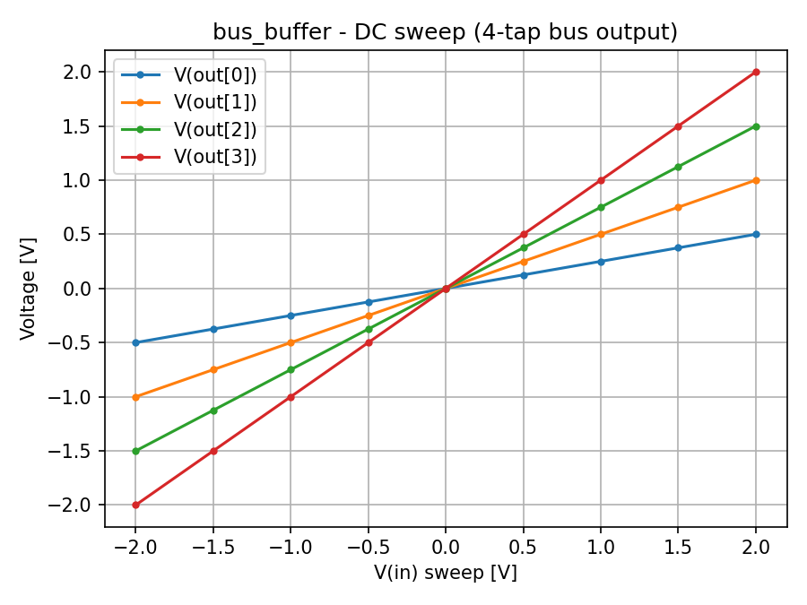
  
  
</p>

---

## Enhancement 4: Laplace transform filter operators, and array-variable declarations, for Verilog-A

*June 2026* — Implements Verilog-A's four **Laplace transform filter** analog operators (`laplace_nd`/`laplace_np`/`laplace_zd`/`laplace_zp`) by converting a transfer function `H(s) = num(s)/den(s)` into an exact controllable-canonical-form state-space realization at compile time, reusing the same implicit-equation/residual machinery `idt()` already uses — no new DAE primitive, and no `sim_back`/`osdi` changes were needed. Along the way, two latent front-end gaps were found and fixed: array-literal expressions (`'{...}'`/`{...}`) were fully scaffolded but never actually parsed, and the array-literal type-checker had a bug that made every array literal type-check as a bare scalar. As a follow-up, **array-variable declarations** (`real [msb:lsb] x;`) were also added, reusing Enhancement-3's bit-select machinery almost unchanged.

- Verified for DC, AC, and Transient analysis (a first-order RC-style low-pass filter, `H(s) = 1/(1+tau*s)`, realized with no actual resistor/capacitor in the model) — exact `-3dB`/`-45°` at the corner frequency, `-20dB`/decade rolloff, and `63.2%` step response at `t=tau`
- Verified all four `laplace_*` forms (coefficient and pole/zero) agree exactly on two equivalent transfer functions
- Verified array-variable declare/write/read end-to-end with a 5-tap weighted-sum model
- Verified for no regressions against the Enhancement-1/2/3 examples
- Verified against a **real 5th-order analog Bessel low-pass filter**, cross-checked against the identical transfer function's analytical response computed independently in Python (`scipy.signal`) — numerical-noise-level agreement (max AC gain error 5.6e-7 dB, max phase error 7.2e-7°, max step-response error 6.6e-6 V). This also surfaced (and fixed) a compiler crash on large bare-integer-shaped literals.
- Details: [Enhancement-4.md](Enhancement-4.md)

**DC / AC / Transient results** for the Laplace low-pass filter:

<p align="center">
  
  
  
</p>

**Simulated vs. analytical** results for the 5th-order Bessel filter:

<p align="center">
  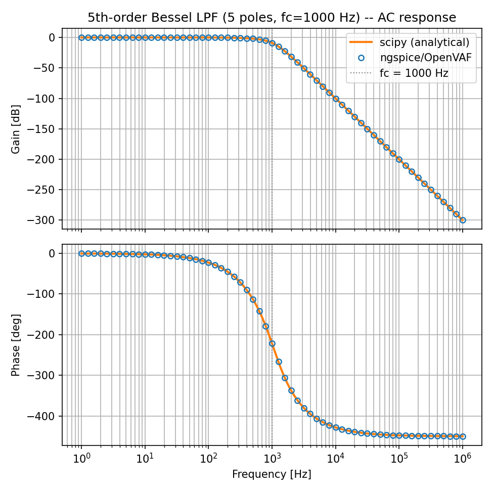
  
</p>

---

## Enhancement 5: Module instantiation for Verilog-A

*July 2026* — Implements Verilog-A **module instantiation** (one module placing other modules as sub-circuit elements on its own nets), which had zero support anywhere in the compiler beforehand. Every layer downstream of the parser (name resolution, type inference, MIR lowering, the DAE builder, OSDI codegen) is architected around exactly one flat module per compiled artifact, so hierarchy is resolved as a **compile-time text-flattening elaboration pass**: instantiated modules are recursively inlined — alpha-renamed per instance, with ports bound to the caller's nets and parameters bound to the caller's overrides — into an ordinary, hand-written-looking flat module *before* the rest of the pipeline ever runs, requiring **zero changes** to `hir_ty`/`hir_lower`/`mir*`/`sim_back`/`osdi`.

- Full feature set: named (`.p(net)`) and positional (`(net)`) port connections, including open/unconnected ports; named (`.r(1e3)`) and positional (`#(1e3)`) parameter overrides; instance arrays (`resistor rarr[0:3](...)`); arbitrary nesting depth; cyclic instantiation is a clean compile error, not a stack overflow
- Bus-typed ports and per-element instance-array slicing: a matching-width bus in the caller's scope is sliced bit-by-bit / element-by-element onto a target bus port or array instantiation, falling back to plain broadcast otherwise
- Works across an `` `include `` boundary with no special-casing — a module can instantiate a target declared in a different file, since `` `include `` is resolved by the preprocessor before the elaboration pass ever inspects the parse tree
- Verified for DC, AC, and Transient analysis on a hierarchical resistor network (nested instantiation, both override forms, an instance array) — matches an independent analytical resistor-network computation to ~1e-9 (solver precision)
- Verified a module that both instantiates sub-modules *and* has its own directly-written `analog` block — the inlined instance equations and the module's own contribution combine correctly under all three analyses
- Verified for no regressions against the Enhancement-1/2/3/4 examples
- Details: [Enhancement-5.md](Enhancement-5.md)

**DC / AC / Transient results** for the hierarchical resistor-divider network:

<p align="center">
  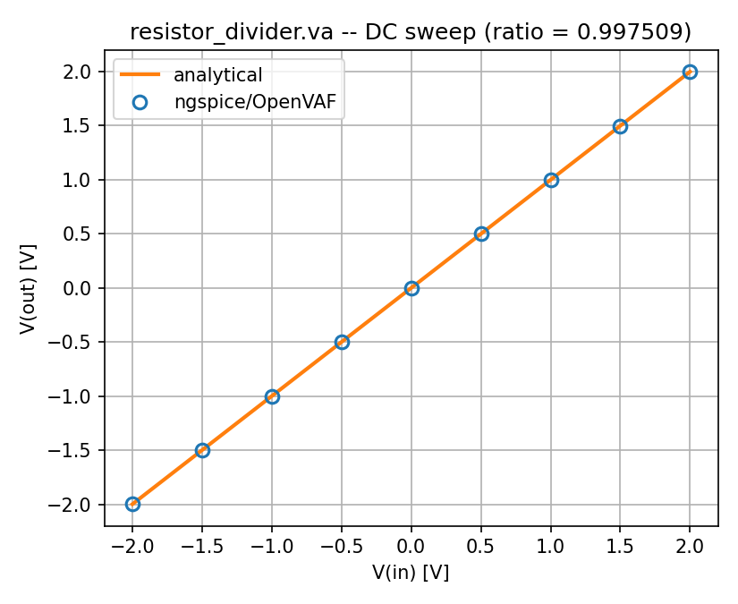
  
  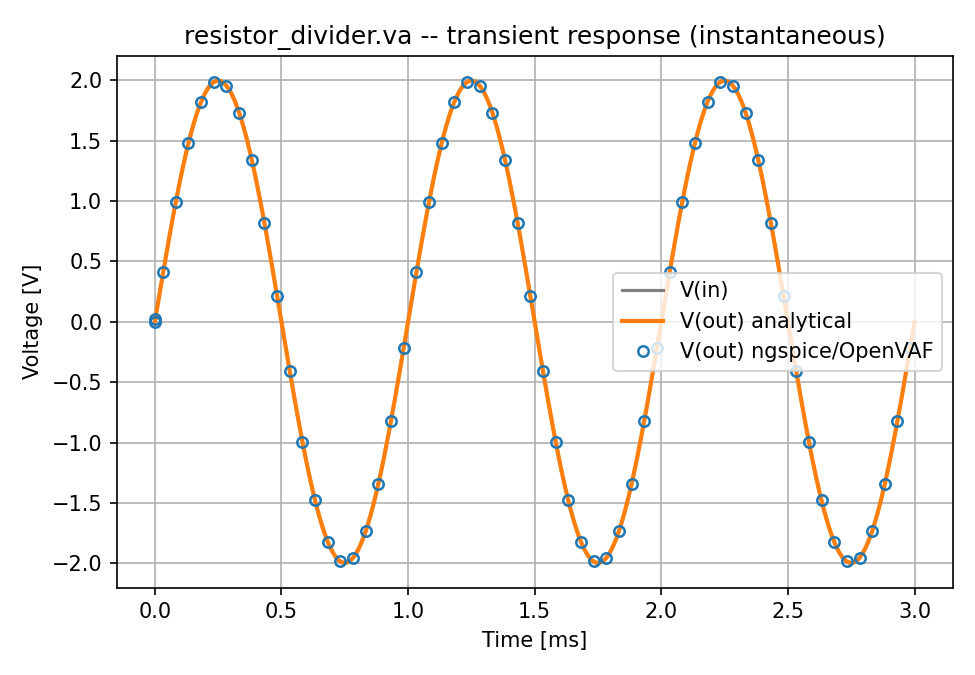
</p>

---

## Enhancement 6: Missing basic Verilog-A features

*July 2026* — A systematic gap analysis against the Verilog-A/AMS LRM across operators, scale factors, keywords, math functions, and compiler directives, followed by implementing everything found tractable in one pass: ten **compiler directives** (`` `default_discipline ``, `` `celldefine ``/`` `endcelldefine ``, `` `unconnected_drive ``/`` `nounconnected_drive ``, `` `timescale ``, `` `line ``, `` `pragma ``, `` `undefineall ``, `` `default_nettype ``) that previously hard-failed compilation as undefined macro calls; the `<<<`/`>>>` **arithmetic shift** operators (plus a real pre-existing lexer bug fix); `slew()`/`transition()`, realized as a saturating rate-limited tracking loop needing no simulator changes; `zi_nd/np/zd/zp()`, realized via a **bilinear (Tustin) transform** to an equivalent continuous transfer function reusing the existing `laplace_*` machinery; and `last_crossing()`, which genuinely needed simulator history — an additive, backward-compatible **OSDI ABI extension** (following the `absdelay()` extension's precedent) plus a matching `ngspice-46` runtime patch (waveform history, crossing detection/interpolation, matrix stamping).

- All five features verified against real ngspice DC/AC/Transient simulation, not just compile checks — see `directive_examples/`, `shift_examples/`, `slew_examples/`, `transition_examples/`, `zi_examples/`, `last_crossing_examples/`
- `slew()`: AC response lands exactly on the predicted first-order tracking-loop pole (`K/2π ≈ 159MHz`); transient measured rise/fall rates match the specified bounds to 3+ significant figures
- `zi_nd()`: AC response shows the expected `-3dB` corner *and* the documented bilinear frequency-warping artifact near the Nyquist rate; transient step response matches an RC step response closely
- `last_crossing()`: transient output steps to the correct crossing times (e.g. `1.0000148e-5` vs theoretical `1.0e-5`, 0.015% error) on a 100kHz sine wave — two real bugs (an `int`/`real` cast bug and a shared-timeline initialization bug) were found only by testing against actual simulation, both compiled cleanly and were only visible at runtime
- Verified for no regressions against the full existing test suite — bit-exact/floating-point-noise-level unchanged DC, AC, and transient results
- Deferred: `cross()`/`above()`/`timer()` need new `@()` event-control grammar (not just an OSDI extension), and `generate`/`genvar` blocks are unimplemented — both out of scope here, noted as follow-up work
- Details: [Enhancement-6.md](Enhancement-6.md)

**AC response** for the `zi_nd()` z-domain lowpass filter (bilinear-transform realization):

<p align="center">
  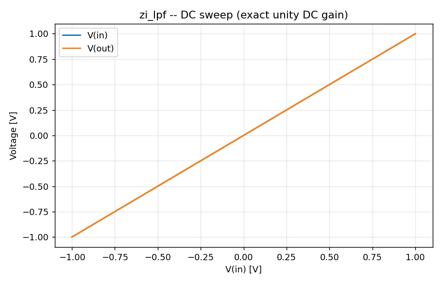
  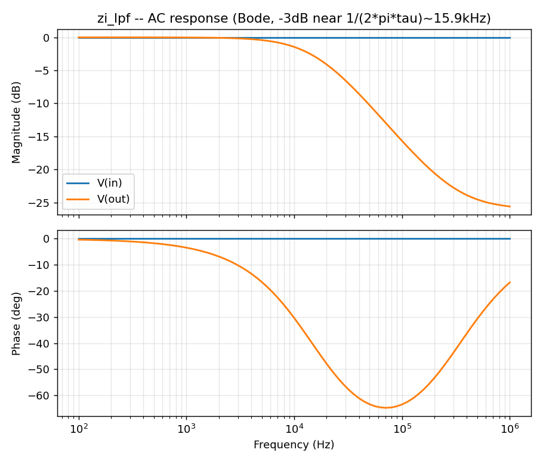
  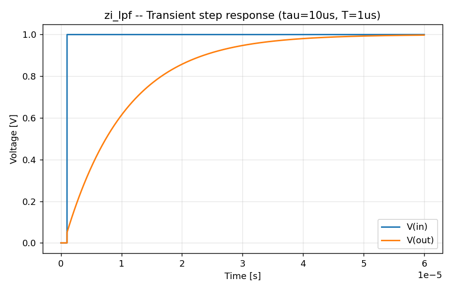
</p>

**Transient result** for `last_crossing()` tracking rising zero-crossings of a 100kHz sine wave:

<p align="center">
  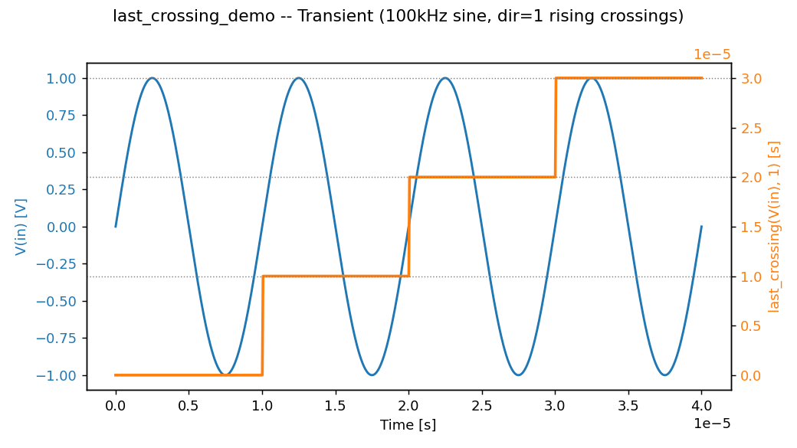
</p>

---

## Enhancement 7: `@(initial_step)` event gating and variable persistence

*July 2026* — While scoping `cross()`/`above()`/`timer()` (deferred from Enhancement 6), found and fixed a foundational, pre-existing gap those operators — and a large fraction of real-world Verilog-A models — depend on: `@(initial_step)`/`@(final_step)` event-control statements didn't gate anything at all (the guarded statement ran on *every* evaluation, forever), and ordinary `real`/`integer` analog-block variables didn't persist their value across evaluations either, with zero event-control involved. Fixed both: a new `ParamKind::IsInitialStep` simulator-provided flag with real conditional lowering for event-control statements, and genuine per-instance storage (`hidden_state`) for variable values across evaluations, backed by a two-pass MIR build to correctly identify which variables need it without regressing dead-code elimination.

- Both fixes verified against real ngspice DC/AC/Transient simulation — see `initial_step_examples/`, `variable_persistence_examples/`
- `@(initial_step)`: verified via `--dump-mir` (a real conditional branch, not dead code) and a real ngspice run showing the gating flag set exactly once per instance
- Variable persistence: a self-referential accumulator (`accum = accum + 1.0;`) now genuinely accumulates across transient timepoints instead of resetting to its default every evaluation
- Verified for no regressions against the full existing test suite — bit-exact/floating-point-noise-level unchanged DC, AC, and transient results
- Known limitation (documented, not fixed): an *explicit* `@(initial_step)` statement that writes to a variable can crash the compiler — narrow edge case, redundant now that plain declared initializers get correct once-only gating automatically
- Deferred to Enhancement 8: `cross()`/`above()`/`timer()` event operators and `generate`/`genvar` blocks — both remain fully unimplemented
- Details: [Enhancement-7.md](Enhancement-7.md)

**Transient result** for the variable-persistence fix — a self-referential accumulator with genuine, sustained persistence across timepoints:

<p align="center">
  
</p>

---

## Enhancement 8: `generate for`/`genvar` and `cross()`/`above()`/`timer()` event-control

*July 2026* — Implements the two features deferred from Enhancement 7. **`generate for`/`genvar`** (structural/declarative loop-based generation of nets, instances, variables, and parameters) is added as a new grammar production plus a text-level elaboration pass mirroring Enhancement 5's module-instantiation flattening, needing zero downstream (`hir_ty`/`mir*`/`sim_back`/`osdi`) changes. **`cross()`/`above()`/`timer()`** extend `@(...)`'s existing event-control grammar with real eval-granularity edge/timer detection (a persistent "previous value" slot, the same mechanism as Enhancement 7's variable persistence) — the original plan called for an OSDI ABI extension and `ngspice` breakpoint-forcing (`CKTsetBreak`), but this was descoped during implementation once eval-granularity detection proved sufficient, so **no OSDI ABI or `ngspice` C-side changes were needed** for the event functions themselves.

Verifying the event functions' primary real-world use case — accumulating a persistent counter on each firing (`count = count + 1.0;` inside the event body) — surfaced a chain of three pre-existing, general compiler bugs (confirmed present in the unmodified pre-Enhancement-7 baseline, not introduced by this work), all now found and fixed: a dangling-reference bug in the CFG-simplifier's unreachable-block removal, a multi-exit post-dominance bug in the dominator-tree builder, and a block-merge bug that could corrupt which block the DAE builder treated as the function's true exit. A fourth, unrelated `ngspice` parsing bug was also found and fixed along the way: a multi-parameter `.model` card override silently dropped its first parameter.

- `generate for`/`genvar`: verified via `--dump-mir` equivalence against a hand-written unrolled version (identical MIR/DAE shape) and a bit-exact ngspice DC sweep match on a `generate`-built resistor ladder — see `generate_examples/`
- `cross()`/`above()`/`timer()`: verified via `--dump-unopt-mir` (genuine conditional branches on the edge-detection condition, not dead code) and real ngspice DC/AC/transient runs — see `cross_examples/`, `timer_examples/`
- All three event functions now demonstrate genuine persistent-counter accumulation across firings (not just `$strobe` reporting), confirming the compiler-bug chain above is fully fixed
- Verified for no regressions against the full existing test suite — bit-exact/floating-point-noise-level unchanged DC, AC, and transient results
- Details: [Enhancement-8.md](Enhancement-8.md)

**DC sweep** for `generate for`-built vs. hand-written resistor ladders (bit-exact match):

<p align="center">
  
</p>

**DC / AC / Transient results** for `above()`'s persistent firing counter:

<p align="center">
  
  
  
</p>

**DC / AC / Transient results** for `cross()`'s persistent firing counter:

<p align="center">
  
  
  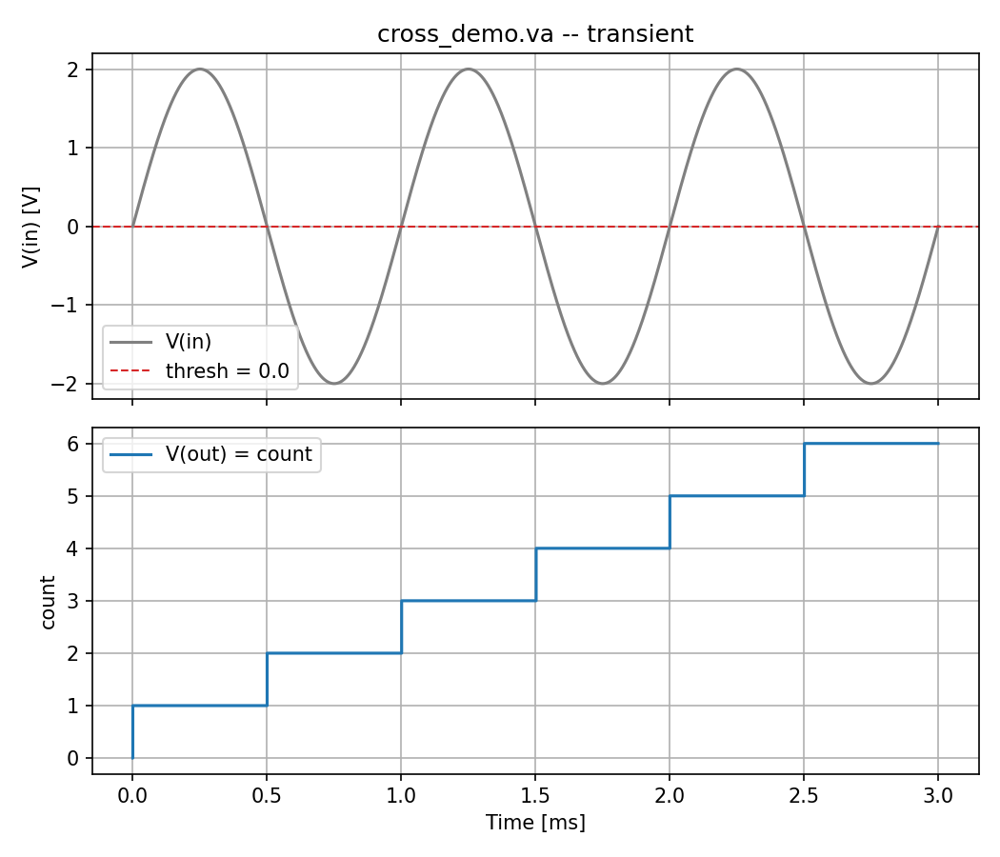
</p>

**DC / AC / Transient results** for `timer()`'s persistent tick counter:

<p align="center">
  
  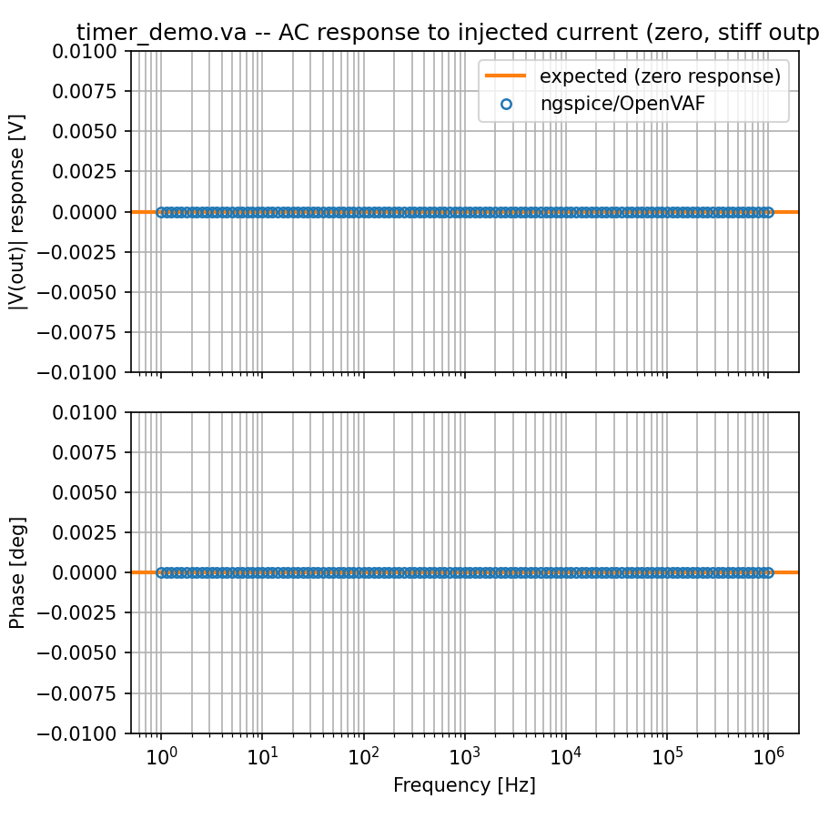
  
</p>

---

## Enhancement 9: Verilog-A noise tables, language fixes, and `repeat`/`disable` loops

*July 2026* — Completes the Verilog-A **noise-source** family: **`noise_table()`/`noise_table_log()`** are implemented end-to-end — reading the frequency/power data from an inline real array or a two-column data file, and generating `log10`-domain piecewise-linear, endpoint-clamped interpolation in the OSDI `load_noise` codegen — where before they read no data and hit an `unimplemented!()` in the backend. `white_noise()`/`flicker_noise()` already worked and are included as verified reference examples. **No OSDI ABI or `ngspice` C-side changes were needed**: ngspice's existing OSDI `.noise` path drives the new interpolation transparently.

Several unrelated language gaps found along the way are also fixed. **`localparam`** is now non-overridable per the LRM (it previously behaved exactly like `parameter`), while derived localparams (`localparam G = 1/R`) still correctly track their inputs; the **`electrical ground gnd;`** net-declaration ordering now parses (only `ground electrical gnd;` did before); **`slew`/`transition`/`last_crossing`/`zi_*`** — implemented back in Enhancement 6 — were re-enabled after Enhancement 8's `builtin.rs` regeneration had silently re-added their "unsupported" gate; and an **uninitialized `string` variable** now defaults to `""` instead of crashing the compiler. Two new statements are added: the **`repeat (count)`** loop, and **`disable <named_block>;`** — Verilog-A's early-exit mechanism, from which both loop `break` and `continue` are built (the language has no `break`/`continue` keywords).

- `noise_table`/`noise_table_log`: verified against closed-form analytics through ngspice `.noise` analysis (interpolated power spectral density matches to floating-point-noise level), alongside `white_noise`/`flicker_noise` — see `noise_examples/`
- `localparam`, `ground`, `string` variables, `repeat`, `disable`: each verified end-to-end through ngspice — see `localparam_examples/`, `ground_examples/`, `vartype_examples/`, `repeat_examples/`, `disable_examples/`
- Verified for no regressions against the full existing test suite and every prior example folder (clean release build of `openvaf-r` + `ngspice`, compile + simulate, with bit-exact reproduction of committed results)
- Details: [Enhancement-9.md](Enhancement-9.md)

**Noise spectral densities** for `white_noise`, `flicker_noise`, `noise_table`, and `noise_table_log`, each vs. its closed-form analytical prediction:

<p align="center">
  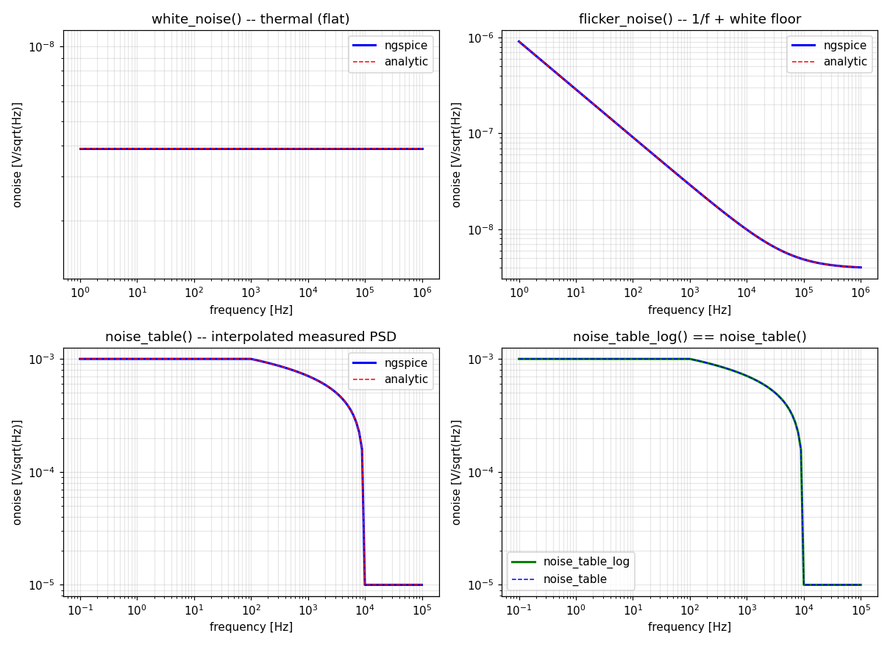
</p>

---

## Enhancement 10: Verilog-AMS random and statistical-distribution functions

*July 2026* — Implements the full random/statistical system-function family: **`$random`/`$arandom`** and every **`$dist_*`/`$rdist_*`** distribution (uniform, normal, exponential, poisson, chi-square, student-t, erlang), via MIR lowering to pure `osdi_rng_*` runtime functions (a splitmix64 core) — **no `ngspice` changes**. Each draw is a deterministic function of `(seed, per-call-site salt)` with *no* in-place seed advance: reproducible, stable across the nonlinear solve (an advancing seed would change every Newton iteration and break DC/transient convergence), and giving independent per-instance variation — the right semantics for statistical device modelling.

- Every distribution verified against its closed-form moments (mean/variance) over thousands of instances, plus reproducibility, stream independence, and `$random` integrality — see `rng_examples/` (`verify_rng.py`, 24/24)
- DC/AC/transient Monte-Carlo demo: an RC filter whose gain/R/C are perturbed by `$rdist_normal`, with plots
- Details: [Enhancement-10.md](Enhancement-10.md)

---

## Enhancement 11: File I/O and string-formatting system functions

*July 2026* — Implements the Verilog-AMS **file I/O** functions — **`$fopen`/`$fclose`/`$fdisplay`/`$fwrite`/`$fstrobe`/`$fmonitor`/`$fdebug`/`$fflush`/`$ftell`/`$fseek`/`$rewind`/`$feof`** — and the **string/reading** functions — **`$swrite`/`$sformat`/`$sscanf`/`$fgets`/`$fscanf`/`$ferror`**. File output reuses the existing `$display` `snprintf` machinery (generalised with a `PrintDst` sink) backed by a small module-global descriptor table in the OSDI stdlib; `$swrite`/`$sformat` format into a string variable, and `$sscanf`/`$fscanf` parse whitespace-delimited fields by target-variable type — **no `ngspice` changes**. (Two codegen traps fixed along the way: a shadowed-`fun` bug in the print callback, and an LLVM IPO mis-specialisation of the descriptor table, cured with a `volatile` table.)

- File output verified end-to-end — a parameter/`I=V/R`-table export exercising `%g`/`%d`/`%h`/`%s`, newline-less `$fwrite`, `$ftell`, and a `$rewind`/`$fseek` overwrite — see `fileio_examples/` (9/9)
- String/reading verified — `$sformat`/`$swrite`, `$sscanf`, file round-trips via `$fgets`/`$fscanf`, and `$ferror` — see `stringio_examples/` (6/6)
- Details: [Enhancement-11.md](Enhancement-11.md)

---

## Enhancement 12: Connectivity-alias, probe, and plusarg functions

*July 2026* — Implements the **last** previously-unsupported system functions — **`$simprobe`**, **`$analog_node_alias`/`$analog_port_alias`**, and **`$test$plusargs`/`$value$plusargs`** — so `hir_def::is_unsupported()` is now empty (every Verilog-AMS system function compiles). None of these has an underlying mechanism in the OSDI/ngspice target (no command-line plusargs, no generic simulator probe, no runtime hierarchical node aliasing), so each lowers to its LRM "mechanism-unavailable" fallback as a compile-time constant (`false` / `0` / the supplied default). A model that uses them now compiles and runs predictably instead of being rejected — with **no runtime callback and no `ngspice` change**.

- Each function verified to return its documented fallback (including `$simprobe` returning a supplied default) — see `alias_examples/` (6/6)
- Details: [Enhancement-12.md](Enhancement-12.md)

---

## Enhancement 13: `limexp()` — kept stateless (a documented decision)

*July 2026* — Investigated the `limexp()` limited exponential. The existing **stateless** implementation — `exp(x)` below `ln(1e30)`, continued along its tangent above to bound the derivative and prevent overflow — is exact and correct in every analysis, and is **kept, unchanged**. A stateful prev-iteration step-limiting version was implemented and then **reverted**: it produces wrong DC values, because keeping the converged value correct *while* limiting requires SPICE's limiting-RHS correction, and OpenVAF only applies that to circuit *unknowns* — not to `limexp`'s derived argument (e.g. `V/Vt`). This enhancement documents the decision (with the failing evidence) so it isn't re-attempted.

- Along the way, the already-supported **`ddx()`** symbolic-derivative operator was demonstrated across DC/AC/transient: a nonlinear resistor exports its `ddx`-computed conductance, which matches the closed-form derivative exactly and governs the small-signal AC response — see `ddx_examples/`
- Details: [Enhancement-13.md](Enhancement-13.md)

---

## Enhancement 14: array literals / aggregates

*July 2026* — Completed Verilog-A **array** support beyond element-at-a-time access. Adds **whole-array aggregate assignment** (`c = '{v0, v1, v2};` and array-to-array copy `c = d;`), **array-valued parameters** (`parameter real [0:3] w = '{...};`) that expand into one scalar OSDI parameter per element — each with its own default and **individually overridable from SPICE** (`.model m dev(w[2]=0.9)`) — and **dynamic (non-constant) indexing** `c[i]` for array variables, lowered to a runtime select over the element variables.

- Fixed a pre-existing infinite-loop bug in `Type::base_type` (it looped on `self` instead of the cursor) that hung the compiler on any array type check — e.g. assigning an array literal to a scalar; such mismatches now report a clean diagnostic
- Verified end-to-end through ngspice — array-parameter defaults, full and partial per-element override, aggregate assignment, copy, and dynamic read/write all match their closed-form values — see `array_examples/`
- Details: [Enhancement-14.md](Enhancement-14.md)

---

## Enhancement 15: multi-dimensional arrays

*July 2026* — Generalised the (1-D) arrays of Enhancement 14 to **any number of dimensions**: N-D declaration for variables and parameters (`real [0:1][0:2] m;`), **constant and dynamic indexing** `m[i][j]`, **nested aggregate literals** (`acc = '{'{a, b}, '{c, d}};`), and N-D array parameters whose elements (`w[0][0]`, `w[0][1]`, …) each carry a default and are **individually overridable from SPICE** (`.model m dev(w[1][1]=0.9)`). Kept the whole-array-expanded-to-scalars model, so no OSDI ABI change and no ngspice change were needed; a dynamic index lowers to a runtime flat-position select over the elements.

- The bit-select representation became multi-index (`m[i][j]` carries all its `[..]` clauses) and array declarations carry a per-dimension size list, while all existing 1-D net/array code stayed unchanged
- Verified end-to-end through ngspice — 2-D parameter defaults, per-element 2-D override, nested-literal aggregate assignment, and dynamic 2-D read/write — see `mdarray_examples/`; every prior example (including 1-D arrays, vectored nets, and `generate`) still passes
- Details: [Enhancement-15.md](Enhancement-15.md)

---

## Enhancement 16: `$table_model` lookup tables

*July 2026* — Implemented the Verilog-AMS **`$table_model`** system function (1-D), which previously carried an explicit `// TODO TABLE_MODEL`. `$table_model(x, <data>[, "control"])` interpolates a value from a tabulated grid — the data coming from an inline `'{x0,y0, x1,y1, ...}` array or a two-column data file — with piecewise-**linear** interpolation and **constant** (clamp) or **linear** extrapolation. Unlike `noise_table` (which only feeds the noise PSD), `$table_model` is used in the **main device equations**, so it is lowered to plain **differentiable MIR arithmetic**: `mir_autodiff` then yields the per-segment slope as the Jacobian entry for free — no OSDI ABI change and no ngspice change needed.

- Verified end-to-end across **DC, AC and transient**: a transfer table interpolates bit-exactly; a file-based nonlinear resistor converges to the analytic nonlinear DC operating point (~5e-10 V); its AC small-signal conductance equals the analytic table slope (~1e-18 S); and its transient output tracks the table instantaneously — see `table_model_examples/` (with DC/AC/transient PNG plots)
- Scope is 1-D linear interpolation; multi-dimensional tables and higher-degree (spline) interpolation are the natural follow-up (as 1-D arrays in Enhancement 14 were extended to N-D in Enhancement 15)
- Details: [Enhancement-16.md](Enhancement-16.md)

---

## Enhancement 17: multi-dimensional `$table_model`

*July 2026* — Generalised the (1-D) `$table_model` of Enhancement 16 to **2-D and 3-D** tables: `$table_model(x1, x2[, x3], "grid_file"[, "control"])` interpolates a value from an N-dimensional grid by **multilinear** (bilinear / trilinear) interpolation. The elegant part is that N-D interpolation is built as **recursive 1-D interpolation** — peel the outermost axis, interpolate each of its slices over the remaining axes, then interpolate those results — so one routine handles any N and, being ordinary differentiable MIR, `mir_autodiff` supplies **all** the partial derivatives (e.g. a table-based MOSFET's `gm` *and* `gds`) with no special support. No OSDI ABI change and no ngspice change.

- Verified end-to-end through ngspice with a **table-based MOSFET** `I(Vgs, Vds)`: the drain current matches a bilinear reference to machine precision (~1e-19 A), and both `gm = dId/dVgs` and `gds = dId/dVds` match the surface partials (~1e-16 S) — so the 2-D Jacobian is exact. Bilinear reproduces `x·y` and trilinear reproduces `x·y·z` exactly; the 1-D case is unchanged — see `mdtable_examples/` (with an I-V surface plot)
- Multi-dimensional data comes from a self-describing grid file (`ndim`, axis sizes, axis coordinates, row-major values); supported dimensionality is 1-D/2-D/3-D, with higher-degree (spline) interpolation as future work
- Details: [Enhancement-17.md](Enhancement-17.md)

---

## Prebuilt Binaries

Binaries are built by CI and committed to `bin/`:

| Platform | Directory | Binaries |
|---|---|---|
| Linux x86-64 | `bin/linux/intel/` | `ngspice`, `openvaf-r` |
| Linux ARM64 | `bin/linux/arm/` | `ngspice`, `openvaf-r` |
| macOS Apple Silicon (M1/M2/M3) | `bin/macos/apple-silicon/` | `ngspice`, `openvaf-r` |
| macOS Intel | `bin/macos/intel/` | `ngspice`, `openvaf-r` |
| Windows x86-64 | `bin/windows/intel/` | `ngspice.exe`, `openvaf-r.exe` |

### Running on Linux

The binaries are dynamically linked against standard system libraries. Install them with your package manager if missing:

**Ubuntu / Debian:**
```bash
sudo apt-get install libreadline8 libx11-6 libxaw7 libxft2 libxext6
```

**Fedora / RHEL:**
```bash
sudo dnf install readline libX11 libXaw libXft libXext
```

After that, mark the binaries executable and run:
```bash
chmod +x bin/linux/intel/ngspice bin/linux/intel/openvaf-r
./bin/linux/intel/ngspice
```

### Running on macOS

The binaries are dynamically linked against **XQuartz** (X11) and **Homebrew** readline/ncurses. Both must be installed before running.

**1. Install XQuartz** (provides the X11 window system for ngspice plots):

Download and install from [https://www.xquartz.org](https://www.xquartz.org), then **log out and log back in** so the X11 libraries at `/opt/X11` are on the dynamic linker path.

**2. Install Homebrew dependencies:**
```bash
brew install readline ncurses
```

**3. Mark binaries executable and run:**
```bash
# Apple Silicon (M1/M2/M3)
chmod +x bin/macos/apple-silicon/ngspice bin/macos/apple-silicon/openvaf-r
./bin/macos/apple-silicon/ngspice

# Intel Mac
chmod +x bin/macos/intel/ngspice bin/macos/intel/openvaf-r
./bin/macos/intel/ngspice
```

> **Note:** macOS may show a security warning ("cannot be opened because the developer cannot be verified"). Go to **System Settings → Privacy & Security** and click **Allow Anyway**, or run:
> ```bash
> xattr -d com.apple.quarantine bin/macos/apple-silicon/ngspice
> xattr -d com.apple.quarantine bin/macos/apple-silicon/openvaf-r
> ```

### Running on Windows

The Windows binaries come **bundled with all required MinGW runtime DLLs** (`libreadline8.dll`, `libtermcap-0.dll`, `libstdc++-6.dll`, `libwinpthread-1.dll`, etc.) in the same directory. No MSYS2, MinGW, or other runtime installation is required — just keep all files in `bin\windows\intel\` together.

Simply run from that directory:
```
bin\windows\intel\ngspice.exe
bin\windows\intel\openvaf-r.exe
```

> **Note:** Windows may show a SmartScreen warning on first run ("Windows protected your PC"). Click **More info → Run anyway**.

> **Note:** `openvaf-r.exe` is a command-line tool. Run it from **Command Prompt** or **PowerShell**, not by double-clicking.

---

## CI Build Details

Builds run on push to `main` (source changes only; binary commits are skipped) or manually via **Actions → Build binaries → Run workflow**.

| Runner | Target | Notes |
|---|---|---|
| `ubuntu-latest` | `bin/linux/intel/` | LLVM 18 from apt |
| `ubuntu-24.04-arm` | `bin/linux/arm/` | LLVM 18 from apt |
| `macos-14` | `bin/macos/apple-silicon/` | LLVM 18 via Homebrew, XQuartz |
| `macos-26-intel` | `bin/macos/intel/` | LLVM 18 via Homebrew, XQuartz; macOS 26 "Tahoe" image, currently in beta. GitHub has signaled Intel macOS runners will be retired entirely in 2027. |
| `windows-latest` | `bin/windows/intel/` | LLVM 18 official tarball, ngspice via MSYS2/MinGW (static) |

See [`.github/workflows/build-binaries.yml`](.github/workflows/build-binaries.yml) for the full workflow.
