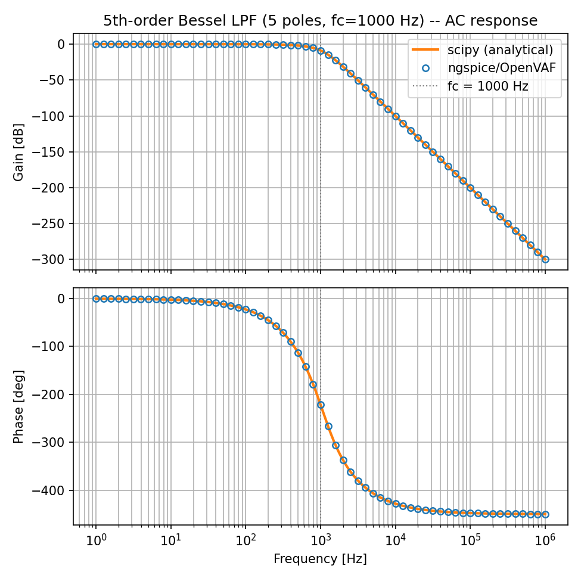
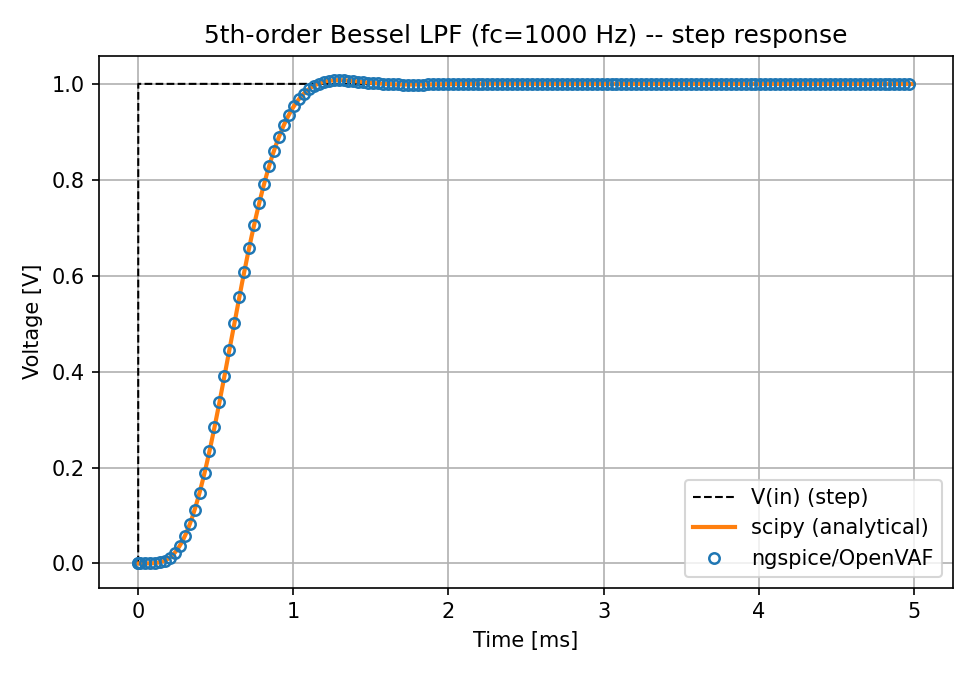

# 5th-order Bessel low-pass filter example (version5)

An end-to-end correctness example for OpenVAF/ngspice **Laplace transform
filter** operator support (`laplace_nd`, Enhancement-4 Part 1): a genuine
5th-order analog Bessel low-pass filter, realized purely via `laplace_nd`
(no RLC network in the model), cross-checked against the same coefficients'
analytical response computed independently in Python (`scipy.signal`).

- compiler : `../OpenVAF-master-20260610/target/release/openvaf-r` (or `../bin/macos/apple-silicon/openvaf-r`)
- simulator: `../bin/macos/apple-silicon/ngspice`

See `../Enhancement-4.md` for the Laplace-operator implementation writeup,
and Part 4 (added alongside this example) for the integer-literal-overflow
crash this example surfaced and the fix for it.

## The model

`design_bessel.py` designs a 5th-order analog Bessel low-pass filter with
`scipy.signal.bessel(N=5, Wn=2*pi*1000, analog=True, norm='phase')`, then
writes the **exact same coefficients** (bit-for-bit, ascending powers of
`s`) into `bessel5.va`:

```verilog
module bessel5(in, out);
    input in;
    output out;
    electrical in, out;

    analog begin
        V(out) <+ laplace_nd(V(in), '{9.79262991312900096e+18}, '{9.79262991312900096e+18, 6.13487665087554400e+15, ...});
    end
endmodule
```

Sharing the exact coefficients (rather than re-deriving them by hand) means
any mismatch between the simulation and the analytical curve can only come
from the compiler/simulator, not from a transcription error — the strongest
version of this cross-check.

## The comparison

`compare_bessel.py` computes `H(jw)` directly from the same `b, a` via
`scipy.signal.freqs` (AC) and `scipy.signal.step` (transient), and overlays
it against the ngspice/OpenVAF simulation.

| Analysis | Result |
|---|---|
| AC (1 Hz – 1 MHz) | max gain error **5.6e-7 dB**, max phase error **7.2e-7°** vs. analytical |
| Step response | max error **6.6e-6 V** vs. analytical |

Both are numerical-noise-level agreement — the simulated and analytical
curves are visually indistinguishable:

<p align="center">
  
  
</p>

The AC plot shows the classic Bessel shape: a gentle, non-maximally-flat
magnitude rolloff (5 poles → -450° total phase swing) in exchange for the
near-linear phase Bessel filters are chosen for. The step response shows
the characteristic small (~1%), non-ringing overshoot.

## Layout

```
bessel_filter_examples/
  design_bessel.py    designs the filter with scipy and writes bessel5.va
  compare_bessel.py    computes the analytical response and plots the comparison
  bessel5.va          the generated 5th-order Bessel model (laplace_nd)
  bessel5.osdi         compiled with version5 openvaf-r (macOS/Apple Silicon snapshot)
  ac_sim.cir           AC sweep 1Hz-1MHz
  tran_sim.cir         step response
  _setup.sh            picks the right bin/<os>/<arch> binaries and recompiles
                       the model for this platform (sourced by run_examples.sh)
  run_examples.sh       runs ac/tran with ngspice and writes ac.txt/tran.txt
  ac.txt, tran.txt      raw wrdata output from the last run
  ac_compare.png, tran_compare.png  plotted simulated-vs-analytical comparison
```

`ac_sim.cir`/`tran_sim.cir` reference `OSDIFILE`/`RESULTFILE` placeholders
rather than hardcoded paths — `run_examples.sh` substitutes them at run
time, so the checked-in netlists stay portable across machines and
OS/architectures.

## Reproduce

```bash
# regenerate bessel5.va from scratch (optional -- it's already checked in)
python3 design_bessel.py

# run AC + transient (compiles bessel5.va for this platform first)
bash run_examples.sh

# compute the analytical response and plot the comparison
python3 compare_bessel.py
```
