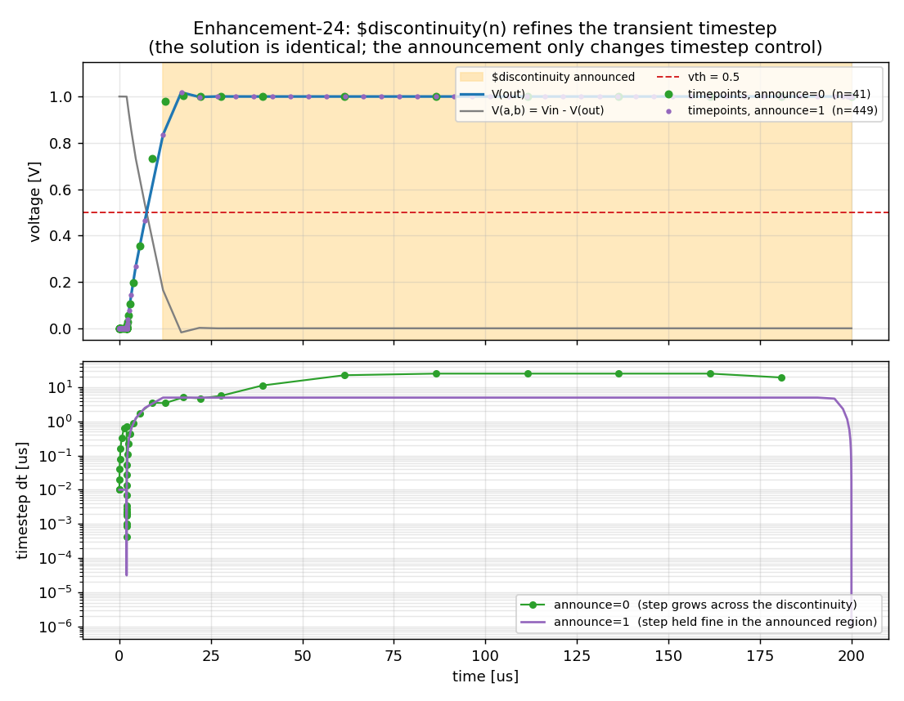

# discontinuity_examples — `$discontinuity(n)` (Enhancement-24)

Demonstrates **`$discontinuity(n)`**, using **version11's own** `openvaf-r` and
`ngspice-46`. `$discontinuity(n)` (n ≥ 0) announces a discontinuity of degree *n*
in the branch constitutive relations at the current point, so the simulator
**limits the transient timestep** there instead of extrapolating a large step
across the event. Previously it compiled but was a no-op (except the internal
`$discontinuity(-1)` used by limiting).

## What it does now

`$discontinuity(n)` for n ≥ 0 writes a sentinel into the model's **`bound_step`**
eval output; ngspice's `OSDItrunc` (its OSDI timestep-control hook) reads the
sentinel and clamps the next timestep so it does not grow past the last accepted
step — resolving the discontinuity region rather than coasting across it. It
affects **only timestep control**, never the computed solution. (This is
implemented over `bound_step` because the OSDI eval-return-flag path used by
`$finish`/`$stop` is not honoured by ngspice's timestep control.)

## The model

`disc_demo.va` is a conductance switch: `g` jumps between two values at
`V(a,b) = vth`, so `I = g·V(a,b)` is discontinuous there. While the device sits
in the switched region it announces `$discontinuity(0)`. A `announce` parameter
toggles the announcement.

## Run

```
python3 verify_discontinuity.py
```

Expected (`ALL PASS`):

- **timestep limiting** — the same transient produces *far* more (finer)
  timepoints with the announcement on than off (~hundreds×), i.e. the
  discontinuity actually limits the timestep;
- **solution unchanged** — the DC operating point is identical either way (the
  announcement changes timestep control, never the computed result).

## Plots

```
python3 plot_discontinuity.py
```

writes `discontinuity_timesteps.png`: a step drives an RC through the switching
threshold, and the same transient is run with the announcement off and on. The
top panel shows the (identical) waveform with a marker at every accepted
timepoint and the announced region shaded; the bottom panel shows the transient
timestep `dt` vs time — without the announcement the step grows to the `tmax`
ceiling across the discontinuity, while with it the step is held fine throughout
the announced region.



## Notes / limitations

- Requires the accompanying **ngspice** change (`OSDItrunc` in `src/osdi/`), so it
  only works with version11's rebuilt `ngspice`.
- The degree `n` is currently treated uniformly (any n ≥ 0 ⇒ "limit the step
  here"); ngspice's OSDI timestep control has no finer degree-specific hook.
- `$discontinuity` and `$bound_step` share the `bound_step` output slot
  (last-writer-wins within one evaluation); a negative value is the discontinuity
  sentinel, a positive value is an explicit `$bound_step` bound.
