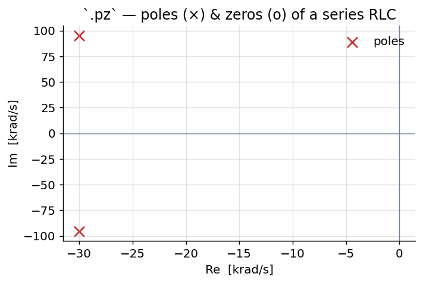
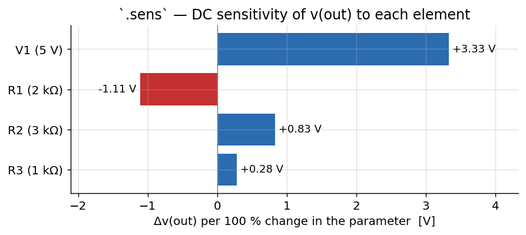
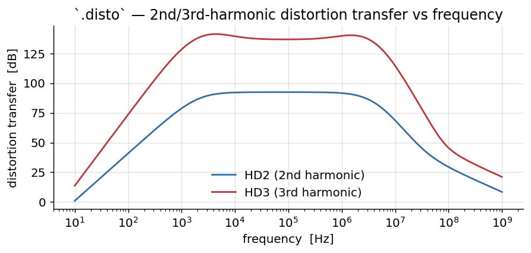
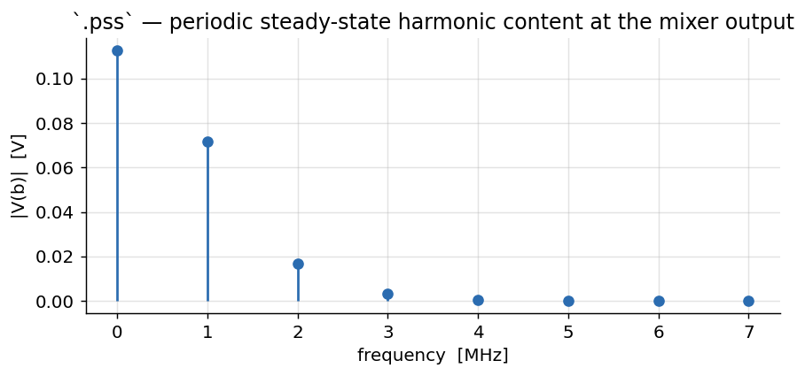
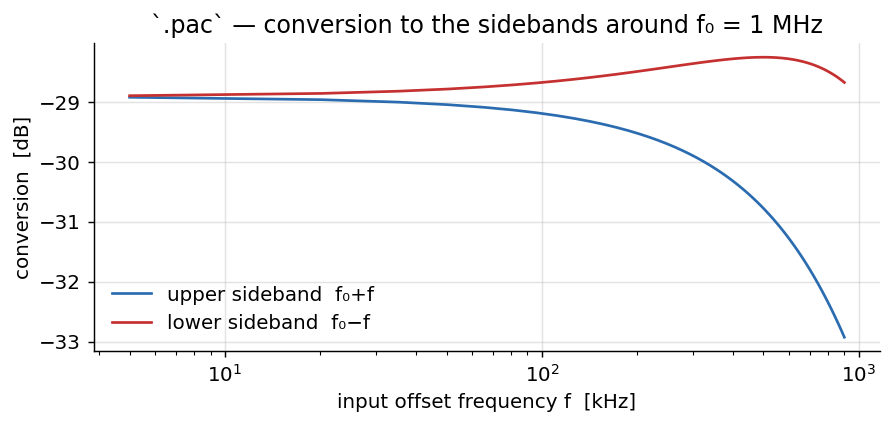
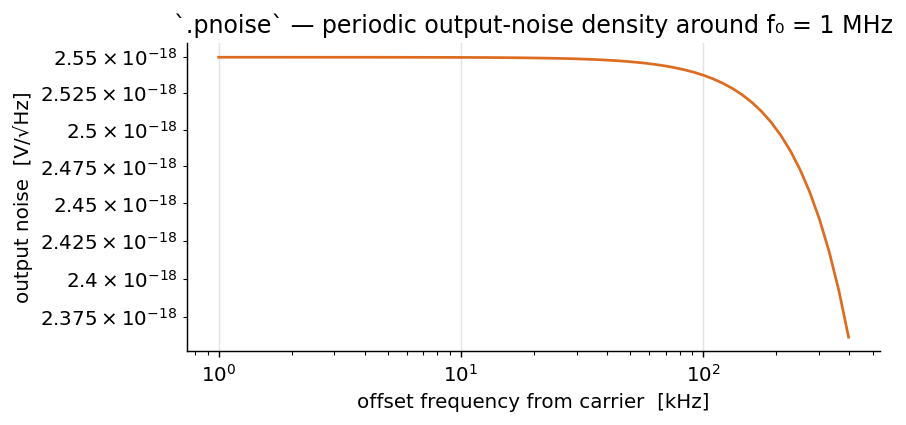

# ngspice commands — a worked reference

This document walks through the commands available in this ngspice build — the
stock nutmeg/spice command set **plus** every command added by the
[enhancement project](https://github.com/javaNoviceProgrammer/Ngspice_OpenVAF_Enhancements)
(the RF steady-state suite, the optimizer, Monte-Carlo/yield, post-layout
reliability, `pyplot`, `pre_osdi`/`pre_snp`, `eye`, `stb`, …). The core analyses
are shown with **complete, copy-pasteable netlists** and **plots produced by
actually running them**; the many smaller utility commands are collected into
reference tables at the end.

Every plot in this document was generated by
[`make_commands_figs.py`](make_commands_figs.py) from the exact netlists shown.

---

## 1. How commands are run

An ngspice input file (a *deck* or *netlist*) has this shape — **the first line is
always the title** and is ignored as a component:

```
* my circuit title            <- title line (ignored)
V1 in 0 dc 1                  <- components
R1 in out 1k
C1 out 0 1u
.tran 10u 5m                  <- a "dot-card" analysis
.control                      <- an interactive command block
run
plot v(out)
.endc
.end
```

There are four ways a command runs:

| Context | How | Example |
|---|---|---|
| **Batch** | `ngspice -b deck.cir` runs every dot-card analysis and any `.control` block, then exits | `ngspice -b amp.cir` |
| **Interactive** | at the `ngspice N ->` prompt | `ngspice -> tran 1u 1m` |
| **`.control` block** | commands between `.control` and `.endc` in the deck | `run` then `print v(out)` |
| **Dot-card** | `.tran`/`.ac`/… in the deck body, executed by `run` | `.ac dec 10 1 1meg` |

The interactive analysis commands (`tran`, `ac`, `dc`, `op`, …) take the **same
arguments** as their dot-card spelling and run immediately. `run` executes the
analysis named by the deck's dot-cards. Results are stored as named **vectors**
inside **plots** (`print`, `plot`, and expressions read them back).

---

## 2. Analyses

### `op` — DC operating point

Solves the quiescent (DC) bias point: every node voltage and source current with
all capacitors open and inductors shorted.

```
* operating point of a resistive divider
V1 in 0 dc 5
R1 in out 2k
R2 out 0 3k
.control
op
print v(out) i(v1)
.endc
.end
```

`v(out) = 3.0 V`, `i(v1) = -1 mA`. `op` is also the bias point every AC, noise,
`tf`, `pz`, and small-signal analysis linearizes around.

### `dc` — DC sweep (and nested sweep)

`dc <src> <start> <stop> <step> [<src2> <start2> <stop2> <step2>]` sweeps a source
(and optionally a second, giving a family of curves). The classic uses are a
diode I–V and a transistor's output characteristics.

```
* diode forward I-V
Vd a 0 dc 0
D1 a 0 DMOD
.model DMOD D(is=1e-14 n=1)
.dc Vd 0 0.8 0.005
.control
run
plot abs(i(vd)) ylog
.endc
.end
```


A **nested** sweep produces the textbook MOSFET output family — the inner source
`Vds` sweeps for each value of the outer source `Vgs`:

```
* NMOS output characteristics (nested .dc)
Vds d 0 dc 0
Vgs g 0 dc 0
M1 d g 0 0 NM W=20u L=1u
.model NM NMOS(level=1 vto=0.7 kp=120u lambda=0.02)
.dc Vds 0 5 0.05 Vgs 1 4 1
.control
run
plot -i(vds)
.endc
.end
```


### `ac` — small-signal frequency response

`ac <lin|dec|oct> <N> <fstart> <fstop>` linearizes at the operating point and
sweeps frequency. Drive the input with an `ac` magnitude and read `vdb()`
(magnitude in dB) and `vp()` (phase).

```
* RC low-pass Bode
Vin in 0 dc 0 ac 1
R1 in out 1k
C1 out 0 100n
.ac dec 40 1 1meg
.control
run
plot vdb(out)
plot vp(out)
.endc
.end
```


The −3 dB corner sits at `1/(2πRC) ≈ 1.6 kHz`; the phase rolls from 0° to −90°.

### `tran` — transient (time-domain)

`tran <tstep> <tstop> [tstart [tmax]] [uic]` integrates the circuit in time.

```
* 1 V step into an RC (over-damped) and a series RLC (ringing)
Vin in 0 pulse(0 1 1u 1n 1n 1 2)
R1 in a 1k
C1 a 0 100n
L1 in b 1m
Rs b c 20
C2 c 0 100n
.tran 1u 400u
.control
run
plot v(a) v(c)
.endc
.end
```


### `noise` — noise analysis

`noise <output> <input-source> <lin|dec|oct> <N> <fstart> <fstop>` computes the
output- and input-referred noise spectral density (and integrated noise). The
spectrum vectors live in the `noise1` plot; the integrated totals in `noise2`.

```
* output noise of a 10k + 1n RC
Vin in 0 dc 0 ac 1
R1 in out 10k
C1 out 0 1n
.noise v(out) Vin dec 20 10 1meg
.control
run
setplot noise1
plot onoise_spectrum
.endc
.end
```


### `tf` — DC transfer function

`tf <output> <input-source>` reports the small-signal DC gain plus the input and
output impedance. `<output>` is `v(node)`, `v(node1,node2)`, or `i(vsource)`.

```
* transfer function of a voltage divider
Vin in 0 dc 1
R1 in out 1k
R2 out 0 1k
.control
tf v(out) Vin
.endc
.end
```

Reports `transfer_function = 0.5`, `output_impedance_at_v(out) = 500 Ω`,
`vin#input_impedance = 2 kΩ`.

### `pz` — pole/zero

`pz <n1> <n2> <n3> <n4> <cur|vol> <pz|pol|zer>` finds the poles and zeros of the
transfer function between the input node pair `(n1,n2)` and output pair
`(n3,n4)`.

```
* poles/zeros of a series RLC (v(out)/vin)
Vin in 0 dc 0 ac 1
L1 in m 1m
R1 m out 60
C1 out 0 100n
.pz in 0 out 0 vol pz
.control
run
print all
.endc
.end
```



The complex-conjugate pole pair sits at `−30 ± 95 krad/s` — a resonance near
`ω₀ = 1/√(LC) = 100 krad/s` with the loss set by `R`.

### `sens` — sensitivity

`sens <output>` computes the DC sensitivity of an output to **every** circuit
parameter; append `ac <lin|dec|oct> <N> <fstart> <fstop>` for the small-signal AC
sensitivity vs frequency. The result lands in a `sens1` plot, one vector per
device (its value sensitivity) and per model parameter (`<dev>:<param>`).

```
* DC sensitivity of v(out) to every element
V1 in 0 dc 5
R1 in out 2k
R2 out mid 3k
R3 mid 0 1k
.sens v(out)
.control
run
print v1 r1 r2 r3      ; each is ∂v(out)/∂param
.endc
.end
```

Scaling each raw sensitivity by the parameter's nominal value gives a comparable
"Δv(out) per 100 % change" — the clearest way to rank which element matters most:



The output tracks the 5 V supply most strongly, and increasing the series R₁
*lowers* it (negative sensitivity), as expected for a divider.

### `disto` — small-signal distortion

`disto <lin|dec|oct> <N> <fstart> <fstop> [f2overf1]` sweeps a small-signal
harmonic (and, with a second tone, intermodulation) distortion analysis. Mark the
driving source with `distof1` (and `distof2` for two-tone). The 2nd- and
3rd-harmonic products land in the `disto1` / `disto2` plots.

```
* small-signal distortion of a common-emitter BJT amp
Vcc cc 0 dc 5
Vin in 0 dc 0.75 ac 1 distof1 1
Rb cc b 220k
Rc cc c 2.2k
Cin in b 1u
Cout c 0 20p
Q1 c b 0 QMOD
.model QMOD NPN(is=1e-15 bf=150 vaf=80 cjc=3p tf=0.3n)
.disto dec 20 10 1g
.control
run
setplot disto1
plot vdb(c)            ; HD2 vs frequency  (disto2 holds HD3)
.endc
.end
```



The distortion (here in dB relative to the unit `distof1` drive) is flat across
the amplifier's passband and rolls off with the input coupling capacitor at low
frequency and the transistor's bandwidth at high frequency.

### `fourier`

`fourier <fund_freq> <vec>` prints the DC term, the first harmonics, and the THD
of a **time-domain** waveform — run a `.tran` first, then `fourier 10k v(out)`.
(The `spec`/`fft` commands in §4 give the full spectrum as a plot.)

---

## 3. RF and periodic steady-state

The project adds a full RF suite on top of the analyses above. Most run as their
own command (or dot-card); the periodic small-signal analyses (`.pac`, `.pnoise`,
`.pxf`, `.psp`) run as dot-cards around a `pss`/`.pss` operating point.

`sp` is the small-signal S-parameter analysis — tag the ports with
`portnum`/`z0` sources:

```
* LC low-pass S-parameters (50 ohm ports)
L1 in out 1u
C1 out 0 400p
V1 in 0 dc 0 ac 1 portnum 1 z0 50
V2 out 0 dc 0 ac 1 portnum 2 z0 50
.sp dec 50 1meg 100meg
.control
run
plot vdb(S_2_1)
.endc
.end
```


| Command | What it does |
|---|---|
| `sp` | S-parameters + noise figure (`.sp`), Touchstone-exportable |
| `pss` | periodic steady state (shooting); the base for the periodic small-signal set |
| `hb` | harmonic-balance steady-state spectrum: `hb <f0> <K>` |
| `hbosc` | autonomous HB for an **oscillator**: `hbosc <oscnode> <K> [fguess] [tstab]` |
| `phasenoise` | oscillator phase-noise `L(Δf)` around an `hbosc` point |
| `qpss` | two-tone quasi-periodic steady state: `qpss <expr> <f1> <f2> …` |
| `qpac` / `qpxf` / `qpnoise` | two-tone periodic AC / transfer / noise around a `qpss…hb` point |
| `envelope` | envelope following: `envelope <node> <fc> <tstop>` |
| `stb` | loop-gain stability (Middlebrook/Tian double injection); reports phase/gain margin |

### Periodic small-signal — `.pss`, `.pac`, `.pnoise`, `.pxf`, `.psp`

These analyses characterise a circuit **around a large-signal periodic operating
point** (a mixer under its LO, a switched-capacitor under its clock, an
oscillator). `.pss` finds that periodic steady state; the rest are small-signal
analyses *on top of it*. All share the same leading arguments
`<fund> <tstab> <outnode> <points> <harmonics> …`.

A self-contained example — a behavioural (`B`-source) conductance pumped by a
1 MHz "LO", which acts as a mixer:

```
* LO-pumped behavioural mixer
V1 lo 0 SIN(0 1 1meg)
VDC a 0 DC 1 AC 1
R1 a b 10k
B1 b 0 I=(1m + 0.8m*v(lo))*v(b)     ; conductance modulated by the LO
C1 b 0 100p
.pss 1meg 1u b 1024 8 50 5u          ; find the periodic steady state
.control
run
setplot pss2                         ; frequency-domain result
plot mag(b)
.endc
.end
```

`.pss` returns the periodic operating point — its harmonic content shows the LO
and the harmonics the nonlinearity generates:



With that operating point, `.pac` computes the small-signal **conversion** to each
mixing sideband (`f₀ ± f`) versus the input frequency — swap the `.pss` line for:

```
.pac 1meg 1u b 1024 6 50 5u lin 60 5k 900k 1
```
```
plot db(b_usb1) db(b_lsb1)     ; upper / lower sideband conversion
```



`.pnoise` gives the **periodic / phase-noise** density folded from every
sideband, versus offset from the carrier:

```
.pnoise 1meg 1u b 1024 6 50 5u b vdc dec 25 1k 400k
```
```
set sqrnoise
plot onoise_spectrum           ; V/√Hz vs offset frequency
```



`.pxf` (periodic transfer function — sensitivity of an output to a small
perturbation at each sideband) and `.psp` (periodic S-parameters) take the same
`.pss` preamble; see the [RF suite reference](ngspice_rf_suite.md) for those plus
the two-tone `qpss`/`qpac`/`qpnoise`/`qpxf` family and the oscillator
`hbosc`/`phasenoise` flow.

---

## 4. Signal processing and measurement

These operate on vectors already in memory (typically after a `.tran`).

`fft <vec>` computes an FFT (run `linearize` first so the samples are uniformly
spaced); `spec` and `psd` are related spectral views.

```
* harmonics of a diode-clipped 10 kHz sine
Vin in 0 sin(0 1.2 10k)
R1 in a 1k
D1 a 0 DL
D2 0 a DL
.model DL D(is=1e-12)
.tran 1u 2m
.control
run
linearize
fft v(a)
plot mag(v(a))
.endc
.end
```


The symmetric clipper produces only odd harmonics (30, 50, 70 kHz …).

| Command | Purpose |
|---|---|
| `meas` | measure a quantity from a result (`meas tran tr TRIG … TARG …`, `meas ac gain MAX vdb(out)`, gain/phase margin, delays, RMS, …) |
| `fft` | FFT spectrum of a vector |
| `spec` | spectrum over a frequency window: `spec <fstart> <fstop> <fstep> <vec>` |
| `psd` | power spectral density via FFT |
| `fourier` | Fourier coefficients + THD of a transient |
| `eye` | eye diagram + jitter: `eye <expr> -ui <T> [-tstart t0] [-threshold v]` |
| `linearize` | resample a transient onto a uniform time grid (needed before `fft`) |
| `cutout` | keep only a slice of a vector |
| `transpose` | transpose a multi-dimensional vector |
| `cross` | build a vector by picking elements from others |
| `compose` | build a vector from values/ranges: `compose v start=0 stop=1 step=0.1` |
| `reshape` | change a vector's dimensions |
| `settype` / `deftype` | set/redefine a vector's type (voltage, time, …) for axis labelling |

---

## 5. Vectors, variables and expressions

Results are **vectors**; `let` creates or modifies them and `print`/`plot` read
them. Expressions support the usual math plus `v()`, `i()`, `vdb()`, `vp()`,
`mag()`, `ph()`, `real()`, `imag()`, `db()`, `abs()`, `sqrt()`, `vector()`,
`length()`, `mean()`, `vecmax()`, `vecmin()`, and the ternary `?:`.

```
.control
run
let pwr = v(out)*i(vout)          ; a new vector
let gain_db = vdb(out)
print vecmax(abs(v(out)))         ; scalars are 1-length vectors
print mean(pwr)
.endc
```

| Command | Purpose |
|---|---|
| `let` | assign a vector: `let x = expr` |
| `unlet` | delete vectors |
| `print` | print vector values: `print [col] expr …` |
| `display` | list the vectors in the current plot |
| `define` / `undefine` | user function: `define sq(x) x*x` |
| `set` / `unset` | set/clear a control variable: `set numdgt=8` |
| `setcs` | like `set`, but keeps the value's case |
| `option` / `options` | set a **simulator** option: `option reltol=1e-4 klu` |
| `setscale` | change the plot's default scale vector |
| `setseed` | reseed the RNG for reproducible Monte Carlo |
| `remzerovec` | drop zero-length vectors |

---

## 6. Plotting and data export

```
.control
run
plot v(out) vs time
plot vdb(out) xlog             ; log-x Bode
pyplot acmag vdb(out)          ; matplotlib PNG/‑window
wrdata out.dat v(out) v(in)    ; columnar (whitespace) data file
wrdata -csv out.csv v(out) v(in) ; comma-separated, with a header row
write out.raw v(out)           ; binary rawfile (reload with `load`)
.endc
```

| Command | Purpose |
|---|---|
| `plot` | the built-in plotter: `plot expr … [vs expr] [xl lo hi] [yl lo hi] [xlog] [ylog]` |
| `pyplot` | render/export via **matplotlib** (`-eye`, `-hist`, `-contour` variants); PNG when a file is named |
| `gnuplot` | render/export via gnuplot |
| `hardcopy` | write a PostScript/SVG hardcopy of a plot |
| `asciiplot` | plot as ASCII art in the terminal |
| `wrdata` | write columnar (whitespace) data — each vector prefixed by its scale; **`-csv`** (or `set wr_csv`) writes a comma-separated file with a header row and one shared scale column |
| `write` | write a binary **rawfile** (`load` reads it back) |
| `load` | load a rawfile into a new plot |
| `wrsnp` / `rdsnp` / `wrs2p` | Touchstone `.sNp` write / read / 2-port write |
| `diff` | compare two plots vector-by-vector |
| `setplot` | switch the current working plot |
| `destroy` | free a plot's data |

---

## 7. Circuit and device management

```
.control
source amp.cir            ; read a deck
listing                   ; show the parsed circuit
alter r1 = 2k             ; change a device value, then re-run
altermod nmos vth0=0.4    ; change a .model parameter
alterparam vsup=3.3       ; change a .param, then `reset` to apply
show m1                   ; print device operating-point parameters
run
.endc
```

| Command | Purpose |
|---|---|
| `source` | read and load a netlist file |
| `listing` | print the current circuit (`logical`/`physical`/`deck`) |
| `edit` | edit the deck in `$EDITOR`, then reload |
| `circbyline` | feed the circuit one line at a time (scripting) |
| `alter` / `altermod` / `alterparam` | change device / `.model` / `.param` values |
| `show` / `showmod` | print device / model parameters (operating point) |
| `devhelp` | list device types and their parameters |
| `inventory` | count the devices in the circuit |
| `save` | select which node/branch outputs to keep |
| `setcirc` | switch between loaded circuits |
| `remcirc` / `removecirc` | drop the current circuit |
| `reset` | rebuild the circuit (apply `alterparam`, clear state) |
| `dump` | dump the circuit matrix structure |

---

## 8. Compiling and loading models

This build compiles Verilog-A to OSDI with `openvaf-r` and loads it directly.

```
.control
pre_osdi bsim4.osdi          ; load a compiled Verilog-A model (the `osdi` command)
pre_osdi -f bsim4.osdi       ; force-reload after recompiling (no restart)
pre_snp filter.s2p           ; compile a Touchstone file to an OSDI n-port, then load it
codemodel extra.cm           ; load an XSPICE code-model library
.endc
N1 d g s b bsim4mod          ; an OSDI device instance (N-prefix)
.model bsim4mod bsim4va w=10u l=1u
```

| Command | Purpose |
|---|---|
| `osdi` (`pre_osdi`) | load one/more compiled `.osdi` models; `-f` force-reloads a recompiled file |
| `snp` (`pre_snp`) | compile a Touchstone `.sNp` to a Verilog-A n-port OSDI model, then load it |
| `codemodel` | load an XSPICE code-model (`.cm`) library |
| `use` | load a device library |

---

## 9. Statistics, yield and optimization

```
* Monte-Carlo yield of an RC corner
.param rr=agauss(1k, 5p, 3)         ; 5% (3-sigma) Gaussian on R
R1 in out {rr}
C1 out 0 1n
Vin in 0 ac 1
.ac dec 20 1 1meg
.control
montecarlo 500 -analysis ac -spec 'vdb(out)' -min -3.5 -max -2.5
.endc
.end
```

| Command | Purpose |
|---|---|
| `montecarlo` | packaged yield: N samples, per-spec pass/fail, yield + 95% CI |
| `mcsample` | Latin-Hypercube sampling of the `.param` random draws (lower variance) |
| `highsigma` | rare-event / high-sigma failure probability by scaled-sigma importance sampling |
| `mccorr` | register a correlation matrix; draw with `mvnorm()` in `.param` |
| `setseed` | reproducible random draws |
| `sweep` | sweep any knob (device/model/`.param`) and record outputs into a plot |
| `optimize` | Nelder-Mead / Levenberg-Marquardt parameter optimizer against an objective |

See the [statistics](ngspice_statistics.md) and [optimizer](ngspice_optimizer.md)
references for full treatments with plots.

---

## 10. Post-layout and reliability

| Command | Purpose |
|---|---|
| `reduce` | reduce an R/C parasitic network (TICER) to an equivalent `.subckt` valid to `fmax` |
| `aging` | age aging-capable devices to a target lifetime (HCI/NBTI/TDDB) for fresh-vs-aged runs |
| `emir` | power-grid IR-drop + electromigration current density + Black's-equation MTTF |

---

## 11. Interactive debugging and control

```
.control
stop when v(out) > 0.9        ; breakpoint on a condition
trace v(out)                  ; watch a node
run                           ; runs until the breakpoint
where                         ; last non-converging node/device
resume                        ; continue
savestate ckpt.st             ; checkpoint the transient state to disk
* … later, even in a fresh process …
loadstate ckpt.st             ; restore and continue the .tran
.endc
```

| Command | Purpose |
|---|---|
| `run` | run the analysis from the deck's dot-cards (optionally to a rawfile) |
| `resume` | continue after a breakpoint/`stop` |
| `stop` | set a breakpoint (`stop after N`, `stop when expr`) |
| `step` | advance N timepoints |
| `trace` / `iplot` | watch / incrementally plot nodes during a run |
| `status` / `delete` | list / remove breakpoints and traces |
| `savestate` / `loadstate` | checkpoint / restore the full transient state (cross-process) |
| `snsave` / `snload` | save / load a solution snapshot |
| `where` | print the last non-converging node or device |

---

## 12. Control-flow scripting (`.control`)

`.control` blocks are a small shell-like language. In addition to the commands
above:

```
.control
run
* structured control
if v(out) > 0.5
  echo "high"
else
  echo "low"
end
* loops
foreach f 1k 10k 100k
  ac dec 10 $f $f
  print vdb(out)
end
let k = 0
dowhile k < 3
  echo iteration $k
  let k = k + 1
end
.endc
```

| Construct | Purpose |
|---|---|
| `if` / `else` / `end` | conditional |
| `while` / `dowhile` / `end` | pre-/post-test loops |
| `foreach var v1 v2 … / end` | iterate over a value list |
| `repeat [N] / end` | repeat N times (or forever) |
| `break` / `continue` | loop control |
| `label` / `goto` | jump within a block |
| `shift` | shift a list/`argv` variable left |
| `echo` | print text/`$variables` |
| `shell` | run a host shell command |
| `cd` / `getcwd` | change / print working directory |
| `strcmp` / `strstr` / `strslice` | string compare / search / slice into `$var` |
| `fopen` / `fread` / `fclose` | open / read / close a file into shell variables |

---

## 13. Help and utility commands

| Command | Purpose |
|---|---|
| `help` / `tutorial` / `newhelp` / `oldhelp` | documentation browser (`help <command>`) |
| `history` | recall previous commands (`history [-r] [N]`) |
| `alias` / `unalias` | define / remove a command alias |
| `synhl` | preview interactive syntax highlighting of a line |
| `version` | print the version |
| `sysinfo` | print host CPU/memory summary |
| `rusage` | print resource usage (time, memory, `all`) |
| `cdump` | dump the parsed control structures |
| `mdump` / `mrdump` | dump the matrix / RHS (debugging) |
| `bug` | open a bug report |
| `rehash` | rebuild the host-command hash |
| `quit` | exit ngspice |

Developer/edge commands: `aspice`/`rspice`/`jobs` (async/remote runs),
`mc_source`, `optran`, `wrnodev`, `check_ifparm`, `bltplot` (a `plot` alias),
`state` (unimplemented placeholder).

---

*Generated for the ngspice-46 + OpenVAF-r enhancement project. Plots produced by
`make_commands_figs.py` from real ngspice runs; rebuild the PDF with
`build_commands_pdf.py`.*
