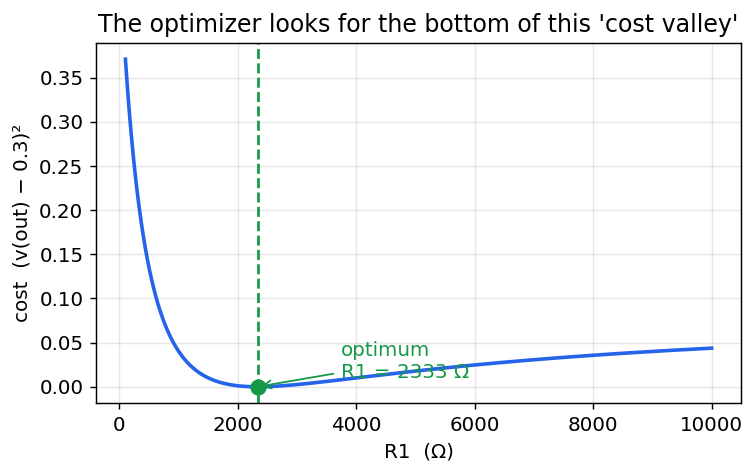
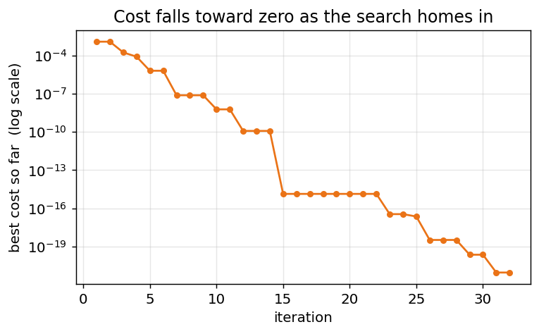
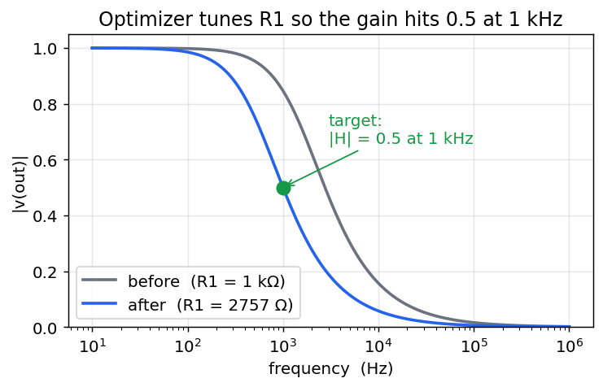
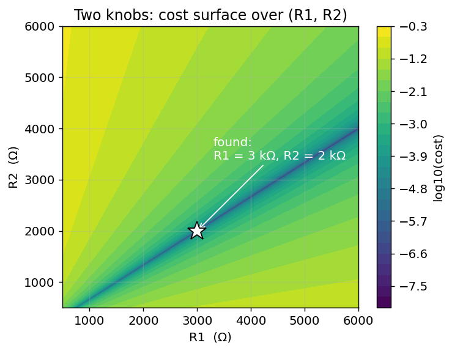
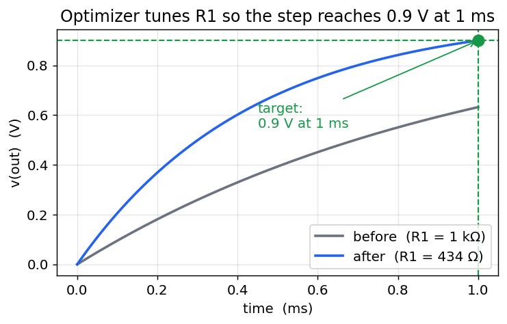

# The ngspice `optimize` command — a friendly user manual

*A built-in parameter optimizer for ngspice (Enhancement-130).*

This guide explains how to use the `optimize` command from scratch. You do **not**
need any background in optimization or numerical methods — if you can write a small
SPICE netlist and run it, you can use the optimizer. We build up from the simplest
possible circuit and end with a few genuinely useful design tasks, with pictures at
every step.

---

## 1. What problem does it solve?

When you design a circuit you usually know **what you want the circuit to do** — a
gain of exactly 0.5, a filter that rolls off at 1 kHz, an output that reaches 0.9 V
after 1 ms — but you **don't know the exact component values** that achieve it. The
normal way to find them is trial and error: change a resistor, run the simulation,
look at the result, change it again, and repeat until it's close enough.

The `optimize` command does that loop for you, automatically and quickly. You tell it:

- **which knobs to turn** (which component values it may change, and their allowed range),
- **what to run** (a normal ngspice analysis: `op`, `ac …`, `tran …`),
- **what "good" means** (a small mathematical expression that is *zero* when the
  circuit does exactly what you want),

and it turns the knobs for you until the circuit is as close to your goal as possible.

### The mental picture

Think of the thing you are trying to make small — how far the circuit is from your
goal — as the **height of a landscape**. Turning a knob moves you east–west; the
"badness" of the result is how high up you are. Your goal sits at the very bottom of a
valley. The optimizer is like a hiker who can't see the whole map but can feel which
way is downhill, and keeps stepping down until they reach the bottom.

Here is that landscape for our very first example (turning one resistor `R1`, trying to
make the output 0.3 V). The optimizer's job is simply to find the bottom of this valley:



The number plotted vertically is called the **cost** (or *objective*): it is `0` when
the circuit is perfect and grows as the circuit gets worse. **You** define the cost; the
optimizer only ever tries to make it small.

---

## 2. The command at a glance

You run `optimize` inside a `.control … .endc` block, after your circuit is loaded:

```
optimize -param <name> <init> <lo> <hi>   [-param ...]
         -analysis <command ...>
         -minimize <expression ...>
         [-maxiter <N>] [-tol <T>] [-verbose]
```

| Part | Meaning |
|---|---|
| `-param name init lo hi` | A knob to turn. `name` is a device (like `R1`, `C1`) or a device parameter. `init` is where to start, `lo`/`hi` are the smallest/largest values allowed. Repeat `-param` for each knob (up to 16). |
| `-analysis <cmd>` | The simulation to run every time it turns the knobs — an ordinary ngspice command such as `op`, `ac dec 20 1 1meg`, or `tran 1u 1m`. |
| `-minimize <expr>` | The cost. Any ngspice expression over the results that should be **zero when the circuit is perfect**. A very common shape is `(something - target)^2`. |
| `-maxiter N` | (optional) stop after at most `N` steps. Default `100`. |
| `-tol T` | (optional) stop when the cost stops improving by more than `T`. Default `1e-6`. |
| `-verbose` | (optional) print the cost after every step so you can watch it fall. |

A couple of friendly details so you don't trip up:

- `-analysis` and `-minimize` gobble up **all** the words after them until the next
  `-word` flag, so you can write `-analysis ac dec 20 1 1meg` or
  `-minimize (v(out)-0.3)^2` **without quotes**.
- A negative lower bound like `-5` is understood as a number, not a flag (flags start
  with `-` followed by a *letter*).
- The hundreds of little simulations the optimizer runs are **silent** by default, so
  your screen isn't flooded. Add `-verbose` if you want to watch progress.

---

## 3. Example 1 — the simplest possible case (one knob)

A **voltage divider**: a 1 V source drives two resistors in series, and we measure the
voltage at their midpoint, `out`. Basic circuit theory says
`v(out) = R2 / (R1 + R2)`. With `R2 = 1 kΩ`, if we want `v(out) = 0.3 V`, the exact
answer is `R1 = 2333.3 Ω`. Let's pretend we don't know that and let the optimizer find
it.

```spice
Voltage divider: tune R1 so v(out) = 0.3 V
V1 in  0   dc 1
R1 in  out 1k
R2 out 0   1k

.control
optimize -param R1 1k 100 10k -analysis op -minimize (v(out)-0.3)^2
print v(out)
.endc
.end
```

Reading the `optimize` line in plain English: *"turn `R1` (start at 1 kΩ, keep it
between 100 Ω and 10 kΩ); each time, run an operating-point (`op`) analysis; and try to
make `(v(out) − 0.3)²` as small as possible."* That expression is zero exactly when
`v(out)` equals `0.3`, which is what we want.

Running it prints:

```
optimize: 1 parameter, analysis 'op', minimizing '(v(out)-0.3)^2'
optimize: converged, objective = 8.99997e-22 after 67 evaluations
    r1 = 2333.33
v(out) = 3.000000e-01
```

The optimizer found `R1 = 2333.33 Ω` — the exact textbook answer — and left the circuit
sitting at that value, so `v(out)` is now `0.3 V`. The `objective = 9e-22` is
essentially zero (the cost at the bottom of the valley).

### Watching it work

Add `-verbose` and the optimizer prints the best cost after each step. Plotting those
numbers shows the search closing in on the answer — the cost plunges toward zero:



That is the whole idea in one picture: start somewhere, keep stepping downhill, stop
when you can't do better.

---

## 4. Example 2 — designing a filter's gain (AC analysis)

Now something a circuit designer actually does. An **RC low-pass filter**: a resistor
`R1` into a capacitor `C1`. Its gain falls with frequency. Suppose we want the gain to
be **exactly 0.5 at 1 kHz**, and we're allowed to choose `R1` (with `C1 = 100 nF`
fixed).

We run an AC analysis at just the one frequency of interest (1 kHz) and ask that the
**magnitude** of the output there be 0.5:

```spice
RC low-pass: tune R1 so |gain| = 0.5 at 1 kHz
V1 in  0   ac 1
R1 in  out 1k
C1 out 0   100n

.control
optimize -param R1 1k 100 100k -analysis ac lin 1 1k 1k -minimize (mag(v(out))-0.5)^2
.endc
.end
```

`ac lin 1 1k 1k` runs the AC analysis at a single point, 1 kHz. `mag(v(out))` is the
gain magnitude there, and we drive `(mag(v(out)) − 0.5)²` to zero. The optimizer finds
`R1 = 2756.6 Ω` (which is the exact value where `1/√(1+(2πfRC)²) = 0.5`).

Here is the filter's response **before** (the starting `R1 = 1 kΩ`) and **after** the
optimizer tuned it — the curve slides over until it passes exactly through the target
point:



The optimizer only ever looked at the single point at 1 kHz, but because it moved `R1`
the whole curve shifted with it, landing the 1 kHz gain right on 0.5.

---

## 5. Example 3 — two knobs at once

Real designs have several free values. The optimizer handles many parameters together —
just add more `-param` flags. Here we tune **both** resistors of a divider so that two
things are true at once:

- the output is `0.4 V`, **and**
- the total resistance is `5 kΩ` (so the current drawn from the 1 V source is `0.2 mA`).

There is exactly one solution: `R1 = 3 kΩ`, `R2 = 2 kΩ`. We combine the two goals by
**adding their costs** — the total is zero only when *both* are satisfied:

```spice
Two-parameter divider design
V1 in  0   dc 1
R1 in  out 1k
R2 out 0   1k

.control
optimize -param R1 1k 100 10k -param R2 1k 100 10k
+        -analysis op
+        -minimize (v(out)-0.4)^2 + (abs(i(v1))-0.2m)^2
+        -maxiter 400 -tol 1e-15
print v(out) i(v1)
.endc
.end
```

(Note the `+` at the start of the continuation lines — that is ngspice's normal way of
splitting one long line.) The optimizer reports:

```
optimize: converged, objective = 4e-26 after 192 evaluations
    r1 = 3000
    r2 = 2000
v(out) = 4.000000e-01
i(v1) = -2.00000e-04
```

Exactly `R1 = 3 kΩ`, `R2 = 2 kΩ`. Now the cost is a **surface** over two knobs instead
of a valley over one. The bright colors are high cost, the dark diagonal streak is the
"trench" of good solutions, and the star marks the single point where both goals are met
and that the optimizer walked to:



This is why the optimizer is worth having: even with two coupled requirements pulling in
different directions, it finds the one combination that satisfies both, from a plain
starting guess of 1 kΩ / 1 kΩ.

---

## 6. Example 4 — a time-domain goal (transient analysis)

Goals don't have to be about voltages or gains — they can be about **timing**. Take an
RC circuit charging from a 1 V step. We want the output to reach **0.9 V exactly 1 ms**
after the step, by choosing `R1` (with `C1 = 1 µF`).

We run a transient out to 1 ms and ask that the output *at the end of the run* be 0.9 V:

```spice
RC step: tune R1 so v(out) = 0.9 V at t = 1 ms
V1 in  0   dc 1
R1 in  out 1k
C1 out 0   1u ic=0

.control
optimize -param R1 100 50 5k -analysis tran 2u 1m uic -minimize (v(out)-0.9)^2
.endc
.end
```

Because `tran 2u 1m` stops at 1 ms, the *last* value of `v(out)` is the voltage at 1 ms,
and that is what the cost compares to 0.9. The optimizer finds `R1 = 434.3 Ω` (the exact
value where `1 − e^(−1ms/RC) = 0.9`). The step response before and after:



The slow starting curve (1 kΩ) only reaches ~0.63 V by 1 ms; after tuning, the faster
curve passes right through the target dot at 0.9 V / 1 ms.

---

## 7. Writing a good cost expression

The cost is the only tricky part, and the recipe is simple: **make it zero when the
circuit is perfect, and positive otherwise.** Some patterns:

| Goal | `-minimize` expression |
|---|---|
| make `X` equal a target `t` | `(X - t)^2` |
| make `X` *as large as possible* | `-X`  (minimizing `−X` maximizes `X`) |
| make `X` *as small as possible* | `X`  (or `X^2` if `X` can be negative) |
| satisfy two goals at once | add them: `(X-t1)^2 + (Y-t2)^2` |
| weight one goal more | scale it: `(X-t1)^2 + 100*(Y-t2)^2` |

`X` and `Y` are any ngspice expressions over the results — node voltages `v(out)`,
branch currents `i(v1)`, magnitudes `mag(v(out))`, decibels `db(v(out))`, and so on.
If the expression produces a whole waveform (as in a transient), the optimizer uses its
**last value** — the value at the end of the run.

---

## 8. Tips and common pitfalls

- **Give sensible bounds.** `lo` and `hi` define the search box; pick a range you know
  contains a good answer. The starting value `init` should be inside it.
- **Different scales are fine.** You can optimize a kilohm resistor and a nanofarad
  capacitor together — the optimizer works in a normalized 0-to-1 version of each
  range internally, so no parameter dominates just because its numbers are bigger.
- **Fast analyses optimize fastest.** The optimizer runs your `-analysis` dozens to a
  few hundred times, so a heavy transient makes the whole thing slow. Use the lightest
  analysis that captures your goal (an `op` or a one-point `ac` if you can).
- **Local minima.** Like a hiker in fog, the search can settle into a nearby dip that
  isn't the deepest valley. If the result looks wrong, try a different starting value
  or tighter bounds.
- **It's silent on purpose.** No per-iteration output means the optimization succeeded
  quietly; add `-verbose` to see the cost each step.
- **The circuit is left at the optimum.** After `optimize` returns, the winning values
  are already applied, so `print`, `plot`, `wrdata`, etc. all see the optimized circuit.

---

## 9. How it works, briefly

Under the hood, `optimize` uses the **Nelder–Mead downhill-simplex** method — a classic
derivative-free optimizer. For `N` knobs it keeps `N+1` trial points (a "simplex"), and
each step reflects the worst point through the others, expanding when that helps and
contracting when it doesn't, so the shape tumbles and shrinks downhill until it settles
on the minimum. It needs no derivatives — only the ability to run the circuit and read a
number — which is exactly what a SPICE simulation gives it.

For every trial it applies the candidate values with `alter`, runs your analysis, and
evaluates your cost expression. It searches in a normalized `[0, 1]` version of each
parameter's range so that very different component scales are treated evenly.

The implementation lives in `ngspice-46/src/frontend/com_optimize.c`; the design notes
are in [Enhancement-130](../../../enhancements_doc/Enhancement-130.md), and a runnable
example set is under [`examples/optimize_examples/`](../../../examples/optimize_examples/).
