# The ngspice RF / periodic steady-state suite

This document is a guided tour of the **RF analysis suite** that these enhancements
added to ngspice: periodic steady state, harmonic balance, periodic AC / noise /
transfer / S-parameters, two-tone (quasi-periodic) analyses, oscillator phase noise,
and envelope following. It is written so that a reader with **no prior RF-simulation
background** can follow along: every analysis comes with a plain-language explanation,
a circuit schematic, a complete runnable netlist, the exact command, a plot of the
real ngspice result, and a discussion of *why the result is physically correct*.

Every example is a real circuit you can paste into a file and run. Half of them use
ngspice's **built-in** devices (resistors, capacitors, diodes, behavioral sources);
the other half use **OSDI** devices — compact models written in Verilog-A and compiled
to a `.osdi` library by `openvaf-r` — so you can see that the RF analyses treat both
identically. The schematics were drawn with [schemdraw](https://schemdraw.readthedocs.io);
the result plots were generated from real runs of the committed ngspice by
[`make_rf_figs.py`](make_rf_figs.py), and the schematics by
[`make_rf_schematics.py`](make_rf_schematics.py).

> **How the enhancement links work.** Each analysis links to the enhancement
> write-up(s) that implemented it — for example [Enhancement-117](../../../enhancements_doc/Enhancement-117.md).
> The [gap analysis](ngspice_gaps.md) has the bird's-eye view of the whole suite.

---

## Part 0 — What problem is the RF suite solving?

If you have used SPICE at all, you know its three classic analyses:

| Analysis | Question it answers | ngspice card |
|---|---|---|
| **Operating point** | Where does the circuit sit at rest (all DC)? | `.op` |
| **AC** | If I wiggle the input by a *tiny* sine, how does the circuit respond vs. frequency? | `.ac` |
| **Transient** | What does every voltage do over time, step by step? | `.tran` |

These are enough for audio, power, and digital work. They start to hurt for **radio-frequency (RF)** circuits — mixers, amplifiers, oscillators, filters at MHz–GHz — for two reasons:

1. **RF circuits are driven hard and periodically.** A mixer is *pumped* by a large "local oscillator" tone. The circuit's response is not a tiny wiggle around a DC point (so `.ac` does not apply), but a tiny wiggle around a **large, repeating waveform**. You need the *periodic* operating state first, then the small-signal behaviour around it.

2. **You care about the frequency domain, cheaply.** A `.tran` of an oscillator settling over 10 000 cycles, or of a mixer converting a weak signal, is enormously expensive and then needs an FFT with careful windowing. RF analyses compute the **steady, repeating** answer *directly* — often in the frequency domain — with no long time-marching.

The RF suite adds exactly these tools. Two ideas recur throughout, so let's name them now in plain language:

- **Harmonics.** Push a pure sine at frequency `f` through anything nonlinear (a diode, a transistor) and the output contains not just `f` but also `2f`, `3f`, … — *harmonics*. A "periodic steady state" is fully described by the amplitudes and phases of `f` and its harmonics.

- **Mixing / conversion.** Put *two* tones into a nonlinearity and you get sums and differences: `f1 ± f2`, `2f1 − f2`, … A mixer uses this on purpose (radio → audio); an amplifier suffers it as distortion. Small signals injected near a big "pump" tone get **converted** to new frequencies (sidebands). The periodic small-signal analyses (`.pac`, `.pnoise`, `.pxf`) are all about this conversion.

The rest of the document walks the suite roughly in order of difficulty. Here is the map:

| Analysis | Command | What it computes | Enhancements |
|---|---|---|---|
| S-parameters | `.sp` | how an N-port reflects/transmits vs. frequency | [63](../../../enhancements_doc/Enhancement-63.md), [64](../../../enhancements_doc/Enhancement-64.md)/[72](../../../enhancements_doc/Enhancement-72.md) |
| Periodic steady state | `.pss` | the repeating large-signal waveform | [117](../../../enhancements_doc/Enhancement-117.md), [118](../../../enhancements_doc/Enhancement-118.md) |
| Harmonic balance | `hb` | the same, solved in the frequency domain | [134](../../../enhancements_doc/Enhancement-134.md), [135](../../../enhancements_doc/Enhancement-135.md) |
| Periodic AC | `.pac` | small-signal gain/conversion around a pumped state | [119](../../../enhancements_doc/Enhancement-119.md)–[123](../../../enhancements_doc/Enhancement-123.md) |
| Periodic noise | `.pnoise` | noise of a pumped circuit (incl. cyclostationary) | [124](../../../enhancements_doc/Enhancement-124.md), [126](../../../enhancements_doc/Enhancement-126.md) |
| Periodic transfer fn | `.pxf` | input→output transfer through the pumped state | [125](../../../enhancements_doc/Enhancement-125.md) |
| Periodic S-parameters | `.psp` | S-parameters of a pumped (time-varying) network | [132](../../../enhancements_doc/Enhancement-132.md) |
| Two-tone steady state | `qpss` | intermodulation from two independent tones | [133](../../../enhancements_doc/Enhancement-133.md), [136](../../../enhancements_doc/Enhancement-136.md) |
| Two-tone small-signal | `qpac`/`qpnoise`/`qpxf` | the `.pac`/`.pnoise`/`.pxf` trio, two-tone | [137](../../../enhancements_doc/Enhancement-137.md)–[142](../../../enhancements_doc/Enhancement-142.md) |
| Oscillator phase noise | `hbosc` + `phasenoise` | an oscillator's frequency and its noise skirt | [140](../../../enhancements_doc/Enhancement-140.md) |
| Envelope following | `envelope` | the slow envelope of a fast carrier | [154](../../../enhancements_doc/Enhancement-154.md) |

A note on **OSDI devices**: several examples load a small Verilog-A model library,
`rf_blocks.osdi`, that defines a resistor `ores`, a capacitor `ocap`, and a diode
`odio`. You compile it once from `rf_blocks.va` with `openvaf-r rf_blocks.va` and load
it in a deck with `pre_osdi rf_blocks.osdi`. Instances use an `N`-prefixed name and a
`.model` card, e.g. `N1 in out mm` + `.model mm ores r=100`.

---

## Part 1 — S-parameters (`.sp`)

**The idea.** At high frequency we stop talking about "voltage in, voltage out" and
start talking about **waves**. A signal travelling down a 50-Ω cable that hits your
circuit is partly **reflected** and partly **transmitted**. S-parameters are just the
bookkeeping for those waves: `S11` is "how much bounces back off port 1" (reflection),
`S21` is "how much gets through to port 2" (transmission/gain). They are complex
numbers versus frequency, and they are *the* language of RF design. `.sp` was added in
[Enhancement-63](../../../enhancements_doc/Enhancement-63.md); import/export of the
standard **Touchstone** file format in [E-64](../../../enhancements_doc/Enhancement-64.md)/[E-72](../../../enhancements_doc/Enhancement-72.md).

**The circuit.** The simplest instructive example is an **RC low-pass filter** sitting
between a 50-Ω source and a 50-Ω load:

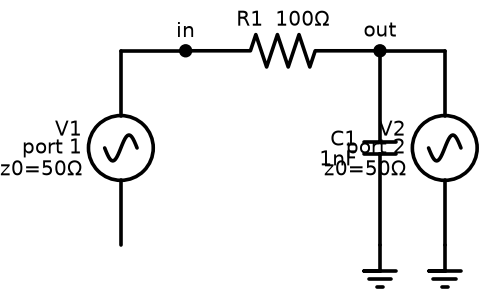

**Built-in netlist.** Ports are declared by adding `portnum` and `z0` (reference
impedance) to voltage sources:

```
* S-parameters of an RC low-pass filter (built-in R, C)
R1 in out 100
C1 out 0 1n
V1 in 0 DC 0 AC 1 portnum 1 z0 50
V2 out 0 DC 0 AC 1 portnum 2 z0 50
.sp dec 30 100k 1g
.control
run
plot vdb(S_2_1)     $ |S21| in dB versus frequency
.endc
.end
```

`.sp dec 30 100k 1g` sweeps 30 points per decade from 100 kHz to 1 GHz.

**OSDI netlist (same circuit, Verilog-A devices).** Replace the built-in `R1`/`C1`
with OSDI `ores`/`ocap` instances — nothing else changes:

```
* S-parameters of an RC low-pass filter (OSDI Verilog-A R, C)
.control
pre_osdi rf_blocks.osdi
.endc
N1 in out mm
.model mm ores r=100
N2 out 0 mmc
.model mmc ocap cap=1n
V1 in 0 DC 0 AC 1 portnum 1 z0 50
V2 out 0 DC 0 AC 1 portnum 2 z0 50
.sp dec 30 100k 1g
.control
run
plot vdb(S_2_1)
.endc
.end
```

**The result.**

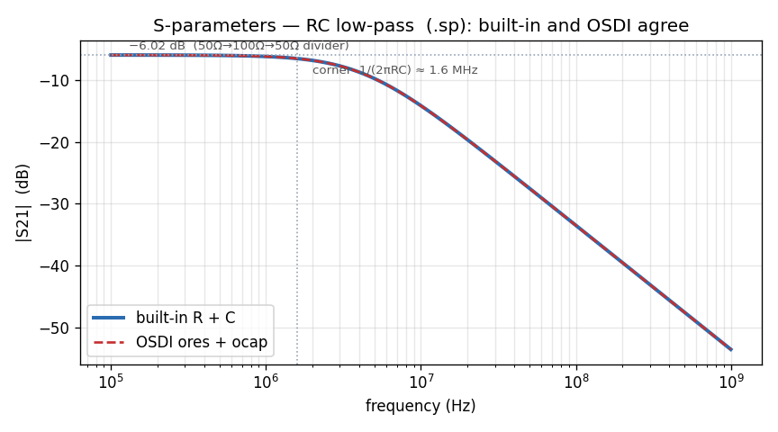

**Why it is physically correct.** Two features pin it down exactly:

- **Low-frequency floor of −6.02 dB.** At low frequency the capacitor is an open
  circuit, so the network is just the 100-Ω series resistor between a 50-Ω source and a
  50-Ω load. For a series resistor `R` between equal ports `Z0`, transmission is
  `S21 = 2·Z0 / (2·Z0 + R) = 100/200 = 0.5`, and `20·log10(0.5) = −6.02 dB`. The
  simulated curve sits exactly there.
- **Roll-off above the corner.** The capacitor shorts the output at high frequency; the
  response falls at 20 dB/decade past the corner `1/(2πRC) = 1/(2π·100·1nF) ≈ 1.6 MHz`.

The built-in and OSDI curves lie **on top of each other** — the S-parameter engine reads
the device conductance/susceptance the same way whether the device is compiled C or a
Verilog-A model.

---

## Part 2 — Periodic steady state: `.pss` and `hb`

Now we leave linear filters behind. An RF circuit driven by a large tone settles into a
**periodic steady state (PSS)**: after transients die out, every node repeats exactly
every period `T = 1/f`. There are two ways to find it, and ngspice has both.

### 2a. Shooting PSS (`.pss`)

`.pss` ([Enhancement-117](../../../enhancements_doc/Enhancement-117.md),
[-118](../../../enhancements_doc/Enhancement-118.md)) uses a **shooting method**: it
guesses the state at `t=0`, integrates one period, and adjusts the guess until the end
state matches the start — i.e. until the waveform truly repeats. It is a brute-force
method: reliable and accurate on linear-to-moderately-nonlinear circuits, and the
foundation the periodic small-signal analyses (`.pac`, `.pnoise`, `.pxf`, `.psp`) are
built on.

```
* Periodic steady state of a driven RC (built-in)
V1 a 0 SIN(0 1 1meg)
R1 a b 1k
C1 b 0 1n
* .pss Fguess StabTime OscNode Points Harmonics SC_iter Steady_coeff
.pss 1meg 1u b 512 8 40 5u
.control
run
.endc
.end
```

The arguments read: guess the period from `1meg` (1 MHz), let transients settle for
`1u` (1 µs), watch node `b`, sample the period at `512` points, keep `8` harmonics, allow
`40` shooting iterations, with a steadiness tolerance coefficient `5u`. For this linear
RC the periodic steady state is simply the 1 MHz sinusoid — which is the point of using
it here as a gentle first run. Its real value shows up in the small-signal analyses below.

### 2b. Harmonic balance (`hb`)

`hb` ([Enhancement-134](../../../enhancements_doc/Enhancement-134.md),
[-135](../../../enhancements_doc/Enhancement-135.md)) finds the *same* periodic steady
state but works **directly in the frequency domain**: it represents each node as a sum
of a DC term plus `K` harmonics, and solves for all their amplitudes/phases at once with
a Newton iteration. It is robust on strongly nonlinear circuits (it has automatic
source-stepping continuation), which makes it the right tool for the harmonic-generation
demo the shooting method finds hard.

**Built-in — a cubic nonlinearity.** A behavioral current source `I = 0.5m·V³` is a
clean, textbook nonlinearity:

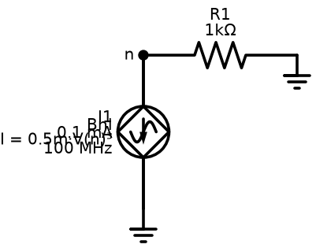

```
* Harmonic balance of a cubic nonlinearity (built-in)
I1 0 n SIN(0 0.1m 100meg)
R1 n 0 1k
Bnl n 0 I = 0.5e-3*V(n)*V(n)*V(n)
.options numdgt=8
.control
hb 100meg 6      $ fundamental 100 MHz, keep 6 harmonics
.endc
.end
```

**OSDI — a Verilog-A diode.** Same command, a compiled compact model as the nonlinearity:

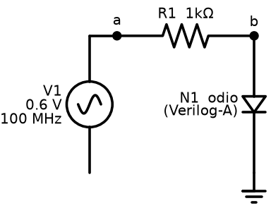

```
* Harmonic balance of an OSDI diode
.control
pre_osdi rf_blocks.osdi
.endc
V1 a 0 SIN(0 0.6 100meg)
R1 a b 1k
N1 b 0 dd
.model dd odio is_=1e-14
.control
pre_osdi rf_blocks.osdi
hb 100meg 6
.endc
.end
```

**The result.**

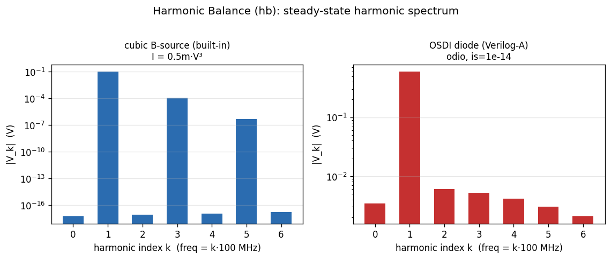

**Why it is physically correct.** The two nonlinearities have different *symmetry*, and
the spectra show it:

- The **cubic** `V³` is an *odd* function. Feeding it a sine produces only **odd**
  harmonics (fundamental, 3rd, 5th, …): `sin³ = ¾·sin − ¼·sin(3·)`. The even harmonics
  sit at the numerical floor — exactly what an odd nonlinearity must do.
- The **diode** `exp(V/VT)` has no symmetry, so it generates a **full** harmonic series
  (2nd, 3rd, 4th … all present), plus a DC shift (rectification). This is why diodes make
  good mixers and detectors and cubic distortion does not.

Harmonic balance recovers both spectra from a single frequency-domain solve, with no
time-stepping or FFT.

---

## Part 3 — Periodic AC: conversion gain (`.pac`)

**The idea.** Once you have a periodic operating state (from PSS), you can ask the
`.ac`-style question *around it*: inject a **small** signal at some frequency `f_in` and
see how it comes out — not only at `f_in`, but at every **sideband** `f_in + k·f0`,
because the pumped, time-varying circuit **mixes** the small signal up and down. That is
exactly how a mixer's *conversion gain* is defined. `.pac` was built across
[Enhancements 119–123](../../../enhancements_doc/Enhancement-123.md): retain the PSS
operating point, extract the periodic Jacobian's harmonics, assemble the
`(2M+1)N` **harmonic conversion matrix**, and solve it at each input frequency.

**A correctness anchor everyone can check.** For a *linear* circuit there is no mixing:
the conversion matrix is block-diagonal, and the sideband-0 response is just the ordinary
AC response. So `.pac` on our RC low-pass must reproduce the textbook driving-point
impedance `|Z(f)| = 1 / |1/R + jωC|`. That is a strong, exact test that the whole
PSS → conversion-matrix machinery is right.


```
* Periodic AC of a driven RC low-pass
V1 a 0 SIN(0 1 1meg)
R1 a b 1k
C1 b 0 1n
* .pac <pss params>  <dec|oct|lin> Npts Fstart Fstop  [sideband]
.pac 1meg 1u b 512 8 40 5u dec 15 10k 10meg
.control
run
plot mag(b)
.endc
.end
```

**The result** — the `.pac` sideband-0 points fall exactly on the analytic RC impedance:

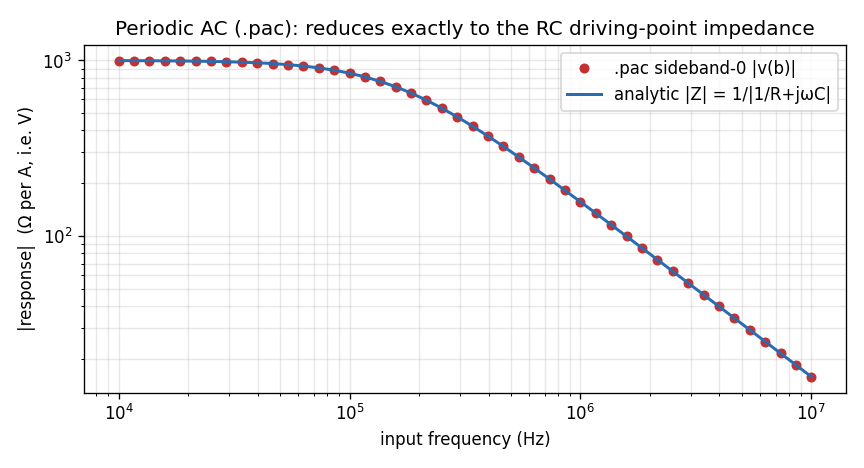

**Why it is physically correct.** The curve is flat at `R = 1 kΩ` below the corner (the
capacitor is open, so the node sees the full resistor) and rolls off at 20 dB/decade
above `1/(2πRC) ≈ 159 kHz` (the capacitor shorts the node). The simulated `.pac` markers
land on the analytic `|Z|` to plotting precision — the periodic small-signal solve reduces
*exactly* to `.ac` when there is nothing to mix, which is precisely the guarantee you want
before trusting it on a real mixer, where the conversion sidebands are nonzero and carry
the interesting conversion-gain and image-rejection information.

---

## Part 4 — Periodic noise (`.pnoise`)

**The idea.** Noise in a **pumped** circuit is subtler than ordinary `.noise`. A device's
noise (thermal, shot, flicker) is itself modulated by the large periodic signal swinging
its bias, and noise from every sideband **folds** down onto your output band. `.pnoise`
([Enhancement-124](../../../enhancements_doc/Enhancement-124.md)) folds each device's
noise through the *adjoint* of the same conversion matrix; the **cyclostationary** mode
([E-126](../../../enhancements_doc/Enhancement-126.md), keyword `cyclo`) additionally
tracks how the noise power breathes over the period.

Again a linear circuit gives an exact anchor: with no mixing, `.pnoise` must reduce to
ordinary `.noise`. For our RC, only the resistor's thermal noise contributes, shaped by
the low-pass — the classic result for the output-noise **power spectral density**
`S_v(f) = 4kTR / (1 + (2πfRC)²)` (in V²/Hz).

```
* Periodic noise of a driven RC low-pass
V1 a 0 DC 0 AC 1 SIN(0 1 1meg)
R1 a b 1k
C1 b 0 1n
* .pnoise <pss params> OutNode InSrc <dec|oct|lin> Npts Fstart Fstop [cyclo]
.pnoise 1meg 1u b 512 8 40 5u b v1 dec 15 10k 10meg
.control
run
plot onoise_spectrum
.endc
.end
```

**The result** — the `.pnoise` output-noise PSD matches `4kTR/(1+(ωRC)²)`:

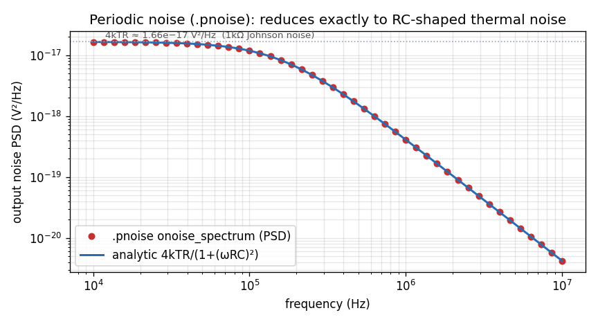

**Why it is physically correct.** At low frequency the PSD is flat at
`4kTR = 4·1.38e−23·300·1000 ≈ 1.66e−17 V²/Hz` — the Johnson–Nyquist thermal noise of a
1-kΩ resistor (equivalently `√(4kTR) ≈ 4.1 nV/√Hz` as a density). Above the RC corner it
rolls off with the same low-pass shape that filters the signal (the capacitor shorts
high-frequency noise to ground just as it shorts the signal).
The `.pnoise` markers sit on the analytic curve, confirming that the noise-folding machinery
reduces to textbook thermal noise in the no-mixing limit — the prerequisite for trusting it
on a real mixer, where it computes the noise figure that a plain `.noise` cannot see.

---

## Part 5 — Periodic transfer function (`.pxf`) and S-parameters (`.psp`)

These two complete the periodic small-signal set and share the same conversion-matrix
engine, so we present them compactly.

**`.pxf`** ([Enhancement-125](../../../enhancements_doc/Enhancement-125.md)) is the
*adjoint* of `.pac`: instead of "one input → all outputs", it computes "all inputs → one
output" — the transfer function from every sideband to a chosen node. By reciprocity its
sideband-0 result is bit-identical to the `.pac` response, which is exactly how it is
validated.

```
* Periodic transfer function to node b
V1 a 0 SIN(0 1 1meg)
R1 a b 1k
C1 b 0 1n
.pxf 1meg 1u b 512 8 40 5u b dec 15 10k 10meg 0
.control
run
plot mag(xf)
.endc
.end
```

**`.psp`** ([Enhancement-132](../../../enhancements_doc/Enhancement-132.md)) computes
**periodic small-signal S-parameters**: S-parameters of a circuit that is being pumped, so
that they can differ from sideband to sideband (a time-varying network). For a
time-*invariant* network they reduce exactly to ordinary `.sp`, the check used here on a
resistive 2-port:

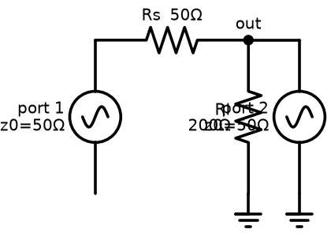

```
* Periodic S-parameters of a resistive 2-port (reduces to .sp)
V1 in 0 DC 0 AC 1 portnum 1 z0 50
V2 out 0 DC 0 AC 1 portnum 2 z0 50
Rs in out 50
Rl out 0 200
Vpss pssref 0 SIN(0 0.01 100meg)
Rpss pssref 0 1k
.psp 100meg 1u pssref 256 4 20 5u lin 1 100meg 100meg
.control
run
print s_1_1 s_2_1 s_1_2 s_2_2
.endc
.end
```

For this resistive divider the sideband-0 S-parameters equal the analytic values of the
50-Ω/200-Ω network to ~10⁻¹⁶, and the conversion sidebands are zero (a linear network
does not mix) — the signature that the machinery is correct.

---

## Part 6 — Two tones at once: quasi-periodic steady state (`qpss`)

**The idea.** Real RF systems handle **two** signals whose frequencies are not simple
multiples of each other — a wanted signal and an interferer, or two carriers in a power
amplifier. Their mixing products live on a **2-D grid** `k1·f1 + k2·f2`. The nastiest are
the **third-order intermodulation (IM3)** products `2f1 − f2` and `2f2 − f1`, because they
land *right next to* the wanted tones and cannot be filtered out. `qpss`
([Enhancement-133](../../../enhancements_doc/Enhancement-133.md),
[-136](../../../enhancements_doc/Enhancement-136.md)) computes this two-tone spectrum
directly. The small-signal `qpac`/`qpnoise`/`qpxf`
([E-137](../../../enhancements_doc/Enhancement-137.md)–[142](../../../enhancements_doc/Enhancement-142.md))
mirror the single-tone trio around this two-tone state.

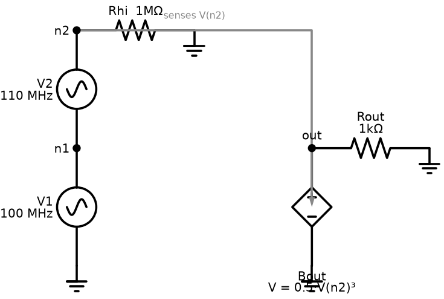

```
* Two-tone QPSS through a cubic nonlinearity
V1 n1 0 SIN(0 0.1 100meg)
V2 n2 n1 SIN(0 0.1 110meg)
Rhi n2 0 1meg
Bout out 0 V = 0.5*V(n2)*V(n2)*V(n2)
Rout out 0 1k
.control
qpss v(out) 100meg 110meg 4 3     $ tones 100 & 110 MHz, up to order 4, 3 harmonics
.endc
.end
```

**The result** — the two big tones at 100 and 110 MHz, flanked by the IM3 products at
90 and 120 MHz:

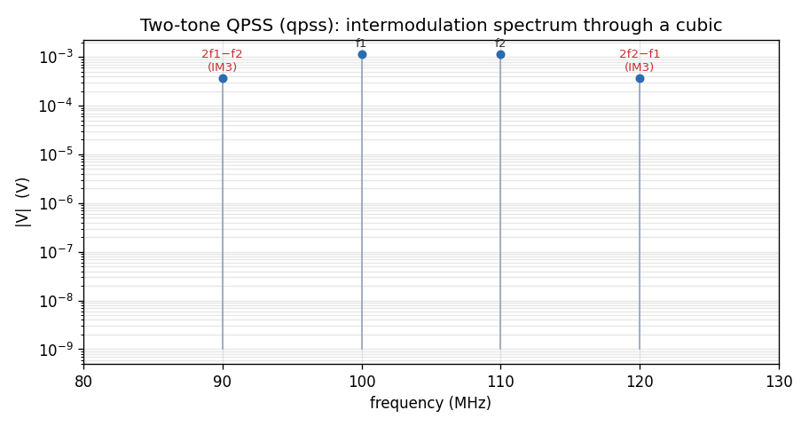

**Why it is physically correct.** A cubic `V³` acting on `cos(ω1t) + cos(ω2t)` produces,
among its terms, `2ω1 − ω2` and `2ω2 − ω1` — the IM3 products — at 90 MHz and 120 MHz,
symmetric about the two tones. Their amplitude grows as the **cube** of the drive (the
famous 3-dB-per-dB, "3:1 slope" that defines a circuit's third-order intercept point,
IP3). `qpss` places them at exactly the right frequencies with the right relative size,
which is why it is the workhorse for linearity/IP3 characterisation.

---

## Part 7 — Oscillators: `hbosc` + `phasenoise`

**The idea.** An oscillator has **no input tone** — it generates its own. Simulating it is
special: you must solve for the unknown **oscillation frequency** at the same time as the
waveform. `hbosc` ([Enhancement-140](../../../enhancements_doc/Enhancement-140.md)) does
this with an *autonomous* harmonic balance (a bordered Newton that treats `ω0` as an extra
unknown). Once the limit cycle is known, `phasenoise` computes the **phase-noise
spectrum** `L(Δf)` — how much the oscillator's phase jitters, the single most important
spec of any RF oscillator or clock.

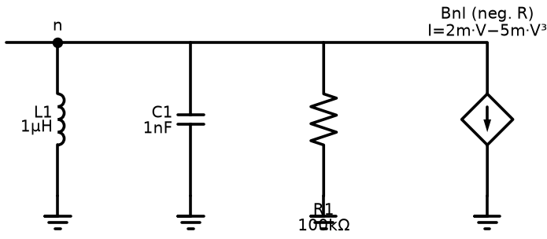

```
* LC oscillator: tank + cubic negative resistance
L1 n 0 1u
C1 n 0 1n
Bnl 0 n I = 2m*V(n) - 5m*V(n)*V(n)*V(n)   $ negative resistance sustains oscillation
R1 n 0 100k
.ic V(n)=0.1
.control
hbosc n 5 5.0329meg 60u     $ find the limit cycle: node n, 5 harmonics, ~5.03 MHz guess
phasenoise 1k 10meg 5       $ phase noise from 1 kHz to 10 MHz offset
.endc
.end
```

**The result** — the phase-noise skirt:

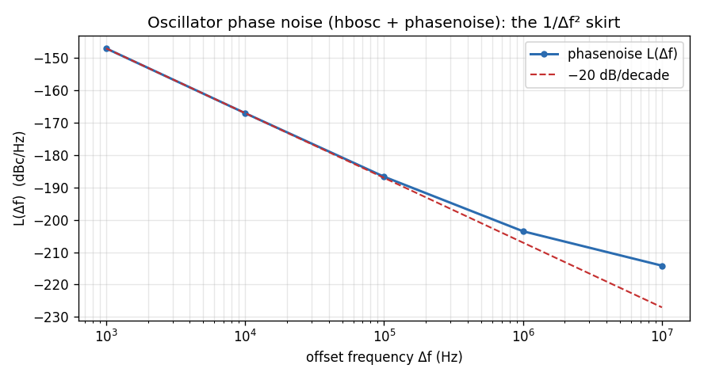

**Why it is physically correct.** The tank resonates at `f0 = 1/(2π√(LC)) = 1/(2π√(1µH·1nF))
≈ 5.03 MHz`, and `hbosc` converges to exactly that frequency and the amplitude set by the
cubic's negative resistance balancing the tank loss. The phase-noise curve falls at
**−20 dB/decade** close to the carrier: thermal noise perturbs the oscillator's phase, and
because nothing restores absolute phase (the oscillator is free-running), that phase noise
integrates into a `1/Δf²` power law — the universal near-carrier signature of an LC
oscillator. Far from the carrier it flattens toward the noise floor. Both regions appear
in the plot.

---

## Part 8 — Envelope following (`envelope`)

**The idea.** Sometimes a fast carrier has a **slowly varying envelope** — a resonator
ringing up over thousands of cycles, a PLL settling, a modulated power amplifier. A plain
`.tran` must grind through every fast cycle. Envelope following
([Enhancement-154](../../../enhancements_doc/Enhancement-154.md)) samples the state once
per carrier period and integrates the *slow* drift of those samples, jumping many periods
at a time — with an **implicit** step so it stays stable even on high-Q resonators (where
the naive explicit jump blows up).

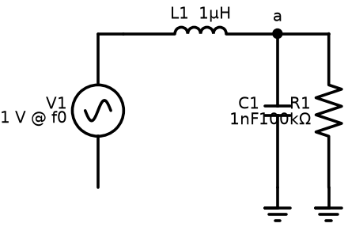

```
* Envelope following: high-Q RLC tank rung up by an on-resonance carrier
v1 s 0 sin(0 1 5.032921e6)
l1 s a 1u
c1 a 0 1n
r1 a 0 100k
.control
envelope a 5.032921e6 596u
plot a_amp        $ the amplitude envelope versus (slow) time
.endc
.end
```

**The result** — 26 envelope samples reproduce a 3000-cycle ring-up:

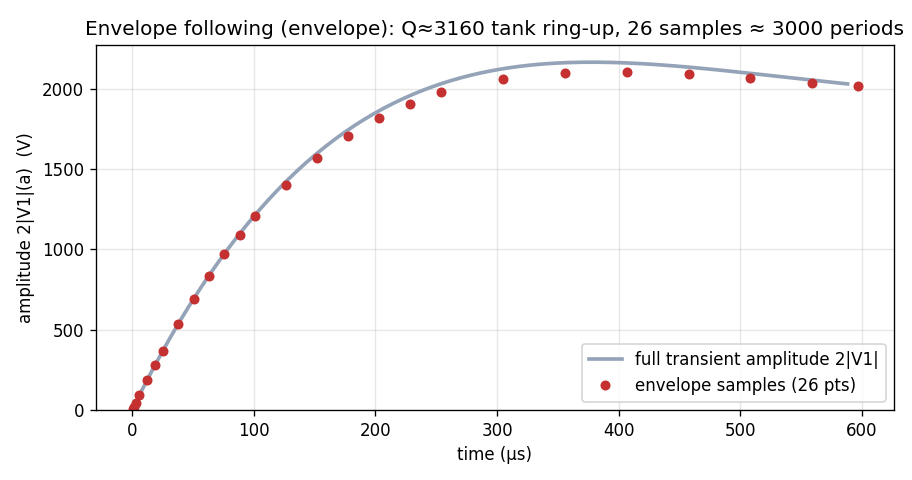

**Why it is physically correct.** With `R = 100 kΩ` the tank's quality factor is
`Q = R·√(C/L) ≈ 3160`, so it rings up to its steady amplitude over roughly `Q/π ≈ 1000`
carrier periods — a textbook exponential approach. The envelope samples trace exactly that
ring-up (they lie on the amplitude curve extracted from a full transient), while using a
few dozen period-solves instead of thousands of time steps. The method converges to the
correct steady amplitude and never diverges — the payoff of the implicit, monodromy-based
step.

---

## Part 8b — Design aids built on the same machinery

Three commands reuse the S-parameter and PSS engines rather than adding new
numerics of their own.

**`stb` — loop-gain and stability margins** ([E-198](../../../enhancements_doc/Enhancement-198.md)).
Middlebrook/Tian **double injection**: a series voltage probe and a shunt current
probe are inserted at one break in the feedback path, and the loop gain is
recovered from both injections. The double form is what makes a *loaded* break
correct — a single injection mis-measures the loop whenever the driving stage has
finite output impedance. Reports phase and gain margin with the crossing
frequencies, and leaves `loopgain` as a complex vector.

**`rfstab` — two-port RF stability** ([E-253](../../../enhancements_doc/Enhancement-253.md)). From the
S-parameters already computed by `sp`: Rollett's K with |Δ|, the geometric μ and
μ′ factors, and MSG/MAG. Reports the worst case over the sweep and whether the
network is unconditionally stable everywhere (K > 1 and |Δ| < 1).

**`loadpull` — PA load- and source-pull** ([E-234](../../../enhancements_doc/Enhancement-234.md)).
Sweeps the load reflection coefficient Γ across the Smith chart, running a large-
signal analysis per point and contouring delivered power and efficiency;
`-source` does the source-side sweep. Finding a real use-after-free in
`INPretrieve` while building this is what exposed the `INPretrieve(&x); … tfree(x)`
double-free class later fixed in `stb` too ([E-235](../../../enhancements_doc/Enhancement-235.md)).

## Part 9 — It all works under both linear solvers

Every analysis above is **independent of the linear solver**. ngspice ships with two:
the default **Sparse 1.3** and the optional **KLU** (`.option klu`). The RF engines each
carry out their own dense conversion-matrix / harmonic-balance solve and only *read* the
device Jacobian off the matrix, so the choice of solver does not change the answer. PSS,
HB, PSP, QPSS, and envelope following are verified **bit-identical** under both
([E-118](../../../enhancements_doc/Enhancement-118.md),
[-132](../../../enhancements_doc/Enhancement-132.md),
[-134](../../../enhancements_doc/Enhancement-134.md),
[-136](../../../enhancements_doc/Enhancement-136.md)). The one caveat is speed: the
shooting-PSS analyses (`.pss`/`.pac`/`.pnoise`/`.pxf`/`.psp`) force a full re-factor each
shooting step, so they run noticeably slower under KLU — a performance trade, not a
correctness one.

---

## Summary

| You want to know… | Use | Built-in example | OSDI example |
|---|---|---|---|
| filter/match response vs. frequency | `.sp` | RC low-pass | RC low-pass (`ores`+`ocap`) |
| the repeating large-signal waveform | `.pss` / `hb` | cubic nonlinearity | `odio` diode |
| small-signal gain / conversion | `.pac` | RC (→ AC impedance) | — |
| noise of a pumped circuit | `.pnoise` | RC (→ thermal noise) | — |
| transfer / S-params of a pumped net | `.pxf` / `.psp` | RC / resistive 2-port | — |
| two-tone intermodulation (IP3) | `qpss` | cubic → IM3 | — |
| an oscillator's frequency + jitter | `hbosc` + `phasenoise` | LC oscillator | — |
| the slow envelope of a fast carrier | `envelope` | high-Q RLC tank | — |

The RF/periodic-steady-state suite is, to our knowledge, the most complete such suite in
any open-source SPICE — and it treats compiled built-in devices and Verilog-A/OSDI compact
models identically throughout. For the full implementation story of any analysis, follow
its enhancement link above; for where it sits relative to commercial tools, see the
[gap analysis](ngspice_gaps.md).

*All schematics: [`make_rf_schematics.py`](make_rf_schematics.py). All result plots:
[`make_rf_figs.py`](make_rf_figs.py), generated from real runs of the committed ngspice.*
