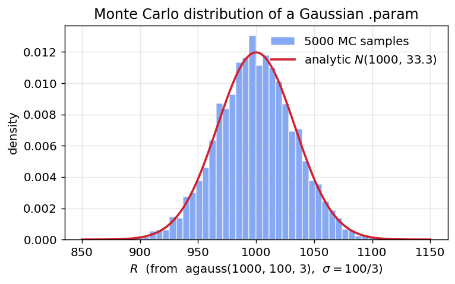
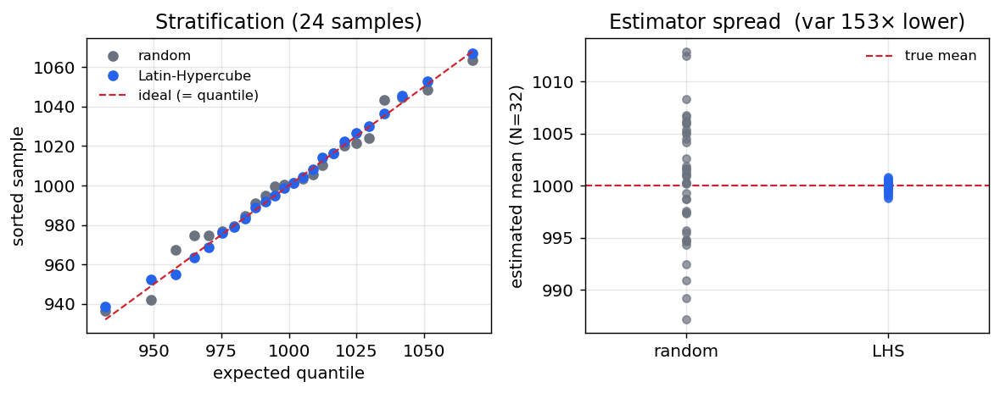
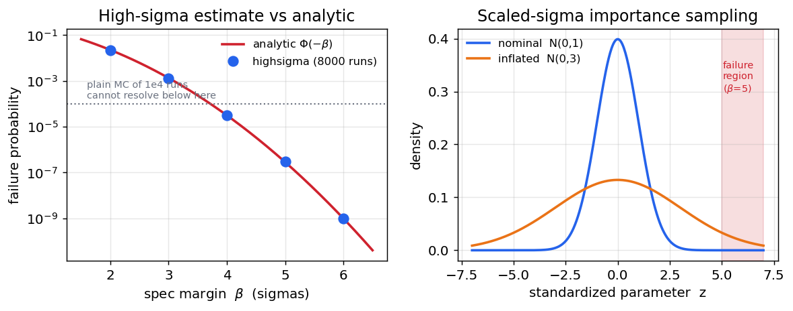
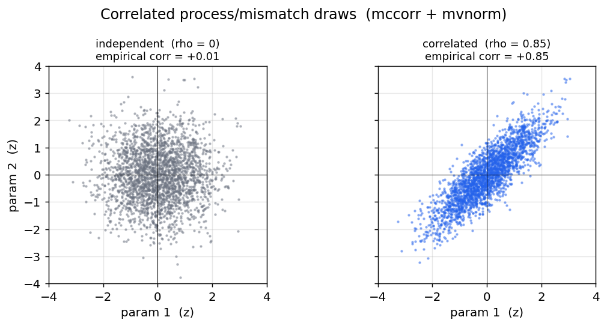
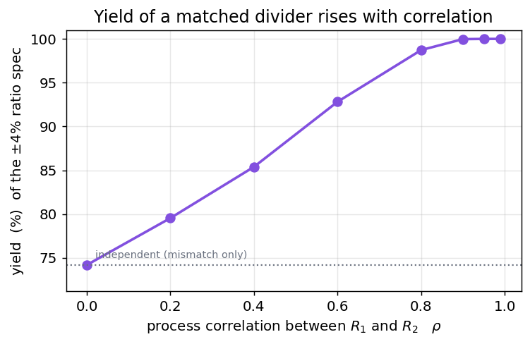

# Statistical simulation in ngspice — a complete guide

This build of `ngspice-46` has a full statistical-analysis suite: ordinary Monte
Carlo, **Latin-Hypercube** low-discrepancy sampling, **high-sigma** rare-event
estimation, native **process/mismatch correlations**, and a packaged **yield**
command. This note documents all of it end-to-end — the distribution functions,
the sampling controls, the commands, and worked, plotted examples — so you can go
from "I have a Verilog-A/SPICE circuit" to "here is its yield, and its 5-sigma
failure probability, with correlated device statistics."

Everything here is a **front-end** capability: it changes only which values the
random `.param`s take, not the circuit solve, so it works identically under the
Sparse 1.3 and KLU linear solvers and with built-in *and* OSDI/Verilog-A devices.

## TL;DR — what's available

| Capability | Command / syntax | Enhancement |
|---|---|---|
| Random parameters | `agauss` / `gauss` / `aunif` / `unif` / `limit` in `.param` | base |
| Deterministic seeding | `setseed <s>` | base |
| Ordinary Monte Carlo | the `reset` loop, or the `alter` loop | base (E-66) |
| Latin-Hypercube sampling | `mcsample lhs <N> [seed <s>]` | E-149 |
| High-sigma rare events | `highsigma <N> -metric <e> -max/-min <spec>` | E-150 |
| Process/mismatch correlations | `mccorr <k> <matrix>` + `mvnorm(i)` | E-151 |
| Packaged yield | `montecarlo <N> [-lhs] -spec <e> -max/-min <spec>` | E-151 |
| Process corners | `.lib` / `.include` corner model sets | base |

## 1. Random parameters

Statistical variation enters through the random functions in a `.param`
expression. They are evaluated **once per Monte Carlo sample** (once per `reset`
re-source), so each sample re-throws the dice:

| function | draw | notes |
|---|---|---|
| `agauss(nom, avar, sig)` | Gaussian, mean `nom`, **σ = avar/sig** | "absolute": `avar` is the `sig`-σ spread |
| `gauss(nom, rvar, sig)` | Gaussian, σ = `nom·rvar/sig` | "relative" variation |
| `aunif(nom, avar)` | uniform on `[nom−avar, nom+avar]` | |
| `unif(nom, rvar)` | uniform on `[nom(1−rvar), nom(1+rvar)]` | |
| `limit(nom, avar)` | `nom ± avar` (a fair coin) | corner-style ± |

So `agauss(1000, 100, 3)` is a resistor with a nominal 1 kΩ and a 3-σ spread of
100 Ω, i.e. **σ = 33.3 Ω**. Drawing 5000 of them and histogramming recovers the
Gaussian exactly:



**The independence gotcha.** Every *textual* occurrence of a random `{param}`
draws **independently** — two devices written with the same `{rr}` get *different*
values in one sample. Matched/correlated devices need either the shared-`.param`
idiom or the native correlation support in §5.

## 2. The two Monte Carlo idioms

**(a) The `reset` idiom** — a random `.param` feeds a device/model, and each
`reset` re-sources the deck (re-throwing the dice) and re-runs the analysis:

```spice
* reset-idiom Monte Carlo
.param rr = agauss(1000, 100, 3)
V1 a 0 DC 1
R1 a 0 {rr}
.control
  setseed 1
  let n = 500
  let iv = unitvec(n)
  let run = 0
  dowhile run < n
    reset            ; re-throws rr, re-runs
    op
    let iv[run] = i(V1)
    let run = run + 1
  end
  print mean(iv) stddev(iv)
.endc
.end
```

This is the idiom every command below builds on. It works with `.model`-card
parameters (`r={rr}`) and OSDI/Verilog-A instances alike.

**(b) The `alter` loop** — control-language random vectors (`sgauss(0)`,
`sunif(0)`) assigned per run with `alter`; no netlist re-parse, so it is faster,
but it does **not** benefit from `mcsample`/`highsigma`/`mccorr`, which target the
`.param` idiom (that is where the well-defined per-sample boundary is).

`setseed <s>` makes either idiom bit-for-bit reproducible.

## 3. Latin-Hypercube sampling — `mcsample`

Plain Monte Carlo draws each parameter independently, so a modest run count
**clumps** in some regions and leaves **gaps** in others, and the estimate
converges only as `1/√N`. `mcsample lhs <N>` switches the `.param` draws to
**Latin-Hypercube sampling**: each random dimension's range is split into `N`
equal-probability strata and hit **exactly once** (with an independent stratum
permutation per dimension; Gaussians are stratified in probability space through
the inverse-normal CDF).

```
mcsample lhs <N> [seed <s>]   engage LHS for the next N reset-driven samples
mcsample random | off         revert to independent draws
```

The left panel shows the stratification (the LHS samples land on their quantiles;
the random ones scatter); the right shows the payoff — the spread of the estimated
mean over many trials collapses (here ~100× lower variance at the same `N`):



Usage is a one-line change to the idiom above:

```spice
.control
  mcsample lhs 200 seed 1        ; <-- the only change
  let run = 0
  dowhile run < 200
    reset
    op
    let iv[run] = i(V1)
    let run = run + 1
  end
  print mean(iv) stddev(iv)      ; a much tighter estimate than plain MC
.endc
```

Use LHS whenever you want an accurate *whole-distribution* statistic (mean,
stddev, a moderate quantile) for a given run budget.

## 4. High-sigma rare events — `highsigma`

For high-replication circuits (an SRAM cell instanced millions of times), the
number that matters is a **4–6 sigma** failure probability of `1e-7`…`1e-9`.
Plain Monte Carlo would need `1e7`…`1e9` runs just to see a handful of failures.
`highsigma` estimates such probabilities with a **few thousand** runs by
**scaled-sigma importance sampling**: it inflates every Gaussian `.param`'s σ by a
factor `λ` so the failure region is sampled often, then reweights each sample by
the likelihood ratio `p_nominal/p_inflated` to keep the estimate **unbiased**. It
is direction-free — no gradient or worst-case-distance search.

```
highsigma <N> [-scale <lambda>] [-seed <s>] [-analysis <cmd>]
          -metric <expr> [-max <hi>] [-min <lo>]
```

The left panel shows the estimate tracking the analytic `Φ(−β)` from 2 to 6 sigma,
far below what plain MC of the same budget can resolve; the right panel shows the
mechanism — the inflated distribution reaches the tail the nominal one never does:



```spice
* probability that R exceeds a 4.5-sigma spec (1150 ohm); analytic 3.4e-6
.param rr = agauss(1000, 100, 3)
V1 a 0 DC 1
R1 a 0 {rr}
.control
  highsigma 6000 -scale 3.0 -seed 1 -analysis op -metric -1/i(v1) -max 1150
.endc
.end
```
```
  P(fail)          : 3.2349e-06  +/- 3.26e-07  (relative error 10.1%)
  equivalent sigma : 4.510  (one-sided, P = Phi(-sigma))
```

The spec is `-max`/`-min` numeric limits rather than a `>`/`<` inside the metric,
because a bare `>` in a control command is an I/O redirect. Results are also left
in `highsigma_pfail`, `highsigma_relerr`, `highsigma_sigma`, `highsigma_nfail`.

## 5. Process/mismatch correlations — `mccorr` + `mvnorm`

Whether two devices' variation is *correlated* is often what decides the yield —
but plain MC draws every `agauss` independently. `mccorr` registers a `k × k`
**correlation matrix** (Cholesky-factored once, and rejected if not
positive-definite), and the new `.param` function **`mvnorm(i)`** returns the
`i`-th component of one correlated standard-normal draw per sample (`y = L·z`):

```spice
mccorr 2  1 0.85  0.85 1               ; rho = 0.85 between the two factors
.param r1 = 1000 + 100*mvnorm(1)       ; r1, r2 now vary together
.param r2 = 1000 + 100*mvnorm(2)
```

`mvnorm(i)` returns a **unit-variance** standard normal (scale it in the `.param`);
the matrix is a correlation matrix (unit diagonal). Drawing two parameters at
`ρ=0` vs `ρ=0.85` shows the joint distribution tilt from a round blob to an
elongated one:



The underlying `z`'s are drawn through the same sampler `mcsample`/`highsigma`
use, so **correlations compose with Latin-Hypercube and importance sampling
automatically**. The classic **process + mismatch** decomposition is just:

```spice
mccorr 1  1                            ; one shared process factor
.param vth1 = 0.5 + 0.03*mvnorm(1) + 0.01*agauss(0,1,1)   ; global + local
.param vth2 = 0.5 + 0.03*mvnorm(1) + 0.01*agauss(0,1,1)   ; shares the process term
```

Here `mvnorm(1)` (the global process shift) is shared by both devices, while each
`agauss(0,1,1)` is independent local mismatch — exactly the standard model.

**An index the matrix does not have is refused** (MC hunt F4, 2026-09-04):
with a `k × k` matrix registered, `mvnorm(0)`, `mvnorm(k+1)` or a fractional
index is a `.param` error naming the range, where it used to fall through to an
independent draw in silence. With **no** matrix registered `mvnorm(i)` draws
independently by design — that is every deck's state at load, before its
`.control` block has run `mccorr` — so `mccorr` itself reports an index the
deck has already used beyond the matrix, and notes that the load-time draws
are independent until a `reset` redraws them (the sampling commands do one per
sample).

## 6. Yield — `montecarlo`

`montecarlo` packages the whole flow: run the samples, apply the pass/fail specs,
report the yield with a confidence interval — or, since E-552, simply record a
value per sample for later.

```
montecarlo <N> [-lhs] [-warm] [-seed <s>] [-analysis <cmd>]
           (-spec <metric> -max <hi>|-min <lo>)...
           (-expr [name=]<expression>)...
```

A sample **passes** only if *every* spec's metric is within its `-max`/`-min`
limits. It reports the yield with a **Wilson 95% confidence interval** and a
per-spec violation count, and leaves `montecarlo_yield`, `montecarlo_npass`,
`montecarlo_n` for scripting. `-lhs` gives a much lower-variance yield estimate.
A `-spec` is a judgement, so it needs a limit; one without `-max`/`-min` is
refused with a pointer to `-expr`.

### 6.1 Recording without judging — `-expr`

`-expr [name=]<expression>` evaluates the expression after every sample and
**records** it, unjudged, into a plot of its own — `montecarlo1`, `montecarlo2`,
… one per invocation, with `sample` (1 … N) as its scale, and named in
`$montecarlo_plot`. With no `-spec` at all there is no yield: the command just
runs the analysis N times and keeps what you asked for.

```spice
.param rr = agauss(1000, 100, 3)
V1 in 0 dc 1 ac 1
R1 in out {rr}
R2 out 0 1k
.control
  montecarlo 200 -seed 3 -analysis op -expr vo=v(out) -expr r=@r1[resistance]
  print mean(vo) stddev(vo)              ; montecarlo1 is now current
  pyplot -hist vo

  montecarlo 50 -analysis "dc v1 0 1 0.01" -expr vo=v(out)
  plot vo                                ; 50 curves, one per sample
  print montecarlo1.vo[3]                ; an earlier run is still there
.endc
```

What each `-expr` becomes:

| the expression is | recorded as |
|---|---|
| a scalar per sample (`v(out)` after `op`, `vecmax(...)`, a device parameter) | an N-long vector on the `sample` scale |
| a waveform per sample (`v(out)` after a `dc`/`ac`/`tran` sweep, L points) | an N × L two-dimensional vector with the analysis scale (`v-sweep`, `frequency`, `time`) copied beside it — `plot` draws it as a family of N curves, `vo[k]` is sample k |

A complex value (an `ac` output) is recorded as its magnitude. A sample that
failed to simulate leaves `nan` in its row. A waveform whose point count differs
between samples — an adaptive `tran` can do that — is not recorded and the
command says so; reduce it to a scalar, or `linearize` it inside the
`-analysis` command. An expression that gives the same value in every sample is
noted, since it means nothing the deck draws reaches it. The name must be a
plain identifier (`montecarlo1.<name>` has to be spellable); without one the
vectors are `expr1`, `expr2`, …

`-spec` and `-expr` combine: a yield run with `-expr` also records its values,
so a yield and the distribution behind it come from the same samples.

```spice
* a matched divider, +/-4% ratio spec
.param r1 = 1000 + 50*mvnorm(1)
.param r2 = 1000 + 50*mvnorm(2)
V1 in 0 DC 1
R1 in out {r1}
R2 out 0 {r2}
.control
  mccorr 2  1 0.9  0.9 1
  montecarlo 5000 -lhs -analysis op -spec v(out) -max 0.52 -min 0.48
.endc
.end
```

Because `mvnorm` correlations feed straight into `montecarlo`, the yield of a
*matched* pair depends strongly on how correlated the two devices are — from
~74 % when independent to ~100 % when they track each other. Getting the
correlation model wrong grossly misestimates the yield:



## 7. Corners, and combining everything

**Process corners** (TT / FF / SS / …) are the ordinary ngspice `.lib`/`.include`
mechanism — a corner model set is selected by a `.lib "models.lib" ff` line.
Corners **compose** with all of the above: load a corner, then run `montecarlo` at
that corner to get the corner's yield, or loop the corners around the MC. A
typical production flow is therefore:

1. `.lib` in a process corner (or loop over corners);
2. declare correlated process/mismatch with `mccorr` + `mvnorm`;
3. `montecarlo … -lhs` for the yield (or `highsigma …` for a rare-event spec).

## 7b. Global search, yield centring and worst-case distance

**Global optimizers** ([E-194](../../../enhancements_doc/Enhancement-194.md)–[E-196](../../../enhancements_doc/Enhancement-196.md)):
particle-swarm (`pso`), differential evolution (`de`) and simulated annealing
(`sa`) join the local Nelder–Mead and Levenberg–Marquardt methods. They matter
for circuit sizing because the cost surface is routinely multi-modal — a local
method converges to whichever basin the initial guess happened to land in.

**Multi-objective** ([E-216](../../../enhancements_doc/Enhancement-216.md)): `nsga2` returns a **Pareto
front** rather than a single point, which is the honest answer when the
objectives genuinely trade off (gain against power, speed against area) and no
scalarised weighting is defensible.

**Yield centring** ([E-206](../../../enhancements_doc/Enhancement-206.md)): `dcenter` moves the nominal
design point to maximise the fraction of the statistical population that meets
spec, rather than optimising the nominal response alone.

**Worst-case distance** ([E-305](../../../enhancements_doc/Enhancement-305.md)): `wcd` reports the
shortest distance, in *standardised* parameter space, from the nominal point to a
spec boundary — i.e. the sigma level at which the design first fails, and the
most-probable failure point that gets there. It answers "how much margin do I
have, and in which direction is it thinnest", which a yield percentage from a
Monte-Carlo run cannot: MC estimates the tail by sampling it, and the tail is
exactly where samples are scarce.
Its dimensions are the netlist's Gaussian `.params` **and, under
`.option osdimc`, every Gaussian `(* std *)` parameter of every OSDI model card
and instance** (MC hunt F3, 2026-09-04): the banner says how many of each, in
that order in `u`, and holds a uniform `(* dist="uniform" *)` parameter at its
nominal, since a bounded uniform has no Gaussian coordinate. Before that the
model-declared statistics were frozen at one draw for the whole search, so a
deck whose variability was entirely model-declared was refused, and one small
netlist dimension beside them produced a wildly wrong distance.

**Warm-started Monte Carlo** ([E-188](../../../enhancements_doc/Enhancement-188.md)) reuses the previous
sample's solution as the next sample's initial guess, and **Latin-hypercube
sampling** ([E-149](../../../enhancements_doc/Enhancement-149.md)–[E-151](../../../enhancements_doc/Enhancement-151.md))
stratifies the draw so a given sample count covers the space more evenly than
independent sampling.

## 8. Practical guidance

- **Reproducibility.** Every run is seeded (`setseed`, or the command's `seed`/
  `-seed`); the same seed reproduces the sample sequence bit-for-bit, so results
  are portable and regressions are detectable. **Without `-seed` the seed is
  1, every time** — so "run it again" returns the same netlist draws, which is
  what a paired comparison across design changes wants and what a replication
  does not. The banner states the seed (`…, seed 1 (default)` / `seed 7`), an
  un-seeded run says a rerun repeats it, and `montecarlo_seed` /
  `highsigma_seed` / `wcd_seed` publish it for scripts. `.option osdimc` draws
  are keyed per trial and advance across commands regardless.
- **Which sampler?** Use **plain MC** to sanity-check; **`mcsample lhs`** (or
  `montecarlo -lhs`) for an accurate mean/stddev/yield at a fixed budget;
  **`highsigma`** when the interesting probability is out in the 4–6 σ tail.
- **Choosing `λ`** for `highsigma`: ~2 for 3 σ, ~2.5 for 4 σ, ~3 for 5–6 σ. Watch
  the reported **relative error** — if it is large, raise `N` or `λ`.
- **Correlations matter.** For matched devices, a plausible correlation is worth
  far more than more samples: as the yield figure shows, `ρ` can move the yield by
  tens of percent.
- **Cost.** Each sample re-sources the deck (a few ms for a small deck), so a
  yield/rare-event run is thousands of re-sources — heavy but far cheaper than the
  `10⁷`–`10⁹` plain-MC runs a 5-σ estimate would otherwise need.

## Reproducing the figures

`make_statistics_figs.py` (in this folder) regenerates every plot from real
`ngspice` runs — it drives the committed binary through the `mcsample`,
`highsigma`, `mccorr`, and `montecarlo` commands and plots the results with
matplotlib. See the per-feature example suites for the verifiers:
[`lhs_examples`](../../../examples/lhs_examples/),
[`highsigma_examples`](../../../examples/highsigma_examples/),
[`yield_examples`](../../../examples/yield_examples/), and
[`montecarlo_examples`](../../../examples/montecarlo_examples/).
