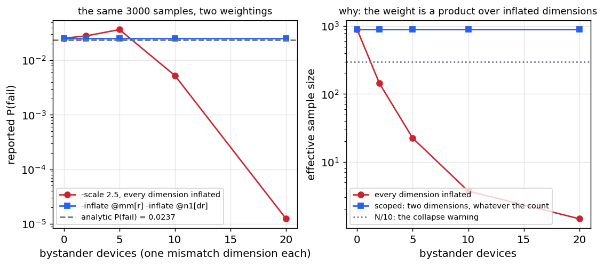
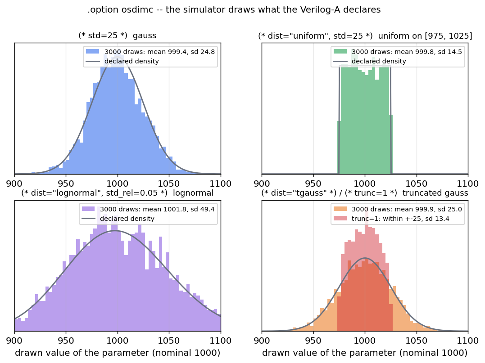

# Statistical simulation in ngspice — a complete guide

This build of `ngspice-46` has a full statistical-analysis suite: ordinary Monte
Carlo, **Latin-Hypercube** low-discrepancy sampling, **high-sigma** rare-event
estimation, native **process/mismatch correlations**, a packaged **yield**
command with per-sample **recording** and **tracking**, **worst-case distance**,
**design centring** — and, since Enhancement-530, statistics that live **in the
Verilog-A model itself**: a parameter declares its own spread with an attribute
and the simulator draws it, trial after trial, with no `gauss()` in the deck.
Every draw of every run can be written to a file beside the netlist, with the
results computed from that run on the same row.

This note documents all of it end-to-end — the distribution functions, the
sampling controls, the commands, the model-side attributes, the recording — with
worked examples whose outputs are taken from real runs of the committed binary,
so you can go from "I have a Verilog-A/SPICE circuit" to "here is its yield, its
5-sigma failure probability, the draws behind every sample, and a file with all
of it."

Two sources of variation exist, and they compose:

| where the statistics live | how they are drawn | who re-draws |
|---|---|---|
| **the netlist**: `agauss()`, `gauss()`, `unif()`, `aunif()`, `limit()`, `mvnorm()` in a `.param`, a device value, a subcircuit call | ngspice's netlist PRNG, once per *sample* | a `reset`, or the loop commands' fast path (§2) |
| **the model**: `(* std=… *)` and friends on a Verilog-A `parameter`, under `.option osdimc` | a pure hash of (`mcseed`, trial, owner, parameter) — no RNG state | every run-class command is a *trial* (§7) |

Everything on the netlist side is a **front-end** capability: it changes only
which values the random `.param`s take, not the circuit solve, so it works
identically under the Sparse 1.3 and KLU linear solvers and with built-in *and*
OSDI/Verilog-A devices. The model side writes each draw through the ordinary
parameter setter — the `alter` path — so it, too, leaves the solve untouched.

## TL;DR — what's available

| Capability | Command / syntax | Enhancement |
|---|---|---|
| Random parameters | `agauss` / `gauss` / `aunif` / `unif` / `limit` in `.param` | base |
| Deterministic seeding | `setseed <s>`; every loop command's `-seed <s>` (default 1, stated) | base, E-374, E-543 |
| Ordinary Monte Carlo | the `reset` loop, or the `alter` loop | base (E-66) |
| Random draws without a re-source | the fast `.param` path, armed by `montecarlo` | E-346 |
| Latin-Hypercube sampling | `mcsample lhs <N> [seed <s>]`, `montecarlo -lhs` | E-149 |
| High-sigma rare events | `highsigma <N> -scale <λ> [-inflate <p>]… -metric <e> -max/-min` | E-150, E-538 |
| Process/mismatch correlations | `mccorr <k> <matrix>` + `mvnorm(i)` | E-151 |
| Packaged yield | `montecarlo <N> [-lhs] [-warm] -spec <e> -max/-min` | E-151, E-188 |
| Recording per sample | `montecarlo … -expr [name=]<e>` → plot `montecarlo<n>` | E-552 |
| Every hit of a condition, per sample | `montecarlo … -track "<track args>"` → plot `track<k>` | E-577–584 |
| The yield of a tracked quantity | `-spec track1.value`, `-expr` feeding a `-track` | E-609 |
| Worst-case distance / MPFP | `wcd -metric <e> -max/-min [-is <N>]` | E-305 |
| Design centring | `optimize -dparam … -center -samples <N> -spec …` | E-206 |
| **Model-declared statistics** | `(* std= / std_rel= / dist= / trunc= *)` on a parameter + `.option osdimc mcseed=<s>` | E-530, E-554 |
| Scoped importance weights | `highsigma -inflate @owner[param]` | E-538 |
| **Every draw of every run, to a file** | `.option savemc[=<file>]`, `automc_save` | E-610 |
| Results onto the same row | `writemc [name=]<e>…`, `montecarlo -writemc …` | E-611 |
| Randomness inside the model | `$random`, `$rdist_normal(seed, …)`, … in Verilog-A | E-10, E-527 |
| Process corners | `.lib` / `.include` corner model sets | base |

## 1. Random parameters

Statistical variation enters through the random functions in a `.param`
expression. They are evaluated **once per Monte Carlo sample**, so each sample
re-throws the dice:

| function | draw | notes |
|---|---|---|
| `agauss(nom, avar, sig)` | Gaussian, mean `nom`, **σ = avar/sig** | "absolute": `avar` is the `sig`-σ spread |
| `gauss(nom, rvar, sig)` | Gaussian, σ = `nom·rvar/sig` | "relative" variation |
| `aunif(nom, avar)` | uniform on `[nom−avar, nom+avar]` | |
| `unif(nom, rvar)` | uniform on `[nom(1−rvar), nom(1+rvar)]` | |
| `limit(nom, avar)` | `nom ± avar` (a fair coin) | corner-style ± |
| `mvnorm(i)` | component `i` of one correlated standard-normal draw | needs `mccorr`, §5 |

So `agauss(1000, 100, 3)` is a resistor with a nominal 1 kΩ and a 3-σ spread of
100 Ω, i.e. **σ = 33.3 Ω**. Drawing 5000 of them and histogramming recovers the
Gaussian exactly:


**The independence gotcha.** Every *textual* occurrence of a random `{param}`
draws **independently** — ngspice inlines the `.param`'s expression into each
device line, so two devices written with the same `{rr}` get *different* values
in one sample:

```spice
* two uses of one random .param are two draws
.param rr = agauss(1000, 100, 3)
V1 a 0 DC 1
R1 a 0 {rr}
R2 a 0 {rr}
.control
setseed 1
op
print @r1[resistance] @r2[resistance]
reset
op
print @r1[resistance] @r2[resistance]
.endc
```
```
@r1[resistance] = 1.017613e+03
@r2[resistance] = 1.049945e+03
@r1[resistance] = 1.022025e+03      <- the reset re-drew both
@r2[resistance] = 1.011230e+03
```

Matched/correlated devices need either the shared-`.param` idiom or the native
correlation support in §5. The same inlining is why `.option savemc` (§8) names
a draw by its **slot** — `r1`, `r2` — and not by the `.param`.

A random function is refused where it cannot mean anything: in a Verilog-A
parameter's *default* or *range* it is a compile error, not a crash
([E-545](../../../enhancements_doc/Enhancement-545.md)).

## 2. The two Monte Carlo idioms

**(a) The `reset` idiom** — a random `.param` feeds a device/model, and each
`reset` re-sources the deck (re-throwing the dice) and re-runs the analysis:

```spice
* reset-idiom Monte Carlo
.param rr = agauss(1000, 100, 3)
V1 a 0 DC 1
R1 a 0 {rr}
.control
  setseed 1
  let n = 500
  let iv = unitvec(n)
  let run = 0
  dowhile run < n
    reset            ; re-throws rr, re-runs
    op
    let iv[run] = -i(V1)
    let run = run + 1
  end
  print mean(iv) stddev(iv)
.endc
.end
```
```
mean(iv) = 9.996056e-04
stddev(iv) = 3.362374e-05
```

This is the idiom every command below builds on. It works with `.model`-card
parameters (`r={rr}`) and OSDI/Verilog-A instances alike.

**(b) The `alter` loop** — control-language random vectors (`sgauss(0)`,
`sunif(0)`) assigned per run with `alter`; no netlist re-parse, so it is faster,
but it does **not** benefit from `mcsample`/`highsigma`/`mccorr`, which target the
`.param` idiom (that is where the well-defined per-sample boundary is).

`setseed <s>` makes either idiom bit-for-bit reproducible — including transient
noise sources, which it did not seed before
[E-374](../../../enhancements_doc/Enhancement-374.md).

**The fast path** ([E-346](../../../enhancements_doc/Enhancement-346.md)).
`montecarlo` does not `reset` per sample: it captures every brace expression
that draws from the RNG (`agauss`, `gauss`, `unif`, `aunif`, `limit`, `mvnorm`)
and re-evaluates *those* in deck order, pushing the values in place. The RNG
stream is consumed exactly as a re-source would consume it, so the samples are
**bit-identical to the `reset` idiom** — with `-lhs` too, since the sample
boundary is still signalled to the sampler — and the banner says when it is
on:

```
montecarlo: fast path armed (1 random value binding, no per-sample reset)
```

**Warm start** ([E-188](../../../enhancements_doc/Enhancement-188.md)):
`montecarlo … -warm` reuses the previous sample's solution as the next sample's
initial guess, which is what a slowly-moving parameter set wants.

## 3. Latin-Hypercube sampling — `mcsample`

Plain Monte Carlo draws each parameter independently, so a modest run count
**clumps** in some regions and leaves **gaps** in others, and the estimate
converges only as `1/√N`. `mcsample lhs <N>` switches the `.param` draws to
**Latin-Hypercube sampling**: each random dimension's range is split into `N`
equal-probability strata and hit **exactly once** (with an independent stratum
permutation per dimension; Gaussians are stratified in probability space through
the inverse-normal CDF).

```
mcsample lhs <N> [seed <s>]   engage LHS for the next N reset-driven samples
mcsample random | off         revert to independent draws
```

The left panel shows the stratification (the LHS samples land on their quantiles;
the random ones scatter); the right shows the payoff — the spread of the estimated
mean over many trials collapses (here ~100× lower variance at the same `N`):


Usage is a one-line change to the idiom above:

```spice
.control
  mcsample lhs 500 seed 1        ; <-- the only change
  let run = 0
  dowhile run < 500
    reset
    op
    let iv[run] = -i(V1)
    let run = run + 1
  end
  print mean(iv) stddev(iv)      ; a much tighter estimate than plain MC
.endc
```
```
Monte Carlo sampling: Latin-Hypercube, N = 500, seed = 1.
mean(iv) = 1.001120e-03
stddev(iv) = 3.363422e-05
```

Use LHS whenever you want an accurate *whole-distribution* statistic (mean,
stddev, a moderate quantile) for a given run budget.

## 4. High-sigma rare events — `highsigma`

For high-replication circuits (an SRAM cell instanced millions of times), the
number that matters is a **4–6 sigma** failure probability of `1e-7`…`1e-9`.
Plain Monte Carlo would need `1e7`…`1e9` runs just to see a handful of failures.
`highsigma` estimates such probabilities with a **few thousand** runs by
**scaled-sigma importance sampling**: it inflates every Gaussian `.param`'s σ by a
factor `λ` so the failure region is sampled often, then reweights each sample by
the likelihood ratio `p_nominal/p_inflated` to keep the estimate **unbiased**. It
is direction-free — no gradient or worst-case-distance search.

```
highsigma <N> [-scale <lambda>] [-inflate <param>]... [-seed <s>] [-analysis <cmd>]
          -metric <expr> [-max <hi>] [-min <lo>]
```

The left panel shows the estimate tracking the analytic `Φ(−β)` from 2 to 6 sigma,
far below what plain MC of the same budget can resolve; the right panel shows the
mechanism — the inflated distribution reaches the tail the nominal one never does:


```spice
* probability that R exceeds a 4.5-sigma spec (1150 ohm); analytic 3.4e-6
.param rr = agauss(1000, 100, 3)
V1 a 0 DC 1
R1 a 0 {rr}
.control
  highsigma 6000 -scale 3.0 -seed 1 -analysis op -metric -1/i(v1) -max 1150
  print highsigma_pfail highsigma_sigma highsigma_seed
.endc
.end
```
```
highsigma: 6000 samples, scale (sigma inflation) = 3, analysis 'op', fail if (-1/i(v1)) > 1150, seed 1
  failures observed : 388 / 6000 (in the inflated sampling)
  P(fail)           : 3.2349e-06  +/- 3.26e-07  (relative error 10.1%)
  equivalent sigma  : 4.510  (one-sided, P = Phi(-sigma))
highsigma_pfail = 3.234899e-06
highsigma_sigma = 4.510425e+00
highsigma_seed = 1.000000e+00
```

The spec is `-max`/`-min` numeric limits rather than a `>`/`<` inside the metric,
because a bare `>` in a control command is an I/O redirect. Results are also left
in `highsigma_pfail`, `highsigma_relerr`, `highsigma_sigma`, `highsigma_nfail`,
`highsigma_nfailed` (samples that did not solve), `highsigma_ess` and
`highsigma_seed`.

### 4.1 Many dimensions: the weight collapses, `-inflate` scopes it

The importance weight is a **product** over every inflated dimension, so its
variance grows exponentially with their number — and `-scale` inflates *every*
Gaussian statistical parameter in the circuit, including ones the metric cannot
depend on. Under `.option osdimc` (§7) that count is not a modelling choice: a
`(* type="instance" *)` mismatch parameter is one dimension **per instance**, so
an ordinary deck arrives in the degenerate regime by itself. The estimator stays
unbiased in expectation and useless in practice; the command therefore measures
its own reliability — the **effective sample size** `ESS = (Σw)²/Σw²` — and says
when it has none ([E-537](../../../enhancements_doc/Enhancement-537.md)). The fix
is not arithmetic but scope: **`-inflate <param>`**
([E-538](../../../enhancements_doc/Enhancement-538.md)), repeatable, restricts
the inflation (and so the weight) to the parameters the failure actually turns
on — a bare name (`r`, wherever it occurs) or the accessor spelling
`@owner[param]`, `*` allowed as the owner.

```spice
* the metric depends on N1 alone; ten bystanders elsewhere each add a mismatch dimension
.option osdimc
V1 1 0 DC 1
N1 1 2 mm
R1 2 0 1k
.model mm rstat r=1k                  ; rstat: (* std=25 *) r, (* type="instance", std=10 *) dr
V2 10 0 DC 1
N2 10 11 bys
...                                   ; N2..N11 in a chain nothing measures
N11 19 0 bys
.model bys rstat r=1k
.control
pre_osdi rstat.osdi
highsigma 2000 -scale 2.5 -seed 1 -analysis op -metric v(2) -min 0.487
highsigma 2000 -scale 2.5 -seed 1 -analysis op -inflate @mm[r] -inflate @n1[dr] -metric v(2) -min 0.487
.endc
```
```
  P(fail)           : 6.6824e-03  +/- 6.31e-03  (relative error 94.5%)
  NOTE    : the importance weights have collapsed -- an effective sample size of 10.1 out of 2000. P(fail) above is NOT trustworthy.
            -scale inflates EVERY (* std *) parameter of every device, including ones the metric cannot depend on. Name the ones that matter with `-inflate <param>`.
highsigma: 2000 samples, scale (sigma inflation) = 2.5 on the -inflate parameters only, analysis 'op', fail if (v(2)) < 0.487, seed 1
  P(fail)           : 2.5504e-02  +/- 2.55e-03  (relative error 10.0%)
  equivalent sigma  : 1.951  (one-sided, P = Phi(-sigma))
```

The analytic answer is `Φ(−53.4/√(25²+10²)) = 0.0237`. The same 2000 samples
were run both times — only the weighting differs — and the figure below sweeps
the bystander count: the scoped estimate is *bit-identical* whatever the count,
because the weight counts exactly the inflated dimensions.



An `-inflate` naming nothing statistical is reported (the run then sampled the
nominal spread), a malformed one is refused before the run. Two more honesty
repairs from the same hunt: a weighted mean is clamped into `[0, 1]` and says
when it was; an "equivalent sigma" at the boundary reads `n/a`, never `0.000`
(which would mean P = 0.5).

## 5. Process/mismatch correlations — `mccorr` + `mvnorm`

Whether two devices' variation is *correlated* is often what decides the yield —
but plain MC draws every `agauss` independently. `mccorr` registers a `k × k`
**correlation matrix** (Cholesky-factored once, and rejected if not
positive-definite), and the `.param` function **`mvnorm(i)`** returns the
`i`-th component of one correlated standard-normal draw per sample (`y = L·z`):

```spice
mccorr 2  1 0.85  0.85 1               ; rho = 0.85 between the two factors
.param r1 = 1000 + 100*mvnorm(1)       ; r1, r2 now vary together
.param r2 = 1000 + 100*mvnorm(2)
```

`mvnorm(i)` returns a **unit-variance** standard normal (scale it in the `.param`);
the matrix is a correlation matrix (unit diagonal). Drawing two parameters at
`ρ=0` vs `ρ=0.85` shows the joint distribution tilt from a round blob to an
elongated one:


The underlying `z`'s are drawn through the same sampler `mcsample`/`highsigma`
use, so **correlations compose with Latin-Hypercube and importance sampling
automatically**. The classic **process + mismatch** decomposition is just:

```spice
mccorr 1  1                            ; one shared process factor
.param vth1 = 0.5 + 0.03*mvnorm(1) + 0.01*agauss(0,1,1)   ; global + local
.param vth2 = 0.5 + 0.03*mvnorm(1) + 0.01*agauss(0,1,1)   ; shares the process term
```

Here `mvnorm(1)` (the global process shift) is shared by both devices, while each
`agauss(0,1,1)` is independent local mismatch — exactly the standard model. (With
Verilog-A models the same split is one attribute: a model parameter is process,
a `(* type="instance" *)` parameter is mismatch — §7.)

**An index the matrix does not have is refused** (MC hunt F4, 2026-09-04):
with a `k × k` matrix registered, `mvnorm(0)`, `mvnorm(k+1)` or a fractional
index is a `.param` error naming the range, where it used to fall through to an
independent draw in silence. With **no** matrix registered `mvnorm(i)` draws
independently by design — that is every deck's state at load, before its
`.control` block has run `mccorr` — so `mccorr` itself reports an index the
deck has already used beyond the matrix, and notes that the load-time draws
are independent until a `reset` redraws them (the sampling commands do one per
sample).

## 6. Yield — `montecarlo`

`montecarlo` packages the whole flow: run the samples, apply the pass/fail specs,
report the yield with a confidence interval — or simply record a value per
sample for later (`-expr`, E-552), every place a condition holds in each sample
(`-track`, E-582), and the yield of a tracked quantity in the same command
(E-609).

```
montecarlo <N> [-lhs] [-warm] [-seed <s>] [-analysis <cmd>]
           (-spec <metric> -max <hi>|-min <lo>)...
           (-expr [name=]<expression>)...
           (-track "<track arguments>")...
           [-writemc [name=]<expression>...]
```

A sample **passes** only if *every* spec's metric is within its `-max`/`-min`
limits. It reports the yield with a **Wilson 95% confidence interval** and a
per-spec violation count, and leaves `montecarlo_yield`, `montecarlo_npass`,
`montecarlo_n`, `montecarlo_seed` for scripting. `-lhs` gives a much
lower-variance yield estimate. A `-spec` is a judgement, so it needs a limit;
one without `-max`/`-min` is refused with a pointer to `-expr`.

```spice
* a matched divider, +/-4% ratio spec: the yield depends on the correlation
.param r1 = 1000 + 50*mvnorm(1)
.param r2 = 1000 + 50*mvnorm(2)
V1 in 0 DC 1
R1 in out {r1}
R2 out 0 {r2}
.control
  mccorr 2  1 0.0  0.0 1
  montecarlo 4000 -lhs -seed 1 -analysis op -spec v(out) -max 0.52 -min 0.48
  mccorr 2  1 0.9  0.9 1
  montecarlo 4000 -lhs -seed 1 -analysis op -spec v(out) -max 0.52 -min 0.48
.endc
.end
```
```
montecarlo: 4000 Latin-Hypercube samples, analysis 'op', 1 spec, seed 1
  yield  : 74.200%  (2968 / 4000 pass)
  spec 1 (v(out)): 1032 violations
montecarlo: 4000 Latin-Hypercube samples, analysis 'op', 1 spec, seed 1
  yield  : 99.975%  (3999 / 4000 pass)
  spec 1 (v(out)): 1 violation
```

Because `mvnorm` correlations feed straight into `montecarlo`, the yield of a
*matched* pair depends strongly on how correlated the two devices are — from
~74 % when independent to ~100 % when they track each other. Getting the
correlation model wrong grossly misestimates the yield:


**Seeds** ([E-543](../../../enhancements_doc/Enhancement-543.md),
[E-559](../../../enhancements_doc/Enhancement-559.md)). Without `-seed` the
netlist PRNG is re-seeded from **1**, every time — so "run it again" returns the
same samples, which is what a paired comparison across design changes wants and
what a replication does not. The banner states it (`seed 1 (default)`), an
un-seeded run notes that a rerun repeats it, and `-seed <n>` gives an independent
replication. Under `.option osdimc` the model-declared draws are keyed by the
same `-seed` and the sample number (§7.4), so a seeded run replays identically
whatever ran before it.

A quoted or unresolvable spec is refused with the spec, sample and plot named —
it used to score as 0 and report a confident 0 % or 100 % yield.

### 6.1 Recording without judging — `-expr`

`-expr [name=]<expression>` evaluates the expression after every sample and
**records** it, unjudged, into a plot of its own — `montecarlo1`, `montecarlo2`,
… one per invocation, with `sample` (1 … N) as its scale, and named in
`$montecarlo_plot`. With no `-spec` at all there is no yield: the command just
runs the analysis N times and keeps what you asked for.
A name is refused when the record plot already owns it — its scale `sample`, or a
result such as `montecarlo_n` (E-557) — and when two `-expr` share it.

```spice
.param rr = agauss(1000, 100, 3)
V1 in 0 dc 1 ac 1
R1 in out {rr}
R2 out 0 1k
.control
  montecarlo 200 -seed 3 -analysis op -expr vo=v(out) -expr r=@r1[resistance]
  print mean(vo) stddev(vo)              ; montecarlo1 is now current
  pyplot -hist vo

  montecarlo 50 -analysis "dc v1 0 1 0.01" -expr vo=v(out)
  plot vo                                ; 50 curves, one per sample
  print montecarlo1.vo[3]                ; an earlier run is still there
.endc
```

What each `-expr` becomes:

| the expression is | recorded as |
|---|---|
| a scalar per sample (`v(out)` after `op`, `vecmax(...)`, a device parameter) | an N-long vector on the `sample` scale |
| a waveform per sample (`v(out)` after a `dc`/`ac`/`tran` sweep, L points) | an N × L two-dimensional vector with the analysis scale (`v-sweep`, `frequency`, `time`) copied beside it — `plot` draws it as a family of N curves, `vo[k]` is sample k |

A complex value (an `ac` output) is recorded as its magnitude. A sample that
failed to simulate leaves `nan` in its row. A waveform whose point count differs
between samples — an adaptive `tran` can do that — is not recorded and the
command says so; reduce it to a scalar, or `linearize` it inside the
`-analysis` command. An expression that gives the same value in every sample is
noted, since it means nothing the deck draws reaches it. The name must be a
plain identifier (`montecarlo1.<name>` has to be spellable); without one the
vectors are `expr1`, `expr2`, …

`-spec` and `-expr` combine: a yield run with `-expr` also records its values,
so a yield and the distribution behind it come from the same samples.

### 6.2 Every place a condition holds, per sample — `-track`

`-expr` records one value, or one waveform, per sample. `track` (E-577) answers a
different question — *every* place a condition holds: each ringing peak, each
crossing of a threshold, each region above a limit — and it is a command, not an
expression, so `-expr` cannot reach it and `-analysis` cannot run it (that flag
runs exactly one command, the analysis). `-track "<track arguments>"`
runs `track <arguments>` after every sample's analysis, quietly, and
records the result into **a plot of its own, `track<k>`** — the shape of a `track`
plot, stacked over the samples:

| vector in `track<k>` | holds |
|---|---|
| `sample` (the scale) | 1 … N |
| `hits` | the hit count per sample: 0 a miss, `nan` a sample that never solved |
| the scale of the analysis (`time`, `frequency`, `v_sweep` for a dc sweep), `value` (or `value1..N`, or the `-output` names), `index`, and a region's `x_out` and `width` — each with its type | an Lmax × N family, hit-major: row k (`time[k]`) is hit k of every sample on the `sample` scale, `nan` where a sample had fewer, Lmax being the largest count any sample had — a *varying* count per sample is the usual case here, and the one `-expr` refuses; when no sample ever has more than one hit (a `-which first` selection, a single crossing) they are plain N-long vectors instead |

The argument is one quoted word, because `track`'s own options begin with `-`; it
is repeatable, and every `-track` gets its own plot, numbered from the first free
`track<k>` name. `montecarlo<n>` stays the current plot afterwards — it holds the
run's counts and the `-expr` vectors — so a record is reached as `track1.value`
from there, or with `setplot $track_plot`; `$track_plot` names the last record made
and `$track_hits` counts the samples that had a hit. `-track` combines with `-spec`
and `-expr` in the same run. The per-sample track plots are destroyed as they are
copied. A miss is silent and records 0; a real error in the track arguments — an
expression that does not evaluate, an unknown option — stops the run on its first
sample with the message once, and records nothing.

```spice
.param rr = agauss(20, 30, 3)
V1 in 0 pulse(0 1 0 1n 1n 1m 2m)
R1 in a {rr}
L1 a out 1m
C1 out 0 1u
.control
  montecarlo 1000 -seed 3 -analysis "tran 2u 1m" -track "v(out) -spec localmax -prominence 20m" -expr r=@r1[resistance]
  print mean(track1.hits)                   ; ringing peaks per sample
  plot track1.value[0] vs r                 ; the first peak's height against the resistance
  setplot $track_plot
  pyplot -hist time[1]                      ; where the second peak lands (nan where there was none)
.endc
```

`value[0]` is row 0 of the family — the first hit of every sample, N long — and
`time[1]` the second, `nan` where a sample had fewer; `time[k][i]` is sample i's
k-th hit; `plot time` draws Lmax curves against `sample`. The orientation is the
opposite of the `-expr` waveform families above, where `vo[k]` is sample k's curve,
because the question about hits is "where did the second peak land across the
samples", not "what did sample k do". `-expr` beside it keeps the per-sample cause,
here the resistance, on the same `sample` scale in `montecarlo<n>`, so a hit count
or a peak position can be plotted against the parameter that drove it. A crossing
needs a previous sample on the other side, and `transition`/`slew` are unity in a
small-signal analysis ([E-587](../../../enhancements_doc/Enhancement-587.md)).

### 6.3 The yield of a tracked quantity — `-spec` reads the track, `-expr` feeds it

Before [E-609](../../../enhancements_doc/Enhancement-609.md) a `-spec` was
evaluated on the analysis plot, before the tracks ran, so nothing in it could
reach a track's result. Now the tracks run first and each sample's track plot is
kept until the specs and exprs have read it:

- **`track<k>.<vector>` in a `-spec` or `-expr`** names the k-th `-track` of the
  command, for the sample being judged — `track1.value`, `track2.x_out`,
  `track1.value[0]` (the first of several hits; a bare `track1.value` judges the
  last), and `track1.hits`, the hit count as a number, 0 on a miss. A miss under
  a `-spec` is a violation, counted apart in the report ("… 24 violations (23 of
  them samples whose track had no hit to judge)"); `-spec track1.hits -max 0` is
  the yield of "nothing there".
- **An `-expr` feeds a `-track` or a `-spec`.** An `-expr` that does not read a
  track is evaluated *before* the tracks and defined as a vector of that name in
  the sample's plot, so a track's expression and a spec may use it by name.

```spice
* -expr feeds a -track whose -output a -spec then judges; a second -expr records the cause
.param rr = agauss(1000, 100, 3)
V1 in 0 dc 1
R1 in out {rr}
R2 out 0 1k
.control
  montecarlo 200 -seed 3 -analysis "dc v1 0 5 0.01" -expr q=v(out)*2 -track "q -spec globalmax -output pk" -spec "track1.pk" -min 4.95 -expr r=@r1[resistance]
  print mean(montecarlo1.r) montecarlo_yield
  print track1.pk[0] montecarlo1.r[0]
.endc
```
```
montecarlo: fast path armed (1 random value binding, no per-sample reset)
montecarlo: -track "q -spec globalmax -output pk": a hit in 200 of 200 samples, never more than one -- plot track1: sample, hits, v_sweep, pk, index (200 long)
montecarlo: 2 expressions over 200 samples recorded into plot 'montecarlo1' (now current)
  yield  : 71.500%  (143 / 200 pass)
  spec 1 (track1.pk): 57 violations
mean(montecarlo1.r) = 1.000704e+03
track1.pk[0] = 4.962493e+00
montecarlo1.r[0] = 1.015116e+03
```

`q` peaks at `10k/(rr+1k)`, so the spec passes when `rr < 1020 Ω` — 0.6 σ above
the mean, ~73 % analytically. A metric may mix the two plots
(`track1.v_sweep / maximum(v(out))`); a `track<k>` beyond the `-track` flags
given is refused at parse time.

## 7. Model-declared statistics — `.option osdimc`

Everything above puts the statistics in the *netlist*: a `.param` draws, a
device reads it. A Verilog-A model can instead **declare its own variability
where the parameter lives**, and the simulator runs the whole Monte-Carlo loop
([E-530](../../../enhancements_doc/Enhancement-530.md)): no `reset`, no netlist
re-expansion, no `gauss()` in the deck, and process-versus-mismatch falls out of
the model/instance split the language already has.

### 7.1 The attributes

```verilog
(* std=25.0 *)                       parameter real r  = 1000.0 from (0:inf); // gauss, sigma 25
(* dist="uniform", std=2e-4 *)       parameter real g  = 1e-3;   // uniform: std is the HALF-WIDTH
(* std_rel=0.05 *)                   parameter real k  = 2.0;    // sigma = 5 % of the resolved nominal
(* type="instance", std=10.0 *)      parameter real dr = 0.0;    // per-device mismatch
(* dist="lognormal", std_rel=0.3 *)  parameter real is = 1e-15 from (0:inf); // never crosses zero
(* std=25.0, trunc=2.0 *)            parameter real rs = 1000.0; // a gauss confined to +-2 sigma
(* dist="tgauss", std_rel=0.05 *)    parameter real kt = 2.0;    // gauss with trunc=3
```

| attribute | meaning |
|---|---|
| `std=<σ>` | absolute standard deviation (uniform: the interval's half-width) |
| `std_rel=<s>` | σ relative to the nominal resolved at setup — so it follows a value the deck sets |
| `dist="gauss"` (default) / `"uniform"` | the shape |
| `dist="lognormal"` (alias `lnorm`) | `nominal · exp(s·z)`; `std_rel` is the sigma of the logarithm, an absolute `std` is converted at the nominal ([E-554](../../../enhancements_doc/Enhancement-554.md)) |
| `trunc=<n>` | the Gaussian coordinate confined to `\|z\| ≤ n` by deterministic rejection: a draw inside the window is exactly the untruncated draw; composes with gauss and lognormal |
| `dist="tgauss"` | gauss with `trunc=3` |
| `type="instance"` | composes with all of the above: an instance parameter draws per device (mismatch), a model parameter once per `.model` card (process) |

A sigma that can never vary is said rather than drawn as 0 in silence: `std=0`
is a compiler warning and is not exported; `std_rel` on a parameter whose
default is 0 — a mismatch parameter's natural default — is a compiler warning
too, and at the draw the simulator says once per parameter `declares
std_rel=0.1 on a nominal of 0: the sigma is 0 and the parameter never varies`
(the deck's `dr=50` on the line draws around 50; use an absolute `std` for a
parameter that lives around 0 — [E-620](../../../enhancements_doc/Enhancement-620.md)).

A negative or non-literal sigma and `std` beside `std_rel` are located compile
errors; an unknown distribution, statistics on a non-real parameter or a
`localparam`, `dist` without a sigma, or `trunc` on a uniform are warnings. The
statistics ride an optional OSDI side-table, so an object compiled without them
loads unchanged and one with them loads in an older simulator, without the
statistics. A quoted number (`std_rel="0.05"`, `trunc="2.5"`) is accepted.

### 7.2 Every run is a trial

With `.option osdimc` (alias `automc`) set, every **run-class command** — `op`,
`tran`, `dc`, `ac`, `run`, … — starts a fresh *trial*: each declared parameter is
written `nominal + draw` through the ordinary parameter setter, the `alter`
path, so node-collapse decisions and everything else downstream re-derive
normally. **The first run after sourcing is the nominal baseline** — a
parameter the deck never set has its default resolved by the model's own setup,
so nominals are only knowable after one pass — and draws begin with the second
run.

```spice
* model-declared statistics: the simulator draws, every run is a trial
.option osdimc mcseed=42
V1 in 0 DC 1
N1 in mid rm
N2 mid 0 rm
.model rm rstat r=1k          ; rstat: (* std=25 *) r, (* type="instance", std=10 *) dr
.control
pre_osdi rstat.osdi
repeat 4
  op
  print @rm[r] @n1[dr] @n2[dr] v(mid)
end
.endc
```
```
trial 1: @rm[r]=1.000000e+03  @n1[dr]=0.000000e+00  @n2[dr]=0.000000e+00  v(mid)=5.000000e-01
trial 2: @rm[r]=1.022885e+03  @n1[dr]=1.004356e+01  @n2[dr]=8.686182e+00  v(mid)=4.996713e-01
trial 3: @rm[r]=1.008466e+03  @n1[dr]=1.742020e+00  @n2[dr]=5.958456e+00  v(mid)=5.010413e-01
trial 4: @rm[r]=1.002764e+03  @n1[dr]=-1.05375e+01  @n2[dr]=2.809054e+00  v(mid)=5.033403e-01
```

Trial 1 is the baseline. From trial 2 the **model** parameter `r` draws **once
per card** — `N1` and `N2` share `rm`, so they move in lockstep (process) — while
the **instance** parameter `dr` draws **per device** (mismatch): the divider
leaves 0.5 only because the two `dr` differ. The drawn values are readable per
trial through the ordinary `@inst[param]` / `@model[param]` channel, and
`.option osdimc_verbose` prints every draw as it is made.

### 7.3 `mcseed`: draws are pure functions, not a stream

There is no random-number *stream* on the model side. A draw is a hash
(`splitmix64` into Box–Muller) of four things — `mcseed`, the trial number, the
owner (model-card or instance name) and the parameter id. Consequences:

- **bit-for-bit reproducible**: the same deck and `mcseed` give the same values
  in any process, in any order; trial N is re-runnable in isolation; `resume`
  never redraws. Trial 2 of the deck above draws `r = 1022.885` — and so does
  trial 2 of any other command sequence with the same seed (§7.4 shows it).
- **`.option mcseed=<int>` swaps the whole ensemble**; the default is 1.
- **`alter`/`altermod` recentre**: a stored value becomes the new nominal, and
  draws stay `nominal + δ` — never a random walk. A statistical parameter the
  deck never gave, whose default reads the written one — a child's binding in
  a hierarchy (`leaf #(.r(rl)) c1`, flattened to `c1__r`), a plain
  `parameter real rb = rl`, an instance default from an instance parameter —
  is re-resolved by the next setup and its draws sit on the new value
  ([E-614](../../../enhancements_doc/Enhancement-614.md)); `altermod tm rl=500`
  moves `c1__r` from `1000 + δ` to `500 + δ`, the same δ.
- **turning the option off** (`unset osdimc`, or `.option noosdimc` /
  `noautomc`) restores every drawn parameter to its nominal on the next run —
  a value the user gave by `alter`, not the deck's default (E-614) — and
  leaves alone what a loop command has just pushed, so `unset osdimc` followed
  by `sweep rr 500 1500 500` reads 500, 1000, 1500
  ([E-618](../../../enhancements_doc/Enhancement-618.md)); a re-`source`
  invalidates the table.

A seed that is not an integer is truncated and said; one that is not a number is
refused and said, each once ([E-572](../../../enhancements_doc/Enhancement-572.md)):

```
Warning: .option mcseed=1.5 is not an integer; using 1
Warning: .option mcseed=abc is not a number; using the default seed 1
```

### 7.4 The trial policy for loop commands

A per-run draw is right for a lone `op` and wrong at both ends of the loop
spectrum, so the loop commands take a position
([E-535](../../../enhancements_doc/Enhancement-535.md)):

| command | trials it consumes |
|---|---|
| `op`, `tran`, `dc`, `ac`, … | one each — a `.dc` sweep or a `tran` is **one** sample, not N stitched ones |
| `sweep`, `optimize`, `wcd`, `loadpull` | **one** for the whole loop (a swept curve is one sample; an optimiser fits a fixed objective) |
| `montecarlo`, `highsigma`, `wcd -is` | **one per sample**, keyed by the command's `-seed` and the sample number instead of the trial counter ([E-559](../../../enhancements_doc/Enhancement-559.md)) — so a seeded loop command replays identically whatever ran before it, and sample 1 is already a draw |
| a user `reset` | **restarts at the baseline** — a command's own internal reset preserves the sequence, yours does not |

```spice
* the trial policy: a sweep is one trial; altermod recentres; off restores
.option osdimc mcseed=42 osdimc_verbose
V1 in 0 DC 1
N1 in 0 rm
.model rm rstat r=1k
.control
pre_osdi rstat.osdi
op                             ; trial 1, the baseline
dc v1 0 1 0.25                 ; trial 2: one draw for the whole sweep
print @rm[r]
altermod rm r=2000             ; recentre
op                             ; trial 3 draws around 2000
print @rm[r]
unset osdimc
op                             ; nominal again
print @rm[r]
.endc
```
```
osdimc: trial 2: n1:dr = 10.0436 (nominal 0)
osdimc: trial 2: rm:r = 1022.89 (nominal 1000)
@rm[r] = 1.022885e+03
osdimc: trial 3: n1:dr = 1.74202 (nominal 0)
osdimc: trial 3: rm:r = 2008.47 (nominal 2000)
@rm[r] = 2.008466e+03
@rm[r] = 2.000000e+03
```

The deltas are those of trials 2 and 3 in §7.2 (+22.885, +8.466): same seed,
same trial, same owner — same draw, whatever the command.

Under `montecarlo`, `-seed` pins the model-side draws as it pins the netlist
ones, and the verbose line shows the pair:

```spice
.control
pre_osdi rstat.osdi
op
op
montecarlo 3 -seed 1 -analysis op -expr r=@rm[r] -expr d1=@n1[dr]
op
montecarlo 3 -seed 1 -analysis op -expr r=@rm[r]      ; a different history, the same samples
montecarlo 3 -seed 9 -analysis op -expr r=@rm[r]      ; a different ensemble
set osdimc_verbose
montecarlo 2 -seed 9 -analysis op -expr r=@rm[r]
.endc
```
```
Index   montecarlo1.r   montecarlo1.d1
0       9.984373e+02    -1.61130e+01
1       1.018678e+03    -5.96126e+00
2       9.748142e+02    -8.64998e+00
Index   montecarlo2.r
0       9.984373e+02                       <- identical to montecarlo1
1       1.018678e+03
2       9.748142e+02
Index   montecarlo3.r
0       9.993001e+02
1       1.012530e+03
2       9.642309e+02
osdimc: trial 13: n2:dr = -18.934 (nominal 0) [sample 1 of -seed 9]
osdimc: trial 13: n1:dr = -2.1765 (nominal 0) [sample 1 of -seed 9]
osdimc: trial 13: rm:r = 999.3 (nominal 1000) [sample 1 of -seed 9]
```

**The `reset`-loop gotcha.** Because a user `reset` restarts the sequence at the
baseline, a hand-written `repeat … reset … tran` loop under `.option osdimc`
redraws the *netlist* `.param`s only — the model-declared parameters sit at
their nominals on every pass (§8 shows the rows). Use `repeat N` with the
analysis and **no** `reset` when only the model side varies, or `montecarlo`,
whose internal per-sample reset preserves the sequence, when both must.

Two more rules. Machine writes — a `.dc` parameter sweep, the `sweep` command's
points, a `sens` perturbation — **pin** their parameter for the run and are
never overwritten by a draw ([E-535](../../../enhancements_doc/Enhancement-535.md)).
And a parameter the model tests with `$param_given` and the deck never gave is
**not drawn**: the draw would switch the model to its "given" branch instead of
varying it (BSIM4 derives `toxp` from `toxe` unless `toxp` is given), so the
simulator says so once and leaves it alone
([E-555](../../../enhancements_doc/Enhancement-555.md)).

### 7.5 The shapes, measured

The five shapes, 3000 draws each straight off a device through
`montecarlo -expr`:



```spice
* one parameter per shape, 400 draws each, measured
.option osdimc mcseed=3
V1 a 0 DC 1
N1 a 0 dm
.model dm rdist
.control
pre_osdi rdist.osdi
montecarlo 400 -analysis op -expr rg=@dm[rg] -expr ru=@dm[ru] -expr rl=@dm[rl] -expr rt=@dm[rt] -expr r1=@dm[r1]
print mean(rg) stddev(rg)
print minimum(ru) maximum(ru)
print minimum(rl) mean(ln(rl/1000)) stddev(ln(rl/1000))
print minimum(rt) maximum(rt) stddev(rt)
print minimum(r1) maximum(r1) stddev(r1)
.endc
```
```
mean(rg)=9.973730e+02  stddev(rg)=2.573553e+01                          ; (* std=25 *)
minimum(ru)=9.750660e+02  maximum(ru)=1.024806e+03                      ; uniform on [975, 1025]
minimum(rl)=8.643095e+02  mean(ln(rl/1000))=-5.48523e-04  stddev(ln(rl/1000))=4.629092e-02   ; lognormal, s = 0.05
minimum(rt)=9.316744e+02  maximum(rt)=1.063867e+03  stddev(rt)=2.560626e+01   ; tgauss: within +-75
minimum(r1)=9.751889e+02  maximum(r1)=1.024977e+03  stddev(r1)=1.382834e+01   ; trunc=1: within +-25, sd 0.55 sigma
```

Why the shapes matter: a gauss has no regard for a `from (0:inf)` range. A draw
that violates the parameter's range **fails that trial** with the model's own
located range error, exactly as the same `alter` would (the descriptor exports
no ranges), and the loop commands drop and count the trial — under
`highsigma -scale` in exactly the tail being measured. A lognormal cannot cross
zero and a truncation cannot leave its window, so size sigmas on a bounded
parameter with one of them. Both inflate under `highsigma -scale` with the
matching importance weight (a truncated tail read ~30 % low without its
normaliser), and both take a `wcd` walk coordinate, clamped at the truncation.

### 7.6 With `highsigma` and `wcd`

The model-declared parameters are dimensions of both rare-event commands. For
`highsigma -scale` each inflated one is a factor of the importance weight — which
is why §4.1's `-inflate` exists, and why the figure there is drawn with
`(* type="instance" *)` bystanders. For `wcd` every gauss `(* std *)` parameter
of every model card and instance is a coordinate (the banner counts them, after
the netlist ones); a uniform holds at its nominal, a lognormal takes its
coordinate in the log domain, a truncated one is clamped at ±n and `wcd` says so
when the boundary lies beyond the window:

```spice
* worst-case distance with model-declared statistics as the dimensions
.option osdimc
V1 in 0 DC 1
N1 in out mm
R1 out 0 1k
.model mm rstat r=1k
.control
pre_osdi rstat.osdi
op
wcd -analysis op -metric v(out) -min 0.487
wcd -analysis op -metric v(out) -min 0.487 -is 2000 -seed 1
.endc
```
```
wcd: 2 statistical dimensions (0 netlist .param, 2 model-declared), analysis 'op', fail if (v(out)) < min
  worst-case distance : beta = 1.9828 sigma
  P(fail), first-order: 2.369579e-02   (= Phi(-beta))
  MPFP (standardised normal coordinates):
    u0=+0.7364 u1=+1.8410
  refining with 2000 mean-shift importance samples centred on the MPFP, seed 1...
  failures seen       : 987 / 2000 (in the shifted sampling)
  P(fail), mean-shift : 2.306361e-02  +/- 7.90e-04  (relative error 3.4%)
  equivalent sigma    : 1.994
```

`u0` is `dr` (σ 10), `u1` is `r` (σ 25): the boundary `r + dr = 1053.4` is
reached most probably by moving the wider parameter more — `0.7364·10 +
1.8410·25 = 53.4`. The three estimates of the same event agree: FORM 0.0237,
mean-shift 0.0231, scoped `highsigma` 0.0255 ± 0.0026 (§4.1).

## 8. Recording every draw — `.option savemc`, `writemc`

A run with statistics produced results but no record of the draws behind them;
reconstructing a sample's parameter set meant `print`ing every `@dev[param]` in
a loop. **`.option savemc`** ([E-610](../../../enhancements_doc/Enhancement-610.md))
records, for every run-class command, one row with the value in force of every
parameter with statistics:

| column | what it is |
|---|---|
| `trial`, `analysis`, `status` | 1, 2, …; `op`/`tran`/…; `ok`, or `failed` for a run that did not solve (the draw happened) |
| `r1`, `m1:w`, `rmod:r_ohm` | a **device slot** whose value draws (a random `.param` is inlined into each use, so each use is its own draw, named by the slot), a `.model` card's `key={...}` |
| `x1.p` | a subcircuit call's own drawn value (empty on `montecarlo`'s fast path, which does not re-derive it) |
| `r.x1.r1` | a slot inside a subcircuit that reads a drawn symbol |
| `@rm[r]`, `@n1[dr]` | under `.option osdimc`, every OSDI parameter with declared statistics, read off the device when the row is made — process ones by model, mismatch ones by instance |

Columns are fixed by the first row and grow if a later row brings a new name.
The file is `mcparams_<YYYYMMDD>_<HHMMSS>.<ext>` beside the netlist (the working
directory for a deck not read from a file), made unique within a second;
`savemc=csv` (default), `savemc=txt` (tab-separated), `savemc=excel` (a genuine
`.xlsx`, rewritten every 25 rows and at exit; in the header a model parameter's
name — `rm:r`, `@rm[r]` — is bold, an instance parameter's regular and a
`writemc` column's blue, E-617/E-619; `.option savemc_font="Times New Roman"
savemc_fontsize=12 savemc_model=bold+navy savemc_instance=italic
savemc_writemc=red+underline` set the font and the three styles — a style is
`bold`, `italic`, `underline`, `regular`, a colour name or a hex `RRGGBB`,
joined with `+`) or `savemc=<name>.<csv|txt|xlsx>`
for a named file (an absolute path is taken as is; the name keeps its case and
its bytes, and a quoted name its spaces — E-612; its directories are made, and
a name that cannot be opened is said with the reason and the rows go to the
dated default beside the netlist instead — E-613). One file per deck: a `reset`
continues it, every `montecarlo` sample is a row, `nosavemc` turns it off; a
different deck sourced in the same session with the same fixed name gets
`<stem>_2.<ext>` and a note saying whose rows the first file holds (E-615).
**`.option automc_save`** (alias `osdimc_save`, same values) records the OSDI
draws only.

```spice
* every parameter with statistics, one row per run: .option savemc
.option savemc=draws.csv osdimc mcseed=7
.param rr = agauss(20, 30, 3)
.subckt load a b c=1u
C1 a b {c}
.ends
V1 in 0 pulse(0 1 0 1n 1n 1m 2m)
R1 in a {rr}
L1 a out 1m
x1 out 0 load c={gauss(1u, 0.1, 1)}
N1 out 0 rm
N2 out 0 rm
.model rm rstat r=1k
.control
pre_osdi rstat.osdi
op
montecarlo 3 -seed 3 -analysis "tran 2u 1m" -expr pk=maximum(v(out))
.endc
```
```
Note: savemc: recording the 6 parameters with statistics, one row per analysis run, to ./draws.csv
```
`draws.csv`:
```
trial,analysis,status,r1,x1.c,c.x1.c1,@n2[dr],@n1[dr],@rm[r]
1,op,ok,1.53917313235,1.03221785959e-06,1.03221785959e-06,0,0,1000
2,tran,ok,24.5348205054,,9.04013857186e-07,4.51220199384,0.91962064256,1018.16902622
3,tran,ok,21.1828413965,,1.18082157571e-06,13.3052107233,-2.23727670569,969.632099409
4,tran,ok,15.9771796274,,1.02835122004e-06,-8.38219382059,7.05127653696,1006.916445
```

Row 1 is the `op` — the osdimc baseline (0, 0, 1000) — and rows 2–4 the three
samples: `r1` and `c.x1.c1` re-drawn per sample on the fast path, `x1.c` empty
there, the model's `r` shared by `N1` and `N2`, their `dr` independent.

**One parameter on both channels.** `.model rm rstat r={agauss(1000,300,3)}`
with `(* std=25 *)` on `r`: the netlist's draw is the sample's nominal and the
model's δ sits on it, so the row reads `@rm[r]` = `rm:r` + δ — on `montecarlo`'s
fast path as on its re-source path
([E-616](../../../enhancements_doc/Enhancement-616.md); the fast path used to
apply δ over the *first* sample's draw on every sample). Which loop varies
what: `montecarlo` varies both channels; a `repeat … reset … op` loop varies
the netlist channel only — a user `reset` restarts the trial sequence, so the
model channel is its baseline on every pass (E-535) — and a `repeat … op` loop
without the `reset` varies the model channel only.

### 8.1 Results onto the same row — `writemc`

The row is written the moment the run ends; what the `.control` block computes
from the run — a peak, a `meas` result, a track's hit count — comes after.
**`writemc [name=]<expression> …`** ([E-611](../../../enhancements_doc/Enhancement-611.md))
puts scalar values onto the **last run's row** (the csv/txt line is rewritten in
place), and **`montecarlo … -writemc …`** does the same per sample, evaluated
after the tracks, specs and exprs — so an `-expr` name, a `track<k>.<vector>`
and any scalar expression may be listed:

```spice
* writemc: what the run produced, on the row of the draws behind it
.option savemc=results.csv osdimc mcseed=7
.param rr = agauss(20, 30, 3)
V1 in 0 pulse(0 1 0 1n 1n 1m 2m)
R1 in a {rr}
L1 a out 1m
C1 out 0 1u
N1 out 0 rm
.model rm rstat r=1k
.control
pre_osdi rstat.osdi
montecarlo 3 -seed 3 -analysis "tran 2u 1m" -expr pk=maximum(v(out)) -track "v(out) -spec localmax -prominence 20m" -writemc pk npk=track1.hits tpk=track1.time[0] over=maximum(v(out))-1
repeat 2
  reset
  tran 2u 1m
  let pk = maximum(v(out))
  meas tran tr trig v(out) val=0.1 rise=1 targ v(out) val=0.9 rise=1
  writemc pk tr q=pk*2
end
.endc
```
`results.csv`:
```
trial,analysis,status,r1,@n1[dr],@rm[r],pk,npk,tpk,over,tr,q
1,tran,ok,24.5348205054,0.91962064256,1018.16902622,1.22587470677,2,0.000107080689285,0.225874706766,,
2,tran,ok,10.4013857186,-2.23727670569,969.632099409,1.54646928156,4,0.000100490845987,0.546469281559,,
3,tran,ok,21.1828413965,7.05127653696,1006.916445,1.28611461892,2,0.000104868548536,0.286114618915,,
4,tran,ok,38.0821575706,0,1000,1.05111554647,,,,6.165155e-05,2.10223109293
5,tran,ok,15.5321707455,0,1000,1.3976247175,,,,4.074237e-05,2.795249435
```

Rows 1–3 are the `montecarlo` samples with the four `-writemc` values; rows 4–5
the hand loop with its own three — a column a row never gets stays empty. Note
`@n1[dr] = 0`, `@rm[r] = 1000` on rows 4–5: the `reset` restarted the
model-side sequence at its baseline (§7.4), while `r1` kept drawing. A `writemc`
item must be a scalar (a waveform is refused with its point count — reduce or
index it; element `[0]` of a one-point vector is itself); a name that is a
draw's (`r1`) lands as `r1*` beside the draw; with `savemc` off the command says
so once and does nothing, so one loop runs with and without recording.

### 8.2 From a schematic front end

The same machinery runs under a host that loads `libngspice` and hands the
circuit over as text — KiCad's simulator, driven through its GUI in the
`KiCad/example6` project of the companion `software-builds` tree
([E-611](../../../enhancements_doc/Enhancement-611.md) records the run). Three things differ from a netlist run: give `savemc` an
**absolute path** (the host sets no netlist directory); a `.control` block runs
when the circuit is loaded, *before* the host's own analysis, so a `writemc`
meant for that run waits behind `set controlswait`; and every root-sheet net is
spelled `/name`, which `v(/mid)/v(/in)` now parses everywhere an expression is
evaluated. A `.model` card whose parameter draws — `.model rmod va_res
R_ohm={agauss(1k,50,3)}`, the natural place for process variation — is a
`rmod:r_ohm` column on both the fast path and a plain run.

## 9. Randomness inside the model — `$random`, `$rdist_*`

Verilog-AMS's random system functions — `$random`, `$arandom`, `$rdist_uniform`,
`$rdist_normal`, `$rdist_exponential`, `$rdist_poisson`, `$rdist_chi_square`,
`$rdist_t`, `$rdist_erlang` and their integer `$dist_*` forms — compile and run
([E-10](../../../enhancements_doc/Enhancement-10.md), audited against the LRM in
[E-527](../../../enhancements_doc/Enhancement-527.md)). The LRM's `inout` seed
that advances on every call cannot work in a Newton loop (the value would change
between iterations and the residual never converge), so each call is a **pure
function of (seed value, call-site salt, arguments)** with no write-back:
reproducible, stable across the solve, independent per call site — and
**per-instance** when the seed is an instance parameter, which is the dominant
use, mismatch:

```verilog
module rseed(p, n);
inout p, n;  electrical p, n;
(* type="instance" *) parameter integer seed = 1;
parameter real r = 1000.0;
(* desc="drawn resistance" *) real rr;
analog begin
  rr = r * (1.0 + 0.05 * $rdist_normal(seed, 0.0, 1.0));   // 5 % mismatch, per instance
  I(p, n) <+ V(p, n) / rr;
end
endmodule
```
```spice
V1 a 0 DC 1
N1 a 0 sm seed=1
N2 a 0 sm seed=2
N3 a 0 sm seed=2
.model sm rseed r=1k
.control
pre_osdi rseed.osdi
op
print @n1[rr] @n2[rr] @n3[rr]
setseed 77
op
print @n1[rr] @n2[rr] @n3[rr]
.endc
```
```
@n1[rr] = 1.027611e+03  @n2[rr] = 1.074738e+03  @n3[rr] = 1.074738e+03
@n1[rr] = 1.027611e+03  @n2[rr] = 1.074738e+03  @n3[rr] = 1.074738e+03
```

Two instances with the same seed draw the same value, a different seed a
different one, and `setseed` — the *netlist* PRNG — does not touch them. This is
the third statistical channel, and the least automated: the deck (or a `.param`
with `agauss`, or `.option osdimc` on the `seed` parameter itself) has to vary
the seed. For a parameter that should simply vary from run to run, the
attributes of §7 are the better tool; `$rdist_*` is for randomness the *model*
owns — a draw inside an equation, a distribution the attributes do not offer.

## 10. Corners, centring and worst-case distance

**Process corners** (TT / FF / SS / …) are the ordinary ngspice `.lib`/`.include`
mechanism — a corner model set is selected by a `.lib "models.lib" ff` line.
Corners **compose** with all of the above: load a corner, then run `montecarlo` at
that corner to get the corner's yield, or loop the corners around the MC. A
typical production flow is therefore:

1. `.lib` in a process corner (or loop over corners);
2. declare correlated process/mismatch with `mccorr` + `mvnorm`, or let the
   models declare theirs and set `.option osdimc`;
3. `montecarlo … -lhs` for the yield (or `highsigma …` for a rare-event spec),
   with `.option savemc` recording the draws behind every row.

**Design centring** ([E-206](../../../enhancements_doc/Enhancement-206.md)):
`optimize -center` moves the nominal design point to maximise the fraction of
the statistical population that meets spec, rather than optimising the nominal
response alone. The outer optimiser searches the design knobs; at each candidate
the inner loop runs `N` Monte-Carlo samples around the current centre, evaluates
every spec, and maximises the worst-case **Cpk** — continuous where raw yield is
a step function. A fixed inner seed gives every candidate the same draws (common
random numbers); under `.option osdimc` the inner loop draws too, and every
candidate replays the same window of trials — the counter is rewound to a
checkpoint per candidate — so the objective samples the model's statistics and
is still deterministic across candidates
([E-536](../../../enhancements_doc/Enhancement-536.md)).

```spice
* design centring: move the nominal so most of the population meets spec
.param xc = 4.0
.param vo = agauss(xc, 1.5, 3)
V1 out 0 dc {vo}
R1 out 0 1k
.control
  optimize -dparam xc 4.0 3 7 -center -lhs -samples 120 -analysis op -spec v(out) -max 6 -min 4 -seed 3 -maxiter 40
  print dcenter_yield dcenter_cpk
.endc
```
```
optimize: design centering -- 1 design param, 1 spec, 120 Latin-Hypercube MC samples/eval, analysis 'op', maximizing worst-case Cpk
optimize: centered -- worst-case Cpk = 0.6705, yield = 95.83% (120 MC samples), after 39 evaluations
    xc = 4.99907
```

For an output ~ N(xc, 0.5) with spec [4, 6] the optimum is the midpoint 5 and
the analytic Cpk `1/(3·0.5) = 0.667`; the off-centre start at 4.0 had ~50 %
yield.

**Worst-case distance** ([E-305](../../../enhancements_doc/Enhancement-305.md)):
`wcd` reports the shortest distance, in *standardised* parameter space, from
the nominal point to a spec boundary — the sigma level at which the design first
fails, and the most-probable failure point that gets there (§7.6 shows a run).
It answers "how much margin do I have, and in which direction is it thinnest",
which a yield percentage cannot: MC estimates the tail by sampling it, and the
tail is exactly where samples are scarce. Its dimensions are the netlist's
Gaussian `.param`s and, under `.option osdimc`, every Gaussian `(* std *)`
parameter of every card and instance; `-is <N>` refines the first-order
estimate by mean-shift importance sampling centred on the MPFP.

**Global optimizers** ([E-194](../../../enhancements_doc/Enhancement-194.md)–[E-196](../../../enhancements_doc/Enhancement-196.md))
— particle-swarm (`pso`), differential evolution (`de`), simulated annealing
(`sa`) — join Nelder–Mead and Levenberg–Marquardt for a multi-modal cost
surface, and **multi-objective** `nsga2`
([E-216](../../../enhancements_doc/Enhancement-216.md)) returns a Pareto front
where the objectives genuinely trade off.

## 11. Practical guidance

- **Reproducibility.** Every run is seeded (`setseed`, or the command's `seed`/
  `-seed`); the same seed reproduces the sample sequence bit-for-bit, so results
  are portable and regressions are detectable. **Without `-seed` the seed is
  1, every time** — so "run it again" returns the same netlist draws, which is
  what a paired comparison across design changes wants and what a replication
  does not. The banner states the seed, and `montecarlo_seed` /
  `highsigma_seed` / `wcd_seed` publish it for scripts. On the model side
  `.option mcseed` plays the same role, and inside a loop command `-seed` keys
  both channels at once.
- **Which channel?** Netlist `.param` draws when the variation is a property
  of *this deck* (a tolerance on one resistor, a correlated pair through
  `mccorr`); model attributes when it is a property of *the device*, shipped
  with the model and drawn without any deck plumbing; `$rdist_*` when the
  randomness belongs inside the model's own equations.
- **Which sampler?** Use **plain MC** to sanity-check; **`mcsample lhs`** (or
  `montecarlo -lhs`) for an accurate mean/stddev/yield at a fixed budget;
  **`highsigma`** when the interesting probability is out in the 4–6 σ tail;
  **`wcd`** for the margin and its direction.
- **Choosing `λ`** for `highsigma`: ~2 for 3 σ, ~2.5 for 4 σ, ~3 for 5–6 σ. Watch
  the reported **relative error** — if it is large, raise `N` or `λ` — and the
  **effective sample size**: under `.option osdimc`, scope the inflation with
  `-inflate` to the parameters the metric turns on, or the weight collapses.
- **Correlations matter.** For matched devices, a plausible correlation is worth
  far more than more samples: as the yield figure shows, `ρ` can move the yield by
  tens of percent. On the model side the split is free — model parameter =
  process, `(* type="instance" *)` = mismatch.
- **Bounded parameters.** A gauss on a `from (0:inf)` parameter fails trials at
  the bound; declare `dist="lognormal"` or a `trunc=` instead of sizing the sigma
  down.
- **Keep the record.** `.option savemc` costs nothing and makes every sample
  reconstructible; `writemc` puts the results beside the causes.
- **Cost.** `montecarlo`'s fast path re-evaluates only the random bindings, and a
  model-side trial is a parameter write, so a yield/rare-event run is thousands
  of cheap re-solves — far cheaper than the `10⁷`–`10⁹` plain-MC runs a 5-σ
  estimate would otherwise need.

## Reproducing the figures

`make_statistics_figs.py` (in this folder) regenerates every plot from real
`ngspice` runs — it drives the committed binary through the `mcsample`,
`highsigma`, `mccorr` and `montecarlo` commands, compiles the two Verilog-A
fixtures with the committed `openvaf-r` for the `.option osdimc` figures, and
plots the results with matplotlib. See the per-feature example suites for the
verifiers:
[`lhs_examples`](../../../examples/lhs_examples/),
[`highsigma_examples`](../../../examples/highsigma_examples/),
[`yield_examples`](../../../examples/yield_examples/),
[`montecarlo_examples`](../../../examples/montecarlo_examples/),
[`mcpolicy_examples`](../../../examples/mcpolicy_examples/),
[`osdimc_examples`](../../../examples/osdimc_examples/),
[`osdidist_examples`](../../../examples/osdidist_examples/),
[`mctrack_examples`](../../../examples/mctrack_examples/),
[`mcyield_examples`](../../../examples/mcyield_examples/),
[`savemc_examples`](../../../examples/savemc_examples/) and
[`writemc_examples`](../../../examples/writemc_examples/) — the last two each
carry a worked example (`mc_example5`, `mc_example6`) with the csv it wrote and
the plots made from it.
