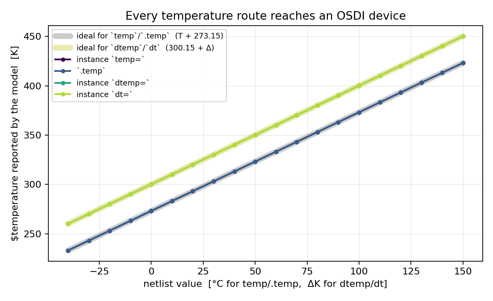
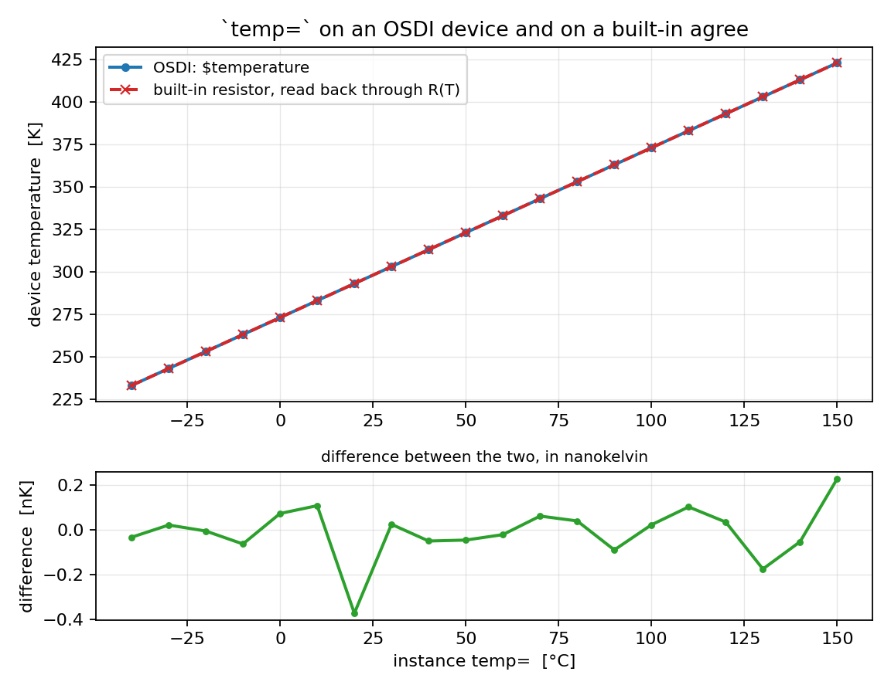
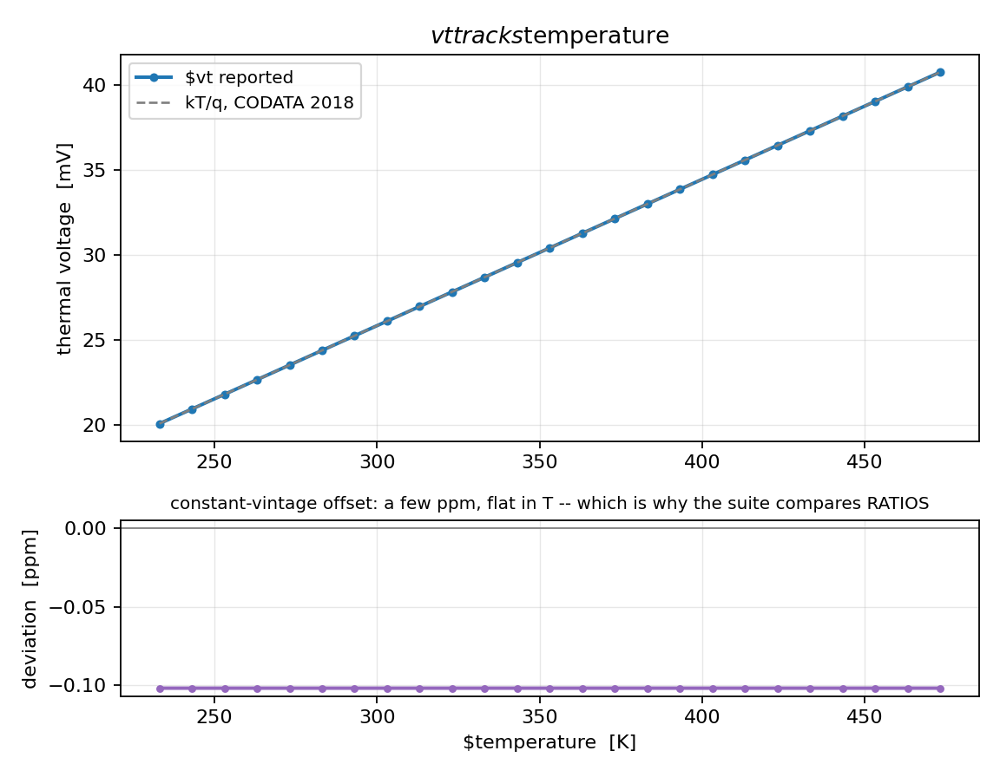
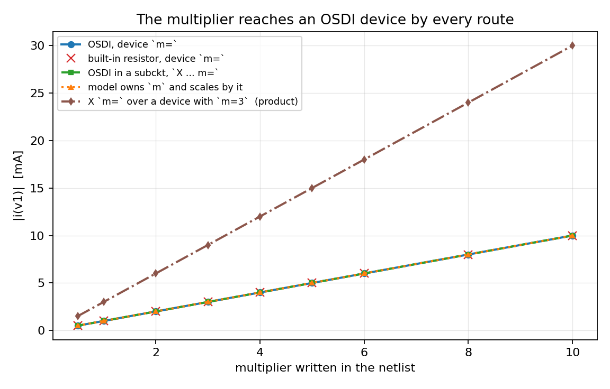
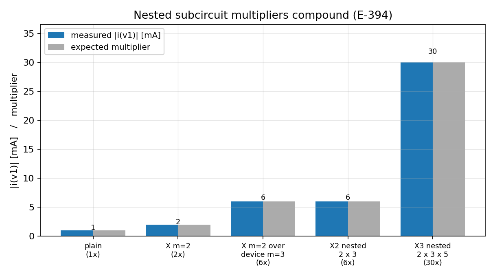
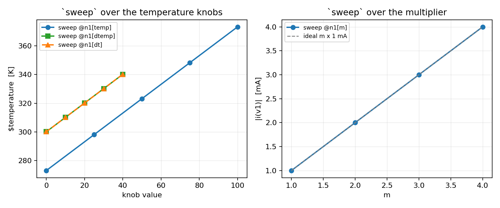
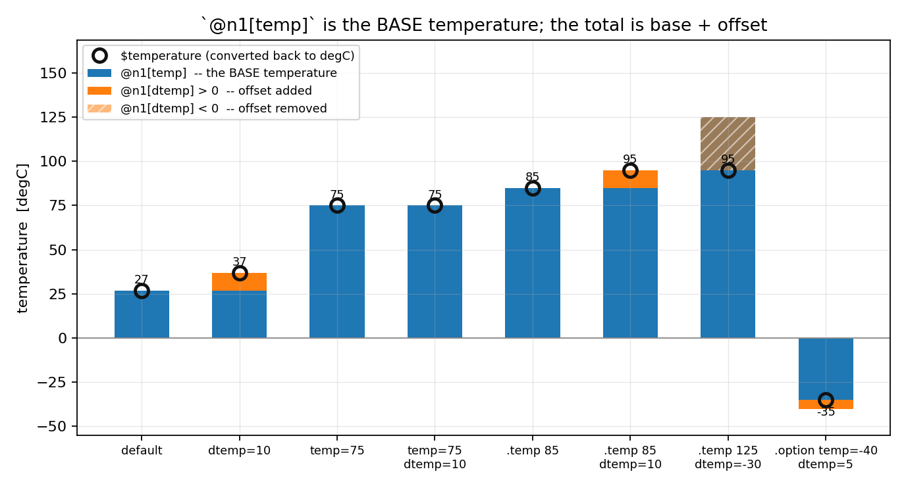

# Temperature and the multiplier in ngspice: `m`, `temp`, `dtemp`, `dt`

*How the four instance knobs ngspice supplies on top of a compact model reach an
OSDI (Verilog-A) device — and what changes when the model declares them itself.*

---

## 1. What these four are

Every SPICE device, built-in or compiled from Verilog-A, sits under four knobs
that belong to the **simulator**, not to the model:

| knob | meaning | units on the netlist |
| --- | --- | --- |
| `m` | device multiplicity — *n* identical devices in parallel | dimensionless |
| `temp` | absolute device temperature, overriding the ambient | **°C** |
| `dtemp` | temperature offset added to the ambient | **ΔK** (= Δ°C) |
| `dt` | the raw OSDI spelling of `dtemp` | **ΔK** |

They are not Verilog-A language features. A model never has to declare them —
ngspice provides them for *every* OSDI device, and a model reads the result
through the standard system functions `$mfactor`, `$temperature` and `$vt`.

The point of this note is that all four have a **routing rule** that is easy to
misread from either side. Two of them were genuinely broken until
[Enhancement-394](../../../enhancements_doc/Enhancement-394.md), and three of
them could not be read back at all until
[Enhancement-397](../../../enhancements_doc/Enhancement-397.md).

---

## 2. They are supplied by default, not on request

This is the first thing to get right, because the intuition runs the other way.

In `osdiregistry.c`, `dt` and `temp` are initialised to **synthetic parameter
ids** *before* the model's own parameters are scanned:

```c
uint32_t dt   = descr->num_params + descr->num_opvars + descr->num_terminals;
bool     has_m = false;
uint32_t temp = descr->num_params + descr->num_opvars + descr->num_terminals + 1;
```

(The `+ num_terminals` is [Enhancement-397](../../../enhancements_doc/Enhancement-397.md);
before it these sat *on top of* the terminal-current ids — see §8.)

and `osdiinit.c` registers them whenever those ids are still valid:

```c
if (entry->dt   != UINT32_MAX) { /* register "dt" and "dtemp" */ }
if (entry->temp != UINT32_MAX) { /* register "temp"           */ }
```

So the default is **present**. Scanning the model's parameters can only take
them away or redirect them:

| the Verilog-A declares | what ngspice does |
| --- | --- |
| *(nothing)* | provides `temp`, `dtemp`, `dt` and the `m` alias itself |
| `m` | `has_m = true` → registers **no** `m` alias; the model owns the name |
| `temp` | `temp = UINT32_MAX` → registers **no** `temp` |
| `dt` | `dt = UINT32_MAX` → registers **neither** `dt` nor `dtemp` |
| `dtemp` | `dt = param_id` → the loader's entries are **routed** to the model's parameter |
| `temperature` | `temp = param_id` → `temp` routed to the model's parameter |

A probe module that declares none of them still answers to all four:

```verilog
`include "disciplines.vams"
module probe(p,n);
 inout p,n; electrical p,n;
 (* desc="tdev" *) real tdev;
 analog begin
   tdev = $temperature;
   I(p,n) <+ V(p,n)*1e-3;
 end
endmodule
```

```spice
N1 a 0 mm temp=75     * -> $temperature = 348.15 K
N1 a 0 mm dtemp=10    * -> $temperature = 310.15 K
N1 a 0 mm dt=10       * -> $temperature = 310.15 K
N1 a 0 mm m=3         * -> 3x the current
```

---

## 3. Temperature: every route, and the Celsius convention

`temp` is written in **degrees Celsius** and the device works in **Kelvin**.
Every built-in adds `CONSTCtoK` in its own parameter setter — `dioparam.c` does
`DIOtemp = value->rValue + CONSTCtoK`. The OSDI path did **not**: it stored the
raw number and used it directly as the Kelvin device temperature, so `temp=75`
reached the model as `$temperature = 75` and `$vt = 6.5 mV` instead of 30 mV. On
a Verilog-A diode that is **−2.5×10¹⁶ A where the correct answer is −4.85×10⁻⁷ A**,
and `temp=0` made `$vt` exactly zero so `limexp(V/$vt)` divided by zero.
Enhancement-394 fixed it; §10 lists the checks that keep it fixed.

The four routes and where they land:



The two grey reference bands are the closed forms — `T + 273.15` for the
absolute knobs, `300.15 + Δ` for the relative ones. `temp` and `.temp` coincide
exactly; `dtemp` and `dt` are the same knob under two spellings and coincide
with each other.

### Rules that follow

- **`temp=` overrides `dtemp=`**, and says so:
  `n1: Instance temperature specified, dtemp ignored`. (A built-in resistor in
  the same situation prints nothing, so the OSDI path is the more informative
  of the two here.)
- **`.temp` and `.option temp` set the ambient**, which `dtemp`/`dt` are then
  relative to: `.temp 75` with `dtemp=10` gives 358.15 K.
- `dt` and `dtemp` are **the same parameter**. They share an id; writing both is
  writing one slot twice.
- `@n1[temp]` reports the **base** temperature, not the total — §9 gives the
  expression for the device's actual temperature.

### Against an independent thermometer

"The OSDI number moved" is not evidence. The check that matters is whether a
built-in device in the same deck sees the *same* temperature. A resistor with a
first-order tempco is a thermometer — invert

$$R(T) = R_0\,\bigl[1 + \mathrm{tc1}\,(T - T_{\text{nom}})\bigr]$$

for `T` from the measured current and compare:



The lower panel is the difference, in **nanokelvin** — it is round-off in the
resistor read-back, not a discrepancy.

### `$vt` and the constants vintage

`$vt` tracks `$temperature` exactly, but it does **not** equal a textbook
`kT/q` to the last digit:



`constants.vams` and ngspice's own `CONSTboltz`/`CHARGE` are different CODATA
vintages, so there is a **few-ppm offset that is flat in temperature**. That is
not a defect, and it is the reason the regression suite checks `$vt` by a
**ratio** — `vt(T₂)/vt(T₁) == T₂/T₁`, which holds to 1 part in 10¹² — rather
than against an absolute constant. An absolute comparison would either fail
spuriously or need a tolerance loose enough to hide a real error.

---

## 4. The multiplier, and why `m` is not `$mfactor`

`$mfactor` is a parameter OpenVAF **always** emits. ngspice exposes it under the
netlist name `_mfactor` (the `$`→`_` rewrite in `osdiinit.c`) and normally
registers an **extra alias keyword** `m` pointing at the same id:

```c
if (!has_m && !strcmp(para->name[0], "$mfactor")) {
    (*dst)[num_names] = (IFparm){.keyword = "m", .id = (int)i, ...};
}
```

`has_m` suppresses *that alias only*. So when a model declares its own `m`, what
it takes is the **netlist keyword** — `$mfactor` still exists, still defaults to
1, and is still reachable as `_mfactor`. The two are independent and they
**multiply**:

| netlist | model without its own `m` | model that declares and uses `m` |
| --- | --- | --- |
| *(nothing)* | 1× (`$mfactor`=1) | 1× (`$mfactor`=1, m=1) |
| `m=3` | 3× (`$mfactor`=3) | 3× (`$mfactor`=1, m=3) |
| `_mfactor=2` | 2× (`$mfactor`=2) | 2× (`$mfactor`=2, m=1) |
| `m=3 _mfactor=2` | **2×** — one slot, last write wins | **6×** — both apply |

The 2× in the bottom-left cell is a single parameter written twice;
[Enhancement-395](../../../enhancements_doc/Enhancement-395.md)'s duplicate-write
check reports it (*"'m' and '_mfactor' are the same parameter"*). The 6× is the
one to watch: owning `m` does not disable `$mfactor`.

**`integer m`** behaves identically — `has_m` keys on the name only — except that
`m=2.5` rounds to **3**. Declare it `real` if fractional multiplicity matters;
a plain model takes `m=2.5` as exactly 2.5×, because `$mfactor` is real.

### Every route delivers the same multiplier



Four routes lie exactly on top of one another — the OSDI device's own `m=`, the
same `m=` on a built-in resistor, `X ... m=` on an enclosing subcircuit, and a
model that owns `m` and scales by it. The fifth line is `X ... m=` applied over a
device that already carries `m=3`: the two **compound**, giving 3× the rest.

### Nesting compounds

Before Enhancement-394 the subcircuit multiplier never reached an OSDI device at
all (1× in every analysis), and nested multipliers did not compound even for
built-in devices — only the outermost `m=` survived. Both are fixed:



The multiplier applies in **every analysis**, not just DC — the regression suite
pins AC and transient at m = 1, 3 and 7 as well.

---

## 5. When the model declares one of the names

The single rule: **if the Verilog-A declares it, the model owns it.** ngspice
hands over the netlist value and applies nothing of its own — for all four names.

```verilog
// the CMC convention: declare `m` AND scale by it
(*type="instance"*) parameter real m = 1.0;
analog I(p,n) <+ m * V(p,n) * g;
```

With that model, `X1 a 0 sub m=3` gives exactly 3× and `$mfactor` stays **1** —
there is no double application in either direction. The same model that declares
`m` and then *ignores* it gets 1×, and the multiplier is lost. That is the
model's bug, not the simulator's, and it is worth stating plainly because it is
the trap that produces a plausible-looking false alarm: a probe module written to
test the multiplier, declaring `m` without using it, looks exactly like "the
subcircuit multiplier is silently defeated". It is not.

The same applies to temperature. A model declaring `dtemp` receives the netlist
value in its own parameter and must add it itself:

```verilog
(*type="instance"*) parameter real dtemp = 0.0;
analog begin
  Teff = $temperature + dtemp;   // ngspice did NOT add it
  ...
end
```

`$temperature` stays at the ambient in that case; `dtemp=10` and `dt=10` both
deliver 10 to the model's parameter, and the effective temperature is whatever
the model makes of it.

### Why this is not reported as a collision

`dtemp` is a conventional CMC instance parameter — PSP 103/104, MEXTRAM 504/505,
VBIC, BSIM-BULK/CMG/IMG/SOI, HiSIM 2/HV/SOI/SOTB, L-UTSOI, EKV, MVSG, ASM-HEMT,
JUNCAP200 and r2/r3_cmc all declare it. Because the loader *routes* its built-in
to the model's parameter, both `IFparm` entries carry the **same id** and nothing
is unreachable. A keyword-only collision check flagged all of them —
[Enhancement-396](../../../enhancements_doc/Enhancement-396.md) made the check
compare ids, which is what distinguishes a deliberate routing from a genuine
`GAIN`/`gain` clash where one value really does become unreachable.

---

## 6. Subcircuits

- **`.temp` propagates** into subcircuits and through nesting — a device three
  levels down sees the ambient.
- **`X1 ... temp=75` does not work** — and it does not work for a built-in device
  either. An `X` line binds **subcircuit parameters**, not device parameters.
  This is core ngspice semantics, not an OSDI shortcoming.
- The working idiom is a subcircuit parameter **forwarded** to the device:

```spice
.subckt s p n dtemp=0
N1 p n mm dtemp={dtemp}
.ends
X1 a 0 s dtemp=50        * -> $temperature = 350.15 K
```

- The **multiplier** is the exception: `X1 a 0 s m=3` *is* meaningful, because
  ngspice's expansion appends ` m={m}` to each device line inside the
  subcircuit. That is what makes the multiplier compound across nesting levels.

---

## 7. Sweeping these knobs

The `sweep` command ([Enhancement-146](../../../enhancements_doc/Enhancement-146.md))
steps any knob and records an output. All four work directly:

```spice
sweep @n1[temp]  0 100 25 -analysis op -output tdev=@n1[tdev]
sweep @n1[dtemp] 0 40 10  -analysis op -output tdev=@n1[tdev]
sweep @n1[m]     1 4 1    -analysis op -output ii=i(v1)
```



Two practical notes:

- **Do not give the output the same name as the knob.** ngspice lowercases
  identifiers, so `sweep TT ... -output tt=...` collides and `print tt` shows the
  sweep *scale* instead of the recorded output.
- Sweeping `temp`, `dtemp` or `dt` used to leave a trailing
  `Error: no such parameter temp.` after the run completed — the swept data was
  complete and correct, but a diagnostic that fires on success reads as a
  failure, and it did mislead. Enhancement-397 removed it; see §8.

If you would rather drive them symbolically, sweep a `.param` that feeds the
instance line; this works for all four:

```spice
.param TSET=27
N1 a 0 mm temp={TSET}
...
sweep TSET 0 100 25 -analysis op -output tdev=@n1[tdev]
```

---

## 8. Reading the knobs back

Until [Enhancement-397](../../../enhancements_doc/Enhancement-397.md), ngspice's
own `temp`, `dtemp` and `dt` entries were registered `IF_SET` with no `IF_ASK` —
they could be written and never read. `print @n1[temp]` answered *"no such
parameter"* where every built-in reports one, `show n1` listed none of the three,
and a `sweep` over them ended with a spurious error **after** completing
correctly.

All three are readable now, and they match the built-in convention exactly:

| netlist | `@…[temp]` | `@…[dtemp]` |
| --- | --- | --- |
| *(nothing)* | 27 — the ambient | 0 |
| `temp=75` | 75 | 0 |
| `dtemp=10` | 27 | 10 |
| `.temp 85` | 85 — follows the ambient | 0 |
| `.temp 85` + `dtemp=10` | 85, **not** 95 | 10 |
| `temp=75 dtemp=10` | 75 | **0** |

`temp` is the **base** temperature in **degrees Celsius**; it never includes
`dtemp`. The last row is the one behaviour change that came with the fix: `temp=`
overrides `dtemp=`, and `restemp.c` does not merely say so but forces
`RESdtemp = 0`. That was invisible while `dtemp` could not be read; now that it
can, the offset is cleared so that what is reported is what is used. The device
temperature is unchanged — `temp=75 dtemp=10` is 348.15 K before and after.

### Why this needed more than an `IF_ASK` flag

The synthesized ids **collided**. `dt` was allocated at
`num_params + num_opvars`, which is exactly the base
[Enhancement-394](../../../enhancements_doc/Enhancement-394.md) gives the
synthesized terminal currents — so **`dt`'s id was terminal 0's id**, and
`temp`'s was terminal 1's. That was survivable only because the two groups were
disjoint by *direction*: the temperature knobs were set-only and the terminal
currents ask-only, so no lookup ever had to choose. Adding `IF_ASK` on top would
have made `@n1[temp]` return a terminal current — a wrong number where there had
at least been an honest error. The ids now sit **above** the terminal range,
which makes the three spaces disjoint.

A model that declares `dtemp` or `temperature` itself is unaffected: the loader
routes its entry to that model parameter, whose id is below the synthesized
range, so it is served by the ordinary readable-parameter path.

---

## 9. Reading the device's *actual* temperature

`@n1[temp]` is the **base** temperature, not the total. It answers "what ambient
is this device sitting at, or what did the instance override it to" — never
"what temperature is it running at." The same is true of a built-in resistor;
this is not an OSDI quirk.

To get the total, add the offset:

```spice
let tdev_c = @n1[temp] + @n1[dtemp]          $ degrees Celsius
let tdev_k = @n1[temp] + @n1[dtemp] + 273.15 $ kelvin, == $temperature
```

That identity is **exact in every case**, verified against `$temperature` to
1e-9 across the matrix below:

| netlist | `@n1[temp]` | `@n1[dtemp]` | sum + 273.15 | `$temperature` |
| --- | --- | --- | --- | --- |
| *(default)* | 27 | 0 | 300.15 | 300.15 |
| `dtemp=10` | 27 | 10 | 310.15 | 310.15 |
| `dt=25` | 27 | 25 | 325.15 | 325.15 |
| `temp=75` | 75 | 0 | 348.15 | 348.15 |
| `temp=75 dtemp=10` | 75 | **0** | 348.15 | 348.15 |
| `.temp 85` | 85 | 0 | 358.15 | 358.15 |
| `.temp 85` + `dtemp=10` | 85 | 10 | 368.15 | 368.15 |
| `.temp 85` + `temp=75 dtemp=10` | 75 | **0** | 348.15 | 348.15 |
| `.option temp=-40` + `dtemp=5` | −40 | 5 | 238.15 | 238.15 |
| `.temp 125` + `dtemp=-30` | 125 | −30 | 368.15 | 368.15 |



The marker is the device's actual temperature and the stack is `temp + dtemp`;
the marker landing on top of the stack *is* the identity. A negative offset is
hatched, because a bar that spans downward from the base would otherwise read as
though it had been added.

### Why one formula covers two different rules

The two branches are not the same operation:

- **no instance `temp=`** — `@n1[temp]` is the ambient and `@n1[dtemp]` is a
  genuine offset. They add.
- **instance `temp=` given** — that is an **override**, not a base to offset
  from. `dtemp` is discarded, and `@n1[dtemp]` reads **0**, so the sum collapses
  to `temp` alone, which is the right answer.

So the formula works across both only because the discarded offset *reports as
zero*. Before [Enhancement-397](../../../enhancements_doc/Enhancement-397.md)
cleared it — matching what `restemp.c` has always done — `temp=75 dtemp=10`
reported `dtemp=10`, and this expression would have given **358.15 K for a
device actually running at 348.15 K**. That consequence was not designed in; it
fell out of matching the built-in, and it is the strongest practical argument
for having matched it.

### Two caveats

- **Units.** `@n1[temp]` is in °C and `@n1[dtemp]` in ΔK, so the sum is °C. Add
  273.15 for kelvin, which is what `$temperature` reports.
- **This describes the simulator's knobs, not necessarily the model's final
  temperature.** If the Verilog-A declares its own `temp`, `dtemp`, `dt` or
  `temperature`, it owns that name and applies whatever it likes — a
  self-heating model adds a thermal node's rise on top of all of this. The sum
  then tells you what ngspice *handed* the device, and only the model can tell
  you the rest. If it exposes `$temperature` as an operating-point variable,
  that reading is authoritative.

ngspice does not expose the effective temperature as a knob of its own, and
neither do built-in devices — which is why this note gives you the expression
rather than a parameter name.

## 10. What is pinned, and where

`examples/instknobs_examples/verify_instknobs.py` — 127 checks, in the regression
suite. It covers the multiplier by every route (device, subcircuit, nested,
compounded, AC and transient, fractional, zero, 1000), temperature by every route
against the built-in thermometer, `$vt` by the ratio test, the `m`/`$mfactor`
independence including the 6× case, the integer rounding, subcircuit propagation
and forwarding, the model-owns-it rule in both directions, and the read-back of
all four knobs against a built-in resistor in the same deck — including the
`temp=` override clearing `dtemp`, which is what makes the §9 identity hold.

Related notes and enhancements:

- [Enhancement-394](../../../enhancements_doc/Enhancement-394.md) — the
  subcircuit multiplier and the Celsius→Kelvin conversion
- [Enhancement-395](../../../enhancements_doc/Enhancement-395.md) — the
  duplicate-write check that reports `m` and `_mfactor` set together
- [Enhancement-396](../../../enhancements_doc/Enhancement-396.md) — the id-aware
  collision check, and the withdrawn `m` finding
- [Enhancement-146](../../../enhancements_doc/Enhancement-146.md) — the `sweep`
  command
- [ngspice_osdi_bypass.md](ngspice_osdi_bypass.md) — the OSDI evaluation path

---

## Reproducing the figures

```bash
python3 docs/internals/ngspice_internals/make_temperature_figs.py
```

Every figure in this note is produced by that script from simulations run at
build time — the Verilog-A probe is compiled with `openvaf-r`, driven through the
netlist forms described above, and plotted against the closed form or against a
built-in device in the same deck. Nothing here is sketched.
