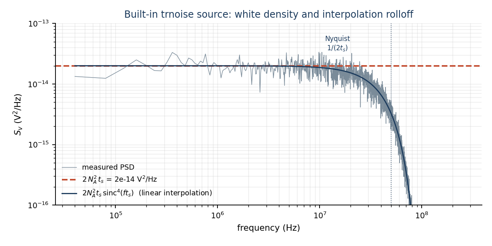
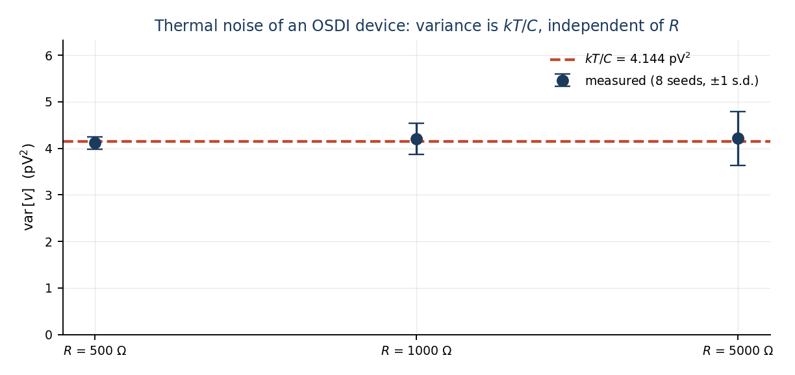
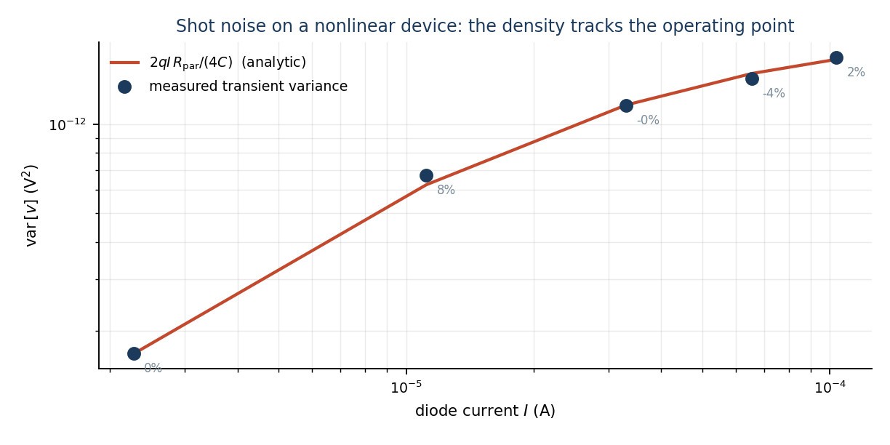
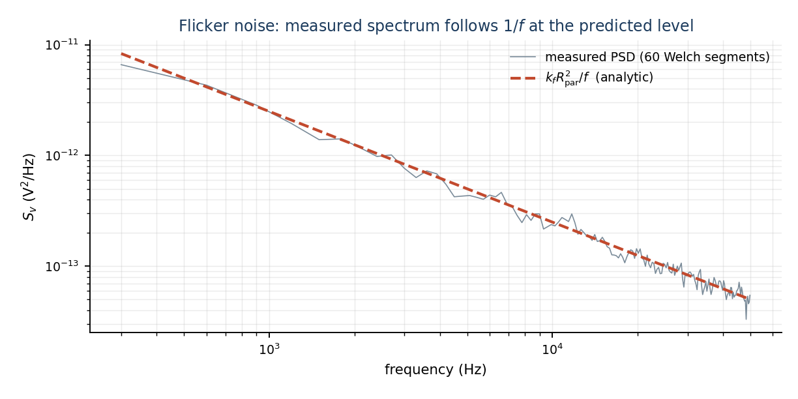

# Transient Noise in ngspice — built-in sources and OSDI (Verilog-A) devices

Small-signal `.noise` linearises about an operating point and reports spectral
densities. That is the right tool for an amplifier's input-referred noise, and
the wrong tool for anything where the noise itself changes the trajectory:
jitter, noise-induced switching, comparator metastability, an oscillator's phase
noise. Those need the noise present **in the time domain**, inside the Newton
loop, so that the circuit responds to it.

This note describes how ngspice does that — the built-in `trnoise` sources it has
had for years, and the OSDI path added by
[Enhancement-364](../../../enhancements_doc/Enhancement-364.md) that makes
Verilog-A devices noisy in `.tran`. It then derives the amplitude law from the
generator's structure and checks it against closed-form results.

Everything quoted below is measured, not asserted. The figures are produced by
[`make_trnoise_figs.py`](make_trnoise_figs.py), which writes the Verilog-A,
compiles it with `openvaf-r`, runs ngspice and plots the result against the
analytic curve.

---

## 1. What is and is not a noise source in `.tran`

This is the first thing that surprises people, and it is worth stating plainly
before any formula:

| element | noisy in `.noise` | noisy in `.tran` |
| --- | --- | --- |
| built-in resistor `R` | **yes** (4kT/R) | **no** |
| built-in diode / BJT / MOS | **yes** | **no** |
| independent source with `trnoise(...)` | no (it is a source) | **yes** |
| OSDI device with `white_noise`/`flicker_noise` | **yes** | **yes**, since E-364 |

A plain `R` contributes thermal noise to a `.noise` sweep and contributes
**nothing** to a transient. That is not an oversight to route around; it is what
makes transient noise affordable, since otherwise every resistor in a netlist
would need its own random stream. It does mean that a transient measurement and
a `.noise` measurement of the *same circuit* are only comparable when the
resistors are either noiseless in both or negligible in both — a trap that
section 6 shows biting a real measurement.

Verified directly. The circuit below has a 1 kΩ resistor and a 1 nF capacitor; if
the resistor were noisy the variance across `C` would be $kT/C$ = 4.14 pV²:

```
builtin resistor is noiseless in tran
V1 in 0 dc 0
R1 in mid 1k
C1 mid 0 1n
Vn nz 0 dc 0 trnoise(0 1e-8 0 0)      $ activates transient noise
Rz nz 0 1k
.control
tran 1e-8 200u 0 1e-8
let ac_ = v(mid) - mean(v(mid))
let mv = mean(ac_*ac_)
echo VAR $&mv
.endc
.end
```

    measured var[v(mid)] = 0.000e+00      kT/C = 4.144e-12

Exactly zero — not "small". The node is driven only by the deterministic DC
solution.

## 2. The generator: a fixed grid, not the timestep

The one thing a transient-noise implementation must not do is scale the noise
sample by the **adaptive** timestep. A white source of density $S$ sampled at
interval $\Delta t$ has per-sample deviation $\sqrt{S/(2\Delta t)}$. If
$\Delta t$ is the LTE-controlled simulation step, then every time the integrator
changes step the injected power changes, and the resulting spectrum is an
artefact of the step controller rather than a property of the circuit.

ngspice avoids this with a **fixed noise grid**. `struct trnoise_state`
(`src/include/ngspice/1-f-code.h`) holds a sequence sampled at a period `TS` that
the user chooses, independent of the simulation step:

```c
struct trnoise_state {
    double points[TRNOISE_STATE_MEM_LEN];
    size_t top;
    double NA, TS, NAMP, NALPHA, RTSAM, RTSCAPT, RTSEMT;
    double *oneof;              /* pre-computed 1/f sequence, if NALPHA > 0 */
    size_t oneof_length;
    ...
};
```

`NA` is the white amplitude, `NAMP`/`NALPHA` the 1/f amplitude and exponent, and
the `RTS*` parameters describe a random-telegraph burst. Samples are produced two
at a time (`rgauss` returns a pair) by `trnoise_state_gen`, and any timepoint is
served by `trnoise_state_get`, which generates forward until the requested index
exists.

### Interpolation between grid points

The device load functions do not hold the sample constant across a grid
interval; they interpolate **linearly** (`src/spicelib/devices/isrc/isrcload.c`):

```c
size_t n1 = (size_t)floor(time / TS);
double V1 = trnoise_state_get(state, ckt, n1);
double V2 = trnoise_state_get(state, ckt, n1 + 1);
value = V1 + (V2 - V1) * (time / TS - (double)n1);
```

This has a spectral consequence that is worth deriving, because it is visible in
every measurement. The continuous waveform is

$$x(t) = \sum_k V_k \, \Lambda\!\left(\frac{t}{t_s} - k\right)$$

with $\Lambda$ the unit triangle of half-width $t_s$ and $V_k$ i.i.d. of variance
$N_A^2$. For a pulse-amplitude-modulated process with pulse $h$,
$S_x(f) = \frac{\sigma^2}{t_s}|H(f)|^2$, and the triangle has
$H(f) = t_s\,\mathrm{sinc}^2(f t_s)$. Hence the **one-sided** density is

$$\boxed{\;S_x(f) = 2\,N_A^2\,t_s\;\mathrm{sinc}^4(f\,t_s)\;}$$

which is flat at $2N_A^2 t_s$ for $f \ll 1/t_s$ and rolls off into Nyquist.



Measured with $N_A$ = 1 mV, $t_s$ = 10 ns, over a band of 990 bins well below
Nyquist:

| quantity | measured | theory | ratio |
| --- | --- | --- | --- |
| $S_x$ (flat region) | 1.929e-14 V²/Hz | $2N_A^2t_s$ = 2.0e-14 | **0.965 ± 0.030** |

The measured curve follows the $\mathrm{sinc}^4$ prediction through the entire
rolloff, which is a stronger statement than matching the flat level: it confirms
the interpolation model, not just the amplitude.

One consequence to be aware of when reading a raw waveform: because interpolation
fills in between grid points, the **variance of the sampled waveform is not**
$N_A^2$. Integrating the density above gives $\tfrac{2}{3}N_A^2$ in the limit of
dense sampling, and the simulator's own timepoints give something between that
and $N_A^2$ depending on how they fall relative to the grid — measured
0.740 ± 0.003 here. The **density** is the well-defined quantity; the raw sample
variance depends on where the timepoints land.

## 3. The OSDI path

A Verilog-A noise contribution reaches the simulator as a parametric description
that the compiler emits and, before E-364, nothing read:

```c
descr->noise_source_type[i]   /* NOISE_TYPE_WHITE / _FLICKER / _TABLE     */
descr->load_noise_params()    /* per-source `power` and `exponent`,       */
                              /*   S(f) = power / f^exponent, at the      */
                              /*   CURRENT bias                           */
descr->noise_sources[i].nodes /* the node pair the source injects between */
descr->noise_sources[i].name  /* the correlation group (LRM 4.6.4)        */
```

so transient noise for OSDI devices is a pure simulator-side feature: no ABI
change and no compiler change. `osdi_trnoise_stamp` (`src/osdi/osditrnoise.c`) is
called from the OSDI load path and adds a current between the source's nodes.

**Activation is automatic.** Transient noise turns on when the deck already
contains at least one `trnoise` independent source, and adopts that source's
`TS`. The rationale is that such a deck is already running a noisy transient, and
its OSDI devices were the only silent components in it. It is deliberately *not*
keyed on "this device declares noise sources", because essentially every real
compact model (BSIM, HICUM, MEXTRAM…) declares thermal and flicker noise, so that
test would be equivalent to "always on" — making every existing transient result
stochastic and costing convergence for a feature the deck never asked for. A deck
with no transient-noise source is bit-identical to before.

**Bias dependence.** Device noise is not stationary: shot noise follows the
current, flicker follows $I^{AF}$. `power` is therefore re-read **every
timepoint** and the generator produces a unit-variance sequence that is scaled at
load time. This is the standard quasi-stationary approximation — it assumes the
operating point moves slowly compared with $t_s$, which is also the assumption
that makes $t_s$ meaningful.

**Correlation.** Verilog-A expresses perfectly correlated sources by giving them
the same name (LRM 4.6.4). Correlated sources must therefore share one random
stream rather than draw independently, so streams are keyed on the source
**name**, not its index. `power` may be negative — OpenVAF folds the contribution
factor as $\mathrm{fac}\cdot|\mathrm{fac}|$ so the sign carries direction
([Enhancement-42](../../../enhancements_doc/Enhancement-42.md)) — and that sign is
applied to the amplitude so correlated sources add coherently.

**Scope.** `white_noise()` and `flicker_noise()` are injected. `noise_table()` is
**not**: a tabulated spectrum needs arbitrary frequency *shaping* rather than a
scalar amplitude, which neither generator can express. It is skipped with a
warning and remains fully accounted for in `.noise`.

## 4. The amplitude law, derived

ngspice's 1/f generator is Kasdin's fractional-noise method: white noise of
deviation $Q$ filtered by the FIR

$$h_k = h_{k-1}\frac{\alpha/2 + k - 1}{k}, \qquad H(z) = (1-z^{-1})^{-\alpha/2}$$

so that $|H(e^{j\omega})|^2 = (2\sin(\omega/2))^{-\alpha} \to (2\pi f t_s)^{-\alpha}$
well below Nyquist. Combining with the discrete-white result of section 2, the
generator delivers

$$S(f) = 2Q^2 t_s\,(2\pi f t_s)^{-\alpha}.$$

The model asks for $S(f) = |power| / f^{\alpha}$. Equating the two and solving:

$$\boxed{\;Q = \sqrt{\dfrac{|power|\;(2\pi t_s)^{\alpha}}{2\,t_s}}\;}$$

which is exactly the line in `osdi_trnoise_stamp`:

```c
double alpha = (descr->noise_source_type &&
                descr->noise_source_type[i] == NOISE_TYPE_FLICKER)
                   ? ((exponent[i] > 0.0) ? exponent[i] : 1.0) : 0.0;
amp = sqrt(fabs(power[i]) * pow(2.0 * M_PI * ts, alpha) / (2.0 * ts));
```

Two properties matter. **$\alpha = 0$ collapses to $\sqrt{|power|/(2t_s)}$**, the
white case, so both kinds share one expression. And **neither depends on the run
length**, which is what makes results reproducible across `tstop`.

This law was *derived*, not fitted, and the derivation is what caught the
original bug: before it, the white amplitude $\sqrt{power/(2t_s)}$ was being used
for flicker too, which is wrong by $\sqrt{1/(2 t_s \pi)}$ — a factor of 399 at
$t_s$ = 1 µs. The measurement returned 397× and 396×, close enough to the
predicted 398.9× to confirm the derivation rather than invite a fudge factor.

## 5. Linear device: thermal noise, and why $kT/C$ is the strongest test

```verilog
`include "disciplines.vams"
module valin(p, n);
  inout p, n;
  electrical p, n;
  parameter real r = 1e3 from (0:inf);
  parameter real c = 1e-9 from [0:inf);
  analog begin
    I(p, n) <+ V(p, n) / r;
    I(p, n) <+ ddt(c * V(p, n));
    I(p, n) <+ white_noise(4.0 * 1.3806488e-23 * $temperature / r, "thermal");
  end
endmodule
```

A white current source of density $4kT/R$ across a parallel $RC$ gives

$$\mathrm{var}[v] = \int_0^\infty \frac{4kT}{R}\,\frac{R^2}{1+(2\pi f R C)^2}\,df
 = 4kTR \cdot \frac{1}{4RC} = \frac{kT}{C}.$$

**$R$ cancels.** That is what makes this the strongest available check: it is
parameter-free, so sweeping $R$ over a decade and recovering the same variance
tests the amplitude law rather than a coincidence of one parameter set. The deck
uses a 1 GΩ series element so the VA device is the only resistance at the node
(section 1: the built-in resistor would not contribute anyway, but this keeps the
loading negligible too).



Eight seeds per point, $C$ = 1 nF, $kT/C$ = 4.144 pV²:

| $R$ | measured var | ratio to $kT/C$ |
| --- | --- | --- |
| 500 Ω | 4.181e-12 V² | **1.009 ± 0.043** |
| 1 kΩ | 4.143e-12 V² | **1.000 ± 0.068** |
| 5 kΩ | 4.275e-12 V² | **1.032 ± 0.095** |

The variance is flat across a 10× change in $R$, as the identity requires.

## 6. Nonlinear device: shot noise must track the bias

Thermal noise of a fixed resistor is a constant, so matching it only proves the
amplitude scaling. Shot noise is $S_i = 2qI$ — it follows the operating point, so
it also proves that `load_noise_params` is re-read at the current bias each
timepoint rather than latched once at the DC solution.

```verilog
`include "disciplines.vams"
module vadio(a, c);
  inout a, c;
  electrical a, c;
  parameter real is = 1e-14 from (0:inf);
  parameter real nf  = 1.0   from (0:inf);
  real vt, id;
  analog begin
    vt = 1.3806488e-23 * $temperature / 1.602176565e-19;
    id = is * (exp(V(a, c) / (nf * vt)) - 1.0);
    I(a, c) <+ id;
    I(a, c) <+ white_noise(2.0 * 1.602176565e-19 * abs(id), "shot");
  end
endmodule
```

For each bias the oracle is built from the diode's **own** operating point as
reported by ngspice — $r_d = n_f V_T / I$, $R_{\rm par} = r_d \,\|\, R_{\rm ext}$,
and the same integral as above:

$$\mathrm{var}[v] = 2qI\,\frac{R_{\rm par}}{4C}.$$



Eight seeds per bias, $R_{\rm ext}$ = 1 kΩ, $C$ = 1 nF:

| $V_{\rm bias}$ | $I$ | $r_d$ | measured var | analytic | ratio |
| --- | --- | --- | --- | --- | --- |
| 0.50 V | 2.276 µA | 11.36 kΩ | 1.705e-13 | 1.676e-13 | **1.018 ± 0.070** |
| 0.60 V | 33.06 µA | 782 Ω | 1.140e-12 | 1.163e-12 | **0.980 ± 0.025** |
| 0.65 V | 65.42 µA | 395 Ω | 1.421e-12 | 1.485e-12 | **0.957 ± 0.038** |
| 0.70 V | 103.5 µA | 250 Ω | 1.619e-12 | 1.658e-12 | **0.976 ± 0.017** |

The current spans **45×** and $r_d$ spans **45×** in the opposite direction; the
agreement holds throughout. A latched-at-DC implementation would track the first
row and drift on the rest.

The same sweep is available as a committed script,
[`examples/trnoise_examples/validate/psd_shot.py`](../../../examples/trnoise_examples/validate/psd_shot.py),
which reports per-bias deviations of 2.3 %, 1.7 %, 1.0 % and 3.6 %.

## 7. Flicker noise — and a measurement trap worth documenting

```verilog
`include "disciplines.vams"
module vaflick(p, n);
  inout p, n;
  electrical p, n;
  parameter real r  = 1e3   from (0:inf);
  parameter real kf = 1e-20 from [0:inf);
  analog begin
    I(p, n) <+ V(p, n) / r;
    I(p, n) <+ flicker_noise(kf, 1.0, "fl");   // S_i(f) = kf / f
  end
endmodule
```

With no capacitor the node impedance is a pure resistance, so
$S_v(f) = k_f R_{\rm par}^2 / f$ exactly — no pole to correct for.



Measured against `.noise` on the same circuit (two independent code paths), 60
Welch segments over 153 bins:

| quantity | result |
| --- | --- |
| mean ratio transient / `.noise` | **0.9737 ± 0.0107** |
| fitted PSD slope | **−1.036** (ideal −1) |

### The trap

A first attempt at this measurement used $R = 1\,\mathrm{k}\Omega$ instead of
1 MΩ and reported the flicker level **38 % low**, consistently, across seeds —
looking every bit like a real defect. It was not. Two things were wrong, and both
are easy to repeat:

1. **The reference was contaminated.** In `.noise`, the external 1 kΩ resistor
   contributes $4kT/R_s$, which at that impedance is *larger* than the flicker
   term. The `.noise` output was $6.644\times10^{-18}$ V²/Hz at 1 kHz, of which
   $4.144\times10^{-18}$ is the resistor and only $2.50\times10^{-18}$ is flicker
   — and the resistor contributes **nothing** to the transient (section 1). The
   decomposition checks exactly: $6.644 - 4.144 = 2.500$, and
   $k_f R_{\rm par}^2/f = 2.50\times10^{-18}$ at 1 kHz.
2. **The estimator was biased by the topology.** At low impedance the flicker
   term is shallow against the floor, and windowing leakage flattens the measured
   slope (fitted −0.958 rather than −1). Evaluating that fit at the *edge* of the
   fit band then reads low.

At 1 MΩ the flicker term dominates the resistor's thermal contribution by ~6000×,
both problems vanish, and the ratio is 0.974. The lesson is general: **compare a
transient measurement with `.noise` only in a regime where the noise you are
measuring dominates the sources the two analyses treat differently.**

## 8. Cross-check against `.noise`

The sharpest end-to-end test compares **variances** rather than a single band,
because integrating the `.noise` spectrum uses every data point from both
analyses and avoids the narrow-band scatter discussed in section 9:

```
noise v(mid) V1 dec 50 1e2 1e9     →  integrate S_v df  →  4.143e-12 V²
tran 1e-8 600u 0 1e-8              →  var[v(mid)]       →  4.113e-12 V²
```

| quantity | value |
| --- | --- |
| variance from integrating `.noise` | 4.143e-12 V² |
| variance measured in `.tran` (8 seeds) | 4.113e-12 ± 2.2e-13 V² |
| ratio | **0.993 ± 0.052** |
| $kT/C$ (independent closed form) | 4.144e-12 V² |

Three independent routes — a frequency-domain small-signal analysis, a
time-domain stochastic simulation, and a closed-form thermodynamic identity —
agree to well within the statistical error.

## 9. How to measure this correctly

A Welch PSD estimate is unbiased, but its relative scatter over a band of $M$
bins averaged over $S$ segments is $\approx 1/\sqrt{MS}$. Checked against a
synthetic i.i.d. sequence of *known* density (2e-14 V²/Hz):

| band | bins | estimate |
| --- | --- | --- |
| wide, high-frequency | ~1000 | 1.96–2.01e-14 (±2 %) |
| narrow, low-frequency | ~10 | 1.53–2.46e-14 (±25 %) |

Reading an amplitude off a narrow band therefore says more about the estimator
than about the simulator. The practical rules used throughout this note:

- **Amplitude → variance.** It integrates every bin and is tight. Average over
  independent seeds (`setseed`) and quote a standard deviation.
- **Shape → PSD.** Flatness and the 1/f slope are robust to bin scatter.
- **Flicker is the exception.** A 1/f process has no stationary variance (it
  depends on the run length), so its level must come from a wide-band fit or a
  matched comparison against `.noise`.
- **Validate the instrument first.** Every clean result in this note was
  preceded by running the estimator on a signal whose answer was already known.

## 10. Practical notes

**Choosing $t_s$.** It sets the noise bandwidth: content exists up to
$1/(2t_s)$, shaped by $\mathrm{sinc}^4$. Choose it a few times faster than the
fastest circuit time constant you care about, and no faster — halving $t_s$
doubles the sample count and, for flicker, the memory.

**Memory.** A 1/f generator pre-computes its whole sequence for the run
(`f_alpha` is called once with `CKTfinalTime/TS` points), costing ~8 bytes per
source per instance per noise timestep. White sources stream and cost nothing.
A long transient with many flicker sources is the case to watch.

**Timestep.** Use a maximum-step argument (`tran <step> <stop> 0 <step>`).
Without it the integrator will happily take steps far longer than $t_s$ through
quiet intervals and alias the noise.

**t = 0.** No noise is injected at $t = 0$; the operating point must be the
deterministic DC solution, or the starting point of every run would move.

**Reproducibility — `setseed` fixes the transient-noise stream**
([E-374](../../../enhancements_doc/Enhancement-374.md)). This note has said both
things: it originally claimed `setseed` worked here, a correctness sweep showed it
did not, and the enhancement that followed made it true.

The bug was worth recording. `#define WaGauss` selects the Wallace normal
generator, whose `initw()` runs at **startup** and did `srand(getpid())` before
filling its pools. A later `setseed` reset the Tausworthe state but could not
refill pools that were already built, so samples kept coming from the
process-id-derived stream: two identical decks with `setseed 42` produced
*different* noise waveforms, while `setseed 42` followed by `rnd(100)` reproduced
exactly — the command worked, just not for this generator. The fix has three parts,
because moving the seeding alone is not enough: `initw()` no longer calls `srand`
(so it cannot clobber a user seed), the two startup sites do it themselves (so an
unseeded run stays random per process), and `com_sseed` now rebuilds the pools
rather than resetting state nothing reads.

The seed-averaged statistics quoted above were never invalidated by this — they
were means over genuinely independent runs, which is what the error bars describe.
What changed is that those runs were independent *by accident* before, and are now
independent *by seeding*: an individual figure here is reproducible bit-for-bit
with the same `setseed`.

## 11. Known limits

- `noise_table()` is not injected in transient (warned, and still correct in
  `.noise`).
- Built-in devices remain noiseless in `.tran`; only `trnoise` sources and OSDI
  devices inject. Model a noisy passive as an OSDI device if you need it.
- The quasi-stationary approximation assumes the bias moves slowly compared with
  $t_s$. A circuit slewing significantly within one noise interval is outside
  what this scheme represents.
- Under `USE_OMP` the OSDI evaluation path has known thread-safety problems
  affecting `@(initial_step)` and `$strobe`; the shipped binary is built without
  it.

---

## Reproducing everything here

```bash
python3 docs/internals/ngspice_internals/make_trnoise_figs.py
python3 examples/trnoise_examples/verify_trnoise.py
python3 examples/trnoise_examples/validate/psd_shot.py
python3 examples/trnoise_examples/validate/psd_flicker.py
```

The first regenerates all four figures (pass `white`, `ktc`, `shot` or `flicker`
to do just one). The second is the fast regression check. The last two are the
statistical measurements that established the amplitude law; they take minutes
and need numpy.

## References

- [Enhancement-364](../../../enhancements_doc/Enhancement-364.md) — transient
  noise for OSDI devices
- [Enhancement-42](../../../enhancements_doc/Enhancement-42.md) — correlated
  noise sources and the sign convention
- `src/frontend/trannoise/1-f-code.c` — `f_alpha`, `trnoise_state_gen`
- `src/osdi/osditrnoise.c` — the OSDI injection path
- N. J. Kasdin, "Discrete simulation of colored noise and stochastic processes
  and 1/f^α power law noise generation", *Proc. IEEE* 83(5), 1995
