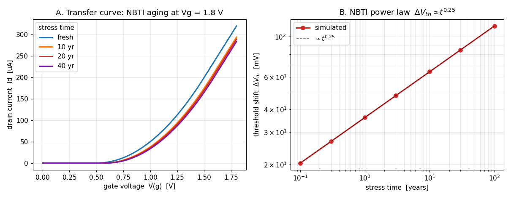

# Enhancement-157 — Device aging (reliability degradation flow)

Reliability sign-off asks a question SPICE could not previously answer: *how does
this circuit behave after ten years of operation?* Transistors degrade under
stress — hot-carrier injection (HCI), negative-bias temperature instability
(NBTI), oxide breakdown (TDDB) — shifting thresholds and mobilities over the
product lifetime. The industry flow is **stress → degrade → re-simulate**: run
the circuit to measure each device's stress, age the device parameters, then
re-simulate the aged circuit and compare against fresh. This enhancement adds
that flow as a new `aging` command. It closes the "Device aging (HCI / NBTI /
TDDB)" and "stress → degrade → re-simulate (fresh/aged)" gaps in the reliability
row of `ngspice_gaps.md`.

## What changed

A new command:

```
aging <t_target> [rate <opvar>] [param <ageparam>] [dynamic <tstop> [tstep]] [verbose]
```

`aging` finds every aging-capable device in the loaded circuit, computes how much
each has degraded after `t_target` seconds of operation, writes that back into
the device, and **re-stamps the circuit** — so any analysis run afterwards (`op`,
`dc`, `tran`, `ac`, …) sees the aged devices. It runs the fresh stress
simulation first, leaving it as the current plot: a convenient "fresh" baseline.

## The aging contract (model-agnostic)

The command owns no device physics. A device opts in purely by exposing two names
in its Verilog-A / OSDI model:

- a **degradation-rate operating-point variable** (default `agerate`) — the
  instantaneous stress rate at the present bias, in *dose units per second*, and
- a **per-instance age parameter** (default `age`, `(*type="instance"*)`) — the
  accumulated stress dose, written back by the engine.

The engine's entire job is to **integrate the rate into a dose and feed it back**;
the model owns the map from `age` to a parameter shift (a sublinear power law, an
Arrhenius temperature factor, a mobility term, …). This clean separation means
any model — a compact BSIM-style transistor, a custom research model, the demo
NMOS here — participates without engine changes, and a device that exposes
neither name (a resistor, a source) is silently skipped. Crucially, the engine
detects participants by scanning each **device type's parameter table** for the
two keywords, so it never probes — and never errors on — an ordinary device.

Because `age` is a *per-instance* parameter, two devices sharing one `.model` but
sitting at different bias age **independently**.

## Two modes

- **static** (default) — read the rate at the DC operating point and scale by the
  lifetime: `age = agerate(op) · t_target`. For a device held at a fixed stress
  bias.
- **dynamic** (`dynamic <tstop> [tstep]`) — run a transient over one
  representative window, integrate the rate over time (trapezoidally,
  time-weighted so non-uniform steps are handled), and extrapolate to the
  lifetime: `age = (∫ agerate dt / tstop) · t_target`. This captures **duty
  cycle** — a gate biased on only part of the time ages by its time-averaged
  stress.

## The demo model

[`examples/aging_examples/agemos.va`](../examples/aging_examples/agemos.va) is a
square-law NMOS with an NBTI-style hook:

```verilog
(* type="instance" *) parameter real age = 0.0 from [0:inf);
(* desc="NBTI aging rate", units="V/s" *) real agerate;
...
dvth    = dvth_ref * pow(age/age_ref, nnbti);   // sublinear NBTI power law (n=0.25)
vtheff  = vth0 + dvth;
agerate = (V(g,s) > vth0) ? (V(g,s) - vth0) : 0.0;   // stress ~ gate overdrive
```

The stress rate is the gate overdrive above the *fresh* threshold; the threshold
shift grows as `age^0.25`, the classic reliability power law.

## Implementation notes

- **`frontend/com_aging.c`** (new). Enumerates instances of every device *type*
  whose parameter table contains both the rate opvar and the age parameter (via
  `DEVices[t]->DEVpublic.instanceParms`), runs the fresh `op`/`tran` through the
  command table (the `com_optimize` synchronous-dispatch pattern), reads each
  rate with the nutmeg expression engine (`@inst[agerate]`), integrates
  (trapezoidal, against `time`, in dynamic mode), and writes the dose back with
  `alter @inst[age]=…`. Console chatter from the internal analysis is suppressed
  (via `ft_optimizing`) unless `verbose`.
- Registered in **`frontend/commands.c`** / **`com_commands.h`** and the
  frontend **`Makefile.am`**.

## Verification

[`examples/aging_examples/verify_aging.py`](../examples/aging_examples/verify_aging.py),
under **both** the Sparse and KLU solvers (aging is solver-independent — it drives
`op`/`tran` and reads opvars):

- **enumeration** — exactly the two NMOS are aged; the resistor and the sources
  are skipped.
- **static degradation** — the reported dose is exactly `rate · t_target`, the
  threshold shift matches the analytic NBTI power law to 5 significant figures,
  and the aged drain current drops.
- **monotonicity** — a longer target lifetime degrades strictly more.
- **near-threshold sensitivity** — for the same threshold shift, the device
  biased closer to threshold loses a larger *fraction* of its current.
- **dynamic duty cycle** — a gate pulsed at 30 % duty ages at 0.30× the rate of
  an identically-biased DC device.
- **no spurious aging** — a device biased below threshold accrues zero dose.

## Why the results are physically correct



The transfer curves fan down and to the right with age (threshold shift + current
loss), and the extracted `ΔVth` follows `∝ t^0.25` exactly. Two subtler physics
points come out for free: **ten times the stress time is only ~1.8× the shift**
(sublinear power law), and a **near-threshold device is the reliability
bottleneck** — in the demo the hard-driven device (Vgs = 1.8) accumulates the
larger dose yet loses only 8 % of its current, while the near-threshold device
(Vgs = 0.9) loses 22 %, because a fixed `ΔVth` costs proportionally more when the
overdrive is small.

## Scope and follow-ups

The flow is complete for DC-stress (static) and duty-cycled (dynamic) aging with
any opting-in Verilog-A model. Natural follow-ups: **self-limiting dynamic aging**
(iterate the dose over sub-intervals when the rate itself depends on accumulated
damage, rather than a single quasi-static rate), a **temperature/Arrhenius**
convenience term, and **electromigration + IR-drop (EMIR)** as a separate
power-grid reliability analysis.
