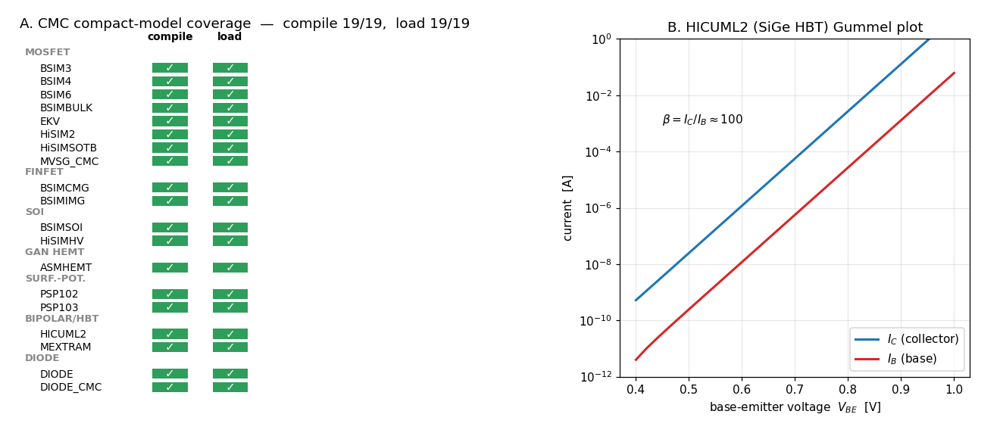

# Enhancement-160 — CMC compact-model coverage sweep

[Enhancement-159](Enhancement-159.md) brought up two production compact models
(BSIM4, EKV) and validated them. This is the comprehensive follow-up: it drives
**every** real CMC (Compact Model Coalition) Verilog-A model bundled with OpenVAF
through the full `openvaf-r → OSDI → ngspice` path and reports a coverage matrix —
the same idea as the [Enhancement-84](Enhancement-84.md) LRM sweep (all 231 LRM
examples), but for the models people actually tape out with. The model sources are
the CMC reference decks under `OpenVAF-master-20260610/integration_tests/`,
compiled **in place, not copied**, so their licenses stay put.

## Result: 19 / 19 compile, 19 / 19 load

Nineteen real device models spanning **every major class** compile through
openvaf-r and load in ngspice:

- **MOSFET** — BSIM3, BSIM4, BSIM6, BSIMBULK, EKV, HiSIM2, HiSIMSOTB, MVSG_CMC
- **FinFET** — BSIMCMG, BSIMIMG
- **SOI** — BSIMSOI, HiSIMHV
- **GaN HEMT** — ASMHEMT
- **surface-potential** — PSP102, PSP103
- **bipolar / SiGe HBT** — HICUML2, MEXTRAM
- **diode** — DIODE, DIODE_CMC

The coverage is checked in two automatic tiers — **compile** (openvaf-r produces an
`.osdi`) and **load** (ngspice loads it and binds an instance) — for all nineteen.
Deeper **conduction + physics** validation is done for a representative model per
class (the full conduction column needs per-model biasing, which is
model-specific):

| Model | Class | Validation |
|---|---|---|
| BSIM4 | MOSFET | vs ngspice **built-in** BSIM4 → ~2 % (needs `rdsmod=1`) |
| BSIM3 | MOSFET | vs ngspice **built-in** BSIM3 → ~7 % |
| EKV | MOSFET | monotonic, saturating I-V (no built-in reference) |
| HICUML2 | SiGe HBT | bipolar current gain **β ≈ 100** (Gummel plot, Panel B) |
| DIODE_CMC | diode | exponential forward turn-on (× 16 000 over 0.2 → 1.0 V) |

The Gummel plot in Panel B — collector and base current as straight exponential
lines separated by ~100× — is the textbook signature of a working bipolar
transistor, a device class ngspice cannot model natively.

## Findings

Two practical gotchas — exactly what a sweep like this exists to surface:

- **The E-159 internal-node issue is BSIM4-specific, not universal.** BSIM4's
  default `rdsmod=0` leaves its internal drain/source nodes floating (Id = 0)
  because OSDI keeps every node static (no dynamic collapsing); `rdsmod=1`
  connects them. **BSIM3**, by contrast, handles the zero-resistance case fine and
  conducts out of the box — its apparent "zero" at Vgs = 1 V is simply a high
  default threshold (~1.7 V), so it turns on above ~1.5 V and then tracks the
  built-in model. So the E-159 finding is one model's quirk, not a toolchain-wide
  limitation.
- **HiSIMHV** (6 terminals `d,g,s,b,sub,temp`) needs `cosubnode=1` to enable the
  substrate node; instantiated with all six nodes and the default `cosubnode=0`,
  its `$fatal` correctly guards the node-count mismatch — which incidentally
  confirms `$fatal` works end-to-end through OSDI.

## Verification

[`examples/cmcsweep_examples/verify_cmcsweep.py`](../examples/cmcsweep_examples/verify_cmcsweep.py):

- **[1]** all 19 models compile through openvaf-r.
- **[2]** all 19 load in ngspice and accept an instance.
- **[3]** OSDI BSIM4 matches built-in BSIM4 to < 5 % (`rdsmod=1`).
- **[4]** OSDI BSIM3 matches built-in BSIM3 to < 8 %.
- **[5]** EKV conducts and is physical (rises with Vgs).
- **[6]** HICUML2 shows bipolar action (β in [50, 200]).
- **[7]** DIODE_CMC turns on exponentially in forward bias.

Compiling nineteen models (12.6k-line BSIM4 among them) takes ~35 s, so the sweep
is **SPARSE-only** (compile/load are solver-independent) and excluded from the fast
regression sweep — run it directly. This is a validation/example enhancement: it
exercises the existing toolchain and needs no ngspice/openvaf-r source change.

## Scope and follow-ups

Running the full CMC zoo end to end is the strongest statement that openvaf-r +
ngspice is a production-grade Verilog-A/OSDI toolchain. Natural follow-ups: a full
per-model **conduction/validation** column (proper biasing for each of the
nineteen), and — the biggest — teaching openvaf-r compile-time **node collapsing**
so models like BSIM4 work with their default `rdsmod=0`.
