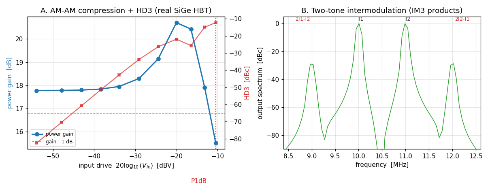

# Enhancement-164 — Large-signal RF characterization of a real transistor

Enhancements [159](Enhancement-159.md)–[161](Enhancement-161.md) validated a
production compact model's DC, coverage, and small-signal (AC / C-V / fT)
behavior. This one drives a real device **hard** and extracts the large-signal RF
figures of merit that matter for power amplifiers and mixers — gain compression
(P1dB), harmonic distortion, and third-order intermodulation (IP3) — for a
common-emitter amplifier built from the bundled **HICUM/L2 SiGe HBT** (compiled in
place from the OpenVAF integration-test sources, with the E-161 dynamic parameters
that give it a finite fT). It is a validation/example enhancement — no
ngspice/openvaf-r source change.

## Results

- **AM-AM (Panel A).** The power gain *expands* from 17.8 dB to ≈ 20.7 dB and then
  compresses — the exponential-transconductance signature of a bipolar (a large
  drive raises the average transconductance until the collector clips) — defining
  the 1-dB compression point at the high-drive end. The third harmonic climbs with
  the textbook **3:1 slope** (a straight line on the dB–dB axes).
- **Two-tone IM3 (Panel B).** For two equal tones the third-order intermodulation
  products (`2f1−f2`, `2f2−f1`) appear just outside the fundamentals at ≈ −30 dBc —
  the in-band distortion that sets an amplifier's IP3.
- **IIP3.** Extracted from the single tone as `IIP3 = A/√(3·HD3)` — since the
  two-tone IM3 is exactly 3× the single-tone HD3 for a third-order nonlinearity —
  it comes out **constant at ≈ 0.134 V** across drive level, confirming the
  third-order model holds.

## A real finding: HB/QPSS don't converge on this amplifier

The frequency-domain harmonic-balance engines (`hb`/`qpss`,
[E-134](Enhancement-134.md)/[136](Enhancement-136.md)) — the very ones that just
gained netlist dot-cards in [E-162](Enhancement-162.md)/[163](Enhancement-163.md) —
turn out **not** to converge on this stiff, many-internal-node production model in
an amplifier configuration:

- `hb` returns **`error 103`** at *any* drive level (even 1 mV) and with extra
  iterations or source-stepping — the internal HICUM nodes diverge in the
  frequency-domain Newton.
- the two-tone `qpss` is **prohibitively slow** (> 2 min for a single point,
  because the conversion-matrix solve grows with the sideband count on a 2000-line
  model).

So the characterization here uses **transient + Fourier/FFT**, which integrates
reliably on the heavy model. This is an honest, useful boundary: HB/QPSS are the
right tool for lighter, well-conditioned circuits (as the E-134/136 examples show),
while transient is the robust route for large-signal RF on a full production
compact model. A worthwhile follow-up would be to harden the HB engine's
convergence (better continuation / a transient-seeded initial guess) so it can
handle circuits like this.

## Verification

[`examples/rfpa_examples/verify_rfpa.py`](../examples/rfpa_examples/verify_rfpa.py),
under **both** the Sparse and KLU solvers (transient works under both):

- **[1]** the transient small-signal gain matches the `.ac` gain (7.744 vs 7.742),
  confirming transient is the correct large-signal engine here.
- **[2]** the third harmonic follows the 3:1 slope (HD3 ∝ A³): the ratio
  HD3(0.02 V)/HD3(0.005 V) is 62.9 (expected 4³ = 64).
- **[3]** the single-tone `IIP3 = A/√(3·HD3)` is constant across drive (0.134 V,
  spread < 2 %).
- **[4]** the amplifier compresses at high drive (gain 7.74 → 5.97 at 150× drive).

## Why the results are physically correct

- **Gain expansion → compression.** `Ic ∝ exp(Vbe/Vt)`, so a large drive raises the
  average transconductance (expansion) until the collector clips (compression).
- **3:1 HD3 / IM3.** A third-order term produces a third harmonic ∝ A³ and, for two
  tones, IM3 products ∝ A³ that are 3× the single-tone HD3 — the basis of the
  single-tone IIP3 extraction and the OIP3-vs-P1dB relationship.

## Scope and follow-ups

Together with E-159/160/161 this closes the loop on production-model validation:
DC, coverage, small-signal, and now large-signal RF. Natural follow-ups: hardening
HB/QPSS convergence on stiff production models (so the frequency-domain path works
here too), and load-pull / power-added-efficiency characterization.
