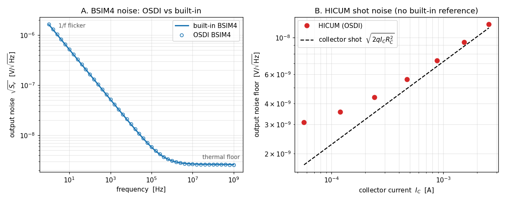

# Enhancement-165 — Production compact-model noise validation

Enhancements [159](Enhancement-159.md)–[161](Enhancement-161.md) validated a real
compact model's DC, coverage, and small-signal (AC / C-V / fT) behavior;
[E-164](Enhancement-164.md) its large-signal RF. This one exercises the remaining
untested small-signal path — OSDI's `.noise` stamping of the models' own
`white_noise` / `flicker_noise` sources — on production models, compiled in place
from the OpenVAF integration-test sources. It is a validation/example enhancement:
no ngspice/openvaf-r source change.

## BSIM4 — validated against ngspice's built-in

The output-noise spectral density `Sv(f)` of a BSIM4 common-source amplifier is
compared to ngspice's **built-in** BSIM4 over the full band (Panel A). Both the
low-frequency **1/f flicker** region (`√Sv ∝ 1/√f`) and the flat high-frequency
**thermal floor** match to **~1.5 %** everywhere — a stringent check that OSDI's
noise stamping reproduces the native model's noise physics, since the flicker
coefficients, thermal-noise model, and their bias dependence all have to line up.

## HICUM — validated against shot-noise physics

HICUM/L2 (SiGe HBT) has no ngspice built-in, so its noise is checked against
physics. Its default noise is **white** — shot noise on the junction currents plus
thermal noise on the parasitic resistances, with no flicker by default — giving a
flat spectrum, in clear contrast to the MOSFET's 1/f rise. With a small source
resistance so the intrinsic device noise dominates, the output-noise floor tracks
the collector **shot-noise** line `√(2q·Ic·RC²)` across two decades of bias current
(Panel B) and scales as `√Ic` — right on the line at high bias (shot-dominated,
within 6 %), a little above it at low bias where the base contributions add.

## Verification

[`examples/modelnoise_examples/verify_modelnoise.py`](../examples/modelnoise_examples/verify_modelnoise.py),
under **both** the Sparse and KLU solvers (`.noise` works under both since
[E-113](Enhancement-113.md) fixed the KLU adjoint solve):

- **[1]** the OSDI BSIM4 output-noise spectrum matches built-in BSIM4 to < 4 %
  (measured ~1.5 %).
- **[2]** BSIM4 shows the 1/f flicker region (`Sv(1Hz)/Sv(10Hz) ≈ √10`).
- **[3]** BSIM4 shows the flat thermal floor at high frequency.
- **[4]** HICUM noise is white (flat) at mid-band — no flicker by default.
- **[5]** HICUM output floor tracks the collector shot noise `2q·Ic·RC²` and scales
  as `√Ic`.

## Why the results are physically correct

- **Flicker (1/f).** Trap-related carrier-number fluctuation gives a power density
  `∝ 1/f`, so the amplitude density falls as `1/√f` — exactly the measured
  low-frequency slope, matching the built-in model to a percent.
- **Thermal floor.** Channel and resistance thermal noise is white — the flat
  high-frequency floor.
- **Shot noise.** A DC current `Ic` crossing a junction carries shot noise
  `i² = 2q·Ic`; through the `RC` load that is `2q·Ic·RC²` at the output, tracking
  the collector current across the bias sweep.

Together with E-159/160/161/164 this completes the production-model validation
loop: DC, coverage, small-signal (AC + noise), and large-signal RF.

## Scope and follow-ups

The BSIM4 comparison could be extended to the other built-in-referenced models
(BSIM3), and the HICUM noise to a full four-source decomposition (collector shot,
base shot, base-resistance thermal, source thermal). Enabling HICUM's flicker
coefficients would add the 1/f corner for the bipolar as well.
