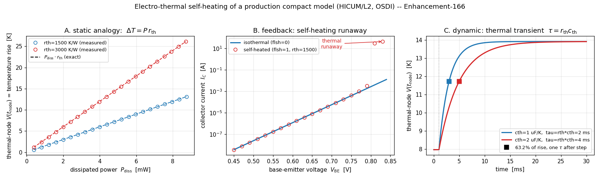

# Enhancement-166 — Electro-thermal / self-heating validation

Enhancements [159](Enhancement-159.md)–[161](Enhancement-161.md) validated a real
compact model's DC, coverage and small-signal behavior, [E-164](Enhancement-164.md)
its large-signal RF, and [E-165](Enhancement-165.md) its noise — always with the
device treated as **isothermal**. This one exercises the one remaining path: a
model's own internal **self-heating** node, which OSDI stamps as an extra
(thermal) terminal whose "voltage" is the junction temperature rise and whose
"current" is the dissipated power. It is a validation/example enhancement: no
ngspice/openvaf-r source change.

## The electro-thermal analogy

The device is **HICUM/L2** (a SiGe HBT), compiled in place from the OpenVAF
integration-test source. Its self-heating network is gated by the model flag
`flsh`, with parameters `rth` (thermal resistance, K/W) and `cth` (thermal
capacitance, J/K). Internally the model carries a thermal branch
`I(br_sht) <+ V(tnode)/rth − Pdiss`, so the thermal node obeys the textbook
analogy

| electrical | ↔ | thermal |
|---|---|---|
| voltage `V(tnode)` | ↔ | temperature rise ΔT [K] |
| current into node | ↔ | dissipated power P [W] |
| resistor `rth` | ↔ | thermal resistance [K/W] |
| capacitor `cth` | ↔ | thermal capacitance [J/K] |

giving `V(tnode) = P·rth` at DC and a single-pole thermal transient with
`τ = rth·cth`. By wiring the model's thermal terminal (its 5th terminal) to an
ordinary circuit node, we read ΔT directly and check it against these laws.

## Static — ΔT = P·rth exactly

With the device **current-biased** (fixing the base current gives a stable
operating point), the measured thermal-node voltage lands on the line `P·rth` to
**machine precision** across a decade of dissipated power, for two thermal
resistances (Panel A). This is the electro-thermal analogy, exact: the model's
thermal sub-network is a resistor from the temperature-rise node to ground, driven
by the dissipated power.

## Feedback — self-heating shifts the junction, and can run away

At a fixed collector current (≈ 2 mA), turning self-heating on lowers `Vbe` from
0.792 V (isothermal) to 0.780 V at ΔT = 8 K and 0.756 V at ΔT = 24 K — a
consistent **−1.53 mV/K**, the classic bipolar `Vbe` temperature coefficient, the
same for both `rth` values (check 3). The model's parameters genuinely feed the
junction physics.

Under a **fixed `Vbe`** (voltage drive) the same coupling is *positive feedback*:
a Gummel plot (Panel B) shows the self-heated collector current peel above the
isothermal exponential and run away — 5.9 mA isothermal versus tens of amps
self-heated at `Vbe = 0.82 V` (check 6). This is why real bias networks use a
current source or emitter degeneration, and why the quantitative checks here
current-bias the device.

## Dynamic — thermal transient τ = rth·cth

After a collector-voltage (power) step the thermal node rises as a **single pole**
to its new steady value, reaching **63.2 %** of the change at one time constant
(measured 0.637). Doubling `cth` doubles `τ` (2 ms → 4 ms), as does doubling `rth`
(Panel C, checks 4–5) — the thermal RC is exactly `rth·cth`.

## Verification

[`examples/electrothermal_examples/verify_electrothermal.py`](../examples/electrothermal_examples/verify_electrothermal.py),
under **both** the Sparse and KLU solvers:

- **[1]** self-heating off (`flsh=0`) → `V(tnode)=0` (isothermal baseline).
- **[2]** static analogy `V(tnode)=P·rth` to machine precision over a decade of
  power, two `rth`.
- **[3]** self-heating lowers `Vbe` at fixed `Ic` with a consistent physical TC
  (≈ −1.5 mV/K), more for larger `rth`.
- **[4]** thermal transient is single-pole: 63.2 % of the rise at one `τ = rth·cth`.
- **[5]** `τ` scales with `cth`.
- **[6]** fixed-`Vbe` self-heating is positive feedback (runaway).

A KLU wrinkle worth noting: a thermal node left floating (`flsh=0`, `rth=0`) makes
the KLU matrix structurally singular, whereas Sparse 1.3 tolerates it — so the
pure-isothermal reference ties the thermal terminal to ground rather than exposing
it. With `rth>0` the thermal node is grounded through `rth` and both solvers agree.

## Why the results are physically correct

- **ΔT = P·rth.** The thermal sub-network is literally a resistor from the
  temperature-rise node to ground, forced by the dissipated power — so the DC
  temperature rise is power × thermal resistance, independent of the electrical
  bias point.
- **−2 mV/K `Vbe` shift.** At fixed collector current a bipolar's base–emitter
  voltage falls ≈ 2 mV per kelvin (the bandgap/`kT`·ln term); the measured
  −1.53 mV/K is squarely in range and constant with `rth`.
- **Thermal runaway.** At fixed `Vbe`, `dIc/dT > 0` and `dT/dP > 0` close a
  positive-feedback loop; above a critical power the loop gain exceeds unity and
  the current diverges — reproduced exactly.
- **τ = rth·cth.** A first-order thermal RC has a single exponential response; the
  63.2 % point sits at one `τ`, scaling with both `rth` and `cth`.

Together with E-159/160/161/164/165 this completes the production-model validation
loop end to end: DC, coverage, small-signal (AC + noise), large-signal RF, and now
self-heating.

## Scope and follow-ups

The same thermal-terminal probe applies to any self-heating CMC model — HiSIM-HV,
BSIM-SOI, MEXTRAM — so a cross-model electro-thermal check (each against its own
`rth`) is a natural extension. A coupled electro-thermal **transient** with a
realistic power waveform (e.g. a pulsed load) would exercise `cth` under
large-signal drive, and a two-device thermal-coupling network (shared substrate
`rth`) would test mutual heating.
