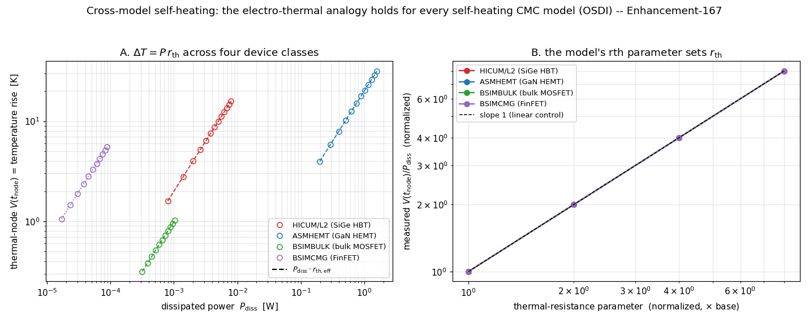

# Enhancement-167 — Cross-model self-heating sweep

[Enhancement-166](Enhancement-166.md) validated **one** production compact model's
self-heating (HICUM/L2). This is the breadth follow-up — like
[E-160](Enhancement-160.md) was to [E-159](Enhancement-159.md) — driving the
**same** electro-thermal analogy through **every** bundled CMC model that exposes a
self-heating thermal terminal, across four different device classes. It is a
validation/example enhancement: no ngspice/openvaf-r source change.

## Four device classes, one analogy

| Model | Device class | flag | rth parameter |
|---|---|---|---|
| **HICUM/L2** | SiGe HBT | `flsh=1` | `rth` (direct, K/W) |
| **ASMHEMT** | GaN HEMT | `shmod=1` | `rth0` (direct, K/W) |
| **BSIMBULK** | bulk MOSFET | `SHMOD=1` | `RTH0` (per width → `rth_eff = RTH0/W`) |
| **BSIMCMG** | FinFET | `SHMOD=1` | `RTH0` (geometry-normalized) |

Each model carries an internal thermal branch `Pwr(thermal) <+ Temp(thermal)/rth −
Pdiss`, so wiring the model's thermal terminal to a circuit node lets us read the
junction temperature rise directly and check `V(tnode) = Pdiss · rth_eff`. Panel A
shows the measured thermal-node voltage riding exactly on its own `Pdiss·rth_eff`
line for all four models, across **five decades** of dissipated power (from ~10 µW
in the FinFET to ~1.5 W in the GaN HEMT) and temperature rise (0.3 K to 30 K) — one
universal law spanning HBT, GaN HEMT, planar bulk CMOS and FinFET.

## V(tnode)/Pdiss is a genuine thermal resistance

The sweep confirms four properties of the self-heating value `V(tnode)/Pdiss`, for
every model:

- **Gated by the flag.** With self-heating off (`flsh`/`shmod`/`SHMOD = 0`) the
  thermal node reads exactly 0.
- **Bias-independent.** `V(tnode)/Pdiss` is the same constant at two different
  operating points — a real thermal resistance, not an operating-point artifact.
- **Linearly controlled** (Panel B). Doubling the model's rth parameter doubles the
  measured thermal resistance; sweeping it over 8× keeps every model on the slope-1
  line.
- **Exact** for the three models whose parameter is a direct or per-width thermal
  resistance: `V(tnode)/Pdiss` equals `rth` (HICUM), `rth0` (ASMHEMT) and `RTH0/W`
  (BSIMBULK) to **machine precision** (e.g. 2000.000, 20.000, 1000.000 K/W). The
  FinFET's `RTH0` is geometry-normalized, so only the bias-independent + linear-
  control properties are asserted for it.

## Verification

[`examples/cmcselfheat_examples/verify_cmcselfheat.py`](../examples/cmcselfheat_examples/verify_cmcselfheat.py),
for each of the four models, under **both** the Sparse and KLU solvers (12 checks):

- **[off]** self-heating flag off → `V(tnode)=0`;
- **[analogy]** on, two operating points → `V(tnode)/Pdiss` is a bias-independent
  constant equal to the expected `rth_eff` (exact for the three direct/per-width
  models);
- **[control]** doubling the rth parameter doubles `V(tnode)/Pdiss`.

A **KLU** wrinkle carried over from E-166: some models leave the thermal node
unconstrained when self-heating is off, which makes the KLU matrix structurally
singular (Sparse tolerates it). A `1e12`-ohm thermal-probe resistor from each
thermal node to ground fixes this uniformly and is negligible when self-heating is
on (the model's `1/rth` conductance, ≥ ~1e-5 S here, swamps the 1e-12 S probe, so
the ratio is unaffected to < 1e-7).

## Why the results are physically correct

Every self-heating compact model implements the thermal sub-network as a resistor
`rth` (optionally with a capacitor `cth`) from a temperature-rise node to thermal
ground, injected with the instantaneous dissipated power. At DC the capacitor is
open, so the node settles to `ΔT = Pdiss·rth` — independent of the electrical
operating point and linear in both power and `rth`. That the constant comes out
*exactly* equal to the datasheet-facing `rth`/`rth0`/`RTH0` parameter (modulo the
documented per-width and geometry normalizations) shows OSDI stamps each model's
thermal terminal faithfully, regardless of device class.

## Scope and follow-ups

- **BSIM-SOI** also exposes a thermal terminal, but in SOI the dissipated power
  includes body/parasitic-BJT and impact-ionization currents, so `Pdiss ≠ Id·Vds`
  and validating its analogy needs the model's *internal* dissipated power rather
  than the terminal product — a natural extension.
- Models whose thermal node is **internal** (MVSG-CMC, HiSIM-SOTB) self-heat
  correctly but don't expose `V(tnode)` for a direct read; validating those via a
  temperature-rise operating-point variable would broaden the sweep further.
- A **coupled** electro-thermal transient (the E-166 `τ = rth·cth` dynamics) across
  all four classes, or mutual thermal coupling between neighbouring devices, are the
  depth follow-ups.
