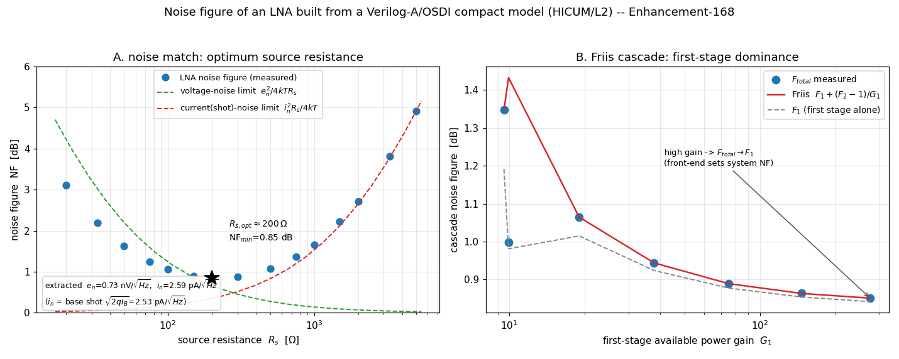

# Enhancement-168 — RF noise figure of an LNA

[Enhancement-165](Enhancement-165.md) validated a production model's device
**noise** (spectral density). This one lifts that to a circuit-level figure of
merit — the **noise figure** of a low-noise amplifier — and checks it against the
two textbook RF-noise results: **optimum source matching** and the **Friis cascade
formula**. It is a validation/example enhancement: no ngspice/openvaf-r source
change.



## The LNA and the NF extraction

The amplifier is a common-emitter stage built from the **HICUM/L2** SiGe HBT
(OSDI), AC-coupled, driven from a source resistance `Rs`. From ngspice's `.noise`
analysis the noise figure is

```
NF = 10·log10( inoise² / (4kT·Rs) )          [T0 = 290 K]
```

where `inoise` is ngspice's input-referred noise density: the noise factor `F` is
the total input-referred noise power divided by the source-resistor thermal noise.
The reference temperature is pinned to the standard `290 K` (`.options temp=16.85`)
so the `4kT·Rs` uses the same temperature as ngspice's resistor thermal-noise
model — the extraction is self-consistent.

## Noise match — the optimum source resistance

`NF(Rs)` is the classic **U-curve** (Panel A) with an interior minimum, the
optimum source resistance `Rs_opt ≈ 200 Ω`, `NF_min ≈ 0.85 dB`. The two dashed
asymptotes are the amplifier's input **voltage noise** `en` (dominating at small
`Rs`, `NF → en²/4kT·Rs`) and its input **current noise** `in` (dominating at large
`Rs`, `NF → in²·Rs/4kT`); they cross near the minimum, which is exactly why an LNA
has an optimum source impedance.

Extracting `en` and `in` from the measured curve (`inoise² = en² + in²·Rs² +
4kT·Rs`) gives `en ≈ 0.73 nV/√Hz` and `in ≈ 2.59 pA/√Hz`. The current noise equals
the base **shot noise** `√(2q·IB) = 2.53 pA/√Hz` (IB = 20 µA) to within 3 % —
the physical origin of the optimum is the transistor's base current.

## Friis cascade — first-stage dominance

A two-stage cascade obeys the **Friis formula** `F_total = F1 + (F2−1)/G_av1`,
where `G_av1` is the first stage's *available power gain* and `F2` is the second
stage's noise factor measured with a source impedance equal to the first stage's
output impedance. The validation measures all three:

- **High first-stage gain** (`G_av1 ≈ 181`): `F_total = 0.858 dB` sits barely above
  `F1 = 0.849 dB` — the second stage adds only 0.01 dB. This is the **first-stage-
  dominance** principle: a high-gain front end sets the whole system's noise figure.
  The measured `F_total` matches the Friis prediction to 0.001 dB.
- **Low first-stage gain** (`G_av1 ≈ 19`): the second stage now contributes a
  clearly measurable 0.05 dB, and `F_total = 1.065 dB` still matches Friis (`1.065`
  predicted) exactly — validating the formula where its correction term matters.

Panel B sweeps the first-stage gain and shows `F_total` tracking the Friis curve
and collapsing onto `F1` as the gain grows.

## Verification

[`examples/noisefigure_examples/verify_noisefigure.py`](../examples/noisefigure_examples/verify_noisefigure.py),
under **both** the Sparse and KLU solvers (6 checks; `.noise` works under KLU since
[E-113](Enhancement-113.md) fixed the KLU adjoint solve):

- **[1]** `NF(f)` is positive everywhere and flat (< 0.1 dB) across the white
  mid-band;
- **[1b]** `NF` rises at high frequency as the input capacitance rolls off the gain;
- **[2]** `NF(Rs)` is a U-curve with an interior optimum source resistance;
- **[2b]** the input current noise (from the high-`Rs` slope) equals the base shot
  noise `√(2q·IB)` to a few percent;
- **[3]** Friis + first-stage dominance (high `G1`): `F_total ≈ F1`, matches
  `F1 + (F2−1)/G_av1`;
- **[4]** Friis quantitative (low `G1`): the second stage contributes measurably and
  `F_total` still matches Friis.

## Why the results are physically correct

- **Noise figure ≥ 0 dB.** Any amplifier adds noise, so the output SNR can only
  fall — `F ≥ 1`. Measured `NF` is positive at every frequency and `Rs`.
- **Optimum source resistance.** A two-generator noise model (`en`, `in`) gives
  `F = 1 + (en² + in²·Rs²)/(4kT·Rs)`, minimized at `Rs_opt = en/in`. The measured
  U-curve, its asymptotes, and `in = √(2q·IB)` all follow this.
- **Friis / first-stage dominance.** Noise added after a gain `G1` is referred back
  to the input divided by `G1`, so a high-gain first stage suppresses later-stage
  noise — the reason receivers put the LNA first. Reproduced to < 0.01 dB.

## Scope and follow-ups

The device is a BJT so that the base current gives a finite `in = √(2q·IB)` — the
high-`Rs` side of the optimum. A MOSFET LNA (induced-gate noise, no shot current)
would show a different `NF(Rs)`; a **noise-matching network** (an input
transformer or L-match presenting `Rs_opt`) achieving `NF_min` at 50 Ω, and a
frequency-dependent `NF` with the flicker corner enabled, are natural extensions.
The Friis check could be pushed to three stages, and combined with the RF
`.pnoise` periodic-noise path ([E-124](Enhancement-124.md)) for a mixer noise
figure (SSB/DSB).
