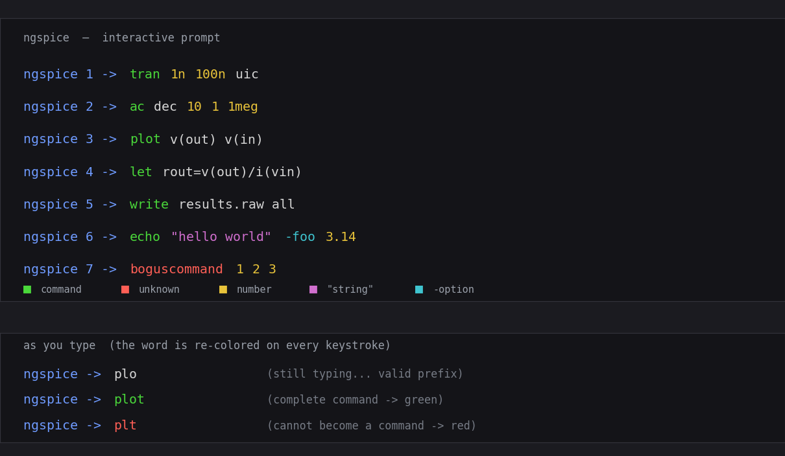

# Enhancement-169 — Interactive command-line syntax highlighting

ngspice's interactive prompt now **colors the command line as it is typed**: the
command word turns **green** the moment it is a recognized command, **red** when
it cannot become one, and stays the normal color while it is still a valid prefix;
numbers, quoted strings and `-option` flags get their own colors. A mistyped
command is visible before Enter is pressed. This is a real ngspice change (new
`src/frontend/syntaxhl.c`, wired into the readline prompt in `src/main.c`).

## What it does

- **Command word** — classified exactly as the interpreter resolves it: looked up
  in the live command table `cp_coms` (the same `strcasecmp` walk `docommand`
  uses) plus the control keywords (`if`, `while`, `foreach`, `begin`, `end`, …).
  So the color always agrees with whether the command will actually run. Match is
  case-insensitive.
- **Prefix awareness** — a partly typed word such as `plo` is a prefix of a real
  command (`plot`), so it stays neutral rather than flashing red; it turns red
  only once it can no longer become *any* command (`plt`).
- **Other tokens** — numbers yellow, `"quoted strings"` magenta, `-option` flags
  cyan; everything else (node names, vectors, operators) keeps the terminal
  default.

## How it is wired

- The coloring engine is a pure function `cp_highlight_line()` that tokenizes a
  line and wraps each token in ANSI SGR color escapes.
- Live coloring overrides **GNU readline's** `rl_redisplay_function`. The
  replacement redraws the colorized line only when the prompt plus the line fit on
  one terminal row; otherwise it defers to readline's own `rl_redisplay()`, so a
  line that wraps is never corrupted. The cursor is repositioned with a plain
  `CR` + `CUF` (cursor-forward) so editing mid-line behaves normally.
- It is **on by default** at an interactive terminal and disabled by
  `set no_syntax_highlight`, by the `NO_COLOR` environment convention, or whenever
  the output is not a TTY — a piped or redirected session never has color codes
  injected into its output.

Because as-you-type coloring needs the terminal in raw mode, it requires a
**readline-enabled** build — which the shipped binaries are (CI builds ngspice
with `--with-readline=yes`, and the committed binaries link `libreadline`).

## The `synhl` command

`synhl <command line>` prints the colorized form of a line non-interactively. It
is useful for previewing the highlighting, works in any build (no terminal
needed), and is what makes the coloring engine regression-testable in batch mode.

## Verification

[`examples/syntaxhl_examples/verify_syntaxhl.py`](../examples/syntaxhl_examples/verify_syntaxhl.py)
— 11 checks in two layers:

- **engine** (via `synhl` in batch): a valid command is green, an unknown command
  is red, a valid prefix is neutral, numbers/strings/options get their colors, and
  matching is case-insensitive.
- **live** (driven through a pseudo-terminal): typing a complete command renders
  green on the fly, an impossible one renders red, a valid prefix stays neutral,
  `NO_COLOR` suppresses coloring, and a piped (non-tty) session leaks no color
  codes. The live layer auto-skips on a build without readline.

It is a front-end (REPL) feature, independent of the linear solver, so it is not
run under the dual-solver harness; the full example regression is unaffected.

## Why this is safe

The change is confined to the interactive front end. In batch mode (`ngspice -b`)
and in any non-interactive/piped session the redisplay hook never fires (the
output is not a TTY), so simulation output is byte-for-byte unchanged — confirmed
by the full example regression. The only new externally visible surface is the
`synhl` command and the coloring at the interactive prompt.

## Scope and follow-ups

The classifier colors the first word as the command; a natural extension is to
re-classify after a `;` command separator, and to color known function names in
expressions and defined vector names. A configurable palette (`set
syntax_colors=…`) and highlighting inside `.control` blocks read from a sourced
file are further possibilities.
