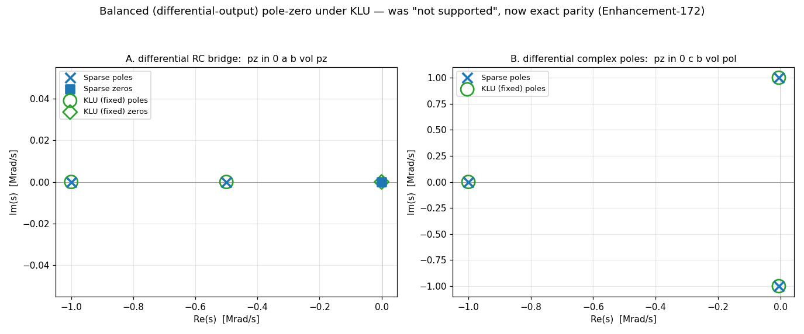

# Enhancement-172 — KLU balanced pole-zero + full partial pivoting

[Enhancement-171](Enhancement-171.md) fixed the KLU pole-zero determinant and
pivot-tolerance defects, leaving two items on its scope list: the
**balanced/differential-output** `.pz` form was still guarded off as unsupported
under KLU, and a twin-T's deflated conjugate zero pair stalled. This enhancement
closes both — **every `.pz` form now runs under KLU with root sets identical to
Sparse**, and the last "not supported with 'option KLU'" analysis guard is gone.

## Part 1 — balanced (differential) output

For an output taken across a floating pair (`pz in 0 a b vol`), the PZ algorithm
changes variables so the new unknown is the difference `V(a)−V(b)`, which
requires folding the solution column into the balance column each trial:
`col(b) += col(a)` — `SMPcAddCol`. Under Sparse this creates any missing
elements on the fly; **KLU's CSC sparsity pattern is fixed at conversion time**,
so the fold's fill-in cannot be created dynamically — which is why the form was
guarded off ([E-113](Enhancement-113.md)-era).

The fix has two halves:

- **Union-pattern reservation** (`cktpzset.c`): before the COO→CSC conversion,
  every row present in the solution column is also registered in the balance
  column (via `SMPmakeElt` into the COO list; duplicate `(row, col)` entries are
  folded into a single CSC slot by the conversion's group labeling). The
  reserved entries are structural zeros until the fold fills them.
- **A KLU branch for `SMPcAddCol`** (`klusmp.c`): a merge-walk over the two
  columns' sorted row lists, adding the complex values in place. If an addend
  row is missing from the accumulator column (impossible once the reservation
  ran) it reports an error instead of corrupting memory.

The `pzan.c` balanced-output guards are removed. Verified: a differential RC
bridge (`poles −1e6, −5e5; zero at 0`) and a differential output with a complex
pole pair — both **digit-for-digit identical to Sparse** (previously:
`Error: ... not supported with 'option KLU'`).

## Part 2 — full partial pivoting for PZ factorizations

While validating a fully-differential configuration, a deeper numerical issue
surfaced: KLU minted **spurious far-field roots** at |s| ~ 1e19–1e21 (including
a positive-real "pole"), where the true determinant has no roots at all.
Diagnosis with an exact-rational (fraction-arithmetic) determinant of the very
matrix KLU had factored showed the factorization itself going numerically rotten
at extreme |s|: at s = 4.52e19 the exact determinant was **+4.36e11** while the
pivot product gave **−2.05e12** — wrong sign *and* magnitude.

The root cause is architectural: **KLU's ordering is fixed at `klu_analyze`
time** (pattern-only AMD/BTF), while **Sparse re-runs value-aware Markowitz
ordering on every PZ trial**. PZ sweeps |s| across ~20 decades, so the matrix
values change by ~12 orders of magnitude under a fixed ordering, and with the
relaxed default pivot tolerance (`tol = 0.001`) the within-block partial
pivoting accepted catastrophically-cancelling pivots. KLU's only value-adaptive
lever *is* that within-block pivoting — so the [E-171](Enhancement-171.md)
sanitization fallback is upgraded from "keep the current tolerance" to **full
partial pivoting (`tol = 1.0`)** whenever the caller passes an out-of-range
`PivRel` (only pole-zero does, with `0.0`). Explicit in-range tolerances — e.g.
DC/AC/transient's `1e-3` — are honored unchanged, so nothing outside PZ is
affected.

This one change eliminated the far-field junk **and** cured the twin-T
conjugate-pair stall recorded in E-171's scope: what looked like vintage-Muller
noise-floor fragility under KLU was largely this factorization inaccuracy.

## Verification

[`examples/klupz_examples/verify_klupz.py`](../examples/klupz_examples/verify_klupz.py)
grows from six to **nine** cross-solver root-set-parity checks (each anchored to
its analytic answer): the E-171 six, plus

- **[7]** differential RC bridge (balanced output — was unsupported under KLU);
- **[8]** balanced output with a complex pole pair;
- **[9]** the twin-T notch — all 6 roots now found under KLU, conjugate
  `±j·10⁶` notch zeros included (KLU's residual real parts are ~1e-12, an order
  closer to the exact 0 than Sparse's ~1e-11).

The dual-solver harness's "balanced-output pole-zero is KLU-unsupported"
detection is removed from `examples/_setup.py` — no analysis card remains
Sparse-only. Full example regression: 134/134.

## Scope

The vintage spice3 Muller driver keeps its solver-independent quirks (on the RLC
bandpass it is *Sparse* that hits its iteration limit while KLU converges
cleanly). With both E-171 and E-172 in place, every circuit in the battery
produces root sets identical between the two solvers to float precision.
