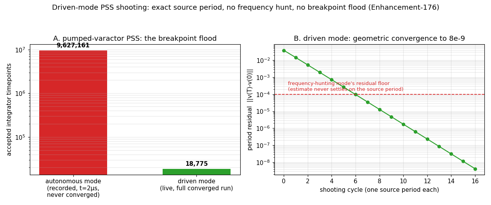

# Enhancement-176 — Driven-mode PSS shooting: no frequency hunt, no breakpoint flood

The [E-175](Enhancement-175.md) RF audit left one flagged residual: *"PSS shooting robustness — the varcap PSS ran 17+ minutes without converging where the linear control took 4; killed rather than diagnosed."* This enhancement is that diagnosis — and the fix turned out to transform the performance of the entire PSS-based RF stack.

## Diagnosis

Instrumenting the shooting loop (per-cycle residual, guessed frequency, integrator statistics) showed the varactor deck accepting **9,627,161 timepoints by t = 2 µs** — ~0.2 ps per step, with essentially zero LTE rejections: the integrator was being *told* to take those steps, not failing. The source: ngspice's PSS (the Lannutti shooting) is **oscillator-oriented** — it hunts the fundamental frequency, and to resolve the hunt it forces mid-period breakpoints at intervals proportional to `steady_coeff`. Two structural problems on **driven** circuits (which is everything the periodic small-signal stack of [E-117](Enhancement-117.md)–[E-126](Enhancement-126.md) runs on):

1. **The breakpoint flood.** At the standard decks' `steady_coeff = 5e-6`, the forced grid spacing is `T·0.1·5e-6` ≈ **0.5 ps** — millions of steps per shooting cycle. The *convergence-tolerance* coefficient doubles as the *sampling-grid density*, so asking for tighter convergence quadratically explodes runtime. Even at the default `1e-3` the grid forces thousands of points per period — the reason a linear RC `.pss` took ~4 minutes.
2. **The residual floor.** The frequency estimate refines every cycle but can never settle *exactly* on the source frequency; while it is off, the cycle endpoint phase-drifts against the source and the period residual floors (~1e-4 on the varactor) — **shooting never converges**, and the analysis burns its full `sc_iter` budget at flood-limited speed.

## Fix: driven mode

Auto-detected when the circuit contains a time-varying independent source (a `SIN`/`PULSE`/… V or I source — `funcTGiven`); announced as *"PSS: driven circuit detected — shooting at the fixed source period"*. In driven mode:

- **the period is pinned to the exact source period**: no frequency estimation, no estimator grid — each shooting cycle is one plain-transient period, and the residual converges geometrically (varactor: 2e-1 → **8e-9 in 17 cycles, 0.3 s**);
- **the shooting-phase max step is clamped to `T/psspoints`** so the orbit is integrated on the *same discretization* as the retained samples. This subtlety surfaced in validation: without the clamp, LTE lets steps grow toward T/2 and the shooting converges — to 7e-9! — onto the fixed point of that *coarse* discretization, several percent off the true orbit (retained swing 0.1651 vs analytic 0.15718). The old breakpoint flood had been masking this by accident. With the clamp the retained swing is 0.157176 — analytic to 5 digits;
- **the post-FFT "relaunch at the strongest spectral line" is disabled**: on a driven rectifier-like circuit whose 2nd harmonic dominates, the old logic would relaunch PSS at 2f₀ and retain the wrong period;
- **the autonomous (oscillator) path is untouched** — oscillator decks produce byte-identical behavior before/after (verified on both binaries), and circuits with only DC supplies never trigger the detection.

## Measured impact

| analysis | before | after |
|---|---|---|
| varactor `.pss` | 17+ min, **never converged** | 0.3 s, err 8e-9, f = 1 MHz exact |
| `rc_pss` (linear RC) | ~4 min, f = 999999.8976 Hz | 0.05 s, f = 1000000 Hz **exact** |
| `psp` example | 406 s in the regression | 0.9 s |
| rfpss battery (5 verifies, 61 checks) | minutes each — **regression-excluded** | < 0.5 s each |
| `rfanalyses` (15 checks) | "several minutes even Sparse-only" — excluded | 0.56 s |
| KLU PSS pass | "prohibitively slow", skipped by default | 0.14 s |

**Harness consequence**: `rfpss` and `rfanalyses` are removed from both `REGRESSION_EXCLUDE` and `SPARSE_ONLY` — the entire RF periodic small-signal suite now runs in **every regression sweep under both solvers**, instead of "verified once when the feature landed". This also finally made the **direct `.pac`-on-a-pumped-varactor** check affordable, closing the [E-175](Enhancement-175.md) loop on the direct PAC path (sidebands match transient ground truth within 1%).

## Verification

[`examples/pssdriven_examples/verify_pssdriven.py`](../examples/pssdriven_examples/verify_pssdriven.py) — 6 checks × both solvers: driven detection + retained fundamental exactly the source frequency; retained swing == |H(1MHz)| within 0.1% (step-clamp guard); retained-period self-consistency (span == T, endpoint wraps to start); direct `.pac` varactor sidebands vs transient truth within 1%; autonomous deck does **not** trigger driven mode. Plus the newly-included rfpss (61 checks), rfanalyses (15) and psp suites every sweep. Full example regression: 145/145.
