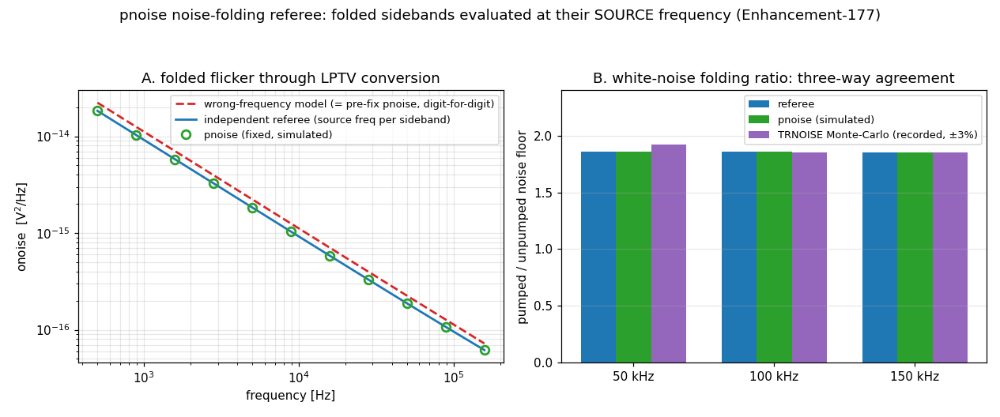

# Enhancement-177 — pnoise noise-folding referee + the folded-flicker frequency fix

The [E-175](Enhancement-175.md) audit's honesty ledger left one prominent gap: periodic noise analysis (`pnoise`/`qpnoise`/`phasenoise`) was *correct by construction, not correct by measurement* — the folding of device noise through LPTV conversion had never been checked against anything independent. This enhancement builds that referee. It certified most of the machinery — and caught a real bug in the rest.

## The referee

Three independent layers, on a 1-node LPTV-conductance circuit (`G(t) = g0 + g1·sin(ω0t)` pumping node b, fed by a noisy 10 kΩ — chosen over a varactor because conversion transfers are O(1), making folding errors dominant):

1. **A from-scratch Python conversion matrix**: `Y_nm = δ_nm(1/R + jω_nC + g0) + G_{n−m}`, `onoise(f) = Σ_k |Z_k(f)|²·S(|f+k·f0|)` — the same physics with zero shared code.
2. **A TRNOISE transient Monte-Carlo** (no shared code *or theory*): the same noise injected as a time-domain source, 198-segment Welch PSD, with the pumped/unpumped **ratio** cancelling the TRNOISE amplitude convention.
3. The LTI (`pnoise ≡ .noise`) and white limits.

**Verdict on the white path: measured-correct.** pnoise matched the referee to 6 digits at every frequency, and the MC arbiter confirmed the ~1.86× folding ratio within statistical error. The adjoint, the sideband sum, and the thermal densities are right.

## The bug the referee caught

The stationary sideband loops set the noise-evaluation frequency **once, to the output frequency** (`data.freq = freq` outside the k loop). But the sideband-k adjoint carries noise that **originates at |f + k·f0|** — a frequency-dependent source PSD (flicker `1/f`, [`noise_table`](Enhancement-109.md)) must be evaluated at the *source-side* frequency. The proof was digit-exact in both directions:

- **pre-fix** pnoise ≡ the referee's deliberately-wrong "evaluate-at-f" model, digit-for-digit (`1.114323e-14` ≡ `1.114323e-14` at 1 kHz — a **21% overestimate** on this circuit, unbounded as f ≪ f0);
- **post-fix** pnoise ≡ the correct model, digit-for-digit (`9.175472e-15`).

Why three generations of checks missed it: white noise is frequency-flat, and LTI circuits have no k≠0 transfer — the **third occurrence of the accidental-correctness pattern** ([E-171](Enhancement-171.md) determinant, [E-175](Enhancement-175.md) parametric term). Audits must probe the untested region.

**Fixed in all three stationary loops** (`dcpss.c`): `pnoise` (`data.freq = |freq + k·f0|` per sideband), `qpnoise` (`|f_in + k1·f1 + k2·f2|` per harmonic), and `phasenoise` — where it matters most: folded far-sideband blocks near a carrier were evaluated at the *tiny offset frequency*, inflating the flicker (1/f³) region.

## Cyclostationary scope

The `cyclo` mode's time-domain identity (`onoise = (1/P)Σ_s S(t_s)·|A_s|²`) treats the source PSD as **frequency-flat** across the folding span — exact for modulated-white noise and for flicker on conversion-free circuits (the shipped E-125/126 use cases), but not for flicker folded through k≠0 conversion, which cannot be collapsed into that product with the aggregate device-noise API. Documented at both cyclo sites; the stationary mode (now exact) is the right tool when folded flicker matters.

## Verification

[`examples/pnoisefold_examples/verify_pnoisefold.py`](../examples/pnoisefold_examples/verify_pnoisefold.py) — 5 checks × both solvers (runs in ~2 s thanks to [E-176](Enhancement-176.md)): white folding vs referee (≤0.1%), flicker folding vs referee (≤0.5%, sample-0 bias read from the retained orbit), the pre-fix signature absent, pump/no-pump ratio ≡ referee ratio, LTI limit ≡ `.noise`. The rfpss/qpss/rccyclo suites pass unchanged (their circuits are conversion-free or white — provably unaffected). Full example regression: 146/146.
