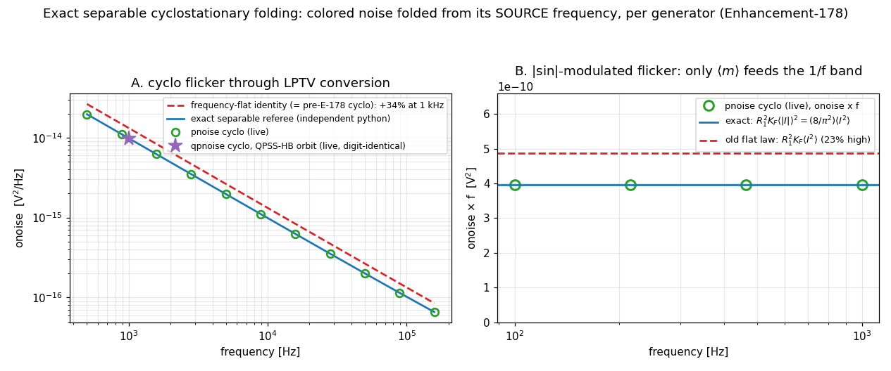

# Enhancement-178 — exact separable cyclostationary folding + the HB DC-source fix

[E-177](Enhancement-177.md) fixed folded flicker in the *stationary* periodic-noise loops and left the *cyclostationary* mode documented as frequency-flat-limited: its time-domain identity `onoise = (1/P)Σ_s S(t_s)|A_s|²` cannot see that noise folded from sideband q originates at |f + q·f0|. This enhancement removes that limitation exactly — and its cross-machinery check caught a second, unrelated bug that had silently doubled every DC bias voltage inside both harmonic-balance solvers.



## The exact separable model

For the physical cyclostationary model S(t, f) = m(t)²·g(f) — a colored stationary process amplitude-modulated along the orbit — the exact output noise is

```
onoise(f) = Σ_g Σ_q |B_q(g)|² · g_g(|f + q·f0|)
B_q(g)    = (1/P) Σ_s m_g(t_s) · dA_s(g) · e^{+jq·θs},   A_s(j) = Σ_k Ψ_k(j) e^{−jk·θs}
```

The stationary limit (m const) reduces to the E-177 sum; the flat limit (g const) collapses by Parseval to the old identity — this path strictly generalizes both.

**Per-generator amplitudes with no device-API change.** The noise-summary machinery (`prtSummary`/`outpVector`) yields one density per generator, and load **polarization** against a fixed reference load R = Ψ₀ (five `DEVnoise` sweeps per orbit sample: A±R, A±jR, R) extracts `ĉ_g,s = √S_g(t_s)·dA_s(g)` up to a constant phase that cancels in |B_q|². The spectral shape g_g is **measured pointwise** at the folded frequencies (no 1/f^EF assumption — [`noise_table`](Enhancement-109.md) works), at several probe biases so a generator quiet at one phase still gets its shape from an active one. Family-total summary slots are excluded by the name-prefix rule. Generators whose measured shape is flat keep the original identity — exact for *any* quadratic form, including `NevalSrc2`-correlated pairs; a colored generator invisible to the reference load falls back to it rather than being dropped. Ported to the two-tone `qpnoise … cyclo` as the 2-D analog B_{q1,q2} at |f + q1·f1 + q2·f2|.

## The physics it fixes: flicker sees ⟨m⟩², white sees ⟨m²⟩

For modulation far above the analysis band, only the DC component of the envelope m(t) feeds the 1/f band — the AC components are shifted to ±f0, ±2f0 sidebands where 1/f is negligible. The old identity collapsed *all* envelope power onto the analysis frequency: for |sin|-modulated flicker it overestimated by π²/8 (23%, the rccyclo circuit — its verify now pins the exact ⟨|I|⟩² law to 1e-4), and on the E-177 conversion circuit by 34%. The new cyclo sweep lands on a from-scratch Python referee to ≤3e-4, and the pre-E-178 binary reproduced the referee's deliberately-flat model to 6e-5 — the error was the model, not the code.

## The bug the cross-machinery check caught

Check [6] runs the same circuit through the **QPSS-HB orbit** (`qpss … hb` + `qpnoise … cyclo`) and expects the 1-D answer. It came out exactly **4×**. A differential experiment (AF = 0/1/2 → ratio 1/2/4, white exact) pinned a doubled bias current, and a trivial DC deck (`VDC=1` → harmonic table shows `2.000000`) proved it: both HB Newton residuals (`hb`, E-134; `qpss … hb`, E-136) fold the settle-mode rhs — which already carries the DC source values — into I_R, then subtract `λ·Is` which carries them **again**. The converged spectrum answered a doubled DC drive: every DC bias voltage came out exactly 2×, silently corrupting all bias-dependent noise and conversion downstream (flicker ∝ I^AF off by 2^AF, diode shot by 2×…), while AC content and bias-independent noise were untouched — which is why every earlier AC-driven HB validation passed (the fourth occurrence of the accidental-correctness pattern: [E-171](Enhancement-171.md), [E-175](Enhancement-175.md), [E-177](Enhancement-177.md)). The fix adds the unscaled DC source block back to the residual, making the net DC drive exactly −λ·Is_DC. With it, `qpnoise … cyclo` agrees with `pnoise … cyclo` **digit-for-digit** across two entirely different orbit machineries (QPSS-HB vs PSS shooting).

## Follow-up hardening (same enhancement, post-release)

A doc-review sweep re-measured the E-139 hard-pumped-diode circuit and found the cyclo result exploding (~6.5e+1 V²/Hz): `dionoise.c` computes its three *sidewall* generators only when `DIOresistSWGiven`, but the `prtSummary` block copies **all** `DIONSRCS` slots — without a sidewall model the summary vector carried uninitialized stack garbage. Latent in stock ngspice for decades (the aggregate total only sums written entries); E-178 is the first *consumer* of per-generator densities. Fixed at the device (unwritten slots zeroed) and hardened in both cyclo consumers (densities must be finite, non-negative PSDs; garbage probe ratios fall back to the flat path). The old `verify_qpnoise` "cyclo > 2× stationary" diode expectation was itself an artifact of the garbage slots and the doubled HB DC bias — the circuit is purely resistive, so the check now compares against a **closed-form torus-average referee** (per-sample Newton + instantaneous adjoints), which the fixed cyclo matches to ~1%: the true value is dominated by Rn's own thermal noise, because when the junction conducts hard its shot PSD rises but its transfer to the output collapses.

## Verification

[`examples/cyclofold_examples/verify_cyclofold.py`](../examples/cyclofold_examples/verify_cyclofold.py) — 6 checks × both solvers: exact-separable referee (≤0.5%), old flat-model signature absent (34% here), white pumped cyclo ≡ stationary (Parseval, digit-exact), the (8/π²)⟨I²⟩ law (≤2%), LTI limit ≡ `.noise`, and the two-tone collapse (≤0.5%, digit-identical in practice). `rfpss` (rccyclo updated to the exact law), `qpss`, and `pnoisefold` suites pass; full example regression: 147/147 (re-run after the follow-up hardening).
