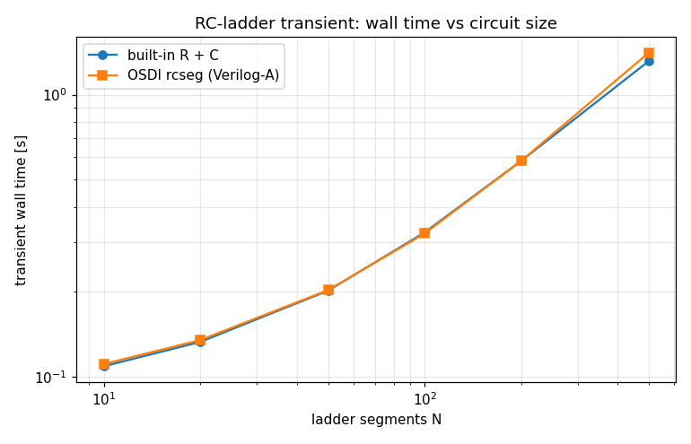
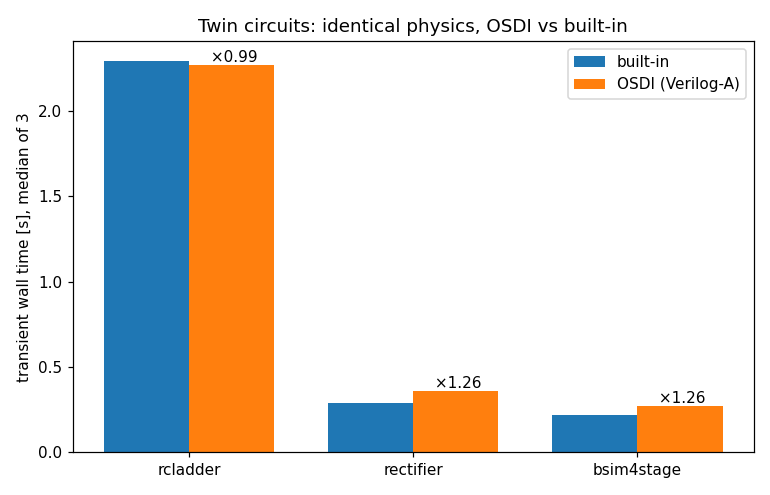
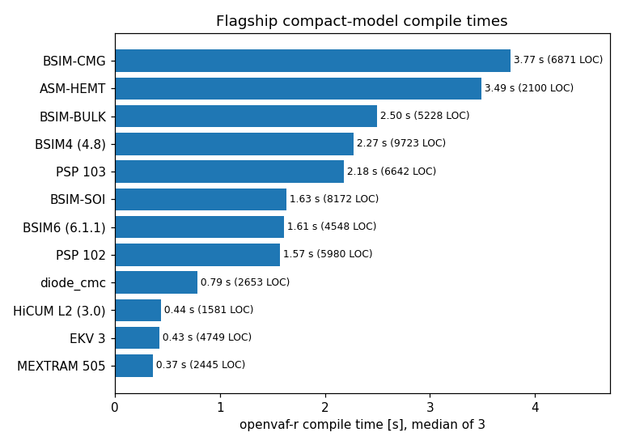

# Enhancement-74 benchmark results (reference run)

- Machine: Apple M2 Ultra — Darwin 25.5.0, arm64
- Toolchain: this repository's openvaf-r + ngspice-46 (see the git tag)
- Date: 2026-07-05

Timing is machine-dependent; regenerate with `python3 run_benchmark.py` for numbers comparable on your machine.

## [A] Compile time (openvaf-r, median of 3)

| Model | Lines (incl. includes) | Compile |
|---|---:|---:|
| BSIM4 (4.8) | 9723 | 2.27 s |
| BSIM6 (6.1.1) | 4548 | 1.61 s |
| BSIM-BULK | 5228 | 2.50 s |
| BSIM-CMG | 6871 | 3.77 s |
| BSIM-SOI | 8172 | 1.63 s |
| PSP 103 | 6642 | 2.18 s |
| PSP 102 | 5980 | 1.57 s |
| HiCUM L2 (3.0) | 1581 | 0.44 s |
| MEXTRAM 505 | 2445 | 0.37 s |
| EKV 3 | 4749 | 0.43 s |
| ASM-HEMT | 2100 | 3.49 s |
| diode_cmc | 2653 | 0.79 s |

Total for the 12 flagships: **21.0 s**.

## [B] Simulation throughput: OSDI vs built-in twins

Identical physics on both sides (same equations, same model card),
so ngspice does the same numerical work and the waveforms agree;
the ratio isolates the OSDI evaluation overhead.

| Benchmark | built-in | OSDI | OSDI/built-in | timepoints | OSDI pts/s | max waveform diff |
|---|---:|---:|---:|---:|---:|---:|
| rcladder | 2.29 s | 2.27 s | 0.99 | 100306 | 44225 | 8.89e-32 V |
| rectifier | 0.29 s | 0.36 s | 1.26 | 20008 | 55231 | 2.77e-05 V |
| bsim4stage | 0.22 s | 0.27 s | 1.26 | 50008 | 182674 | 6.87e-03 V |

## [C] RC-ladder scaling (wall time vs circuit size)

| N segments | built-in | OSDI | ratio |
|---:|---:|---:|---:|
| 10 | 0.11 s | 0.11 s | 1.02 |
| 20 | 0.13 s | 0.14 s | 1.01 |
| 50 | 0.20 s | 0.20 s | 1.00 |
| 100 | 0.33 s | 0.32 s | 0.99 |
| 200 | 0.58 s | 0.58 s | 1.00 |
| 500 | 1.32 s | 1.41 s | 1.07 |

