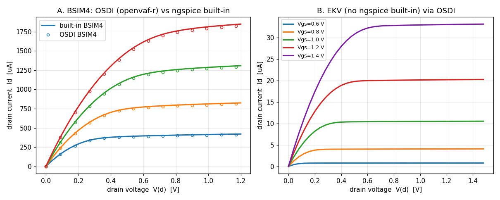

# Real production compact models — Enhancement-159

This brings up actual industry **CMC (Compact Model Coalition)** Verilog-A models
— the ones people tape out with — through the full `openvaf-r → OSDI → ngspice`
path, and validates their physics. It is the ultimate proof that the toolchain
handles real models, not just teaching examples.

The model sources are the CMC reference decks bundled with OpenVAF
(`OpenVAF-master-20260610/integration_tests/`); they are **compiled in place, not
copied**, so their licenses stay with them.

## BSIM4 — validated against ngspice's built-in

[BSIM4](../../OpenVAF-master-20260610/integration_tests/BSIM4/bsim4.va) is the
industry-standard bulk MOSFET (~12,600 lines of Verilog-A). ngspice has a
**built-in** BSIM4, so this is a rigorous self-check: the OSDI-compiled BSIM4.8
and the native BSIM4.8.3 are the *same model*, and they agree to a few percent
across the whole I-V family (the residual is the point-release version gap).

```
openvaf-r ../../OpenVAF-master-20260610/integration_tests/BSIM4/bsim4.va -o bsim4.osdi
ngspice -b bsim4_demo.cir
```

### The internal-node finding

Bringing BSIM4 up surfaced a genuine, general finding about OSDI MOSFET models:

> **OSDI keeps every internal node static — there is no dynamic node collapsing.**
> BSIM4 has internal drain/source nodes (`di`, `si`). With the default
> `rdsmod=0` the model expects the simulator to *collapse* `di→d`, `si→s`; OSDI
> cannot, so those nodes are left **floating** and the device conducts **zero
> current**. Enabling the external series-resistance nodes with **`rdsmod=1`**
> (the model near-shorts them, ~1 mΩ, when no S/D geometry is given) connects
> them and the device works.

So `rdsmod=1` is the way to use these OSDI MOSFET models. The model's own source
even carries `TODO` comments at the S/D-conductance code noting that all nodes
are kept static at setup. (`verify_compactmodels.py` check [3] pins this: default
`rdsmod=0` → Id = 0.)

## EKV — a model ngspice has no built-in for

[EKV](../../OpenVAF-master-20260610/integration_tests/EKV/ekv.va) (EPFL's compact
MOSFET, ~840 lines) is a model ngspice **cannot** simulate natively — so OSDI
genuinely extends ngspice's device set. It works out of the box (no `rdsmod`
wrinkle) and gives textbook saturation curves.

## Verify + figure

```
python3 verify_compactmodels.py    # 6 checks, under BOTH the Sparse and KLU solvers
python3 make_compactmodels_fig.py  # -> compactmodels_iv.png
```



* **A.** BSIM4 output family `Id(Vds)` for four `Vgs`: the OSDI-compiled BSIM4
  (markers) overlaid on ngspice's built-in BSIM4 (lines) — they track across the
  whole family.
* **B.** EKV output family via OSDI — five textbook saturation curves for a model
  ngspice has no built-in for.

## Why the results are physically correct

* **BSIM4 vs built-in.** Both are BSIM4; the OSDI model reproduces the native one
  to ~2% on the output curves and ~4.5% on the transfer curve, the difference
  being the BSIM4.8 vs BSIM4.8.3 point release — a direct, self-checking
  validation that openvaf-r's codegen and ngspice's OSDI stamping are correct on
  a 12.6k-line model.
* **EKV.** Drain current rises with gate overdrive and saturates as `Vds`
  exceeds the overdrive — the defining MOSFET behavior — with no built-in
  reference needed.

## Scope and follow-ups

The bundled CMC suite also includes BSIM3/6, BSIMSOI, BSIM-CMG, PSP, HICUM/L2,
HiSIM, ASMHEMT (GaN), MEXTRAM, and the CMC diode — a natural follow-up is to
extend this suite model by model. The internal-node-collapse limitation is
inherent to OSDI's static-node ABI; supporting compile-time **node collapsing**
in openvaf-r (so `rdsmod=0` works) would be its own enhancement.

See [Enhancement-159](../../enhancements_doc/Enhancement-159.md) for the full
write-up.
