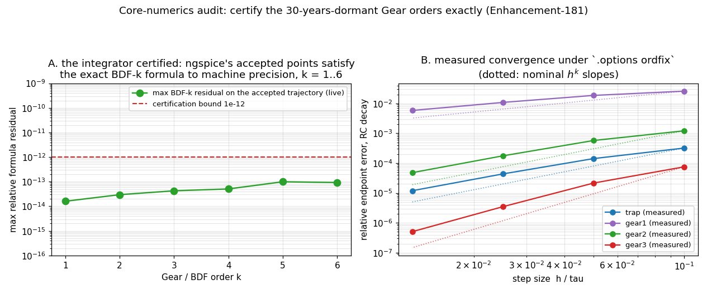

# Core-numerics audit: the integrator certified exactly (Enhancement-181)

The gap-analysis "Core numerics" table says integration and convergence are
on-par — but nobody had ever verified that ngspice's Gear (BDF) corrector
coefficients deliver their nominal order. Orders 3–6 were dead code for ~30
years until [E-128](../dynorder_examples/)'s `dynorder` woke them, and E-128
verified order *selection*, not coefficient *correctness*.



## The instrument: `.options ordfix=K`

Measuring convergence order from outside is impossible with the stock
controller — and three ways the naive experiment lies were found and are now
documented pitfalls:

1. **Loose tolerance inverts the order preference**: the LTE-limited step is
   `h_k = (c_k·tol)^{1/(k+1)}`, which *decreases* with k for tol ≫ 1 — the
   controller's refusal to climb is correct numerics, not a bug.
2. **The order-1 first step** proportional to the pinned step imposes an
   O(h²) startup floor that masks any order above 2.
3. **Large step ratios destabilize variable-step BDF at high order** — a ×2
   ramp at order 6 visibly seeds divergence (textbook variable-step BDF
   theory, observed live during the audit).

`ordfix=K` pins the order for verification: every converged step is accepted
(the step is ruled by `tmax`), the first step is shrunk 1000×, the order ramps
to K while the step is tiny, and the step then grows gently (×1.15) to the pin.

## The certification

With the instrument, the referee is airtight: dump the accepted trajectory at
full precision and check, at every stencil of k+1 uniformly spaced points,
that ngspice's values satisfy the **exact BDF-k formula** (Lagrange
differentiation on the actual nodes) for the circuit ODE. Result: residuals
≤ 1.3e-13 at every order 1–6, on ~90 stencils each — **the `NIcomCof`
coefficients are exactly right**. Measured global slopes confirm orders 1–3
asymptotically, and the trap-vs-Gear dissipation dichotomy on a lossless LC
matches theory (trap preserves amplitude, |R(iy)| = 1; Gear damps,
less at higher order).

## Also audited — no defects

- **Linear-solve precision** tracks conditioning theory under both solvers; a
  1e18-conductance-spread asymmetric mesh (VCCS included) solves to 1e-15
  against an exact-rational MNA referee.
- **DC convergence aids**: default / `noopiter` / `gminsteps=0` / `srcsteps=0`
  all land on the same operating point of a 40-diode hard-DC chain
  (spread ≤ 2.2e-6, tolerance-level), KLU ≡ Sparse to 1e-12.
- **`xmu`**: 0.5 is bit-identical to trap; 0.45 damps the lossless ring.
- **`lvltim=1`** (iteration-count timestep control) works and agrees with the
  default LTE control.

## Running

```sh
python3 verify_corenum.py     # 8 checks x {sparse, klu}
python3 make_corenum_fig.py   # figure
```
