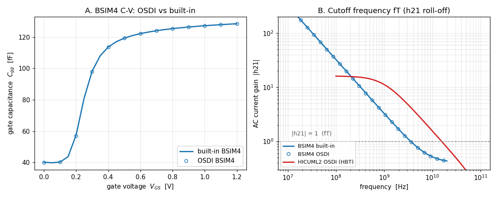

# Dynamic (AC / RF) compact-model validation — Enhancement-161

Enhancements [159](../../enhancements_doc/Enhancement-159.md) and
[160](../../enhancements_doc/Enhancement-160.md) validated the CMC compact models'
**DC** behavior. This one exercises their **dynamic** behavior — the part that
matters most for analog and RF — which flows through a completely different code
path: OSDI's **reactive (charge) Jacobian** stamping and ngspice's `.ac` analysis.
The models are the CMC reference decks bundled with OpenVAF, compiled in place.



## BSIM4 C-V — gate capacitance vs bias

The gate capacitance `Cgg(Vgs)` is extracted from `.ac` (`Cgg = Im(I_gate)/ω`) and
swept over gate bias. It rises from a small subthreshold value (~40 fF, overlap +
fringe) to the oxide capacitance in inversion (~129 fF) — the textbook MOSFET C-V
curve — and the OSDI model matches ngspice's **built-in** BSIM4 to **< 1 %** at
every bias. Because the capacitance is dominated by the (version-independent) oxide
term, this is an even tighter check of the reactive stamping than the DC I-V match.

## Cutoff frequency fT — AC current gain roll-off

The cutoff frequency `fT` is where the AC current gain `|h21| = |I_out/I_in|`
falls to 1. Panel B shows the `-20 dB/decade` roll-off and the `|h21|=1` crossing:

* **BSIM4** (MOSFET) — `fT ≈ 3.5 GHz`; OSDI matches the built-in to ~1 %.
* **HICUML2** (SiGe HBT) — ngspice has no built-in bipolar reference. The *default*
  model has zero transit time (`t0=0`) → infinite fT, so a realistic dynamic
  parameter set is supplied (`t0=10 ps`, 1 fF junction caps). The resulting fT sits
  right at the transit-time limit `1/(2π·t0) ≈ 15.9 GHz` and rises with collector
  current — textbook bipolar behavior.

## Run it

```
python3 verify_dynmodels.py    # 4 checks, under BOTH the Sparse and KLU solvers
python3 make_dynmodels_fig.py  # -> dynmodels_ac.png
```

## Why the results are physically correct

* **C-V shape.** In subthreshold the gate sees only overlap/fringe capacitance; as
  the channel inverts, the gate couples to the channel through the oxide, so `Cgg`
  climbs toward `Cox·W·L`. Matching the built-in model to sub-percent confirms the
  OSDI charge model and its reactive Jacobian are stamped correctly.
* **fT.** A single-pole roll-off gives `|h21| ≈ fT/f`, so `|h21|=1` at `f=fT`. For
  the MOSFET `fT ≈ gm/(2π·Cgg)`; for the bipolar, charge-control theory gives
  `fT ≈ 1/(2π·τ_f)` in the transit-time-limited regime — exactly where the
  measured 15.5 GHz lands for `t0 = 10 ps`.

## Notes

* `.ac` is supported under both the Sparse and KLU solvers, so every check runs
  under both.
* This is a validation/example enhancement — it exercises the existing toolchain
  and needs no ngspice/openvaf-r source change.

See [Enhancement-161](../../enhancements_doc/Enhancement-161.md) for the full
write-up.
