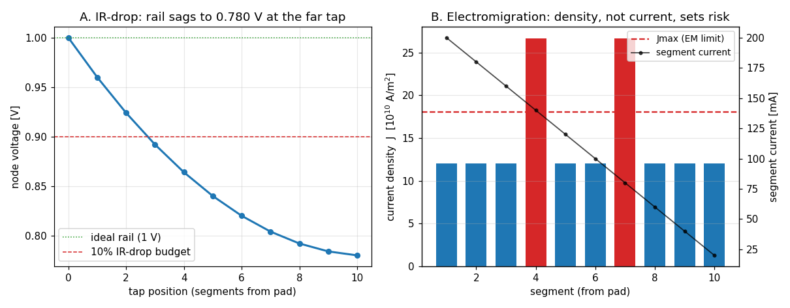

# Power-grid EMIR — electromigration + IR-drop — Enhancement-158

`emir` analyses the power-distribution network (PDN) of the loaded circuit after
a DC solve and reports the two classic power-grid reliability metrics — **IR-drop**
and **electromigration** — completing the reliability trilogy alongside device
aging (Enhancement-157).

```
emir [rail <V>] [thresh <frac>] [thick <m>] [jmax <A/m2>] [n <exp>] [tref <s>] [top <k>] [verbose]
```

## What it reports

* **IR-drop** — how far each node has sagged below the ideal supply rail under
  load (the resistive grid drops `I·R` between the pad and each tap). Reports the
  worst-case drop and every node past a threshold (default 10% of the rail).

* **Electromigration (EM)** — for each wire-segment resistor, the current
  **density** `J = |I| / (w · thickness)` and a Black's-equation lifetime. EM is
  driven by current *density*, not current, so a narrow wire can be the
  bottleneck even at modest current. Reports the worst-density segment, a ranked
  table, and every segment past the current-density limit `Jmax`, with a relative
  mean-time-to-failure `MTTF/ref = (Jmax/J)^n` (Black: `MTTF ∝ J^-n`; a segment at
  exactly `Jmax` has `MTTF` = the reference lifetime `tref`).

Parameters default to: `rail` = the highest node voltage (the supply pad),
`thresh` = 0.1, `thick` = 0.5 µm, `jmax` = 1e10 A/m² (~1 MA/cm²), Black `n` = 2,
`tref` = 10 years, `top` (table length) = 10.

## Run it

```
ngspice -b emir_demo.cir
```

[`emir_demo.cir`](emir_demo.cir) is a 1 V rail feeding a 3-segment ladder, each
tap drawing 0.1 A, wires tapering 2 µm → 1 µm → 0.5 µm:

```
emir: IR-drop  (rail = 1 V, threshold 10%)
  worst drop  0.3 V  (30.0% of rail)  at  n3
  3 nodes over threshold:
  node                        V         drop    %rail
  n3                        0.7          0.3     30.0
  n2                       0.75         0.25     25.0
  n1                       0.85         0.15     15.0
emir: electromigration  (thickness = 5e-07 m, Jmax = 3.5e+11 A/m2, Black n = 2)
  worst J  4e+11 A/m2  at  rw3   (MTTF 0.766 x ref)
  2 segments over Jmax:
  segment                I(A)       w(m)      J(A/m2)    MTTF(x ref)   status
  rw3                     0.1      5e-07        4e+11         0.7656     FAIL
  rw2                     0.2      1e-06        4e+11         0.7656     FAIL
  rw1                     0.3      2e-06        3e+11          1.361       ok
```

## Verify + figure

```
python3 verify_emir.py     # 7 checks, under BOTH the Sparse and KLU solvers
python3 make_emir_fig.py   # -> emir_grid.png
```



* **A.** Node voltage along a 10-segment ladder: the IR-drop accumulates from the
  pad to the far tap and crosses the 10%-of-rail budget partway out.
* **B.** Per-segment current density vs the EM limit `Jmax`. The well-tapered
  segments sit at a constant density below the limit; two deliberately under-sized
  segments violate it — **even though they carry less current than the safe
  trunk** (the black line is segment current).

## Why the results are physically correct

* **IR-drop is `I·R`, accumulated.** The current through the segment nearest the
  pad is the sum of every downstream load, so the drop is largest there and the
  voltage keeps sagging outward — exactly the ladder solve (`n1=0.85, n2=0.75,
  n3=0.70` for the demo). Doubling every load doubles every drop (linear).
* **Electromigration is set by current density, not current.** In the demo the
  widest wire `Rw1` carries the most current (0.3 A) yet has the *lowest* density
  and passes, while the narrow `Rw3` carries the least (0.1 A) yet has the
  *highest* density and fails. This is why real grids taper wire width with
  carried current to hold `J` roughly constant.
* **Black's equation.** `MTTF ∝ J^-n`: halving the density (at fixed everything
  else) multiplies lifetime by `2^n`. The reported `MTTF/ref` is exactly
  `(Jmax/J)^n`, so a segment right at the limit has `MTTF = tref`.

## Notes

* `emir` runs a fresh `op` first, leaving it as the current plot.
* Wire segments are ordinary resistors carrying a width (`w=…`); segments without
  a width are skipped for EM (and counted). The current loads can be current
  sources, transistors, or OSDI Verilog-A devices — `verify_emir.py` covers an
  OSDI load.
* Solver-independent: `emir` reads a DC solution and per-resistor currents, so it
  is identical under Sparse 1.3 and KLU.

See [Enhancement-158](../../enhancements_doc/Enhancement-158.md) for the full
write-up.
