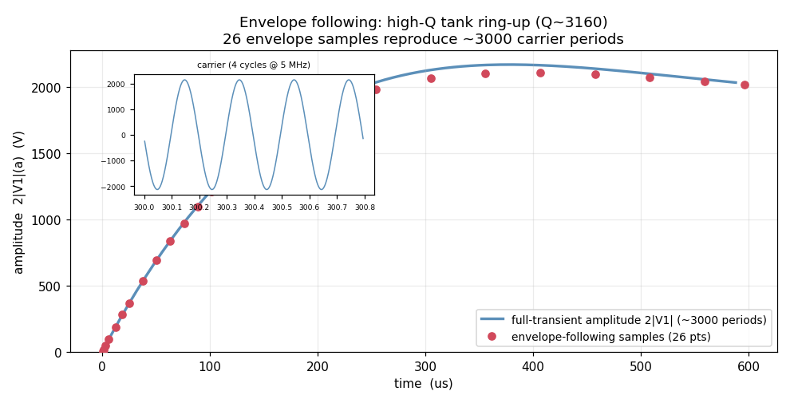

# Envelope Following (Enhancement-154)

The last remaining RF analysis. A carrier-driven circuit whose amplitude or phase
modulates **slowly** over **many** carrier periods — a ringing resonator, a settling
PLL, a modulated power amplifier — is expensive to simulate with a plain `.tran`,
which must integrate every one of the thousands of fast carrier cycles. Envelope
following samples the state once per carrier period `T = 1/fc` and integrates the
**slow drift** of those samples, jumping `M` carrier periods at a time.

```
envelope <node> <fc> <tstop> [nppp N] [m M0] [maxm Mmax] [reltol t] [settle ts]
```

It builds a plot named `envelope` holding the observable's amplitude `<node>_amp`
(the fundamental `2|V1|`), mean `<node>_dc`, and in-phase / quadrature components
`<node>_re` / `<node>_im`, versus (slow) time.



## Why implicit

The exact per-period map is `X_{n+1} = phi(X_n)`, where `phi(x)` integrates the DAE
one carrier period from `x`. Treating the period index as continuous, the envelope
obeys `dX/dn ~ phi(X) - X`. The **naive explicit** jump

```
X_{n+M} = X_n + M*(phi(X_n) - X_n)
```

is **unstable** for high-Q / oscillatory circuits: the one-period map has eigenvalues
on the unit circle, so `I + M*(Phi - I)` amplifies, and the envelope **blows up**.
This analysis uses the **implicit backward-Euler** jump

```
X_{n+M} = X_n + M*(phi(X_{n+M}) - X_{n+M})
G(Y) = Y - X_n - M*(phi(Y) - Y) = 0     Newton:  [(1+M) I - M*Phi] dY = -G
```

with `Phi = dphi/dY` the one-period **monodromy** matrix (finite-differenced). The
implicit step is A-stable, so it tracks a resonator's envelope without blowing up,
and its fixed point is the true per-period sequence, so it converges to the correct
steady state. The step size `M` is chosen by a step-doubling local-truncation-error
control, like transient step control.

The one-period map is integrated on a fixed grid of `nppp` points in **trapezoidal**
mode (backward-Euler numerically damps a high-Q resonance; trapezoidal does not),
self-started from the sampled state so `phi` is a true function of it.

## Demo

`envelope_demo.cir`: a parallel LC tank (`L1`, `C1`, loss `R1 = 100k`, `Q ~ 3160`)
driven at resonance `f0 ~ 5.033 MHz`. The amplitude rings up to `~Q` volts over
`~1000` carrier periods. `envelope` reproduces the whole `3000`-period ring-up with
**26 samples**, staying bounded — where an explicit envelope jump diverges.

```
ngspice -b envelope_demo.cir
```

## Verification

`verify_envelope.py` (both linear solvers): the `envelope` command returns a
plottable envelope with far fewer samples than periods; the EF amplitude tracks a
full `.tran` (same fundamental-Fourier measure) across the ring-up to **< 3 %** and
converges to the transient steady state; the high-Q resonator is tracked over 3000
periods and stays **bounded**; a moderate-Q tank is tracked to **~1.6 %**.

## Scope and accuracy

Envelope following pays off when the envelope is **much slower** than the carrier
(high-Q resonators, PLLs, modulated RF): there `M` stays large and EF covers
thousands of carrier periods with a few dozen period-solves (on the Q~3160 demo,
several times faster than the full transient). When the envelope is only a little
slower than the carrier (a fast ring-up), `M` is forced small and a full `.tran`
is competitive.

Accuracy is set mainly by `nppp` (points per carrier period, default 128) and the
envelope tolerance `reltol` (default 0.01). The self-start's first sub-step is
backward-Euler — the only self-starting method — which slightly damps a high-Q
resonance; it is sub-divided to keep that bias small (a bounded steady-state offset,
controlled by `nppp`). A second-order non-dissipative self-start and a sparse
monodromy solve (for larger circuits) are natural follow-ups.
