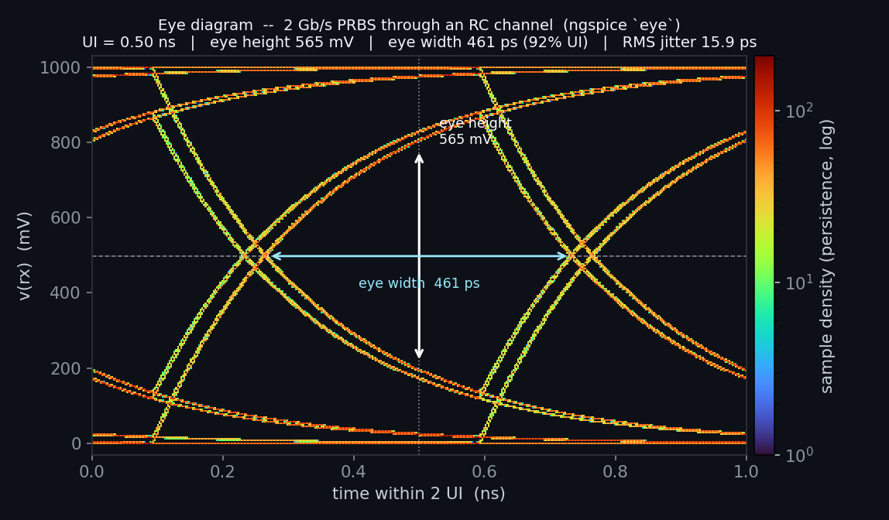

# Enhancement-207 — eye diagram / jitter analysis (`eye`)

The core measurement for serial links / SerDes: fold a received data waveform modulo
the unit interval (bit period) and read out the **eye** and its quality metrics.

## Usage

```
eye <expr> -ui <T> [-tstart <t0>] [-threshold <vth>] [-window <frac>]
```

Given a transient data signal `<expr>` (e.g. `v(rx)`) and its UI `-ui <T>`, `eye`:

- auto-detects the two logic rails (`level0`/`level1`) and the decision threshold
  (default: midway between the rails);
- finds every threshold crossing (linearly interpolated), estimates the UI phase,
  and computes each crossing's **TIE** (time-interval error) → **jitter RMS / pp**;
- measures the **eye height** (vertical opening at the sampling instant) and the
  **eye width** (UI − jitter_pp), plus the **eye width at BER 1e-12** (from the
  Gaussian random-jitter tail, ±7.035σ);
- folds the waveform modulo 2·UI into the `eye_wave` vs `eye_t` vectors — whose
  scatter plot **is** the eye diagram:

```
plot eye_wave vs eye_t
```

All results are published as permanent vectors: `eye_height`, `eye_width`,
`eye_width_ber12`, `eye_jitter_rms`, `eye_jitter_pp`, `eye_level0`, `eye_level1`,
`eye_amplitude`, `eye_threshold`, `eye_crossings`, `eye_ui`.

## Figure



`make_eye_fig.py` drives a 2 Gb/s pseudo-random bit stream through a bandwidth-limiting
RC channel (τ ≈ 0.5 UI, moderate inter-symbol interference), runs `eye v(rx) -ui 0.5n`,
and renders the folded `eye_wave` vs `eye_t` samples as a persistence-style 2-D
histogram — the eye above (eye height 565 mV, eye width 461 ps, 15.9 ps RMS jitter).

```
python3 make_eye_fig.py        # -> eye_diagram.png
```

## Demo

`eye_demo.cir` sends a 0/1 clock at UI = 0.5 ns through a bandwidth-limiting RC
channel (so the eye closes from inter-symbol interference) and runs `eye` on the
received node.

```
ngspice -b eye_demo.cir
```

## Verify

```
python3 verify_eye.py
```

Six checks against signals with **known** metrics: an ideal clock recovers rails
[0, 1] / amplitude 1 with ~zero jitter and a full-UI open eye; a clock carrying a
**known injected Gaussian jitter** (σ = 20 ps) is recovered to within a few percent
(measured ≈ 18.6 ps rms / 99 ps pp), with `eye_width` tracking `UI − jitter_pp`; and
the folded eye vectors are published.
