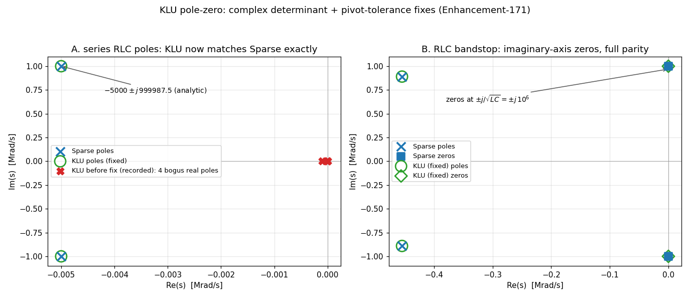

# KLU pole-zero: complex determinant, pivot tolerance, balanced output (E-171 + E-172)

A deep audit of the two linear-solver stacks (Sparse 1.3 and KLU) found that
**pole-zero analysis under `.option klu` silently produced garbage for any
circuit with complex poles or zeros** — a series RLC reported *four bogus real
poles* (−100, −10, −0.89, 0) instead of its conjugate pair −5000 ± j·999 987.5.
Real-axis poles/zeros came out right, which is exactly why the existing
regression (a single-real-pole RC) never caught it.



## The two defects (both in `maths/KLU/klusmp.c`)

1. **Complex determinant formula.** `spDeterminant_KLU` built each pivot as the
   mixed quantity `(1/(Ux·Rs), Uz·Rs)` and took its complex reciprocal. KLU's
   `Udiag` holds the *actual* pivots (its solve divides by them), so the correct
   contribution is simply `Udiag·Rs` — the mixed form is right **only when the
   pivot is real** (`Uz = 0`) and garbage everywhere else. Since pole-zero's
   Muller iteration evaluates `det(G + sC)` at complex trial points `s`, every
   complex-plane evaluation was wrong. The real branch was worse still: its
   product loop never ran (the loop index was left at N by the preceding scan),
   it divided instead of multiplying (copied from Sparse, whose `Diag` stores
   *reciprocal* pivots), and it never wrote the imaginary part, so the caller
   consumed an uninitialized value. Both branches also computed the permutation
   sign as `#non-fixed-points/2`, which is wrong for any cycle longer than 2 —
   now an exact cycle-decomposition parity.

2. **Unsanitized pivot tolerance.** Pole-zero calls `SMPcReorder` with
   `PivRel = 0.0`. Sparse's `spOrderAndFactor` **sanitizes** a non-positive
   threshold to its default; the KLU branch passed it straight to
   `Common->tol`, making KLU accept an *exactly-zero* diagonal as a pivot. At
   the `s = 0` trial an inductor branch has a `0.0` diagonal, so the
   factorization came back `KLU_SINGULAR` and PZ recorded a **spurious root at
   the origin** — and the poisoned search never expanded past |s| ≈ 10.

With both fixed, the KLU determinant matches Sparse to ~14 digits at every
trial point, and the E-113-era guard ("finite-zero computation is not supported
with KLU") is removed from `pzan.c` — its root cause was defect 2. (The
balanced/differential-output guard remains: `SMPcAddCol` genuinely has no KLU
branch.)

## Enhancement-172: balanced output + full partial pivoting

Two follow-up fixes complete KLU pole-zero support:

- **Balanced / differential output** (`pz n1 n2 n3 n4 vol` with a non-ground
  output reference) was guarded off as unsupported: the output fold
  `col(out−) += col(out+)` runs through `SMPcAddCol`, which had no KLU branch —
  and KLU's CSC sparsity pattern is fixed at conversion time, so the fold's
  fill-in cannot be created on the fly the way Sparse does. Fixed by reserving
  the **union pattern** in `CKTpzSetup` (every row of the solution column is
  added to the balance column before the COO→CSC conversion; duplicates fold
  into one slot) plus a merge-walk KLU branch in `SMPcAddCol`.
- **Full partial pivoting for PZ factorizations.** KLU's ordering is fixed at
  `klu_analyze` time (pattern-only); Sparse re-runs *value-aware* Markowitz
  ordering every trial. PZ sweeps |s| across ~20 decades, and with the relaxed
  default `tol = 0.001` the fixed ordering picked catastrophically-cancelling
  pivots at extreme |s| — the determinant came back with the **wrong sign and
  magnitude** (verified against an exact rational determinant of the same
  loaded matrix), minting spurious far-field "roots" at |s| ~ 1e19–1e21. The
  out-of-range-PivRel fallback is now `tol = 1.0` (full partial pivoting, KLU's
  only value-adaptive lever), which keeps the determinant accurate across the
  whole sweep — and also cured the twin-T conjugate-pair stall noted in E-171's
  scope: **all root sets now match Sparse**, including the twin-T (6/6 roots).


## Files

- **`verify_klupz.py`** — compares the **full pole/zero root set** between the
  two solvers on nine circuits, each also anchored to its analytic answer:
  series RLC (conjugate pole pair — the smoking gun), RC lowpass (the old-good
  case, no regression), lead network (finite real zero), RC highpass (origin
  zero), RLC bandstop (**purely imaginary zeros** — the hardest case), RLC
  bandpass (the finite-zero search that used to be guarded off under KLU);
  plus the E-172 additions — differential RC bridge and differential
  complex-pole pair (**balanced output**, formerly "not supported with 'option
  KLU'"), and the twin-T notch (formerly stalling on its conjugate zero pair).
- **`make_klupz_fig.py`** → **`klupz.png`** — s-plane root maps: Sparse ✕ vs
  fixed-KLU ○ coinciding, with the recorded pre-fix garbage in red.
- **`klupz_demo.cir`** — the series RLC under `.option klu`, printing the
  conjugate pair.

## Running

```sh
python3 verify_klupz.py       # 6 checks (drives both solvers itself)
python3 make_klupz_fig.py     # figure
ngspice -b klupz_demo.cir     # demo
```

## Scope note

The vintage spice3 PZ driver (Muller iteration on determinants) remains
numerically delicate near its noise floor *independent of solver* — on the RLC
bandpass it is **Sparse** that hits its iteration limit (KLU converges cleanly).
With the E-172 full-partial-pivoting fallback, every circuit in this battery
produces root sets identical between the two solvers to float precision
(the twin-T stall noted during E-171 is resolved).
