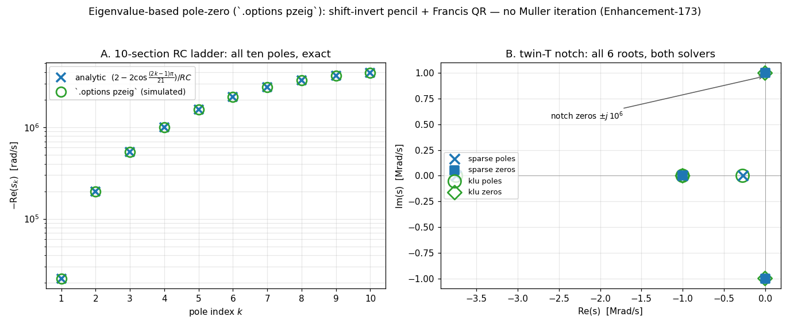

# Eigenvalue-based pole-zero: `.options pzeig` (Enhancement-173)

The classic spice3 pole-zero driver hunts the roots of `det(G + sC)` with a
**Muller iteration on determinant values** — famously fragile: iteration limits
("giving up after N trials"), noise-floor stalls, and search-path sensitivity
(E-171/172 fixed the KLU-side defects, but the ~1990 algorithm itself remains
delicate in both solvers). `.options pzeig` switches `.pz` to a **direct dense
eigenvalue method**:

1. The PZ-configured MNA matrix is affine in s: `A(s) = G + s·C`. Two loads
   (s=0, s=1) extract the pencil densely (a third load verifies affinity, so a
   non-polynomial device falls back cleanly with a message).
2. Roots of `det(G + sC) = 0` are the finite eigenvalues of the pencil, solved
   by **shift-invert linearization**: factor `(G + σC)` once at a non-root
   shift with the circuit's own sparse solver (Sparse or KLU), form
   `M = (G + σC)⁻¹C` by n sparse solves, and every finite root is
   `s = σ − 1/μ` for an eigenvalue μ of M — the pencil's infinite eigenvalues
   (C's structural singularity) land harmlessly at μ = 0.
3. Eigenvalues of the dense real M come from a classical
   **balance / Hessenberg / Francis double-shift QR** chain — a new
   self-contained eigensolver (`maths/dense/eig.c`, no LAPACK dependency).

No iteration, no trial sequence, no warnings: every root at once, under either
solver, including the balanced/differential-output forms. The default remains
the Muller method; `pzeig` is opt-in.



## Files

- **`verify_pzeig.py`** — 13 checks: series RLC conjugate pair (both solvers);
  a **10-section RC ladder** whose ten poles must match the analytic
  tridiagonal-eigenvalue formula `s_k = −(2−2cos((2k−1)π/21))/RC` *and* the
  Muller results root-for-root; the RLC bandpass where Muller hits its
  iteration limit (eig: identical roots, **no warning**); the twin-T notch
  (all 6 roots, both solvers); the bandstop's purely imaginary zeros ±j·10⁶
  (**exact** under eig); balanced/differential output; a purely resistive
  circuit (no roots, no crash); and that the default remains Muller.
- **`make_pzeig_fig.py`** → **`pzeig.png`** — ladder poles vs analytic +
  twin-T s-plane under both solvers.
- **`pzeig_demo.cir`** — the bandpass with `.options pzeig`.

## Running

```sh
python3 verify_pzeig.py       # 13 checks (drives both solvers + both methods)
python3 make_pzeig_fig.py     # figure
ngspice -b pzeig_demo.cir     # demo
```

## Scope

- Dense O(n²) memory / O(n³) QR — capped at 2000 unknowns (plenty for the
  small-signal blocks PZ is used on); above the cap it errors with a clear
  message pointing back to the Muller method.
- Root accuracy is that of a dense QR eigensolve: absolute error scales with
  the dominant root magnitude (~1e-9·|s_max| here), so an exact origin-zero can
  print as ~1e-7 when poles sit at 1e6 rad/s. Muller refines each root locally
  and can resolve wider dynamic ranges; the eig method never misses or invents
  a root. (The methods agree to ≥6 digits on every circuit in the battery.)
- Devices whose small-signal load is not affine in s (none in the standard
  device set; transmission lines are already rejected by PZ itself) are
  detected by the affinity check and reported.
