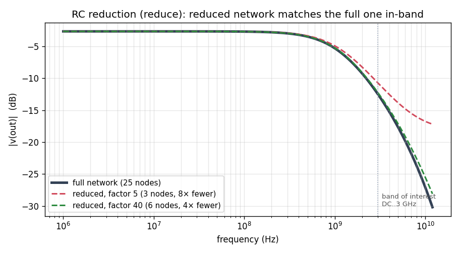

# RC network reduction — `reduce` (Enhancement-155)

Post-layout extraction turns a chip net into an enormous **parasitic RC network** —
thousands to millions of interior resistor/capacitor nodes — that is hopeless to
simulate raw. The `reduce` command collapses that network into a small, electrically
**equivalent** one that preserves the port behaviour over a chosen frequency band,
and writes it as an ordinary `.subckt` of R's and C's you can drop straight back into
a netlist.

```
reduce <fmax> [factor <f>] [maxdeg <d>] [file <fname>] [name <subckt>] [keep <node> ...]
```

**Scale (Enhancement-156).** The engine is **sparse**: the network is stored as
adjacency lists and interior nodes are eliminated in a **minimum-degree** order (like
sparse LU), so fill-in stays tiny — a degree-2 chain node merges two series elements
with *zero* fill. A **fill guard** (`maxdeg`, default 12) refuses to eliminate a node
once its degree grows past the threshold, so a dense mesh core is left intact instead
of blowing up. This lifts the node cap from ~2500 (the original dense build) into the
millions — a 65k-node network reduces in a few seconds.

> **Terminal order matters.** The reduced `.subckt`'s terminals are emitted in a fixed
> order, which `reduce` prints (`reduce: instantiate as x1 <ports…> <name>`). Instance
> it with the ports in *that* order, e.g. `x1 out in reduced` — not necessarily the
> order you typed them.

It uses **TICER** (Time-Constant Equilibration Reduction): Schur-complement (Gaussian)
elimination of interior nodes, kept first-order in `s` so the result stays realizable
as R's and C's — no model-order-reduction black box, no passive-synthesis step. A node
is eliminated only when its self time-constant frequency `f_n = G_n/(2π C_n)` lies well
above the band of interest (`f_n > factor·fmax`), so its dynamics are quasi-static
in-band. **DC is preserved exactly**; `factor` trades reduction against in-band
accuracy (smaller → more reduction, larger → tighter fit).

**Ports** (nodes that must be kept) are **auto-detected**: every node touched by a
device that is *not* a resistor or capacitor — a source, a transistor, an OSDI
Verilog-A device — plus ground and any `keep` nodes. Those are exactly the terminals
where the parasitic network meets the real circuit; only interior RC-only nodes are
removed.



## Demo

`reduce_demo.cir` reduces a 24-section RC ladder standing in for an extracted net:

```
ngspice -b reduce_demo.cir
```

It prints, e.g., `reduce: RC network 25 nodes -> 6 nodes (4.2x), 10 R + 11 C written
to reduced.sp` and plots the reduced AC response — which lies on top of the full
network's through the band of interest (see the figure: factor 40 tracks the full
25-node ladder with 6 nodes; the more aggressive factor 5 keeps only 2 nodes and
starts to deviate above ~1 GHz).

## Verification

`verify_reduce.py` (both linear solvers):

- **identity** — with a huge `factor` nothing is eliminated and the emitted subckt
  reproduces the full network's AC response **bit-for-bit** (the extraction + emission
  are exact);
- **reduction + accuracy** — a moderate factor cuts the node count while the reduced
  network stays within tolerance of the full one in-band, with **DC exact**;
- the accuracy/reduction **tradeoff is monotone** in `factor`;
- **OSDI auto-port** — an OSDI device attached to a node makes that node a kept port
  automatically, with no `keep` needed.

## Scope and follow-ups

The reducer is **sparse** (Enhancement-156): minimum-degree elimination + a `maxdeg`
fill guard scale it into the millions of nodes. Remaining follow-ups: optional
**passivity enforcement** (naive TICER can emit small negative elements, harmless for
AC but worth guarding for transient), and RLCk (inductive) reduction.
