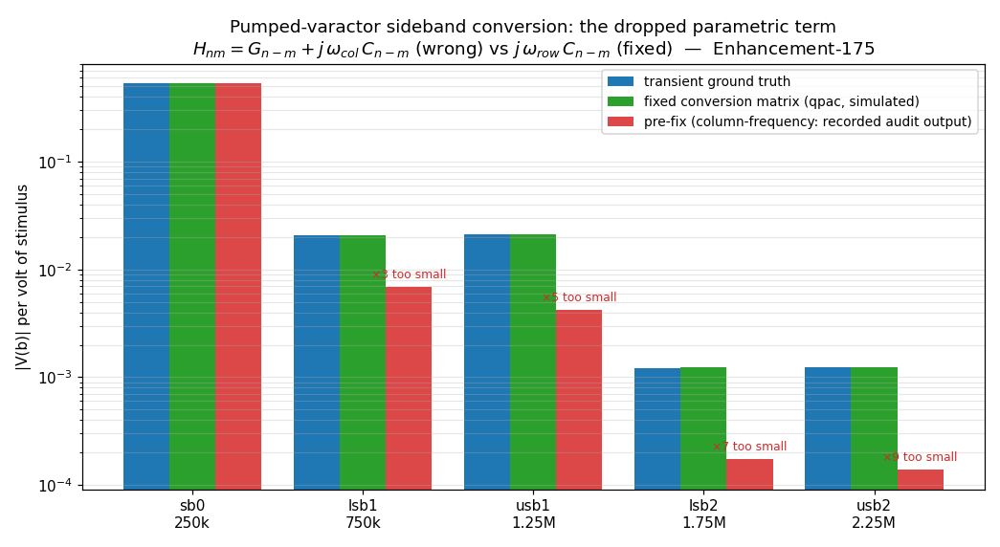

# LPTV conversion-matrix frequency fix (Enhancement-175, RF-suite audit)

A full audit of the RF suite (`.sp`/Touchstone, PSS/PAC/pnoise/pxf, PSP, HB,
QPSS + the two-tone family, hbosc/phasenoise) found **one real defect** — and
it sat in the mathematical heart of every periodic small-signal analysis.

## The bug

The conversion matrix scaled its reactive terms by the **column**
(input-sideband) frequency:

```
H_nm = G_{n-m} + j·ω_m·C_{n-m}        (wrong for small-signal)
```

For a small signal riding a periodic orbit, the capacitance waveform
`C(t) = ∂Q/∂v|orbit` is **frozen**, so `δi = d/dt[C(t)·δv] = Ċ·δv + C·δv̇` —
and the product rule gives the **row** (output-sideband) frequency:

```
H_nm = G_{n-m} + j·ω_n·C_{n-m}        (correct)
```

Using `ω_m` silently drops the **parametric-pumping term `Ċ·δv`** — the very
term that makes a pumped varactor convert. Every conversion sideband through a
time-varying capacitance came out scaled by exactly `ω_in/ω_out`: on the audit
circuit, **3× / 5× / 7× / 9× too small** at the ±1/±2 sidebands. Affected:
`pac`, `psp`, `pnoise`, `pxf`, `qpac`, `qpnoise`, `qpxf`, and the `phasenoise`
adjoint — for any circuit with nonlinear/pumped capacitance (varactors,
junctions, MOS gates: every real mixer or oscillator).

LTI circuits have no off-diagonal `C` harmonics, and on the diagonal
`ω_n = ω_m` — which is why the entire prior regression (linear RC checks)
passed: the E-171 *accidental correctness in the untested region* pattern.



## The subtlety that made HB innocent

The **harmonic-balance residual** uses the same builders but must **keep** the
column frequency: its reactive current is the exact chain rule
`d/dt Q(v(t)) = C(v(t))·v̇(t)`, whose n-th harmonic is `Σ_m C_{n-m}·(jω_m V_m)`.
That is why HB and QPSS-HB always matched transient ground truth while the
small-signal analyses did not — and why the fix is a **mode flag** on the two
builders (`pac_build_matrix`, `qp_build_matrix`) plus the two inline copies
(PAC adjoint, phasenoise adjoint): `smallsig=1` → row frequency;
`smallsig=0` (HB/QPSS-HB residual + Jacobian) → chain-rule column frequency,
unchanged.

## Ground truth

A plain **transient + one-beat Fourier projection** — the time-domain
integrator is independent of all conversion-matrix machinery. Circuit: 1 kΩ
driving an OSDI varactor (`C(v) = c0(1+αv)`, c0=1n, α=0.5) pumped by
1 V @ 1 MHz, probed by a 1 mV tone at 250 kHz.

| sideband | truth /V | fixed qpac /V | pre-fix /V |
|---|---|---|---|
| sb0 250k | 0.53817 | 0.53821 | 0.53821 (diagonal — unaffected) |
| lsb1 750k | 0.020755 | 0.020765 | 0.006922 (**×3 small**) |
| usb1 1.25M | 0.021050 | 0.021058 | 0.004212 (**×5 small**) |
| lsb2 1.75M | 0.0012221 | 0.0012284 | 0.0001755 (**×7 small**) |
| usb2 2.25M | 0.0012407 | 0.0012439 | 0.0001382 (**×9 small**) |

## What the audit found clean

- **`.sp` + Touchstone** (17 analytic/format checks): asymmetric 2-port column
  order, complex S-params, reciprocity, 3-port row-major wrapping, RI/MA/DB
  and Y/Z round-trips, GHz scaling — all exact.
- **HB**: cubic-resistive branch current exact to 7 digits against
  `a1A + (3/4)a3A³` / `(1/4)a3A³` (and identical under Sparse/KLU).
- **QPSS-HB and QPSS-tran**: two-tone fundamentals, IM3 `(3/4)a3A³`, third
  harmonics — exact / within transient truncation error; commensurate-tone
  aliasing correctly guarded.
- `cktspnoise.c` is dead code (`#ifdef RFSPICE_`) — noted, left as-is.

## Files

- **`verify_rfconv.py`** — 5 checks under both solvers: transient truth vs
  QPSS-HB (unchanged), truth vs fixed qpac (all 5 sidebands within 2%),
  pre-fix signature absent, HB + QPSS-HB analytic anchors.
- **`make_rfconv_fig.py`** → **`rfconv.png`**, **`rfconv_demo.cir`**,
  **`varcap.va`** (the OSDI varactor).

## Running

```sh
python3 verify_rfconv.py       # 5 checks x {sparse, klu}
python3 make_rfconv_fig.py     # figure
ngspice -b rfconv_demo.cir     # demo
```
