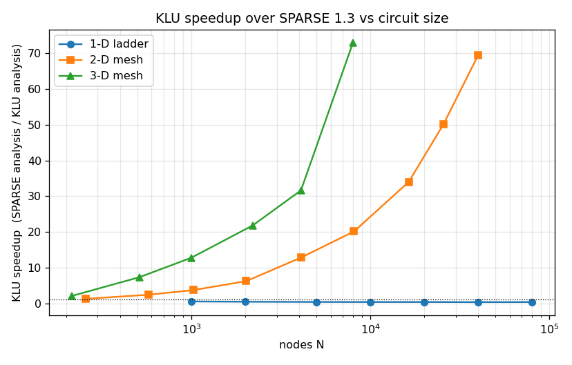
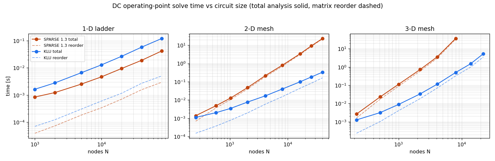
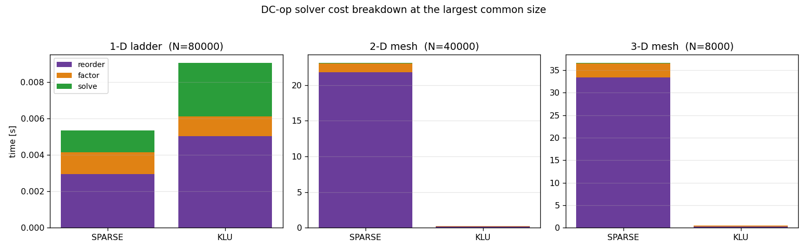
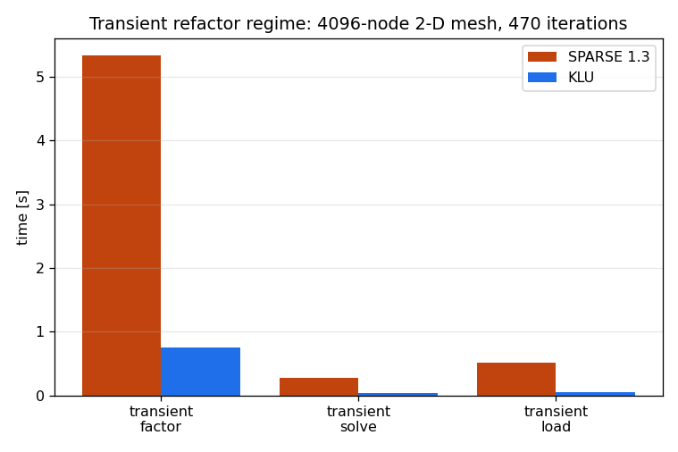
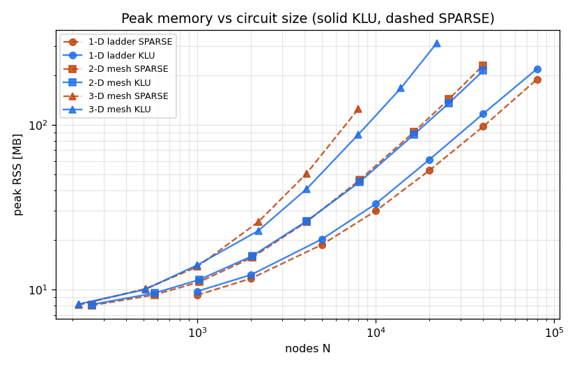

# Solver stress test — results

Reference machine: **Apple silicon (arm64), Darwin 25.5.0**, ngspice-46 from
`bin/macos/apple-silicon/ngspice`. Timing is machine-dependent — regenerate with
`python3 stress.py && python3 plot_stress.py` for numbers comparable to yours.
See [README.md](README.md) for the method; every DC point below was checked for
correctness (max |V_klu − V_sparse| = **0.0** — bit-identical — at every size in
all three topologies).

## Headline

For **1-D** circuits KLU is a slight loss; for **2-D / 3-D** meshes it wins by
one to two orders of magnitude, and the win grows without bound as the circuit
grows. The entire difference is the **matrix reorder** (fill-reducing ordering):
SPARSE 1.3's Markowitz search scales roughly `O(N²)` on a 2-D/3-D mesh while
KLU's AMD ordering scales roughly `O(N^1.5)`.

*Total analysis time (solid) sits right on top of the reorder time (dashed) for
SPARSE on the meshes — reorder is essentially the whole cost.*

## [1] 1-D ladder (tridiagonal — KLU's worst case)

Both solvers are `O(N)`; KLU's per-solve overhead makes it **~2–3× slower**.
This is the regime the old `benchmark_examples/[F]` measured, and it's why the
default is SPARSE.

| N | SPARSE reorder | SPARSE analysis | KLU analysis | KLU speedup |
|---:|---:|---:|---:|---:|
| 1 000 | 0.04 ms | 0.85 ms | 1.6 ms | 0.5× |
| 10 000 | 0.34 ms | 4.7 ms | 12.9 ms | 0.4× |
| 40 000 | 1.6 ms | 19 ms | 58 ms | 0.3× |
| 80 000 | 3.0 ms | 42 ms | 121 ms | 0.3× |

## [2] 2-D mesh (KLU's sweet spot)

Crossover is at **N ≈ 400 nodes**; past that KLU pulls away fast. At a
200×200 grid (40 000 nodes) SPARSE spends **21.8 s just reordering**; KLU does
the whole solve in 0.33 s.

| N | SPARSE reorder | SPARSE analysis | KLU analysis | KLU speedup |
|---:|---:|---:|---:|---:|
| 576 | 3.8 ms | 4.9 ms | 2.0 ms | 2.4× |
| 4 096 | 0.19 s | 0.22 s | 17 ms | **12.8×** |
| 16 384 | 3.08 s | 3.39 s | 0.10 s | **34×** |
| 25 600 | 8.54 s | 9.16 s | 0.18 s | **50×** |
| 40 000 | 21.8 s | 23.2 s | 0.33 s | **69×** |

## [3] 3-D mesh (heavy fill-in)

The most punishing case. By 8 000 nodes SPARSE needs **36.6 s** and beyond that
blew the 30 s budget and was skipped; KLU sailed on to a 28³ cube (21 952 nodes,
8 M fill-in non-zeroes) in 5.4 s.

| N | SPARSE reorder | SPARSE analysis | KLU analysis | KLU speedup |
|---:|---:|---:|---:|---:|
| 512 | 17 ms | 23 ms | 3.2 ms | 7.3× |
| 2 197 | 0.60 s | 0.73 s | 34 ms | 21.8× |
| 4 096 | 3.09 s | 3.64 s | 0.12 s | **31.6×** |
| 8 000 | 33.4 s | 36.6 s | 0.50 s | **73×** |
| 13 824 | — (over budget) | — | 1.5 s | — |
| 21 952 | — (over budget) | — | 5.4 s | — |

## [4] Transient — the repeated-refactor regime

A 64×64 mesh (4 096 nodes) with a cap at every node, pulsed source, fixed-step
`.tran` (470 iterations, same for both). This is where KLU's cheap numeric
refactor (reuse the symbolic ordering, refactor numerics only) compounds over
every timepoint:

| | transient factor | transient solve | wall |
|---|---:|---:|---:|
| SPARSE 1.3 | 5.33 s | 0.28 s | 6.5 s |
| KLU | 0.76 s | 0.044 s | 0.98 s |
| **KLU speedup** | **7.0×** | **6.5×** | **6.6×** |

## [5] Memory & correctness

KLU is **not** a memory hog. On 1-D it uses slightly more (it stores explicit
non-zeroes where SPARSE reports a trivially-banded matrix); on the meshes AMD
ordering produces *fewer* fill-in non-zeroes than Markowitz, so KLU is actually
**leaner**: at 2-D 40 000 nodes KLU held 1.89 M non-zeroes / 213 MB versus
SPARSE's 2.14 M / 229 MB. On 3-D KLU completed 21 952 nodes at 313 MB, a size
SPARSE could not finish in the time budget at all.

Both solvers produced **bit-identical** DC operating points at every tested
size (max |ΔV| = 0.0) — this is a pure speed/scaling story, not an accuracy
trade-off.

## Takeaways

- **Default SPARSE 1.3 is the right default for small and 1-D-like circuits**
  (ladders, filters, transmission lines, most textbook decks): KLU's setup
  overhead isn't repaid.
- **Add `.options klu` for any large 2-D/3-D-structured network** — power/ground
  grids, substrate and thermal meshes, large extracted-RC parasitic decks,
  detailed interconnect. The break-even is only a few hundred nodes; by a few
  thousand nodes KLU is 10–30× faster and the gap keeps widening.
- **KLU turns "won't finish" into "sub-second."** SPARSE's Markowitz reorder is
  the scaling wall (`~O(N²)` on meshes); KLU's `O(N^1.5)` AMD ordering plus
  numeric-only refactor is what makes large-node transient and DC sweeps
  practical. It costs slightly *less* memory on those circuits too.
- This complements the million-element OSDI benchmark: with 10⁶ devices under
  KLU the remaining bottleneck is single-threaded numeric factorization, not the
  ordering — consistent with the reorder-dominated picture here at smaller N.
