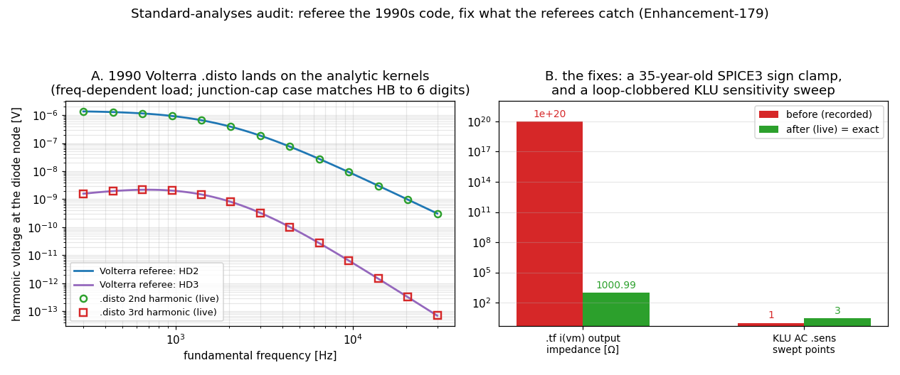

# Standard-analyses audit: referee battery + three fixes (Enhancement-179)

The gap-analysis doc marks the "Standard analyses (analog)" table all on-par —
but several rows are 1990s SPICE3 code whose *values* had never been checked
against independent physics (the E-171/175/177/178 accidental-correctness
lesson). This suite embeds the referees. Both solvers, every check.



## The three fixes

1. **`.tf` current-output impedance** (`tfanal.c`): `.tf i(vm) vin` always
   reported output impedance **1e20** — the code clamps `1/MAX(1e-20, rhs)`
   where the branch current of the unit forcing is *negative* for every passive
   network (the input-impedance path right above correctly divides by `-rhs`).
   Inherited verbatim from Berkeley SPICE3 — a 35-year-old bug. Now exact
   (RL + node Thevenin, digit-perfect vs hand analysis).
2. **KLU AC sensitivity truncation** (`cktsens.c`): the KLU complex-conversion
   block inside the frequency loop reused `i` — the outer loop variable — so
   after the first point `i = DEVmaxnum` ended the sweep: **one frequency
   point, silently**. The surviving point was correct, which is why E-62's
   single-point check passed. Now the full sweep matches the analytic
   `dV/dC = −jωR/(1+jωRC)²` to 6 digits under both solvers.
3. **`.meas DERIV{ATIVE}` implemented** (`com_measure2.c`): parsed since the
   SPICE3 era but never evaluated — an explicit *"currently not supported"*
   stub with an empty `#if 0 measure_deriv()` placeholder. Implemented as a
   3-point Lagrange-quadratic derivative on the nonuniform time grid (`AT=`
   and `WHEN` forms), verified against the analytic sine slope to 5 digits.
   The `DERIVATIVE`/`INTEGRAL` long spellings are now accepted too.

## Measured-correct (the rest of the table)

- **`.disto`** — the 1990 Volterra code holds up impressively: HD2/HD3 match
  an analytic diode-kernel referee **with a frequency-dependent load**
  (harmonic loads correctly at Z(2ω)/Z(3ω) — the E-177-style frequency probe
  is clean) to ≤0.06%; the SIM2 two-tone path (f1+f2, f1−f2, 2f1−f2) matches
  including cascade terms; Volterra amplitude scaling is exact; and
  nonlinear-junction-capacitance harmonics agree with the E-134 **Harmonic
  Balance** engine to ~6 digits — two fully independent engines.
- **`.noise` integrals** — `onoise_total²` equals the band-limited analytic
  (→ kT/C) to 0.06% and the flicker log-integral to 6 digits.
- **`.sens`** — DC sensitivities at a *nonlinear* OP (dv/dRs, dv/dIS) match
  central finite differences to 5–6 digits, model parameters included.
- **`.pz` at a nonlinear OP works** — the E-62 "nonlinear pz quirk" was the
  input *convention* (a bias source on the injection node shorts it; ngspice's
  refusal is correct). The driving-point form returns the linearized pole
  −(1/Rs+g_d)/C to 0.02%.
- **`.tran`/`.op`/`.meas`** — trap/gear both ≤4e-7 vs the analytic RC decay;
  hard-DC homotopy identical across solvers; RMS/PP/INTEG/WHEN ≤1e-6.

## Running

```sh
python3 verify_stdaudit.py     # 8 checks x {sparse, klu}
python3 make_stdaudit_fig.py   # figure
```
