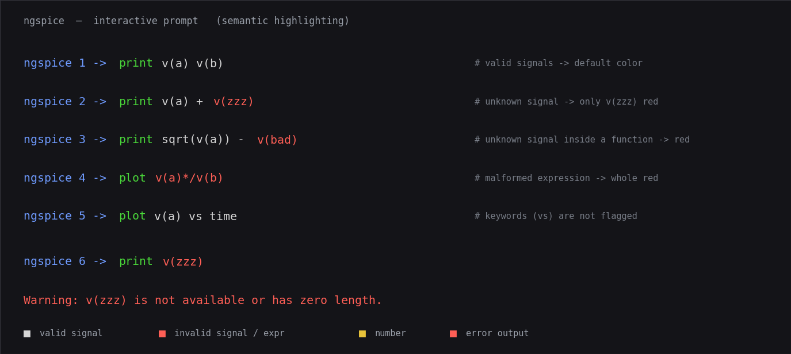

# Interactive syntax highlighting (Enhancements 169 & 170)

ngspice now **colors the interactive command line as you type it**. The command
word is shown **green** the moment it is a recognized command, **red** when it
cannot become one, and left the normal color while it is still a valid prefix
being typed. Numbers, quoted strings and `-option` flags get their own colors, so
a mistyped command or argument is visible before you press Enter.


**Enhancement-170** extends this from *lexical* to *semantic* coloring: it checks
whether the **signals** and **expressions** you type actually exist and parse, and
draws **error output in red**.



- An invalid signal (`v(typo)`, `i(nope)`, `@dev[bad]`) turns **red**; a valid one
  keeps the default color. Inside an expression, only the invalid signal reddens
  (`v(a)+v(zzz)` → just `v(zzz)`).
- A genuinely malformed expression (`v(a)*/v(b)`) reddens as a whole, checked with
  the real parser (muted). A half-typed one (`v(bP`, `v(a)+`) stays neutral.
- Error/warning output is drawn red at an interactive terminal.

This is a real ngspice change (`src/frontend/syntaxhl.c`, wired into the readline
prompt in `src/main.c`), not an example-only enhancement.

## How it works

- The command word is classified exactly the way the interpreter resolves it —
  looked up in the live command table (`cp_coms`) plus the control keywords
  (`if`, `while`, `foreach`, …). So "is this green?" always matches "will this
  run?".
- A partly typed word (`plo`) is a **prefix** of some command (`plot`), so it
  stays neutral — it only turns red once it can no longer become any command
  (`plt`).
- Live coloring is done by overriding GNU readline's redisplay function; it draws
  the colorized line only when it fits on one terminal row and otherwise defers to
  readline's own redisplay, so a wrapped line is never corrupted.

## Controls

- **On by default** at an interactive terminal. Turn it off with
  `set no_syntax_highlight` (and back on with `unset no_syntax_highlight`).
- The `NO_COLOR` environment variable is honored (no coloring when set).
- Coloring only happens on a real terminal — a piped or redirected
  (non-interactive) session never has color codes injected into its output.

## The `synhl` command

`synhl <command line>` prints the colorized form of a line without needing an
interactive terminal — handy for previewing, and it is what makes the coloring
engine testable in batch mode:

```
ngspice -> synhl tran 1n 100n
tran 1n 100n         # 'tran' green, '1n'/'100n' yellow
```

## Files

- **`verify_syntaxhl.py`** — 11 checks: the coloring **engine** (via `synhl` in
  batch: green valid / red unknown / neutral prefix, numbers, strings, options,
  case-insensitive), and the **live** as-you-type behavior driven through a
  pseudo-terminal (green/red/neutral on the fly, `NO_COLOR` and non-tty suppress
  color). The live layer is skipped automatically on a build without GNU readline
  (the shipped binaries are built with `--with-readline=yes`).
- **`make_syntaxhl_fig.py`** → **`syntaxhl.png`** — renders the *actual* ANSI
  output from ngspice as a terminal window (a gallery of commands plus the
  as-you-type progression).
- **`syntaxhl_demo.cir`** — previews the coloring with `synhl`.

## Running

```sh
python3 verify_syntaxhl.py           # 11 checks (engine + live)
python3 make_syntaxhl_fig.py         # figure
ngspice -b syntaxhl_demo.cir         # preview gallery
# or, interactively, just type at the prompt:
ngspice
ngspice 1 -> plot v(out)             # 'plot' shows green as you complete it
```

## Note

Live as-you-type coloring requires a **readline-enabled** ngspice (the shipped
binaries are). In a build without readline the terminal stays in cooked mode and
the application only sees a line after Enter, so live coloring is not possible;
the `synhl` command still works there.
