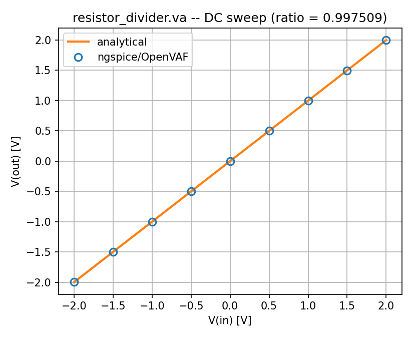
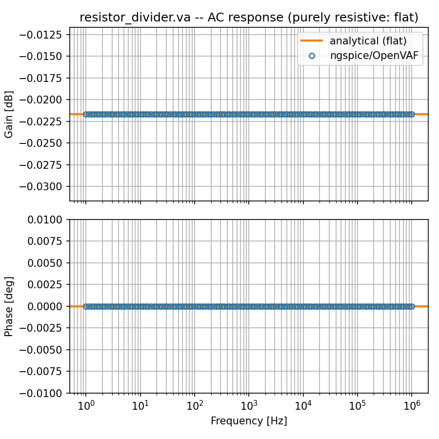
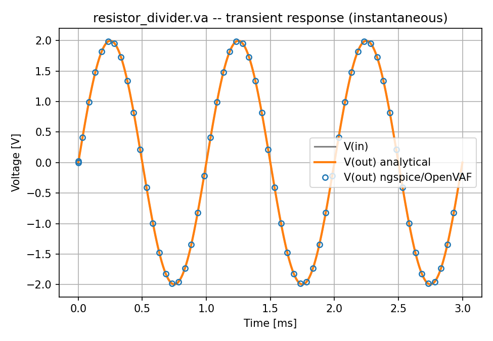
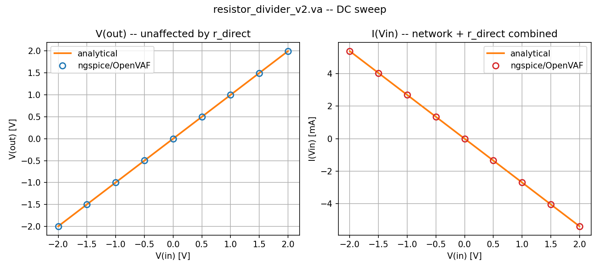
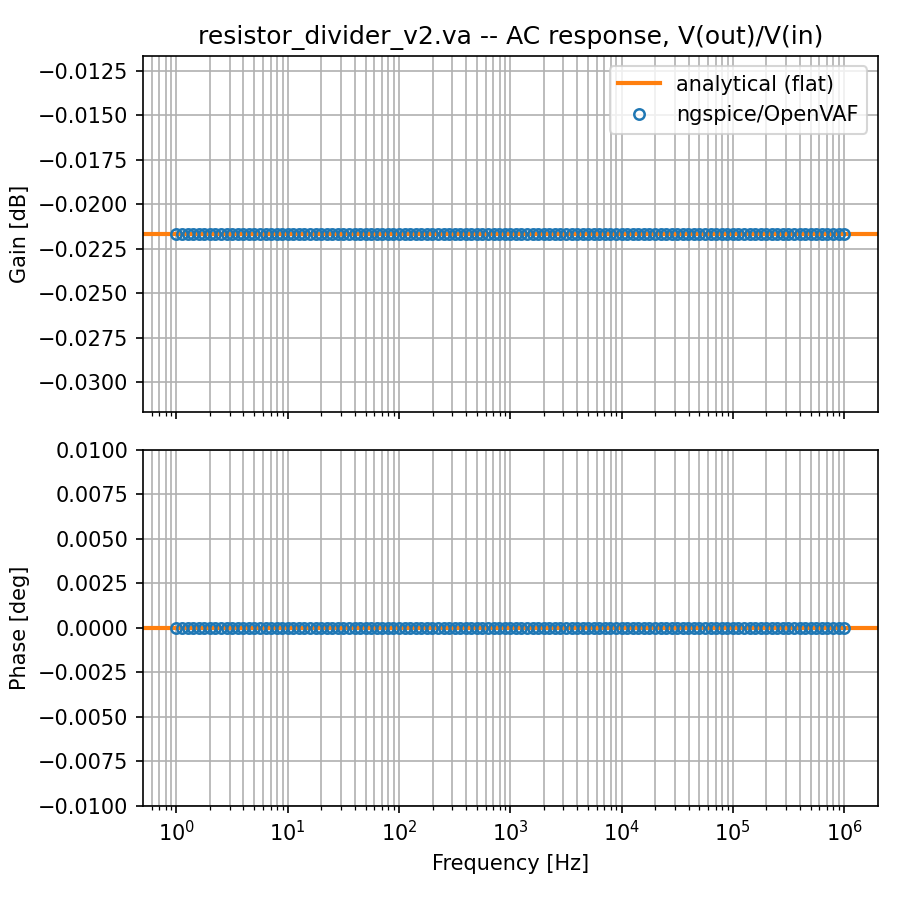
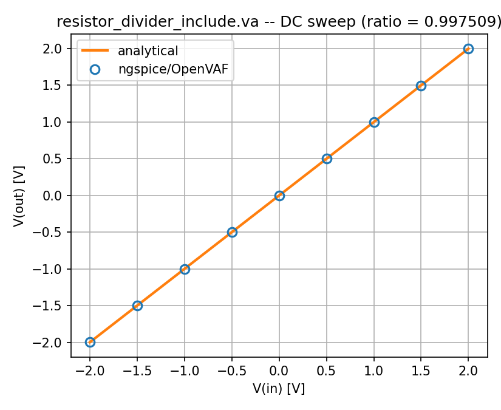
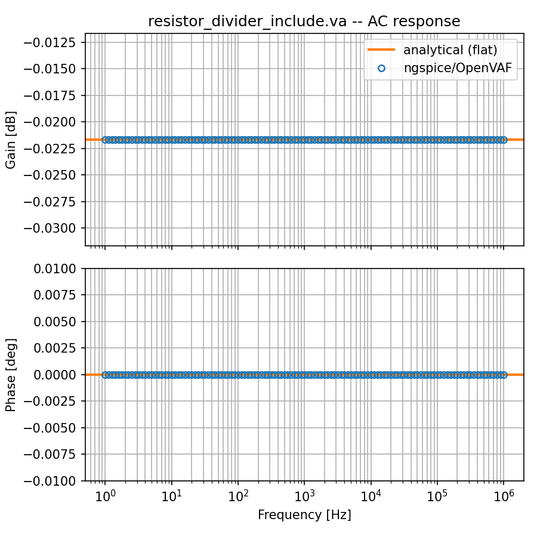
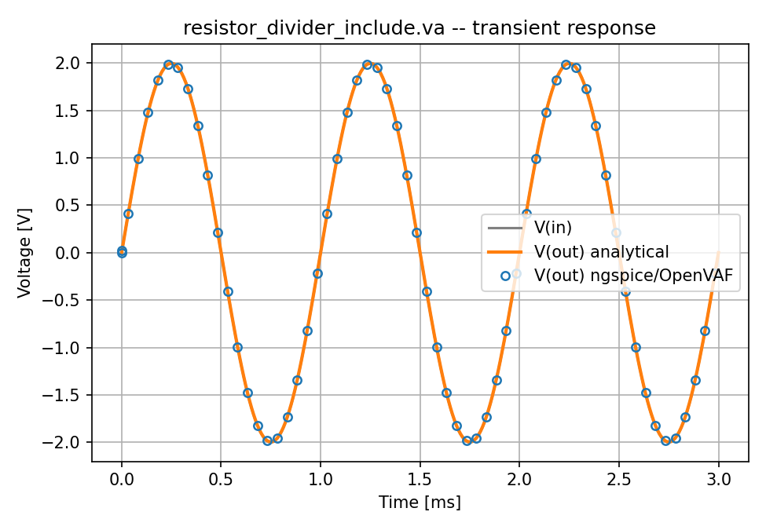

# Module instantiation examples (version6)

Self-contained correctness examples for OpenVAF **module instantiation**
support, covering **DC**, **AC**, and **transient** analysis. Uses the
**version6** toolchain:

- compiler : `../OpenVAF-master/target/release/openvaf-r` (built with `--features llvm18`)
- simulator: `../ngspice-46/build/src/ngspice` (locally built, OSDI-capable — not the system-wide `ngspice`)

See `../Enhancement-5.md` for the full implementation writeup.

## The model: a hierarchical resistor network

`resistor_divider.va` exercises the full feature set added in
Enhancement-5 in one file:

```verilog
module resistor(p, n);
    inout p, n;
    electrical p, n;
    parameter real r = 1000;
    analog begin
        I(p, n) <+ V(p, n) / r;
    end
endmodule

module buffer(in, out);
    inout in, out;
    electrical in, out;
    resistor #(.r(1)) rb(in, out);
endmodule

module divider(in, out, gnd);
    inout in, out, gnd;
    electrical in, out, gnd;
    buffer b1(in, out);                     // nested instantiation
    resistor #(.r(1e3)) r1(in, out);         // named parameter override
    resistor #(2e3) r2(.p(out), .n(gnd));    // positional override, named ports
    resistor rarr[0:1](out, gnd);            // instance array -> 2 instances
endmodule
```

`buffer` (1 ohm) and `r1` (1e3 ohm) end up in parallel between `in`/`out`;
`r2` (2e3 ohm) and both `rarr` elements (1e3 ohm each) end up in parallel
between `out`/`gnd` — an ordinary two-resistor voltage divider once each
parallel group is combined analytically.

## The test circuit

All three `.cir` files instantiate `divider` and drive `in` with a single
source, probing `V(out)`:

```
.model dividermodel divider
Ndut in out 0 dividermodel
```

Building and simulating:

```sh
openvaf-r resistor_divider.va -o resistor_divider.osdi
ngspice -b dc_sim.cir     # writes dc.txt
ngspice -b ac_sim.cir     # writes ac.txt
ngspice -b tran_sim.cir   # writes tran.txt
python3 compare_divider.py   # verifies all three, writes dc.png / ac.png / tran.png
```

## Results

The network is purely resistive (no inductors/capacitors anywhere in the
instantiated tree), so the analytical prediction is a plain real-valued
voltage-divider ratio, frequency-independent, with no time constant:

| Analysis | Sweep | Expected | Observed |
|---|---|---|---|
| DC | `V(in)` from −2V to 2V | `V(out) = ratio * V(in)`, `ratio = 0.997509` | exact match across the sweep (max err `1.0e-9`) |
| AC | 1 Hz – 1 MHz | flat gain `20*log10(ratio) = -0.021666 dB`, phase `0°` (purely resistive) | flat to `1.6e-11 dB` / `0°` across 6 decades |
| Transient | 1 kHz / 2V sine drive | `V(out)(t) = ratio * V(in)(t)` at every instant (no delay) | tracks pointwise to `8.5e-9` |

<p>
  
  
  
</p>

`compare_divider.py` combines the parallel-resistor groups analytically
and checks all three against ngspice/OpenVAF, printing per-point errors
before asserting each stays below `1e-6`.

---

## resistor_divider_v2.va: instantiation *and* a directly-written analog block

Same network, but `divider` **also has its own `analog begin...end`
block** (a direct resistor from `in` to `gnd`, `r_direct = 5e3`, in
parallel with the whole instantiated in→out→gnd network) — exercising a
module that mixes instantiation statements with ordinary directly-written
analog behavior in the same body:

```verilog
module divider(in, out, gnd);
    ...
    parameter real r_direct = 5e3;

    buffer b1(in, out);
    resistor #(.r(1e3)) r1(in, out);
    resistor #(2e3) r2(.p(out), .n(gnd));
    resistor rarr[0:1](out, gnd);

    analog begin
        I(in, gnd) <+ V(in, gnd) / r_direct;
    end
endmodule
```

`V(out)` alone can't distinguish "`r_direct` present" from "absent" (it's
a separate path straight from the ideal source to ground, entirely
bypassing node `out`) — so `I(Vin)`, the *current drawn from the source*,
is the signal that actually exercises the module's own directly-written
contribution, on top of the inlined instance equations.

```sh
openvaf-r resistor_divider_v2.va -o resistor_divider_v2.osdi
ngspice -b dc_sim_v2.cir     # writes dc_v2.txt
ngspice -b ac_sim_v2.cir     # writes ac_v2.txt
ngspice -b tran_sim_v2.cir   # writes tran_v2.txt
python3 compare_divider_v2.py   # verifies all three, writes dc_v2.png / ac_v2.png / tran_v2.png
```

### Results

| Analysis | Checks | Observed |
|---|---|---|
| DC | `V(out)` (unaffected by `r_direct`) *and* `I(Vin)` (network + `r_direct` combined) | both exact (max err `1.0e-9` / `2.6e-12`) |
| AC | `V(out)/V(in)` — same flat/zero-phase prediction as the base example | flat to `1.6e-11 dB` / `0°` |
| Transient | `V(out)(t) = ratio * V(in)(t)` pointwise | tracks to `8.5e-9` |

<p>
  
</p>
<p>
  
  
</p>

Every check matches to solver precision, confirming the inlined instance
equations and the module's own directly-written contribution are both
present and correctly combined under DC, AC, *and* transient analysis —
not just at a single operating point.

---

## resistor_divider_include.va: instantiating a module defined in another file

Module instantiation also works across an `` `include `` boundary: the
target module doesn't need to be declared in the same file as the
instantiation statement. `resistor_lib.va` declares `resistor`/`buffer`
(nothing new — the same two modules as above); `resistor_divider_include.va`
pulls them in and instantiates them exactly as before:

```verilog
// resistor_lib.va
`include "disciplines.vams"

module resistor(p, n);
    ...
endmodule

module buffer(in, out);
    ...
endmodule
```

```verilog
// resistor_divider_include.va
`include "resistor_lib.va"

module divider(in, out, gnd);
    inout in, out, gnd;
    electrical in, out, gnd;
    buffer b1(in, out);
    resistor #(.r(1e3)) r1(in, out);
    resistor #(2e3) r2(.p(out), .n(gnd));
    resistor rarr[0:1](out, gnd);
endmodule
```

This works for a simple, self-contained reason: `` `include `` is a
**preprocessor** directive, resolved by OpenVAF's `preprocessor` crate
*before* parsing ever happens (see `Enhancement-5.md` §7's discussion of
`db.preprocess`/`db.parse`). By the time the elaboration pass looks at the
parsed source tree, `resistor_lib.va`'s contents have already been merged
into one token stream / one parse tree together with
`resistor_divider_include.va`'s own text — `resistor`/`buffer` are just
two more top-level modules in that single merged tree, indistinguishable
from modules declared directly in the main file. No special-casing was
needed for this to work; it falls directly out of where in the compiler
pipeline the elaboration pass sits.

(The include search path always checks the including file's own directory
first, so a plain `` `include "resistor_lib.va" `` with no path prefix
resolves correctly as long as both files live in the same directory, as
they do here.)

```sh
openvaf-r resistor_divider_include.va -o resistor_divider_include.osdi
ngspice -b dc_sim_include.cir     # writes dc_include.txt
ngspice -b ac_sim_include.cir     # writes ac_include.txt
ngspice -b tran_sim_include.cir   # writes tran_include.txt
python3 compare_divider_include.py   # verifies all three, writes dc_include.png / ac_include.png / tran_include.png
```

### Results

Since the flattened circuit is byte-for-byte the same network as
`resistor_divider.va` (only the source layout differs), every result
matches it exactly:

| Analysis | Observed |
|---|---|
| DC | max err `1.0e-9` (identical to `resistor_divider.va`) |
| AC | flat to `1.6e-11 dB` / `0°` |
| Transient | tracks pointwise to `8.5e-9` |

<p>
  
  
  
</p>
